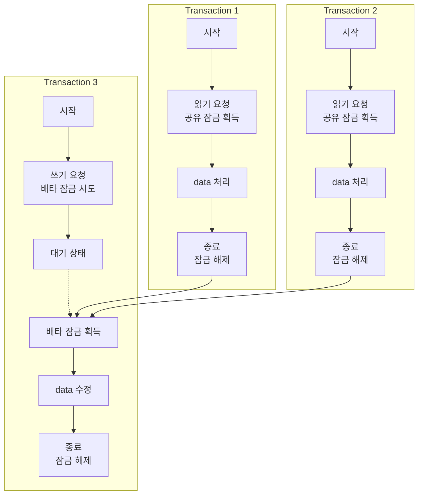

## 공유 잠금과 배타 잠금

- 잠금(lock)은 data 무결성을 보장하면서도 동시성을 최적화하기 위한 필수 요소이며, 크게 공유 잠금과 배타 잠금으로 나뉩니다.

- 공유 잠금과 배타 잠금은 database에서 transaction의 동시성 제어를 위한 핵심 mechanism입니다.
    - 두 잠금 방식은 각각 다른 목적으로 사용되며 서로 다른 특성을 가집니다.

- 공유 잠금과 배타 잠금은 잠금 수준(locking level)과는 무관하며, database의 환경과 설정에 따라 다르게 동작할 수 있습니다.
    - 예를 들어, MySQL InnoDB에서는 row-level lock을 기본으로 사용하기 때문에, 공유 잠금과 배타 잠금 모두 row-level lock으로 설정됩니다.
    - 반면, MyISAM에서는 table-level lock을 사용하므로 공유 잠금과 배타 잠금 모두 table-level lock으로 설정됩니다.

| 특성 | 공유 잠금 (Shared Lock) | 배타 잠금 (Exclusive Lock) |
| --- | --- | --- |
| **목적** | 읽기 작업 보호 | 쓰기 작업 보호 |
| **다른 명칭** | Read Lock, S-Lock | Write Lock, X-Lock |
| **동시성** | 여러 transaction이 동시에 획득 가능 | 한 번에 하나의 transaction만 획득 가능 |
| **읽기 허용** | 다른 transaction의 읽기 허용 | 다른 transaction의 읽기 차단 |
| **쓰기 허용** | 다른 transaction의 쓰기 차단 | 다른 transaction의 쓰기 차단 |
| **주요 SQL 구문** | SELECT, SELECT FOR SHARE | INSERT, UPDATE, DELETE, SELECT FOR UPDATE |
| **호환성** | 다른 공유 잠금과 호환됨 | 어떤 잠금과도 호환되지 않음 |
| **잠금 해제 시점** | 읽기 작업 완료 시 | 쓰기 작업 완료 및 commit/rollback 시 |
| **주요 장점** | 높은 동시성, 처리량 증가 | 강력한 data 보호, 무결성 보장 |
| **주요 단점** | 쓰기 작업 보호 불가 | 낮은 동시성, 잠재적 병목 현상 |
| **적합한 상황** | 읽기 위주 작업, 높은 처리량 필요 시 | 쓰기 위주 작업, 높은 무결성 필요 시 |
| **잠금 경합** | 상대적으로 낮음 | 상대적으로 높음 |
| **Deadlock 가능성** | 낮음 | 높음 |
| **성능 영향** | 일반적으로 적음 | 잠재적으로 큼 |
| **격리 수준 관련성** | READ COMMITTED, REPEATABLE READ | SERIALIZABLE |

- 두 잠금 방식은 각자 고유한 특성과 사용 목적을 가지고 있어 database transaction 관리에서 상호 보완적인 역할을 합니다.
    - 각각 trade-off 관계를 가지고 있어, application 특성에 맞게 적절히 사용해야 합니다.
    - 읽기 작업이 많은 application에서는 공유 잠금을 주로 활용하고, 쓰기 작업이 중요한 application에서는 배타 잠금의 적절한 관리가 필수적입니다.
    - 현대 database system은 이 두 가지 잠금 방식을 기본으로 MVCC(Multi-Version Concurrency Control)와 같은 고급 기법을 함께 활용하여 동시성과 일관성 사이의 균형을 유지합니다.

### 공유 잠금 (Shared Lock) : 읽기 잠금

- **공유 잠금(shared lock)은 data를 읽기 위한 목적으로 사용하는 lock mechanism**입니다.
    - 읽기 잠금(read lock) 또는 줄여서 S-lock이라고도 불립니다.

- **여러 transaction이 동시에 동일한 data 항목에 공유 잠금을 설정하는 것이 가능**합니다.
    - 읽기 작업은 data 변경을 수반하지 않으므로 여러 transaction이 동시에 수행 가능합니다.

- **공유 잠금이 설정된 data는 읽기 작업은 허용하지만 쓰기 작업은 제한**됩니다.
    - 다른 transaction이 해당 data에 배타 잠금을 획득하려면 모든 공유 잠금이 해제될 때까지 대기해야 합니다.
    - 이는 한 transaction이 읽는 동안 다른 transaction이 해당 data를 변경하는 것을 방지합니다.

- database system에서는 대개 **SELECT 문 실행 시 자동으로 공유 잠금을 설정**합니다.
    - MySQL의 경우 `SELECT ... FOR SHARE` 또는 `SELECT ... LOCK IN SHARE MODE` 구문으로 명시적 설정이 가능합니다.
    - PostgreSQL에서는 `SELECT ... FOR SHARE` 구문을 사용합니다.

- 공유 잠금의 주요 이점은 **높은 수준의 동시성을 제공**한다는 점입니다.
    - 여러 transaction이 동시에 같은 data set을 읽을 수 있어 system 처리량이 향상됩니다.
    - 특히 읽기 작업이 많은 application에서 성능 향상에 기여합니다.

- 공유 잠금은 **dirty read나 non-repeatable read와 같은 문제를 방지**합니다.
    - transaction이 아직 commit되지 않은 변경 사항을 다른 transaction이 읽는 것을 차단합니다.

### 배타 잠금 (Exclusive Lock) : 쓰기 잠금

- **배타 잠금(exclusive lock)은 data를 수정하기 위한 목적으로 사용하는 lock mechanism**입니다.
    - 쓰기 잠금(write lock) 또는 줄여서 X-lock이라고도 불립니다.

- **한 번에 오직 하나의 transaction만 특정 data 항목에 배타 잠금을 설정**할 수 있습니다.
    - 쓰기 작업은 data 변경을 수반하므로 동시 수행 시 충돌이 발생합니다.
    - 배타 잠금은 이러한 충돌을 방지하기 위해 설계되었습니다.

- **배타 잠금이 설정된 data는 다른 어떤 transaction도 읽거나 수정할 수 없습니다.**
    - 다른 transaction이 해당 data에 접근하려 하면 배타 잠금이 해제될 때까지 **waiting queue에 대기**합니다.
    - 이 **대기 시간이 timeout을 초과하면 deadlock**으로 이어질 수 있습니다.

- database system에서는 **INSERT, UPDATE, DELETE 문 실행 시 자동으로 배타 잠금을 설정**합니다.
    - 또한 `SELECT ... FOR UPDATE` 구문을 통해 읽기 작업에도 배타 잠금을 명시적으로 설정할 수 있습니다.
    - 이 방식은 읽은 후 곧바로 수정할 예정인 data를 다른 transaction이 변경하지 못하도록 할 때 유용합니다.

- 배타 잠금의 주요 이점은 **data 일관성과 무결성을 보장**한다는 점입니다.
    - transaction이 data를 수정하는 동안 **다른 transaction의 간섭을 완전히 차단**합니다.
    - 이를 통해 lost update 문제를 방지하고 transaction의 **원자성**을 보장합니다.

- 배타 잠금은 **transaction 격리 수준을 높이지만 동시성은 감소**시킵니다.
    - 쓰기 작업이 빈번한 system에서는 lock 경합으로 인한 성능 저하가 발생할 수 있습니다.

---

## 공유 잠금과 배타 잠금의 관계 및 호환성

- 두 잠금 유형 간의 호환성은 database 동시성 제어에서 중요한 개념입니다.

- **공유 잠금끼리는 서로 완전히 호환됩니다.**
    - 여러 transaction이 동일한 data 항목에 동시에 공유 잠금을 획득할 수 있습니다.
    - 이는 여러 사용자가 동시에 같은 data를 읽을 수 있음을 의미합니다.

- **배타 잠금은 어떤 종류의 lock과도 호환되지 않습니다.**
    - 배타 잠금이 설정된 data 항목에는 다른 공유 잠금이나 배타 잠금을 설정할 수 없습니다.
    - 이는 한 사용자가 data를 수정 중일 때 다른 사용자는 해당 data에 접근할 수 없음을 의미합니다.

- **공유 잠금과 배타 잠금은 서로 호환되지 않습니다.**
    - 공유 잠금이 설정된 data 항목에는 배타 잠금을 설정할 수 없습니다.
    - 배타 잠금이 설정된 data 항목에는 공유 잠금을 설정할 수 없습니다.

### 잠금 호환 Metrix

| 구분 | 공유 잠금 (S) | 배타 잠금 (X) |
| --- | --- | --- |
| **공유 잠금 (S)** | 호환됨 | 호환되지 않음 |
| **배타 잠금 (X)** | 호환되지 않음 | 호환되지 않음 |

- lock 획득 요청 시 **호환되지 않는 lock이 이미 설정되어 있으면 대기 상태**가 됩니다.
    - 이 대기는 선점한 **transaction이 lock을 해제할 때까지 계속**됩니다.
    - 이러한 **대기 상태가 길어지면 system 성능 저하나 deadlock 상황이 발생**할 수 있습니다.

---

## 공유 잠금과 배타 잠금의 동작 방식

- 세 개의 transaction이 동시에 실행되는 상황을 가정합니다.

- Transaction 1과 2는 동시에 같은 data에 공유 잠금을 설정하고 읽기 작업을 수행합니다.
- Transaction 3은 같은 data에 쓰기 작업을 위해 배타 잠금을 설정하려 하지만, 공유 잠금이 해제될 때까지 대기해야 합니다.
- Transaction 1과 2가 모두 종료되어 공유 잠금이 해제된 후에야 Transaction 3이 배타 잠금을 획득하고 쓰기 작업을 수행할 수 있습니다.
