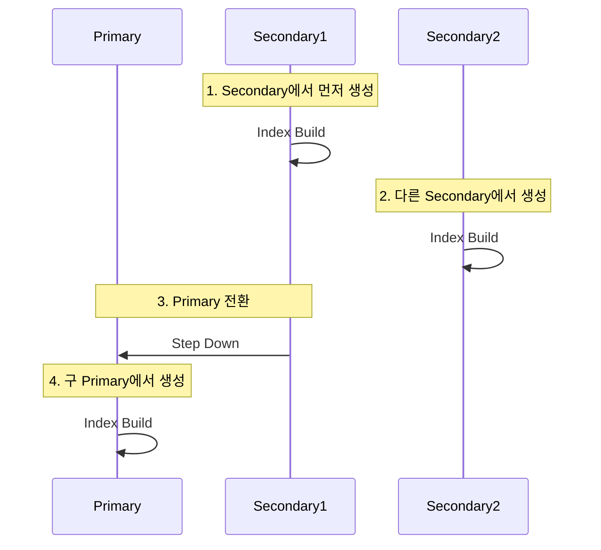

## Index Build Process : Index 생성 방식

- **index build process**는 MongoDB가 새로운 index를 생성하는 절차입니다.
    - collection의 모든 document를 읽고 정렬하여 index 구조를 만듭니다.

- index 생성 방식에 따라 database의 가용성과 성능이 크게 달라집니다.
    - 대용량 collection에서는 index 생성에 많은 시간이 소요될 수 있습니다.

- MongoDB는 version에 따라서 다양한 index build 방식을 지원합니다.


---


## Index Build 방식의 종류

- MongoDB는 역사적으로 foreground와 background 두 가지 방식을 지원했습니다.


### Foreground Index Build (Legacy)

- **foreground build**는 index 생성 중 database를 잠그는 방식입니다.
    - MongoDB 4.2 이전 version의 기본 방식입니다.

- index 생성이 완료될 때까지 해당 database의 모든 read/write 작업이 차단됩니다.
    - 매우 빠르지만 service 중단이 발생합니다.

```js
// MongoDB 4.2 이전에서 foreground build (기본값)
db.collection.createIndex({ field: 1 });
```

- production 환경에서는 사용하지 않는 것이 좋습니다.
    - 점검 시간(maintenance window)에만 사용해야 합니다.


### Background Index Build (Legacy)

- **background build**는 index 생성 중에도 read/write 작업을 허용하는 방식입니다.
    - MongoDB 4.2 이전 version에서 `background: true` option으로 지정합니다.

```js
// MongoDB 4.2 이전에서 background build
db.collection.createIndex({ field: 1 }, { background: true });
```

- foreground build보다 느리지만 service 중단 없이 index를 생성할 수 있습니다.

- background build의 한계가 있습니다.
    - 여러 background index를 동시에 생성할 수 없습니다.
    - replica set의 모든 member에서 순차적으로 실행되어 시간이 오래 걸립니다.
    - index 생성 중 server가 재시작되면 처음부터 다시 시작해야 합니다.


### Hybrid Index Build (MongoDB 4.2+)

- **hybrid build**는 MongoDB 4.2부터 도입된 새로운 기본 방식입니다.
    - foreground의 빠른 속도와 background의 가용성을 결합했습니다.

```js
// MongoDB 4.2 이상에서 기본값
db.collection.createIndex({ field: 1 });
```

- hybrid build는 세 단계로 진행됩니다.
    1. **초기화 단계** : 짧은 시간 동안 write를 차단하고 index 생성을 준비합니다.
    2. **build 단계** : read/write를 허용하면서 index를 생성합니다. 이 기간 동안의 write는 별도로 기록됩니다.
    3. **완료 단계** : 짧은 시간 동안 write를 차단하고 기록된 변경 사항을 index에 반영합니다.

- 대부분의 시간 동안 read/write가 가능하므로 service 중단이 최소화됩니다.

- MongoDB 4.2 이상에서는 `background: true` option이 무시됩니다.
    - 모든 index build는 자동으로 hybrid 방식으로 실행됩니다.


---


## Index Build 시간과 Resource 사용

- index build는 상당한 resource를 소비하며, collection 크기에 따라 오래 걸릴 수 있습니다.


### Build 시간 예상

- index build 시간은 다양한 요인에 따라 달라집니다.
    - collection의 document 수와 크기.
    - index field의 data type과 복잡도.
    - server의 CPU와 disk 성능.
    - 동시에 실행 중인 다른 작업.

- 일반적으로 수백만 개의 document를 가진 collection에서 index 생성은 수분에서 수시간이 걸릴 수 있습니다.


### Resource 사용

- index build는 다음 resource를 집중적으로 사용합니다.

| Resource | 영향 |
| --- | --- |
| CPU | document를 읽고 정렬하는 데에 사용됩니다. |
| Memory | 정렬 작업과 임시 data 저장에 사용됩니다. |
| Disk I/O | collection을 읽고 index를 쓰는 데에 사용됩니다. |
| Disk 공간 | index file과 임시 file을 저장하는 데에 필요합니다. |

- index build 중에는 다른 query의 성능이 일시적으로 저하될 수 있습니다.


### Build 진행 상황 확인

```js
// 현재 진행 중인 index build 확인
db.currentOp({
    $or: [
        { op: "command", "command.createIndexes": { $exists: true } },
        { op: "none", "msg": /^Index Build/ }
    ]
});
```

- `currentOp()`을 통해 index build의 진행 상황을 monitoring할 수 있습니다.

```js
// index build 통계 확인
db.collection.stats().indexBuilds;
```


---


## Replica Set에서의 Index Build

- replica set 환경에서는 index build가 더 복잡하게 진행됩니다.


### Rolling Index Build

- **rolling index build**는 replica set의 각 member에서 순차적으로 index를 생성하는 방법입니다.
    - 전체 replica set의 가용성을 유지하면서 index를 생성할 수 있습니다.



- rolling build 절차는 다음과 같습니다.
    1. 하나의 secondary에서 index를 생성합니다.
    2. 완료되면 다른 secondary에서 index를 생성합니다.
    3. 모든 secondary에서 완료되면 primary를 step down합니다.
    4. 새로운 primary가 선출되고, 구 primary(현재 secondary)에서 index를 생성합니다.

- rolling build는 service 중단 없이 index를 추가할 수 있지만, 매우 오래 걸립니다.


### Simultaneous Index Build (MongoDB 4.4+)

- **simultaneous build**는 MongoDB 4.4부터 도입된 방식으로, replica set의 모든 member에서 동시에 index를 생성합니다.
    - rolling build보다 훨씬 빠르게 완료됩니다.

- primary에서 `createIndex()` 명령을 실행하면 자동으로 모든 secondary에 전파됩니다.

```js
// MongoDB 4.4 이상에서는 자동으로 simultaneous build
db.collection.createIndex({ field: 1 });
```

- primary와 secondary는 거의 동시에 index build를 시작합니다.
    - 각 member는 독립적으로 hybrid build process를 실행합니다.

- 모든 member가 index build를 완료해야 전체 작업이 완료됩니다.
    - 하나라도 실패하면 전체 replica set에서 index가 rollback됩니다.


---


## Index Build 실패와 중단

- index build는 다양한 이유로 실패하거나 중단될 수 있습니다.


### Build 실패 원인

- index build가 실패하는 주요 원인은 다음과 같습니다.

| 원인 | 설명 |
| --- | --- |
| Disk 공간 부족 | index file과 임시 file을 저장할 공간이 부족합니다. |
| Memory 부족 | 정렬 작업에 필요한 memory가 부족합니다. |
| Unique 제약 위반 | unique index 생성 시 중복 값이 발견됩니다. |
| Server 재시작 | old version에서는 build가 중단되고 다시 시작됩니다. |
| Timeout | maxTimeMS를 초과하면 build가 중단됩니다. |

- index build 실패 시 error message를 확인하여 원인을 파악해야 합니다.


### Build 중단

```js
// 진행 중인 index build 중단
db.killOp(operationId);
```

- `currentOp()`으로 operation ID를 확인한 후 `killOp()`으로 중단할 수 있습니다.

- MongoDB 4.4 이상에서는 index build를 중단하면 이미 생성된 부분이 보존되지 않습니다.
    - 처음부터 다시 시작해야 합니다.


### Build 재시작

- MongoDB 4.4 이상에서는 index build가 중단되면 server 재시작 시 자동으로 재개됩니다.
    - 중간 상태가 저장되어 처음부터 다시 시작하지 않아도 됩니다.

```js
// 재시작 가능한 index build 정보 확인
db.getSiblingDB("admin").system.indexBuilds.find();
```


---


## Index Build 최적화 전략

- index build를 효율적으로 수행하기 위한 전략이 있습니다.


### 적절한 시간 선택

- 사용량이 적은 시간대(off-peak hours)에 index를 생성합니다.
    - 야간이나 주말 등 traffic이 낮은 시간을 활용합니다.

- 중요한 business event 전에는 index 생성을 피합니다.
    - Black Friday, Promotion 기간 등.


### Resource 준비

- disk 공간을 충분히 확보합니다.
    - 일반적으로 collection 크기의 최소 1.2배 이상의 여유 공간이 필요합니다.

- memory를 충분히 할당합니다.
    - `maxIndexBuildMemoryUsageMegabytes` 설정을 조정하여 build 성능을 향상시킬 수 있습니다.


### 병렬 Build 제한

```js
// 동시에 생성할 수 있는 index 수 제한
db.adminCommand({
    setParameter: 1,
    maxNumActiveUserIndexBuilds: 2
});
```

- 여러 index를 동시에 생성하면 resource 경쟁이 발생합니다.
    - 순차적으로 생성하거나 동시 생성 수를 제한합니다.


### 단계적 배포

- 대규모 replica set에서는 단계적으로 index를 배포합니다.
    1. staging 환경에서 먼저 테스트합니다.
    2. production의 일부 secondary에서 시험 생성합니다.
    3. 문제가 없으면 전체 replica set에 적용합니다.


---


## Index Rebuild

- 기존 index를 재생성해야 하는 경우가 있습니다.


### Rebuild가 필요한 경우

- index가 손상되었거나 비효율적인 경우 rebuild가 필요합니다.

| 상황 | 설명 |
| --- | --- |
| Index 단편화 | 오랜 기간 사용으로 index가 단편화되어 성능이 저하됩니다. |
| 손상된 index | disk 오류나 비정상 종료로 index가 손상되었습니다. |
| Version upgrade | MongoDB version upgrade 시 index format이 변경될 수 있습니다. |
| 압축 | index를 재생성하여 disk 공간을 회수합니다. |


### Rebuild 방법

```js
// 특정 index rebuild
db.collection.reIndex({ index: "index_name" });

// collection의 모든 index rebuild
db.collection.reIndex();
```

- `reIndex()`는 모든 index를 삭제하고 다시 생성합니다.
    - rebuild 중에는 해당 index를 사용할 수 없습니다.

```js
// 더 안전한 방법 : 새 index 생성 후 기존 index 삭제
db.collection.createIndex({ field: 1 });  // 새 index 생성
db.collection.dropIndex("old_index_name");  // 기존 index 삭제
```

- production 환경에서는 새 index를 먼저 생성하고 기존 index를 삭제하는 것이 안전합니다.


---


## 대용량 Collection의 Index Build

- 수백만 개 이상의 document를 가진 대용량 collection에서는 특별한 전략이 필요합니다.


### Bulk Insert 전 Index 생성

- 대량의 data를 insert할 계획이라면, insert 전에 index를 생성하지 않습니다.

```js
// 1. index 없이 bulk insert 수행 (빠름)
db.collection.insertMany(largeDataArray);

// 2. insert 완료 후 index 생성
db.collection.createIndex({ field: 1 });
```

- index가 있으면 insert 시마다 index를 update해야 하므로 매우 느려집니다.
- 모든 data를 insert한 후 한 번에 index를 생성하는 것이 훨씬 빠릅니다.


### Sharding 고려

- 매우 큰 collection은 sharding을 고려합니다.
    - 각 shard에서 독립적으로 index가 생성되므로 전체 시간이 단축됩니다.

```js
// collection을 shard한 후 index 생성
sh.shardCollection("mydb.collection", { shardKey: 1 });
db.collection.createIndex({ field: 1 });
```

- shard key를 먼저 정의하고 index를 생성하는 것이 효율적입니다.


### 점진적 Migration

- 기존 system에서 새 system으로 migration하는 경우, 점진적으로 진행합니다.
    1. 새 system에 빈 collection을 만들고 index를 먼저 생성합니다.
    2. 기존 system에서 소량씩 data를 복사합니다.
    3. application traffic을 점진적으로 새 system으로 전환합니다.


---


## Reference

- <https://www.mongodb.com/docs/manual/core/index-creation/>
- <https://www.mongodb.com/docs/manual/tutorial/build-indexes-on-replica-sets/>
- <https://www.mongodb.com/docs/manual/reference/method/db.collection.createIndex/>
- <https://www.mongodb.com/docs/manual/core/index-creation/#comparison-of-index-builds>

