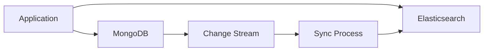

## MongoDB에서의 Text Search

- MongoDB는 다양한 text 검색 방법을 제공합니다.
    - 각 방법은 서로 다른 성능 특성과 기능을 가지고 있으며, 요구 사항에 따라 적절한 방법을 선택해야 합니다.

- text 검색 방법은 크게 **MongoDB 내장 기능**과 **외부 search engine 연동**으로 나뉩니다.


---


## MongoDB 내장 검색 방법

- MongoDB는 별도의 외부 tool 없이도 여러 text 검색 방법을 제공합니다.


### 정규 표현식 검색

- **정규 표현식(regex)**은 가장 기본적인 pattern matching 방법입니다.
    - `$regex` 연산자를 사용하여 문자열 pattern을 검색합니다.

```js
// 기본 정규 표현식 검색
db.articles.find({
    title: { $regex: "mongodb", $options: "i" }
});

// 단축 표기법
db.articles.find({
    title: /mongodb/i
});

// 여러 pattern 검색
db.articles.find({
    $or: [
        { title: /mongodb/i },
        { content: /mongodb/i }
    ]
});
```

#### 장점

- 별도의 index 생성 없이 즉시 사용 가능합니다.
- 복잡한 pattern matching이 가능합니다.
- 정확한 제어가 가능합니다.

#### 단점

- index를 효율적으로 사용하지 못합니다.
- collection scan이 발생하여 매우 느립니다.
- 대소문자 구분 option(`i`)을 사용하면 index를 전혀 사용하지 못합니다.
- 자연어 처리 기능이 없습니다.

#### 사용 예시

- 소규모 collection에서 간단한 pattern 검색.
- 특수한 pattern이나 wildcard 검색이 필요한 경우.
- 일회성 검색이나 admin tool에서의 조회.


### Prefix 검색 (^로 시작하는 정규 표현식)

- `^`는 문자열의 시작을 의미하며, 일반 B-tree index를 활용할 수 있습니다.
    - text index와 달리 문자열 **시작 부분**만 검색합니다.
    - 단순 문자 matching이며, 형태소 분석이나 자연어 처리는 하지 않습니다.

```js
// index 생성
db.products.createIndex({ name: 1 });

// prefix 검색
db.products.find({ name: /^Apple/ });
```

#### 장점

- prefix 검색에서는 index를 활용하여 빠른 성능을 제공합니다.
- 별도의 text index 생성이 필요 없습니다.

#### 단점

- 문자열 시작 부분만 검색 가능합니다.
- 중간이나 끝 부분은 검색할 수 없습니다.
- 자연어 처리 기능이 없습니다.

#### 사용 예시

- 자동 완성(autocomplete) 기능.
- 특정 문자열로 시작하는 항목 찾기.


### Text Index

- **text index**는 MongoDB의 내장 전문 검색 기능입니다.
    - 정규 표현식과 달리 단어 단위로 검색하며, 문자열 어디에든 있는 단어를 찾을 수 있습니다.
    - 형태소 분석, stemming, stop words 제거 등 자연어 처리 기능을 제공합니다.

```js
// text index 생성
db.articles.createIndex({
    title: "text",
    content: "text"
}, {
    weights: {
        title: 10,
        content: 1
    },
    default_language: "english"
});

// text 검색
db.articles.find({
    $text: { $search: "mongodb database" }
});

// 점수 기반 정렬
db.articles.find(
    { $text: { $search: "mongodb database" } },
    { score: { $meta: "textScore" } }
).sort({ score: { $meta: "textScore" } });
```

#### 장점

- 자연어 검색 기능을 제공합니다.
- stemming으로 단어 변형을 자동 처리합니다.
- 관련성 점수를 기반으로 정렬할 수 있습니다.
- 별도의 외부 tool 없이 사용 가능합니다.
- 여러 언어를 지원합니다.

#### 단점

- collection당 하나의 text index만 생성 가능합니다.
- index 크기가 매우 큽니다.
    - 원본 data의 2-3배.
- write 성능에 큰 영향을 줍니다.
- fuzzy search, autocomplete 등 고급 기능이 부족합니다.
- 한국어 형태소 분석 품질이 낮습니다.

#### 사용 예시

- 중소 규모의 blog, news, forum 검색.
- 간단한 상품 검색 기능.
- FAQ, help center 검색.
- 별도의 search engine 없이 기본적인 전문 검색이 필요한 경우.


### Aggregation Pipeline 활용

- **aggregation pipeline**을 사용하면 더 복잡한 검색 logic을 구현할 수 있습니다.

```js
// text search + 추가 filtering
db.articles.aggregate([
    // text 검색
    { $match: {
        $text: { $search: "mongodb index" }
    }},

    // 점수 추가
    { $addFields: {
        searchScore: { $meta: "textScore" }
    }},

    // 추가 조건
    { $match: {
        searchScore: { $gte: 1.5 },
        category: "database",
        publishedAt: { $gte: ISODate("2024-01-01") }
    }},

    // 정렬
    { $sort: {
        searchScore: -1,
        publishedAt: -1
    }},

    // 결과 가공
    { $project: {
        title: 1,
        summary: 1,
        searchScore: 1,
        publishedAt: 1
    }},

    { $limit: 20 }
]);
```

#### 장점

- 복잡한 검색 로직을 단계별로 구현할 수 있습니다.
- filtering, 정렬, 가공을 유연하게 조합할 수 있습니다.

#### 단점

- query가 복잡해집니다.
- 최적화가 어렵습니다.

#### 사용 예시

- text search와 다른 조건을 복합적으로 사용하는 경우.
- 검색 결과에 추가 계산이나 가공이 필요한 경우.


### $in 연산자와 Exact Match

- **정확한 값 matching**이 필요한 경우 `$in` 연산자를 사용합니다.

```js
// tag 검색
db.articles.find({
    tags: { $in: ["mongodb", "database", "nosql"] }
});

// index 활용
db.articles.createIndex({ tags: 1 });
```

#### 장점

- 매우 빠른 성능을 제공합니다.
- index를 효율적으로 사용합니다.

#### 단점

- 정확히 일치하는 값만 검색합니다.
- 자연어 검색이나 유사 단어 검색이 불가능합니다.

#### 사용 예시

- tag, category 같은 정형화된 keyword 검색.
- 정확한 값 matching이 필요한 경우.


---


## MongoDB Atlas Search

- **Atlas Search**는 MongoDB Atlas에서 제공하는 Apache Lucene 기반 search engine입니다.
    - text index보다 훨씬 강력한 전문 검색 기능을 제공합니다.


### 기본 사용법

```js
// search index 생성 (Atlas UI 또는 CLI)
{
    "mappings": {
        "dynamic": false,
        "fields": {
            "title": {
                "type": "string",
                "analyzer": "lucene.standard"
            },
            "content": {
                "type": "string",
                "analyzer": "lucene.korean"
            }
        }
    }
}

// search query
db.articles.aggregate([
    {
        $search: {
            "text": {
                "query": "mongodb database",
                "path": ["title", "content"],
                "fuzzy": {
                    "maxEdits": 2
                }
            }
        }
    },
    {
        $project: {
            title: 1,
            content: 1,
            score: { $meta: "searchScore" }
        }
    },
    { $limit: 10 }
]);
```


### 주요 기능들

- Atlas Search는 다양한 고급 검색 기능을 제공합니다.

#### Fuzzy Search

```js
// 오타 허용 검색
db.products.aggregate([
    {
        $search: {
            "text": {
                "query": "mongdb",  // typo
                "path": "name",
                "fuzzy": {
                    "maxEdits": 2,
                    "maxExpansions": 100
                }
            }
        }
    }
]);
```

#### Autocomplete

```js
// 자동 완성
db.products.aggregate([
    {
        $search: {
            "autocomplete": {
                "query": "mon",
                "path": "name",
                "tokenOrder": "sequential"
            }
        }
    }
]);
```

#### Faceting

```js
// facet 검색 (filtering option 제공)
db.products.aggregate([
    {
        $searchMeta: {
            "facet": {
                "operator": {
                    "text": {
                        "query": "laptop",
                        "path": "name"
                    }
                },
                "facets": {
                    "brandFacet": {
                        "type": "string",
                        "path": "brand"
                    },
                    "priceFacet": {
                        "type": "number",
                        "path": "price",
                        "boundaries": [0, 500, 1000, 2000]
                    }
                }
            }
        }
    }
]);
```

#### Highlighting

```js
// 검색어 강조 표시
db.articles.aggregate([
    {
        $search: {
            "text": {
                "query": "mongodb",
                "path": "content"
            },
            "highlight": {
                "path": "content"
            }
        }
    },
    {
        $project: {
            title: 1,
            highlights: { $meta: "searchHighlights" }
        }
    }
]);
```

#### Synonym

```js
// 동의어 검색
// search index 설정에 synonym mapping 추가
{
    "synonyms": [
        {
            "name": "db_synonyms",
            "analyzer": "lucene.standard",
            "source": {
                "collection": "synonyms"
            }
        }
    ]
}

// query
db.articles.aggregate([
    {
        $search: {
            "text": {
                "query": "database",
                "path": "content",
                "synonyms": "db_synonyms"
            }
        }
    }
]);
```


### 장점

- **강력한 검색 기능** : fuzzy search, autocomplete, faceting, highlighting 등의 고급 기능들을 제공합니다.
    - 한국어 형태소 분석에서도 우수한 성능을 보입니다.

- **별도 관리 불필요** : Atlas에 통합되어 별도의 infra 관리가 필요 없습니다.
    - MongoDB data와 동기화가 자동으로 이루어집니다.

- **확장성** : 대용량 data와 높은 traffic을 처리할 수 있습니다.


### 단점

- **Atlas 전용** : MongoDB Atlas에서만 사용 가능합니다.
    - on-premise 환경에서는 사용할 수 없습니다.

- **비용** : 별도의 비용이 발생합니다.
    - search index를 위한 추가 resource가 필요합니다.

- **Learning Curve** : text index보다 복잡한 설정과 query 문법이 필요합니다.


### 사용 예시

- e-commerce 상품 검색.
    - faceting, autocomplete 필요.
- 대규모 문서 검색 system.
- 다국어 지원이 필요한 검색.
- 고급 검색 기능이 요구되는 application.


---


## 외부 Search Engine 연동

- MongoDB와 별도의 전문 search engine을 연동하여 사용할 수 있습니다.


### Elasticsearch 연동

- **Elasticsearch**는 가장 널리 사용되는 전문 search engine입니다.



#### 동기화 전략

1. **Change Stream 활용** : MongoDB의 Change Stream을 사용하여 실시간으로 data 변경 사항을 Elasticsearch에 반영합니다.

```js
// MongoDB Change Stream으로 실시간 동기화
const pipeline = [
    { $match: {
        'operationType': { $in: ['insert', 'update', 'delete'] }
    }}
];

const changeStream = db.articles.watch(pipeline);

changeStream.on('change', async (change) => {
    switch(change.operationType) {
        case 'insert':
            await esClient.index({
                index: 'articles',
                id: change.documentKey._id.toString(),
                body: change.fullDocument
            });
            break;
        case 'update':
            await esClient.update({
                index: 'articles',
                id: change.documentKey._id.toString(),
                body: { doc: change.updateDescription.updatedFields }
            });
            break;
        case 'delete':
            await esClient.delete({
                index: 'articles',
                id: change.documentKey._id.toString()
            });
            break;
    }
});
```

2. **Dual Write** : application level에서 MongoDB와 Elasticsearch에 동시에 write합니다.

```js
// application에서 MongoDB와 Elasticsearch에 동시 write
async function createArticle(data) {
    // MongoDB 저장
    const result = await db.articles.insertOne(data);

    // Elasticsearch 저장
    await esClient.index({
        index: 'articles',
        id: result.insertedId.toString(),
        body: data
    });

    return result;
}
```

3. **Batch Sync** : 주기적으로 MongoDB의 변경 사항을 Elasticsearch에 동기화합니다.

```js
// 주기적으로 batch 동기화
async function syncToElasticsearch() {
    const lastSyncTime = await getLastSyncTime();

    const cursor = db.articles.find({
        updatedAt: { $gt: lastSyncTime }
    });

    const bulk = [];

    for await (const doc of cursor) {
        bulk.push({ index: { _index: 'articles', _id: doc._id.toString() }});
        bulk.push(doc);
    }

    if (bulk.length > 0) {
        await esClient.bulk({ body: bulk });
    }
}
```

4. **Elasticsearch 검색** : elasticsearch에서 검색을 수행하고, 필요한 경우 MongoDB에서 추가 data를 조회합니다.

```js
// Elasticsearch에서 검색
const result = await esClient.search({
    index: 'articles',
    body: {
        query: {
            multi_match: {
                query: "mongodb database",
                fields: ["title^3", "content"],
                fuzziness: "AUTO"
            }
        },
        highlight: {
            fields: {
                content: {}
            }
        },
        aggs: {
            categories: {
                terms: { field: "category" }
            }
        }
    }
});

// MongoDB에서 전체 document 조회
const ids = result.hits.hits.map(hit => ObjectId(hit._id));
const articles = await db.articles.find({
    _id: { $in: ids }
}).toArray();
```


### 장점

- **최고 수준의 검색 기능**을 제공합니다.
    - 매우 강력한 전문 검색 기능.
    - 복잡한 query와 분석 기능.
    - 뛰어난 한국어 형태소 분석 (nori plugin).

- **확장성과 성능**이 우수합니다.
    - 대용량 data 처리에 최적화.
    - 분산 처리와 수평 확장 가능.

- **생태계**가 풍부합니다.
    - Kibana를 통한 시각화와 모니터링.
    - 풍부한 plugin과 도구들.


### 단점

- **복잡성**이 증가합니다.
    - 별도의 cluster 구축 및 관리 필요.
    - data 동기화 로직 구현 필요.
    - 운영 복잡도 증가.

- **비용**이 높아집니다.
    - 추가 infra 비용.
    - 운영 인력 필요.

- **data 일관성** 문제가 발생할 수 있습니다.
    - MongoDB와 Elasticsearch 간 동기화 lag 발생 가능.
    - 동기화 실패 처리 필요.


### 사용 예시

- 매우 복잡한 검색 요구 사항.
- 대규모 전문 검색 system.
- 실시간 분석과 aggregation이 필요한 경우.
- 검색 품질이 핵심 business 가치인 경우.


### Solr, Algolia 등 다른 Search Engine

- **Apache Solr** : Elasticsearch와 유사한 Lucene 기반 search engine.
    - 더 성숙한 ecosystem과 안정성.

- **Algolia** : SaaS 형태의 search engine.
    - 매우 빠른 응답 속도.
    - 간편한 통합.
    - 비용이 높음.

- **Meilisearch** : 경량 open source search engine.
    - 간단한 설정.
    - typo tolerance 기본 제공.


---


## 검색 방법 선택 Guide

- 요구 사항에 따라 적절한 검색 방법을 선택해야 합니다.


### 선택 기준표

| 요구 사항 | 권장 방법 | 이유 |
| --- | --- | --- |
| 소규모 collection (<10K docs) | 정규 표현식 | 별도 index 없이도 충분한 성능 |
| 간단한 전문 검색 | Text Index | 추가 infrastructure 없이 사용 가능 |
e 중규모 검색 (10K-1M docs) | Text Index 또는 Atlas Search | 요구 사항 복잡도에 따라 선택 |
| 고급 검색 기능 필요 | Atlas Search 또는 Elasticsearch | fuzzy, autocomplete, faceting 지원 |
| 대규모 검색 (>1M docs) | Atlas Search 또는 Elasticsearch | 확장성과 성능 보장 |
| On-premise 환경 | Text Index 또는 Elasticsearch | Atlas Search는 cloud 전용 |
| 검색이 핵심 기능 | Elasticsearch | 최고 수준의 검색 품질과 성능 |
| Tag/Category 검색 | `$in` 연산자 + Index | 정확한 matching에 최적화 |
| 자동 완성 | Atlas Search 또는 Elasticsearch | 전용 기능 지원 |
| 한국어 검색 | Atlas Search 또는 Elasticsearch + nori | 형태소 분석 품질 |


### 단계적 접근

- Phase 1 : **MVP**.
    - text index 또는 정규 표현식으로 시작.
    - 빠르게 기능 구현.

- Phase 2 : **성장기**.
    - traffic과 data가 증가하면 Atlas Search 고려.
    - 또는 text index 최적화 (compound index, projection 등).

- Phase 3 : **성숙기**.
    - 검색이 핵심 기능이 되면 Elasticsearch 도입 검토.
    - 전문 검색 team 구성.


### 비용 대비 효과 분석

| 방법 | 초기 비용 | 운영 비용 | 기능 | 권장 규모 |
| --- | --- | --- | --- | --- |
| 정규 표현식 | 낮음 | 낮음 | 제한적 | 소규모 |
| Text Index | 낮음 | 중간 | 기본 | 중소규모 |
| Atlas Search | 중간 | 중간 | 고급 | 중대규모 |
| Elasticsearch | 높음 | 높음 | 최고급 | 대규모 |


---


## 검색 성능 최적화 공통 전략

- 검색 방법과 무관하게 적용할 수 있는 최적화 전략이 있습니다.


### Caching

- Redis를 활용하여 자주 조회되는 검색 결과를 caching합니다.

```js
async function search(query) {
    const cacheKey = `search:${query}`;

    // cache 확인
    const cached = await redis.get(cacheKey);
    if (cached) {
        return JSON.parse(cached);
    }

    // 실제 검색 수행
    const results = await db.articles.find({
        $text: { $search: query }
    }).toArray();

    // cache 저장 (10분 TTL)
    await redis.setex(cacheKey, 600, JSON.stringify(results));

    return results;
}
```


### Pagination

- 큰 결과 집합에 대해 효율적인 pagination 기법을 사용합니다.

```js
// skip/limit (작은 offset에만 사용)
db.articles.find({ $text: { $search: query } })
    .skip(0)
    .limit(20);

// cursor 기반 pagination (큰 offset에 적합)
db.articles.find({
    $text: { $search: query },
    _id: { $gt: lastId }
}).limit(20);
```


### Denormalization

- 검색에 자주 사용되는 field를 별도로 저장하여 조회 성능을 향상시킵니다.

```js
// 검색용 field를 별도로 생성
{
    _id: ObjectId("..."),
    title: "MongoDB Index Guide",
    content: "...",

    // 검색 최적화를 위한 denormalized field
    searchableText: "MongoDB Index Guide database nosql",
    tags: ["mongodb", "database", "nosql"],
    category: "tech"
}

// 검색 시 최적화된 field 사용
db.articles.find({
    $text: { $search: query },
    category: "tech"
}).project({
    title: 1,
    summary: 1
});
```


### Read Preference

- 읽기 부하 분산을 위해 secondary(replica set)에서 읽기를 수행합니다.

```js
// secondary에서 읽기 (검색 부하 분산)
db.articles.find({
    $text: { $search: query }
}).readPref("secondaryPreferred");
```


---


## Reference

- <https://www.mongodb.com/docs/manual/text-search/>
- <https://www.mongodb.com/docs/atlas/atlas-search/>
- <https://www.mongodb.com/docs/manual/core/index-text/>
- <https://www.mongodb.com/products/platform/atlas-search>
- <https://www.elastic.co/guide/en/elasticsearch/reference/current/index.html>

