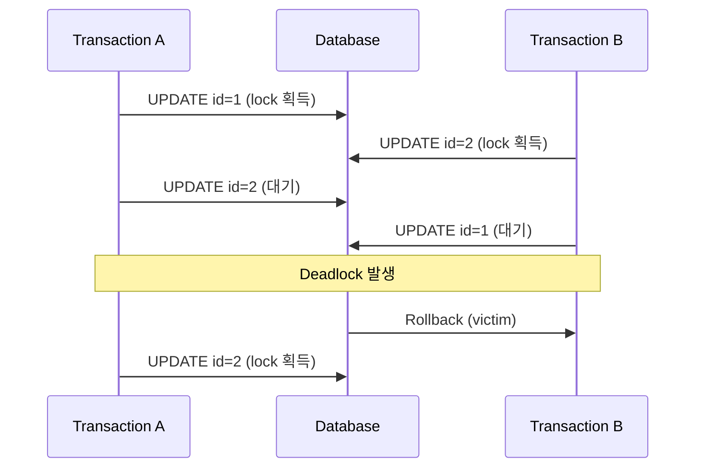
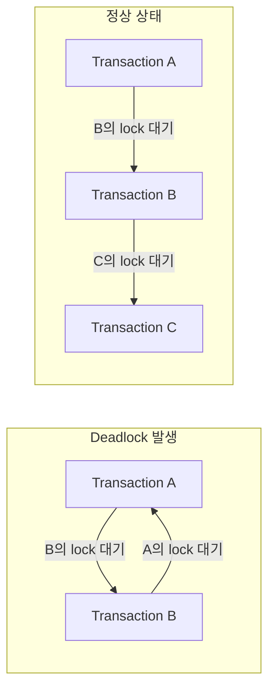

## Deadlock : 순환 대기로 인한 교착 상태

- deadlock(교착 상태)은 두 개 이상의 transaction이 서로가 보유한 lock을 기다리며 무한히 대기하는 상태입니다.
- InnoDB는 deadlock을 자동으로 감지하고, 하나의 transaction을 강제로 rollback하여 해결합니다.

- deadlock이 발생하려면 4가지 조건이 모두 충족되어야 합니다.

| 조건 | 설명 |
| --- | --- |
| Mutual Exclusion | resource는 한 번에 하나의 transaction만 사용 가능 |
| Hold and Wait | transaction이 resource를 보유한 채로 다른 resource를 대기 |
| No Preemption | 다른 transaction이 보유한 resource를 강제로 빼앗을 수 없음 |
| Circular Wait | transaction들이 순환 형태로 서로의 resource를 대기 |

- 4가지 조건 중 하나라도 깨지면 deadlock은 발생하지 않습니다.
- InnoDB에서는 주로 row-level lock 간의 순환 대기로 deadlock이 발생합니다.


---


## Deadlock Scenarios

- deadlock은 두 개 이상의 transaction이 lock을 보유한 채로 서로의 lock을 대기할 때 발생합니다.


### 서로 다른 순서로 Row를 잠그는 경우

- 가장 흔한 deadlock pattern입니다.
- 두 transaction이 동일한 row들을 서로 다른 순서로 접근할 때 발생합니다.

```sql
-- Transaction A
BEGIN;
UPDATE accounts SET balance = balance - 100 WHERE id = 1;  -- row 1 lock 획득
UPDATE accounts SET balance = balance + 100 WHERE id = 2;  -- row 2 lock 대기

-- Transaction B (동시에 실행)
BEGIN;
UPDATE accounts SET balance = balance - 50 WHERE id = 2;   -- row 2 lock 획득
UPDATE accounts SET balance = balance + 50 WHERE id = 1;   -- row 1 lock 대기 → Deadlock
```



- Transaction A는 row 1을 잠근 후 row 2를 기다립니다.
- Transaction B는 row 2를 잠근 후 row 1을 기다립니다.
- 서로가 서로의 lock을 기다리는 순환 대기가 형성됩니다.


### Gap Lock으로 인한 Deadlock

- InnoDB의 REPEATABLE READ isolation level에서는 gap lock이 사용됩니다.
- gap lock은 index record 사이의 간격을 잠가서 phantom read를 방지합니다.
- 서로 다른 transaction이 겹치는 gap에 대해 lock을 획득하면 deadlock이 발생할 수 있습니다.

```sql
-- Table: orders (id INT PRIMARY KEY, status VARCHAR(20))
-- 현재 data: id = 1, 5, 10

-- Transaction A
BEGIN;
SELECT * FROM orders WHERE id = 3 FOR UPDATE;  -- gap lock (1, 5) 획득
INSERT INTO orders VALUES (4, 'pending');       -- gap lock 대기

-- Transaction B (동시에 실행)
BEGIN;
SELECT * FROM orders WHERE id = 4 FOR UPDATE;  -- gap lock (1, 5) 획득
INSERT INTO orders VALUES (3, 'pending');       -- gap lock 대기 → Deadlock
```

- 두 transaction이 동일한 gap에 대해 gap lock을 획득할 수 있습니다.
    - gap lock은 서로 호환되기 때문입니다.
- 하지만 해당 gap에 INSERT하려면 상대방의 gap lock이 해제되어야 합니다.


### INSERT 간 Deadlock

- unique key constraint가 있는 column에 INSERT할 때 deadlock이 발생할 수 있습니다.
- duplicate key가 감지되면 InnoDB는 shared lock을 설정합니다.

```sql
-- Table: users (email VARCHAR(100) UNIQUE)

-- Transaction A
BEGIN;
INSERT INTO users (email) VALUES ('test@example.com');  -- exclusive lock 획득

-- Transaction B
BEGIN;
INSERT INTO users (email) VALUES ('test@example.com');  -- shared lock 대기 (duplicate check)

-- Transaction C
BEGIN;
INSERT INTO users (email) VALUES ('test@example.com');  -- shared lock 대기 (duplicate check)

-- Transaction A가 ROLLBACK하면
-- Transaction B와 C가 동시에 shared lock을 획득한 후 exclusive lock으로 upgrade 시도 → Deadlock
```

- Transaction A가 rollback되면 B와 C가 동시에 shared lock을 획득합니다.
- 둘 다 exclusive lock으로 upgrade하려 하지만, 상대방의 shared lock 때문에 대기합니다.


---


## Deadlock 감지와 해결 Mechanism

- InnoDB는 deadlock을 자동으로 감지하고 해결하는 mechanism을 내장하고 있습니다.


### Wait-for Graph

- InnoDB는 wait-for graph algorithm을 사용하여 deadlock을 감지합니다.
- wait-for graph는 transaction 간의 lock 대기 관계를 방향 그래프로 표현합니다.
    - node : transaction.
    - edge : lock 대기 관계.
        - `A → B`는 A가 B의 lock을 기다린다는 의미합니다.



- graph에서 cycle이 감지되면 deadlock으로 판단합니다.
- InnoDB는 lock 요청 시마다 wait-for graph를 검사합니다.


### Victim 선택과 Rollback

- deadlock이 감지되면 InnoDB는 하나의 transaction을 victim으로 선택하여 rollback합니다.
- victim 선택 기준은 rollback 비용이 가장 적은 transaction입니다.
    - INSERT, UPDATE, DELETE한 row 수가 적은 transaction.
    - undo log 양이 적은 transaction.

- rollback된 transaction은 `ERROR 1213 (40001): Deadlock found` error를 반환합니다.
- 나머지 transaction은 lock을 획득하고 정상적으로 진행됩니다.


### 관련 설정

- `innodb_deadlock_detect` : deadlock 감지 활성화 여부를 설정합니다.
    - 기본값은 `ON`입니다.
    - 높은 동시성 환경에서 `OFF`로 설정하면 성능이 향상될 수 있습니다.
    - `OFF`로 설정하면 `innodb_lock_wait_timeout`에 의존하여 deadlock을 해결합니다.

```sql
-- 현재 설정 확인
SHOW VARIABLES LIKE 'innodb_deadlock_detect';

-- 설정 변경 (동적 변경 가능)
SET GLOBAL innodb_deadlock_detect = OFF;
```

- `innodb_lock_wait_timeout` : lock 대기 최대 시간(초)을 설정합니다.
    - 기본값은 50초입니다.
    - timeout이 발생하면 해당 statement만 rollback됩니다.
    - `innodb_rollback_on_timeout`을 `ON`으로 설정하면 전체 transaction이 rollback됩니다.

```sql
-- 현재 설정 확인
SHOW VARIABLES LIKE 'innodb_lock_wait_timeout';

-- 설정 변경
SET GLOBAL innodb_lock_wait_timeout = 10;
```


---


## Deadlock 진단과 분석

- MySQL은 deadlock 발생 시 관여한 transaction, 실행 중이던 query, 보유 및 대기 중이던 lock 정보를 기록합니다.


### SHOW ENGINE INNODB STATUS

- 가장 최근에 발생한 deadlock 정보를 확인할 수 있습니다.
- `LATEST DETECTED DEADLOCK` section에서 deadlock 상세 정보를 제공합니다.

```sql
SHOW ENGINE INNODB STATUS\G
```

- 출력에서 transaction 정보, 보유 중인 lock, 대기 중인 lock, rollback된 transaction을 확인할 수 있습니다.

```
------------------------
LATEST DETECTED DEADLOCK
------------------------
2026-01-07 10:30:45 0x7f1234567890
*** (1) TRANSACTION:
TRANSACTION 12345, ACTIVE 5 sec starting index read
mysql tables in use 1, locked 1
LOCK WAIT 3 lock struct(s), heap size 1136, 2 row lock(s)
MySQL thread id 10, OS thread handle 123456789, query id 100 localhost root updating
UPDATE accounts SET balance = balance + 100 WHERE id = 2

*** (1) HOLDS THE LOCK(S):
RECORD LOCKS space id 10 page no 4 n bits 72 index PRIMARY of table `test`.`accounts`
lock_mode X locks rec but not gap

*** (1) WAITING FOR THIS LOCK TO BE GRANTED:
RECORD LOCKS space id 10 page no 4 n bits 72 index PRIMARY of table `test`.`accounts`
lock_mode X locks rec but not gap waiting

*** (2) TRANSACTION:
TRANSACTION 12346, ACTIVE 3 sec starting index read
...

*** WE ROLL BACK TRANSACTION (2)
```

| 항목 | 설명 |
| --- | --- |
| TRANSACTION | transaction ID와 활성 시간 |
| mysql tables in use | 사용 중인 table 수 |
| lock struct(s) | lock 구조체 수 |
| row lock(s) | row lock 수 |
| HOLDS THE LOCK(S) | 현재 보유 중인 lock 정보 |
| WAITING FOR THIS LOCK | 대기 중인 lock 정보 |
| WE ROLL BACK TRANSACTION | rollback된 transaction 번호 |


### Performance Schema 활용

- MySQL 8.0 이상에서는 `performance_schema`를 통해 현재 lock 상태를 실시간으로 monitoring할 수 있습니다.

```sql
-- 현재 보유 중인 lock 조회
SELECT * FROM performance_schema.data_locks;

-- lock 대기 상태 조회
SELECT * FROM performance_schema.data_lock_waits;

-- 대기 중인 transaction과 blocking transaction 조회
SELECT
    r.trx_id AS waiting_trx_id,
    r.trx_mysql_thread_id AS waiting_thread,
    r.trx_query AS waiting_query,
    b.trx_id AS blocking_trx_id,
    b.trx_mysql_thread_id AS blocking_thread,
    b.trx_query AS blocking_query
FROM performance_schema.data_lock_waits w
JOIN information_schema.innodb_trx b ON b.trx_id = w.blocking_engine_transaction_id
JOIN information_schema.innodb_trx r ON r.trx_id = w.requesting_engine_transaction_id;
```

- `data_locks` table에서 각 lock의 대상 table, index, lock 종류, 획득 상태를 확인할 수 있습니다.

| Column | 설명 |
| --- | --- |
| ENGINE_TRANSACTION_ID | transaction ID |
| OBJECT_SCHEMA | database 이름 |
| OBJECT_NAME | table 이름 |
| INDEX_NAME | index 이름 |
| LOCK_TYPE | lock type (TABLE, RECORD) |
| LOCK_MODE | lock mode (S, X, IS, IX, GAP 등) |
| LOCK_STATUS | lock 상태 (GRANTED, WAITING) |
| LOCK_DATA | lock이 설정된 data 값 |


---


## Deadlock 방지 전략

- deadlock을 완전히 제거할 수는 없지만, 발생 가능성을 크게 줄일 수 있습니다.


### 접근 순서 고정

- 모든 transaction에서 동일한 순서로 resource에 접근합니다.
- table이나 row에 접근할 때 항상 정해진 순서를 따릅니다.

```sql
-- 나쁜 예 : 접근 순서가 다름
-- Transaction A: UPDATE t1 → UPDATE t2
-- Transaction B: UPDATE t2 → UPDATE t1

-- 좋은 예 : 접근 순서 통일
-- Transaction A: UPDATE t1 → UPDATE t2
-- Transaction B: UPDATE t1 → UPDATE t2
```

- primary key나 unique key 기준으로 오름차순 접근을 권장합니다.
- 여러 table을 접근할 때도 table name의 alphabetical order로 접근하는 등 일관된 순서를 유지합니다.


### 잠금 범위 최소화

- 적절한 index를 사용하여 row-level lock을 유지합니다.
- index가 없으면 table scan이 발생하고, 더 많은 row에 lock이 걸립니다.

```sql
-- index가 없는 경우 : 모든 row를 scan하며 lock
UPDATE orders SET status = 'shipped' WHERE customer_id = 100;

-- customer_id에 index가 있는 경우 : 해당 row만 lock
CREATE INDEX idx_customer_id ON orders(customer_id);
UPDATE orders SET status = 'shipped' WHERE customer_id = 100;
```

- `SELECT ... FOR UPDATE`는 필요한 row에만 사용합니다.
- WHERE 절에 정확한 조건을 지정하여 불필요한 lock을 방지합니다.


### Transaction 짧게 유지

- transaction 내에서 lock을 보유하는 시간을 최소화합니다.
- 불필요한 작업은 transaction 외부로 분리합니다.

```sql
-- 나쁜 예 : transaction 내에서 외부 API 호출
BEGIN;
SELECT * FROM orders WHERE id = 1 FOR UPDATE;
-- 외부 API 호출 (수 초 소요)
UPDATE orders SET status = 'confirmed' WHERE id = 1;
COMMIT;

-- 좋은 예 : 외부 작업을 transaction 외부로 분리
-- 외부 API 호출 (수 초 소요)
BEGIN;
SELECT * FROM orders WHERE id = 1 FOR UPDATE;
UPDATE orders SET status = 'confirmed' WHERE id = 1;
COMMIT;
```

- 사용자 입력 대기, 외부 system 호출 등은 transaction 외부에서 처리합니다.
- batch 작업은 적절한 크기로 분할하여 처리합니다.


### 재시도 Logic 구현

- deadlock은 완전히 방지할 수 없으므로, application에서 재시도 logic을 구현합니다.
- deadlock error (MySQL error code 1213)를 감지하여 자동으로 재시도합니다.

```python
import mysql.connector
from mysql.connector import Error
import time

def execute_with_retry(connection, query, params, max_retries=3):
    for attempt in range(max_retries):
        try:
            cursor = connection.cursor()
            cursor.execute(query, params)
            connection.commit()
            return cursor
        except Error as e:
            if e.errno == 1213:  # Deadlock error
                connection.rollback()
                if attempt < max_retries - 1:
                    time.sleep(0.1 * (attempt + 1))  # exponential backoff
                    continue
            raise e
    raise Exception("Max retries exceeded")
```

- 재시도 시 exponential backoff를 적용하여 충돌 가능성을 줄입니다.
- 최대 재시도 횟수를 설정하여 무한 loop를 방지합니다.


---


## Reference

- <https://dev.mysql.com/doc/refman/8.0/en/innodb-deadlocks.html>
- <https://dev.mysql.com/doc/refman/8.0/en/innodb-deadlock-detection.html>
- <https://dev.mysql.com/doc/refman/8.0/en/innodb-locking.html>

