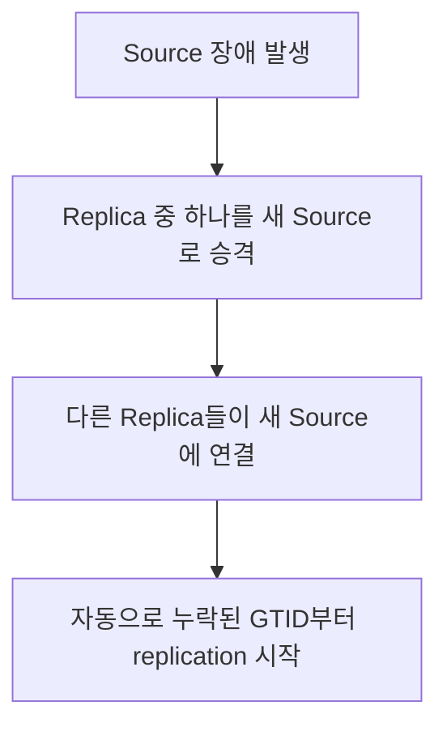

## GTID

- **GTID(Global Transaction Identifier)**는 MySQL replication 환경에서 **transaction을 고유하게 식별하는 식별자**입니다.
    - MySQL 5.6부터 도입되었습니다.
    - source server에서 실행된 transaction은 replica server에서도 동일한 GTID를 유지합니다.

- GTID는 **`server_uuid:transaction_id`** 형식으로 구성됩니다.
    - `server_uuid` : MySQL server의 고유 식별자입니다.
    - `transaction_id` : 해당 server에서 실행된 transaction의 순차적 번호입니다.

```sql
-- GTID 예시
-- server_uuid : 05398e1d-efec-11ef-abed-0242ac120005
-- transaction_id : 42
-- 결과 : 05398e1d-efec-11ef-abed-0242ac120005:42
```

- GTID를 사용하면 **replication 구성이 단순화**됩니다.
    - 기존 방식은 binary log file 이름과 position을 수동으로 지정해야 했습니다.
    - GTID 방식은 자동으로 replication 위치를 동기화합니다.


---


## GTID의 구성 요소

- GTID는 server UUID와 transaction ID로 구성됩니다.


### Server UUID

- **server UUID**는 MySQL server가 처음 시작될 때 자동으로 생성되는 고유 식별자입니다.
    - `auto.cnf` file에 저장되며 server를 재시작해도 유지됩니다.
    - 수동으로 변경하지 않는 한 변하지 않습니다.

```sql
-- server UUID 조회
SELECT @@server_uuid;
-- 결과 : 05398e1d-efec-11ef-abed-0242ac120005
```


### Transaction ID

- **transaction ID**는 해당 server에서 실행된 transaction의 순차적 번호입니다.
    - 1부터 시작하여 transaction이 commit될 때마다 1씩 증가합니다.
    - 연속된 transaction은 범위로 표현됩니다.

```sql
-- 현재 server에서 실행된 모든 GTID 조회
SELECT @@gtid_executed;
-- 결과 : 05398e1d-efec-11ef-abed-0242ac120005:1-100

-- 범위 표기 해석
-- :1-100은 transaction 1부터 100까지 모두 실행되었음을 의미
```


### GTID Set

- **GTID Set**은 여러 server의 GTID를 쉼표로 구분하여 표현합니다.
    - replication topology에서 여러 source의 transaction을 추적할 때 사용됩니다.

```sql
-- 여러 server의 GTID Set 예시
-- server1:1-50, server2:1-30
05398e1d-efec-11ef-abed-0242ac120005:1-50,
a1b2c3d4-5678-90ab-cdef-1234567890ab:1-30
```


---


## GTID 활성화

- GTID를 사용하려면 source와 replica 모두에서 설정을 활성화해야 합니다.


### 설정 방법

- `my.cnf` 또는 Docker command로 GTID를 활성화합니다.

```ini
# my.cnf 설정
[mysqld]
gtid_mode = ON
enforce_gtid_consistency = ON
```

```yaml
# Docker Compose 설정
services:
  mysql:
    image: mysql:8.4
    command:
      - --gtid_mode=ON
      - --enforce_gtid_consistency=ON
```

- **gtid_mode** : GTID 기능의 활성화 상태를 설정합니다.
    - `OFF` : GTID 비활성화 (기본값).
    - `ON` : GTID 활성화, 모든 transaction에 GTID 부여.

- **enforce_gtid_consistency** : GTID와 호환되지 않는 SQL 문장을 차단합니다.
    - `ON`으로 설정하면 GTID 일관성을 보장합니다.


### 설정 확인

```sql
-- GTID 관련 설정 확인
SHOW GLOBAL VARIABLES LIKE '%gtid%';
```

| Variable_name | Value |
| --- | --- |
| gtid_mode | ON |
| enforce_gtid_consistency | ON |
| gtid_executed | 05398e1d-...:1-100 |
| gtid_purged | 05398e1d-...:1-50 |


---


## GTID 기반 Replication

- GTID를 사용하면 replication 구성이 크게 단순화됩니다.


### 기존 방식과의 비교

- **기존 binary log position 방식**은 file 이름과 position을 정확히 지정해야 합니다.

```sql
-- 기존 방식 : binary log file과 position 지정
CHANGE MASTER TO
    MASTER_HOST = 'source_host',
    MASTER_USER = 'repl_user',
    MASTER_PASSWORD = 'password',
    MASTER_LOG_FILE = 'mysql-bin.000003',
    MASTER_LOG_POS = 1234;
```

- **GTID 방식**은 자동으로 적절한 위치를 찾습니다.

```sql
-- GTID 방식 : 자동 위치 동기화
CHANGE MASTER TO
    MASTER_HOST = 'source_host',
    MASTER_USER = 'repl_user',
    MASTER_PASSWORD = 'password',
    MASTER_AUTO_POSITION = 1;
```

| 항목 | Binary Log Position 방식 | GTID 방식 |
| --- | --- | --- |
| 위치 지정 | 수동 (file, position) | 자동 |
| Failover | 복잡 (새 position 계산) | 간단 (자동 동기화) |
| Transaction 추적 | 어려움 | 쉬움 |
| 설정 복잡도 | 높음 | 낮음 |


### Replication 상태 확인

```sql
-- replica에서 replication 상태 확인
SHOW SLAVE STATUS\G

-- 주요 확인 항목
-- Retrieved_Gtid_Set : source로부터 받은 GTID
-- Executed_Gtid_Set : replica에서 실행된 GTID
```


---


## Failover 자동화

- GTID의 가장 큰 장점은 **failover를 단순화**한다는 점입니다.


### 기존 방식의 문제점

- binary log position 방식에서는 source 장애 시 새로운 source의 정확한 위치를 계산해야 합니다.
    - 각 replica가 어느 위치까지 적용했는지 확인해야 합니다.
    - 새 source의 binary log에서 해당 위치를 찾아야 합니다.
    - 수동 계산 중 실수가 발생하면 data 불일치가 생깁니다.


### GTID 방식의 장점

- GTID 방식에서는 replica가 이미 실행한 GTID를 알고 있으므로 자동으로 동기화됩니다.



- replica는 `gtid_executed`를 기반으로 아직 실행하지 않은 transaction만 요청합니다.
- MHA(Master High Availability), Orchestrator 같은 failover 도구가 GTID를 활용합니다.


---


## GTID 관련 System Variables

- GTID와 관련된 주요 system variable입니다.

| Variable | 설명 |
| --- | --- |
| `gtid_executed` | 현재 server에서 실행된 모든 GTID |
| `gtid_purged` | binary log에서 제거된 GTID |
| `gtid_owned` | 현재 실행 중인 transaction의 GTID |
| `gtid_mode` | GTID 활성화 상태 |
| `enforce_gtid_consistency` | GTID 일관성 강제 여부 |

```sql
-- 주요 GTID variable 조회
SELECT @@gtid_executed;
SELECT @@gtid_purged;
```


### gtid_purged

- **gtid_purged**는 binary log에서 제거(purge)되었지만 실행된 것으로 기록된 GTID입니다.
    - binary log rotation이나 수동 삭제로 인해 log file이 제거될 때 설정됩니다.
    - 새 replica를 구성할 때 backup에서 복원 후 이 값을 설정해야 합니다.

```sql
-- backup 복원 후 gtid_purged 설정
SET GLOBAL gtid_purged = '05398e1d-efec-11ef-abed-0242ac120005:1-1000';
```


---


## GTID 제약 사항

- GTID 모드에서는 일부 SQL 문장에 제약이 있습니다.


### 사용할 수 없는 SQL

- **CREATE TABLE ... SELECT** 문장은 사용할 수 없습니다.
    - DDL과 DML이 하나의 transaction에 섞이면 GTID로 표현할 수 없습니다.

```sql
-- 금지 : CREATE TABLE ... SELECT
CREATE TABLE new_table SELECT * FROM old_table;

-- 대안 : 두 문장으로 분리
CREATE TABLE new_table LIKE old_table;
INSERT INTO new_table SELECT * FROM old_table;
```

- **transaction 내 임시 table 생성/삭제**는 제한됩니다.

```sql
-- 금지 : transaction 내에서 임시 table 조작
START TRANSACTION;
CREATE TEMPORARY TABLE temp_t (id INT);
-- ...
COMMIT;

-- 대안 : transaction 외부에서 생성
CREATE TEMPORARY TABLE temp_t (id INT);
START TRANSACTION;
-- temp_t 사용
COMMIT;
```

- **non-transactional storage engine 혼합**은 제한됩니다.
    - InnoDB와 MyISAM을 같은 transaction에서 함께 사용할 수 없습니다.


### Replication 제약

- source와 replica의 `gtid_mode`가 일치해야 합니다.
- 한쪽만 GTID를 사용하는 혼합 구성은 제한적으로 가능하지만 권장되지 않습니다.


---


## GTID 운영 시 고려 사항

- GTID 환경에서는 **binary log 보관 기간, backup 복원 시 gtid_purged 설정, errant transaction 방지**를 관리해야 합니다.


### Binary Log 관리

- GTID는 binary log에 기록되므로 log 관리가 중요합니다.
    - `expire_logs_days` 또는 `binlog_expire_logs_seconds`로 보관 기간을 설정합니다.
    - log가 너무 일찍 제거되면 새 replica 구성이 어려워집니다.

```sql
-- binary log 보관 기간 설정 (7일)
SET GLOBAL binlog_expire_logs_seconds = 604800;
```


### Backup과 복원

- GTID 환경에서 backup을 복원할 때는 `gtid_purged`를 적절히 설정해야 합니다.
    - mysqldump의 `--set-gtid-purged` option을 사용합니다.

```bash
# backup 생성 (GTID 정보 포함)
mysqldump --single-transaction --set-gtid-purged=ON --all-databases > backup.sql

# 복원 후 replica 구성 가능
```


### Errant Transaction

- **errant transaction**은 replica에서만 실행된 transaction입니다.
    - replica에서 직접 DML을 실행하면 발생합니다.
    - failover 시 data 불일치의 원인이 됩니다.

```sql
-- errant transaction 확인
-- replica의 gtid_executed에 source에 없는 GTID가 있으면 errant transaction
SELECT @@gtid_executed;
```

- replica에서는 `read_only=ON` 또는 `super_read_only=ON`을 설정하여 방지합니다.


---


## Reference

- <https://dev.mysql.com/doc/refman/8.0/en/replication-gtids.html>
- <https://dev.mysql.com/doc/refman/8.0/en/replication-gtids-concepts.html>
- <https://dev.mysql.com/doc/refman/8.0/en/replication-gtids-howto.html>

