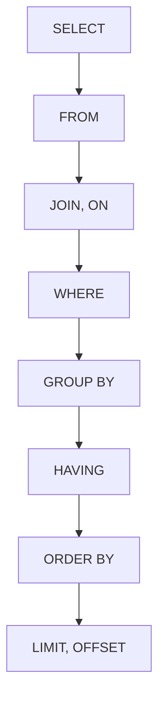
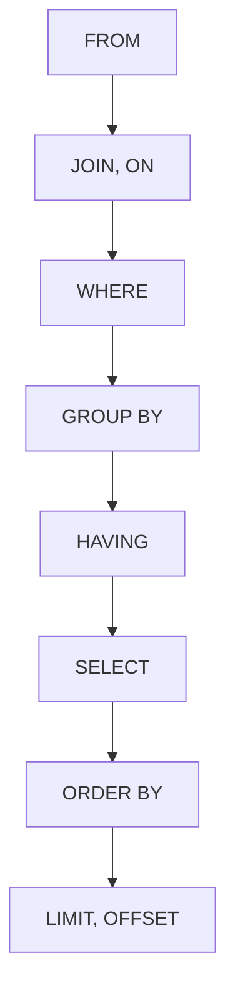

## MySQL Query의 작성 순서와 실행 순서

- MySQL query는 작성하는 순서와 실행되는 순서가 다릅니다.

- 작성 순서와 실행 순서의 차이를 이해하는 것은 query를 최적화하고 문제를 해결하는 데에 도움이 됩니다.
    - 예를 들어, `WHERE`는 grouping 전에 실행되고, `HAVING`은 grouping 후에 실행됩니다.
    - 예를 들어, `SELECT`에서 정의한 alias는 `WHERE`에서 사용할 수 없습니다.
        - 실행 순서상 `WHERE`가 `SELECT` 앞에 실행되기 때문입니다.
    - 예를 들어, `SELECT`에서 정의한 alias는 `GROUP BY`, `HAVING`, `ORDER BY`에서 사용할 수 있습니다.
        - 이런 경우, MySQL은 alias를 인식하도록 특별히 처리합니다.


---


## 작성 순서



1. `SELECT` : 조회하고자 하는 column을 지정합니다.
2. `FROM` : data를 가져올 table을 지정합니다.
3. `JOIN` : 다른 table과 연결합니다.
4. `WHERE` : 조회할 data의 조건을 지정합니다.
5. `GROUP BY` : 동일한 값을 가진 행을 grouping합니다.
6. `HAVING` : grouping된 결과에 조건을 적용합니다.
7. `ORDER BY` : 결과를 정렬합니다.
8. `LIMIT`, `OFFSET` : 결과의 개수와 시작 위치를 제한합니다.


---


## 실행 순서

- MySQL은 작성 순서와 다른 순서로 query를 실행합니다.



1. `FROM` : 먼저 data를 가져올 table을 결정합니다.
2. `JOIN` : 지정된 조건에 따라 다른 table과 결합합니다.
3. `WHERE` : 조건에 맞는 행만 filtering합니다.
4. `GROUP BY` : 지정된 column을 기준으로 행을 grouping합니다.
5. `HAVING` : grouping된 결과 중 조건에 맞는 것만 filtering합니다.
6. `SELECT` : 최종적으로 조회할 column을 선택합니다.
7. `ORDER BY` : 결과를 지정된 순서로 정렬합니다.
8. `LIMIT`, `OFFSET` : 결과의 개수와 시작 위치를 제한합니다.


### Query의 실행 순서 예시

```sql
SELECT 
    department, 
    AVG(salary) as avg_salary
FROM 
    employees
JOIN 
    departments ON employees.dept_id = departments.id
WHERE 
    hire_date > '2020-01-01'
GROUP BY 
    department
HAVING 
    AVG(salary) > 50000
ORDER BY 
    avg_salary DESC
LIMIT 5;
```

1. `FROM employees` : `employees` table을 대상으로 합니다.
2. `JOIN departments` : `departments` table과 결합합니다.
3. `WHERE hire_date > '2020-01-01'` : 2020년 이후 입사한 직원만 filtering합니다.
4. `GROUP BY department` : 부서별로 grouping합니다.
5. `HAVING AVG(salary) > 50000` : 평균 급여가 50,000 이상인 부서만 선택합니다.
6. `SELECT department, AVG(salary) as avg_salary` : 부서명과 평균 급여를 조회합니다.
7. `ORDER BY avg_salary DESC` : 평균 급여 기준 내림차순으로 정렬합니다.
8. `LIMIT 5` : 상위 5개 결과만 반환합니다.


---


## 실행 순서를 고려한 Query 최적화 Tip

- `WHERE` 조건을 최대한 활용하여 초기 단계에서 data를 filtering합니다.
    - 초기에 필요한 data만 거르기 때문에, 이후 단계에서 처리할 data의 양을 줄일 수 있습니다.

- `GROUP BY`와 `HAVING` 대신 `WHERE`를 사용할 수 있다면 `WHERE`를 사용합니다.
    - `WHERE`는 grouping 전에 실행되므로 처리해야 할 data의 양을 줄여줍니다.

- 불필요한 column은 `SELECT`에서 제외합니다.
    - 특히 `TEXT`나 `BLOB` 같은 대용량 data type인 경우, 성능에 큰 영향을 줍니다.

- `ORDER BY`와 `LIMIT`는 query의 마지막에 실행되므로, 대량의 결과를 정렬할 때는 주의해야 합니다.
    - 특히 `ORDER BY`는 data가 많을 경우, 성능에 큰 영향을 줄 수 있습니다.

