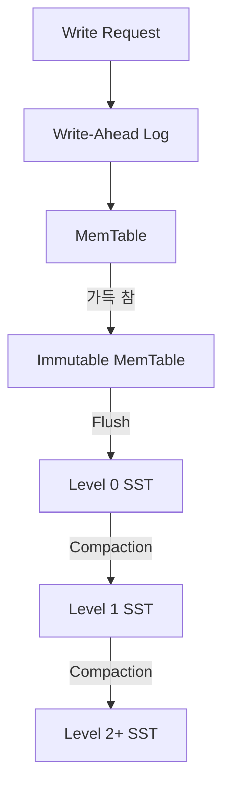

## RocksDB

- **RocksDB**는 Facebook이 개발한 **LSM Tree(Log-Structured Merge Tree) 기반의 embedded key-value storage engine**입니다.
    - Google의 LevelDB를 fork하여 성능과 기능을 대폭 개선한 project입니다.
    - 2012년에 개발을 시작하여 현재는 Apache 2.0 license로 open source로 공개되어 있습니다.

- RocksDB는 **쓰기 최적화 workload**에서 뛰어난 성능을 발휘합니다.
    - LSM Tree 구조 덕분에 random write를 sequential write로 변환하여 disk I/O를 최소화합니다.
    - SSD와 flash storage에 최적화되어 있습니다.

- **embedded database**로 설계되어 별도의 server process 없이 application에 직접 통합됩니다.
    - library 형태로 제공되어 C++, Java, Python 등 다양한 언어에서 사용 가능합니다.


---


## LSM Tree 구조

- RocksDB의 핵심은 **LSM Tree(Log-Structured Merge Tree)** 자료 구조입니다.
    - data를 memory와 disk의 여러 level에 걸쳐 계층적으로 저장합니다.
    - write 작업은 먼저 memory에 기록되고, 이후 background에서 disk로 병합됩니다.


### Write Path

- 쓰기 작업은 **MemTable → Immutable MemTable → SST File** 순서로 진행됩니다.



- **Write-Ahead Log (WAL)** : 모든 write는 먼저 WAL에 기록되어 crash recovery를 보장합니다.
- **MemTable** : memory에 있는 정렬된 자료 구조로, 새로운 data가 먼저 저장됩니다.
- **Immutable MemTable** : MemTable이 가득 차면 읽기 전용으로 전환됩니다.
- **SST File (Sorted String Table)** : disk에 저장되는 불변의 정렬된 file입니다.


### Read Path

- 읽기 작업은 **최신 data부터 오래된 data 순서**로 탐색합니다.


- MemTable에서 먼저 찾고, 없으면 SST file을 level 순서대로 탐색합니다.
- **Bloom Filter**를 사용하여 불필요한 disk 접근을 최소화합니다.


---


## Compaction

- **Compaction**은 여러 SST file을 병합하여 중복 key를 제거하고 삭제된 data를 정리하는 과정입니다.
    - disk 공간을 회수하고 read 성능을 유지합니다.
    - background thread에서 비동기적으로 실행됩니다.


### Compaction 전략

- RocksDB는 workload 특성에 따라 다양한 compaction 전략을 제공합니다.

| 전략 | 특징 | 적합한 Workload |
| --- | --- | --- |
| Level Compaction | 기본 전략, 공간 효율 높음 | 일반적인 workload |
| Universal Compaction | 쓰기 증폭 낮음, 공간 사용 많음 | 쓰기 집중 workload |
| FIFO Compaction | 오래된 data 자동 삭제 | TTL 기반 data |

- **Level Compaction** : level 간 data를 병합하며, 각 level은 이전 level보다 10배 큰 용량을 가집니다.
- **Universal Compaction** : 같은 level의 file들을 병합하여 쓰기 증폭을 줄입니다.
- **FIFO Compaction** : 용량 제한에 도달하면 가장 오래된 SST file을 삭제합니다.


### write amplification과 space amplification

- compaction은 **write amplification**과 **space amplification** 사이의 trade-off입니다.

- **write amplification** : 실제 쓰기 양 대비 disk에 기록되는 양의 비율입니다.
    - Level Compaction은 write amplification이 높지만 space efficiency가 좋습니다.
    - Universal Compaction은 write amplification이 낮지만 더 많은 disk 공간이 필요합니다.

- **space amplification** : 실제 data 크기 대비 disk에서 차지하는 공간의 비율입니다.
    - 중복 key와 삭제된 data가 즉시 제거되지 않아 발생합니다.


---


## 주요 기능

- RocksDB는 **column family, Bloom Filter, block cache, compression** 등의 기능으로 read/write 성능을 최적화합니다.


### Column Families

- **column family**는 논리적으로 분리된 key-value namespace입니다.
    - 하나의 database 내에서 여러 column family를 생성할 수 있습니다.
    - 각 column family는 독립적인 MemTable과 SST file을 가집니다.

```cpp
// Column Family 생성
rocksdb::Options options;
rocksdb::DB* db;
std::vector<rocksdb::ColumnFamilyDescriptor> column_families;
column_families.push_back(rocksdb::ColumnFamilyDescriptor("default", options));
column_families.push_back(rocksdb::ColumnFamilyDescriptor("metadata", options));
```

- data 유형에 따라 다른 설정을 적용할 수 있습니다.
- column family 간 atomic write가 가능합니다.


### Bloom Filter

- **Bloom Filter**는 특정 key가 SST file에 존재하는지 빠르게 확인하는 확률적 자료 구조입니다.
    - false positive는 가능하지만 false negative는 불가능합니다.
    - 불필요한 disk read를 크게 줄여 read 성능을 향상시킵니다.

- memory 사용량과 false positive rate는 trade-off 관계입니다.
    - bit per key를 높이면 정확도가 올라가지만 memory 사용량이 증가합니다.


### Block Cache

- **block cache**는 자주 접근하는 data block을 memory에 caching합니다.
    - LRU(Least Recently Used) algorithm을 사용합니다.
    - hot data에 대한 read latency를 크게 줄입니다.


### Compression

- RocksDB는 여러 compression algorithm을 지원합니다.
    - Snappy, LZ4, Zlib, Zstd 등을 level별로 다르게 설정할 수 있습니다.
    - 상위 level(오래된 data)에는 높은 압축률, 하위 level(최신 data)에는 빠른 압축을 적용하는 것이 일반적입니다.


---


## 사용 사례

- RocksDB는 **database storage engine, stream processing state store, embedded application** 등에서 사용됩니다.


### Database Storage Engine

- **MySQL MyRocks** : Facebook이 개발한 MySQL storage engine으로, InnoDB 대비 공간 효율이 뛰어납니다.
- **MariaDB MyRocks** : MariaDB에서도 MyRocks를 지원합니다.
- **TiKV** : TiDB의 distributed key-value storage로 RocksDB를 사용합니다.
- **CockroachDB** : distributed SQL database의 storage layer입니다.


### Stream Processing

- **Apache Flink** : state backend로 RocksDB를 사용하여 대용량 state를 관리합니다.
- **Apache Kafka Streams** : local state store로 RocksDB를 사용합니다.
- **ksqlDB** : Kafka Streams 기반이므로 내부적으로 RocksDB를 사용합니다.


### Embedded Applications

- mobile application, IoT device 등 embedded 환경에서 local database로 사용됩니다.
- log storage, cache layer, metadata storage 등 다양한 용도로 활용됩니다.


---


## B-Tree와의 비교

- LSM Tree는 **write 성능과 space efficiency**에서 우수하고, B-Tree는 **read 성능**에서 우수합니다.

| 항목 | LSM Tree (RocksDB) | B-Tree (InnoDB) |
| --- | --- | --- |
| Write 성능 | 뛰어남 (sequential write) | 보통 (random write) |
| Read 성능 | 보통 (여러 level 탐색) | 뛰어남 (단일 tree 탐색) |
| Space Efficiency | 높음 (압축 용이) | 보통 |
| Write Amplification | 높음 | 낮음 |
| SSD 친화성 | 매우 높음 | 보통 |

- **write-heavy workload**에는 LSM Tree가 적합합니다.
- **read-heavy workload**나 point query가 많은 경우 B-Tree가 유리합니다.
- 실제 선택은 workload 특성, hardware 환경, 운영 요구 사항을 종합적으로 고려해야 합니다.


---


## Reference

- <https://rocksdb.org/>
- <https://github.com/facebook/rocksdb/wiki>
- <https://rocksdb.org/blog/2021/05/26/integrated-blob-db.html>

