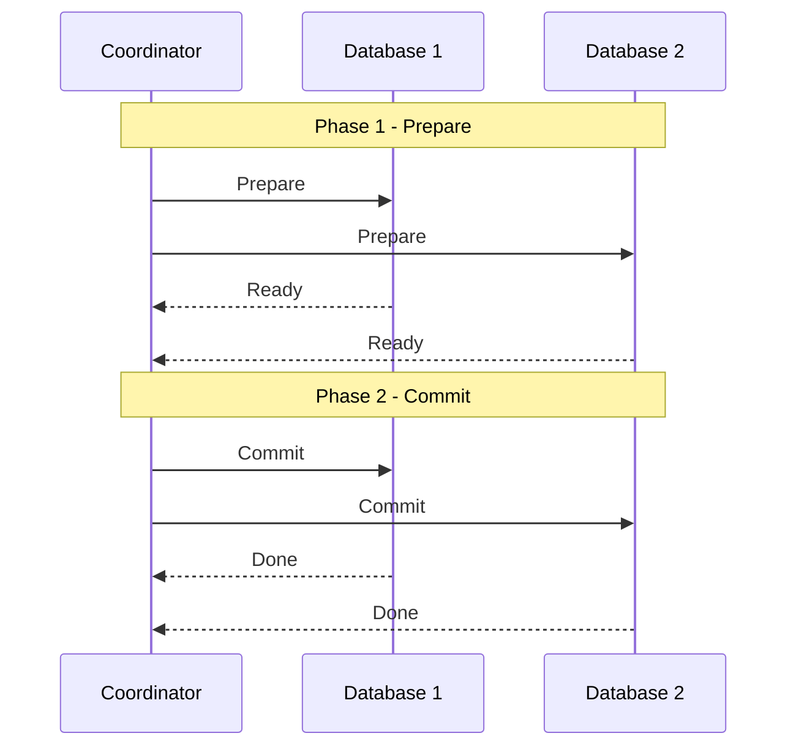
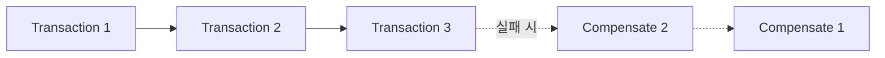

## 분산 Transaction의 필요성

- 분산 transaction은 **두 개 이상의 독립적인 database 또는 service에 걸쳐 실행되는 transaction**입니다.
    - 단일 database 내에서는 ACID 속성을 통해 transaction의 원자성과 일관성이 보장됩니다.
    - 그러나 여러 database가 관여하면 각 database의 local transaction만으로는 전체 작업의 원자성을 보장할 수 없습니다.

- MSA(Microservice Architecture)나 database 이원화 환경에서 분산 transaction 문제가 자주 발생합니다.
    - 예를 들어, 회원 정보가 Master DB와 Sub DB로 나뉘어 관리되는 경우, 계정 생성 시 두 database에 모두 data를 기록해야 합니다.
    - 첫 번째 database에는 성공했지만 두 번째 database에서 실패하면, data 불일치가 발생하고 조회 logic에 오류가 생깁니다.

- 분산 환경에서는 **network 장애, 부분 실패, 시간 지연** 등 단일 system에서는 고려하지 않아도 되는 문제들이 추가로 발생합니다.

---

## 해결 전략의 선택 기준

- 분산 transaction 문제를 해결하는 방법은 여러 가지가 있으며, 각 방법은 **정합성, 성능, 복잡도** 측면에서 서로 다른 trade-off를 가집니다.

- 선택 시 고려해야 할 요소는 세 가지입니다.
    - **정합성 수준** : 강한 일관성(Strong Consistency)이 필요한지, 결과적 일관성(Eventual Consistency)으로 충분한지 판단합니다.
    - **성능 요구 사항** : 대용량 traffic을 처리해야 하는 환경에서는 lock 점유 시간이 짧은 방식이 유리합니다.
    - **운영 복잡도** : infra 설정과 유지보수 비용을 고려해야 합니다.

| 전략 | 정합성 | 성능 | 복잡도 |
| --- | --- | --- | --- |
| Chained Transaction Manager | Best Effort | 중간 | 낮음 |
| 2PC (Two-Phase Commit) | 강한 일관성 | 낮음 | 높음 |
| Saga Pattern | 결과적 일관성 | 높음 | 중간 |

---

## Chained Transaction Manager

- Chained Transaction Manager는 **여러 Transaction Manager를 순차적으로 묶어 commit과 rollback을 수행**하는 방식입니다.
    - Spring Data Commons에서 `ChainedTransactionManager`로 제공되었던 기능입니다.

- 이 방식은 **Best Effort 1PC** pattern으로 분류됩니다.
    - 각 database의 local transaction을 순차적으로 commit하며, 모든 commit이 성공하면 전체 transaction이 완료됩니다.
    - 그러나 첫 번째 database commit 후 두 번째 database에서 실패하면, 이미 commit된 첫 번째 database는 rollback할 수 없습니다.

- 완벽한 원자성을 보장하지 못하고, 성능 이슈와 deadlock 가능성으로 인해 현재는 deprecated 상태입니다.
    - 간단한 구현이 필요하고 data 불일치 허용 범위가 넓은 경우에만 제한적으로 사용됩니다.

---

## 2PC (Two-Phase Commit)

- 2PC는 **분산 환경에서 강한 일관성을 보장하기 위한 protocol**입니다.
    - coordinator가 모든 참여자(database)에게 commit 준비를 요청하고, 모든 참여자가 준비 완료를 응답하면 최종 commit을 지시합니다.
    - 하나라도 실패하면 전체 rollback을 수행합니다.

### 2PC의 두 단계

- 2PC는 **Prepare 단계**와 **Commit 단계**로 구성됩니다.

- **Phase 1 : Prepare**.
    - coordinator가 모든 참여자에게 "commit할 준비가 되었는가?"를 질의합니다.
    - 각 참여자는 transaction을 실행하고, commit 가능 여부를 coordinator에게 응답합니다.
    - 이 시점에서 참여자는 lock을 유지한 채 대기합니다.

- **Phase 2 : Commit / Rollback**.
    - 모든 참여자가 준비 완료를 응답하면, coordinator는 commit 명령을 전송합니다.
    - 하나라도 실패 응답이 오면, coordinator는 rollback 명령을 전송합니다.

### 2PC의 한계

- 2PC는 강한 일관성을 보장하지만, **성능과 가용성 측면에서 단점**이 있습니다.

- **성능 저하** : Prepare 단계에서 모든 참여자가 lock을 유지한 채 대기하므로, lock 점유 시간이 길어집니다.
    - 참여자 수가 늘어날수록 대기 시간이 증가하고 throughput이 감소합니다.

- **Coordinator 단일 장애점** : coordinator가 장애를 일으키면 참여자들은 lock을 유지한 채 무한 대기 상태에 빠질 수 있습니다.

- **설정 복잡도** : XA transaction을 지원하는 database와 JTA(Java Transaction API) 구현체가 필요하며, infra 구성이 복잡합니다.

---

## Saga Pattern

- Saga pattern은 **각 단계를 local transaction으로 처리하고, 실패 시 보상 transaction을 실행하여 상태를 되돌리는** 방식입니다.
    - 2PC와 달리 global lock을 사용하지 않아 성능이 높습니다.
    - ACID 중 Isolation을 포기하고, **결과적 일관성(Eventual Consistency)**을 목표로 합니다.

- Saga는 **일련의 local transaction과 그에 대응하는 보상 transaction의 쌍**으로 구성됩니다.
    - 각 단계가 성공하면 다음 단계로 진행합니다.
    - 중간에 실패하면 이전에 성공한 단계들의 보상 transaction을 역순으로 실행합니다.

### Choreography vs Orchestration

- Saga pattern은 구현 방식에 따라 **Choreography**와 **Orchestration** 두 가지로 나뉩니다.

- **Choreography** 방식은 각 service가 event를 발행하고 구독하여 다음 단계를 trigger합니다.
    - 중앙 coordinator 없이 service 간 event로 협력합니다.
    - service가 추가될수록 event 흐름 파악이 어려워지는 단점이 있습니다.

- **Orchestration** 방식은 중앙 orchestrator가 전체 흐름을 제어합니다.
    - orchestrator가 각 service에 명령을 내리고 결과를 수집합니다.
    - 흐름 파악이 쉽지만, orchestrator가 단일 장애점이 될 수 있습니다.

| 방식 | 장점 | 단점 |
| --- | --- | --- |
| Choreography | 느슨한 결합, 단일 장애점 없음 | 복잡한 흐름 추적, debugging 어려움 |
| Orchestration | 명확한 흐름 제어, 쉬운 monitoring | orchestrator 의존성, 단일 장애점 가능성 |

### Saga의 trade-off

- Saga pattern은 **격리성(Isolation)을 보장하지 않습니다.**
    - transaction 진행 중에 다른 transaction이 중간 상태의 data를 읽을 수 있습니다.
    - 이를 **Dirty Read** 또는 **Lost Update** 문제라고 하며, application level에서 별도로 처리해야 합니다.

- 보상 transaction 설계가 복잡할 수 있습니다.
    - 모든 action에 대해 역으로 되돌리는 보상 logic을 정의해야 합니다.
    - 일부 작업은 본질적으로 되돌릴 수 없어 **semantic rollback**이 필요합니다.
        - 예를 들어, email 발송은 취소할 수 없으므로 "발송 취소 안내 email"을 보내는 방식으로 보상합니다.

---

## 전략 선택 Guide

- **강한 일관성이 필수**이고 성능 저하를 감수할 수 있다면 **2PC**를 선택합니다.
    - 금융 거래, 결제 system 등 data 오류가 절대 허용되지 않는 경우에 적합합니다.

- **높은 성능이 필요**하고 결과적 일관성으로 충분하다면 **Saga pattern**을 선택합니다.
    - 대용량 traffic을 처리하는 MSA 환경에서 주로 사용됩니다.
    - data 불일치가 일시적으로 발생해도 최종적으로 복구되면 되는 경우에 적합합니다.

- 간단한 구현이 필요하고 제약이 적다면 **Chained Transaction Manager**를 고려할 수 있으나, deprecated 상태이므로 신규 개발에는 권장되지 않습니다.

---

## Reference

- <https://microservices.io/patterns/data/saga.html>
- <https://en.wikipedia.org/wiki/Two-phase_commit_protocol>

