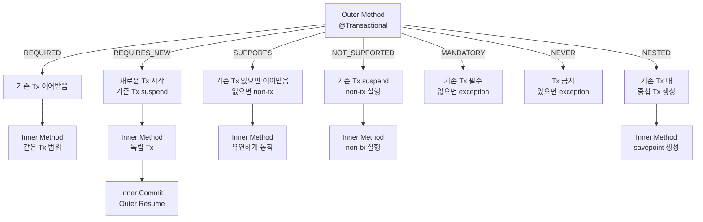
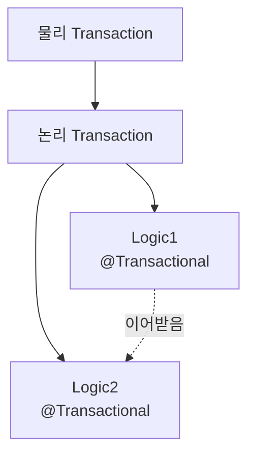
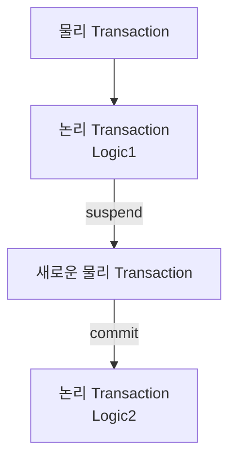
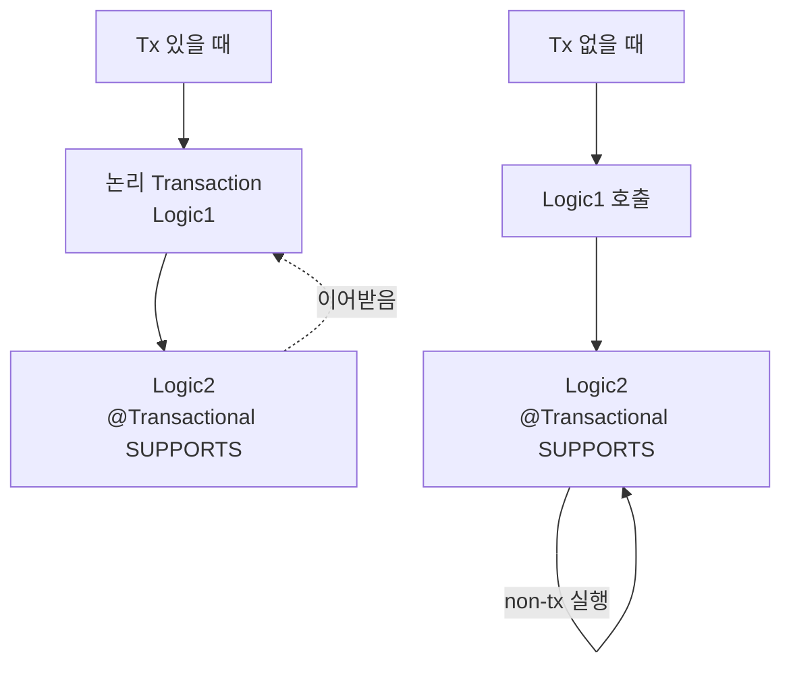
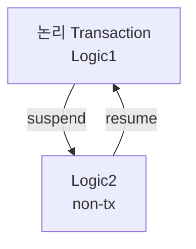
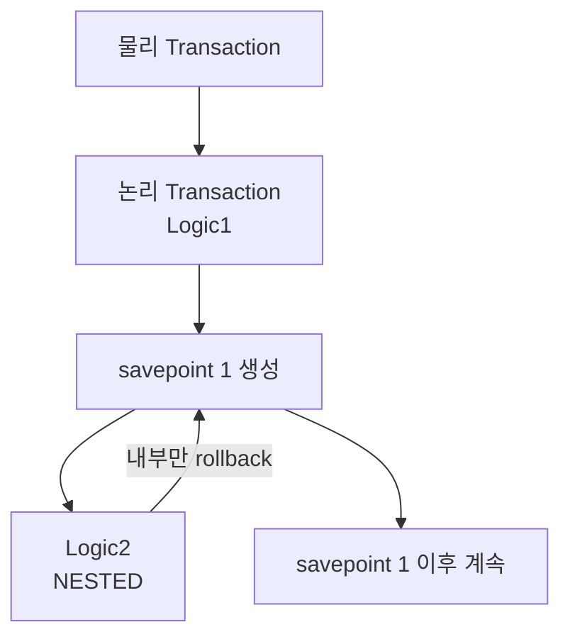

## Transaction Propagation

- **Transaction propagation**은 `@Transactional` method가 다른 `@Transactional` method를 호출할 때, 기존 transaction을 어떻게 처리할지를 결정하는 속성입니다.

- `REQUIRED`, `REQUIRES_NEW`, `SUPPORTS`, `NOT_SUPPORTED`, `MANDATORY`, `NEVER`, `NESTED` 등 7가지 전파 전략을 제공합니다.
    - 기본값은 `Propagation.REQUIRED`입니다.

- 각 propagation 전략에 따라 outer method와 inner method의 transaction이 관계되는 방식이 달라집니다.



| 전략 | 기존 Tx 있을 때 | 기존 Tx 없을 때 | 주요 특징 |
| --- | --- | --- | --- |
| REQUIRED | 이어받음 | 새로 시작 | 기본값, 대부분의 service method |
| REQUIRES_NEW | 새로 시작 (suspend) | 새로 시작 | 독립적인 transaction 필요 |
| SUPPORTS | 이어받음 | non-tx 실행 | 유연한 transaction 관리 |
| NOT_SUPPORTED | suspend | non-tx 실행 | transaction 범위 밖에서 실행 |
| MANDATORY | 이어받음 | exception 발생 | transaction 필수 강제 |
| NEVER | exception 발생 | non-tx 실행 | transaction 금지 강제 |
| NESTED | savepoint 생성 | 새로 시작 | 부분적 rollback 지원 |


---


## `REQUIRED` : 기존 Transaction 이어받기

- 기존 transaction이 있으면 그것을 이어받고, 없으면 새로운 transaction을 시작합니다.
- 가장 일반적으로 사용되는 전파 방식으로, 대부분의 service method의 기본값입니다.



- `REQUIRED`는 Spring의 기본값으로, 기존 transaction이 있으면 이어받습니다.
- 내부 logic이 이어받는 위 logic과 동일한 물리 transaction에 포함됩니다.

```java
@Service
public class OrderService {
    @Transactional
    public void createOrder(Order order) {
        orderRepository.save(order);
        paymentService.processPayment(order);
    }
}

@Service
public class PaymentService {
    @Transactional(propagation = Propagation.REQUIRED)
    public void processPayment(Order order) {
        paymentRepository.save(order);
    }
}
```

- `OrderService.createOrder()`는 새로운 transaction을 시작합니다.
- `PaymentService.processPayment()`는 `createOrder()`의 transaction을 이어받습니다.
- 두 method 모두 동일한 transaction 범위 내에서 실행되므로, 어느 쪽이든 exception이 발생하면 전체가 rollback됩니다.


---


## `REQUIRES_NEW` : 항상 새로운 Transaction 시작

- 항상 새로운 transaction을 시작합니다.
- 기존 transaction이 있으면, 그것을 suspend(일시 중지)하고 새로운 transaction을 시작합니다.
- 새로운 transaction이 완료되면, 기존 transaction이 resume(재개)됩니다.



- `REQUIRES_NEW`는 외부 transaction을 내부 transaction이 사용하지 않습니다.
- 각각의 물리 transaction이 분리되어 독립적으로 처리됩니다.

```java
@Service
public class OrderService {
    @Transactional
    public void createOrder(Order order) {
        orderRepository.save(order);
        auditService.logOrderCreation(order);
    }
}

@Service
public class AuditService {
    @Transactional(propagation = Propagation.REQUIRES_NEW)
    public void logOrderCreation(Order order) {
        auditLogRepository.save(new AuditLog(order));
    }
}
```

- `OrderService.createOrder()`의 transaction과 `AuditService.logOrderCreation()`의 transaction은 독립적입니다.
- `createOrder()`가 rollback되어도 audit log는 database에 commit됩니다.
- 기본 작업의 성공/실패와 무관하게 처리되어야 하는 작업(audit, logging)에 적합합니다.


---


## `SUPPORTS` : Transaction 있으면 이어받기

- 기존 transaction이 있으면 이어받고, 없으면 non-transactional하게(transaction 없이) 실행됩니다.
- transaction이 필수적이지 않은 작업에 사용합니다.



- `SUPPORTS`는 호출 상황에 따라 유연하게 동작합니다.
- transaction이 있으면 이어받고, 없으면 non-transactional하게 실행됩니다.

```java
@Service
public class CacheService {
    @Transactional(propagation = Propagation.SUPPORTS)
    public User getUser(Long id) {
        return userCache.getOrLoad(id);
    }
}

@Service
public class UserService {
    @Transactional
    public void updateUserAndCache(Long id, UpdateRequest request) {
        User user = userRepository.findById(id).orElseThrow();
        user.update(request);
        userRepository.save(user);
        cacheService.getUser(id);
    }

    public User getUserOnly(Long id) {
        return cacheService.getUser(id);
    }
}
```

- 호출하는 곳의 상황에 따라 유연하게 동작합니다.
- 조회나 utility method처럼 transaction이 있어도, 없어도 상관없는 작업에 적합합니다.


---


## `NOT_SUPPORTED` : Transaction 없이만 실행

- transaction 없이 실행합니다.
- 기존 transaction이 있으면, 그것을 suspend하고 transaction 없이 method를 실행합니다.
- 완료 후 기존 transaction이 resume됩니다.



- `NOT_SUPPORTED`는 transaction이 있으면 일시 중지하고 non-transactional하게 실행합니다.
- 작업 완료 후 기존 transaction이 다시 시작됩니다.

```java
@Service
public class ExternalServiceClient {
    @Transactional(propagation = Propagation.NOT_SUPPORTED)
    public void callExternalService(String data) {
        externalApi.send(data);
    }
}

@Service
public class OrderService {
    @Transactional
    public void createOrderAndNotify(Order order) {
        orderRepository.save(order);
        externalServiceClient.callExternalService(order.getId());
    }
}
```

- 외부 service 호출이나 cache invalidation 같이 transaction 범위 밖에서 처리되어야 하는 작업에 사용합니다.
- transaction 내에서 실행되면 안 되는 특별한 작업을 명시적으로 표현합니다.


---


## `MANDATORY` : 반드시 기존 Transaction 필요

- 반드시 기존 transaction 내에서만 실행되어야 합니다.
- 기존 transaction이 없으면 `IllegalTransactionStateException`을 발생시킵니다.

```java
@Service
public class PaymentRepository {
    @Transactional(propagation = Propagation.MANDATORY)
    public void processPayment(Order order) {
        paymentTable.save(order.getPayment());
    }
}

@Service
public class OrderService {
    @Transactional
    public void createOrder(Order order) {
        orderRepository.save(order);
        paymentRepository.processPayment(order);
    }

    public void createOrderWithoutTransaction(Order order) {
        orderRepository.save(order);
        paymentRepository.processPayment(order);
    }
}
```

- 특정 method는 항상 transaction 범위 내에서만 호출되어야 한다는 계약을 강제(enforce)합니다.
- 여러 repository method를 조합하는 business logic은 반드시 transaction 내에서만 호출되어야 할 때 사용합니다.


---


## `NEVER` : Transaction 없이만 실행

- transaction 없이만 실행되어야 합니다.
- 기존 transaction이 있으면 `IllegalTransactionStateException`을 발생시킵니다.

```java
@Service
public class MetricsService {
    @Transactional(propagation = Propagation.NEVER)
    public void recordMetric(String metricName, double value) {
        metricsDb.insert(metricName, value);
    }
}

@Service
public class OrderService {
    @Transactional
    public void createOrder(Order order) {
        orderRepository.save(order);
        metricsService.recordMetric("order.created", 1.0);
    }
}
```

- transaction이 있으면 안 되는 특별한 상황을 명시적으로 표현합니다.
- monitoring이나 metric 수집 같이 transaction 범위 밖에서만 처리되어야 하는 작업에 사용합니다.


---


## `NESTED` : 중첩된 Transaction 생성

- 기존 transaction 내에 중첩된 transaction을 생성(savepoint 사용)합니다.
- 기존 transaction이 없으면, `REQUIRED`처럼 새로운 transaction을 시작합니다.



- `NESTED`는 savepoint를 이용하여 부분적인 rollback을 지원합니다.
- 중첩된 transaction이 rollback되어도 외부 transaction은 계속 진행됩니다.

```java
@Service
public class DataImportService {
    @Transactional
    public void importData(List<Record> records) {
        for (Record record : records) {
            try {
                importSingleRecord(record);
            } catch (Exception e) {
                log.warn("Failed to import record: {}", record.getId(), e);
            }
        }
    }

    @Transactional(propagation = Propagation.NESTED)
    public void importSingleRecord(Record record) {
        recordRepository.save(record);
    }
}
```

- 중첩된 transaction이 rollback되면 savepoint로 롤백되고, 외부 transaction은 계속 진행됩니다.
- 외부 transaction이 rollback되면 중첩된 transaction도 함께 rollback됩니다.
- 모든 database가 savepoint를 지원하지는 않으며, 일부 database에서만 사용 가능합니다.
- 부분적인 rollback이 필요한 경우에 사용합니다.


---


## Propagation 전략 선택 지침

- 각 propagation 전략의 특성과 사용 사례를 이해하여 상황에 맞게 선택합니다.

- **REQUIRED (기본값)** : 대부분의 service layer method에서 사용합니다.
    - 여러 repository method를 호출하는 business logic은 하나의 transaction 범위에서 실행되어야 합니다.

- **REQUIRES_NEW** : 기본 작업의 성공/실패와 무관하게 처리되어야 하는 작업에 사용합니다.
    - audit log 기록, system notification 발송, error report 저장 등이 해당합니다.

- **SUPPORTS** : transaction이 있어도, 없어도 상관없는 작업에 사용합니다.
    - 조회 작업이나 utility method에 적합합니다.

- **NOT_SUPPORTED** : 외부 service 호출이나 cache invalidation 같이 transaction 범위 밖에서 실행되어야 하는 작업에 사용합니다.

- **MANDATORY** : 특정 method는 항상 transaction 범위 내에서만 호출되어야 한다는 계약을 enforce하고 싶을 때 사용합니다.

- **NEVER** : transaction이 있으면 안 되는 특별한 작업을 명시적으로 표현할 때 사용합니다.

- **NESTED** : 부분적인 rollback이 필요한 경우에 사용하며, database 지원 확인이 필수입니다.


---


## Reference

- <https://docs.spring.io/spring-framework/docs/current/reference/html/data-access.html#tx-propagation>
- <https://docs.spring.io/spring-framework/docs/current/javadoc-api/org/springframework/transaction/annotation/Propagation.html>

