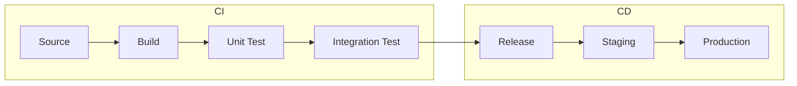

## Integration Hell

- CI/CD가 없는 환경에서는 **integration hell**이 발생합니다.
    - 개발자들이 각자의 branch에서 오래 작업한 후, 특정 시점(merge day)에 한꺼번에 병합합니다.
    - 병합 시점에 대량의 충돌이 발생하고, 충돌의 원인을 파악하기 어렵습니다.
    - 배포는 수동으로 진행되어 human error가 발생하기 쉽습니다.

- CI/CD는 **자주 통합하고, 자동으로 검증하고, 빠르게 배포**하는 방식으로 integration hell을 해결합니다.
    - 작은 단위의 변경을 자주 통합하여 충돌을 최소화합니다.
    - 자동화된 build와 test로 문제를 조기에 발견합니다.
    - 배포 과정을 자동화하여 반복 가능하고 신뢰할 수 있게 만듭니다.

---

## CI : Continuous Integration

- CI(Continuous Integration)는 **code 변경을 자주 통합하고 자동으로 검증**하는 방식입니다.
    - 개발자가 code를 commit하면 자동으로 build와 test가 실행됩니다.
    - 문제가 발생하면 즉시 feedback을 받아 빠르게 수정합니다.

### CI의 핵심 원칙

- **자주 commit**합니다.
    - 하루에 한 번 이상 main branch에 통합하는 것이 권장됩니다.
    - commit 간격이 길어질수록 충돌 가능성이 높아집니다.

- **자동화된 build를 유지**합니다.
    - commit마다 자동으로 build가 실행되어야 합니다.
    - build가 실패하면 즉시 알림을 받고 수정합니다.

- **자동화된 test를 실행**합니다.
    - unit test와 integration test가 자동으로 실행됩니다.
    - test가 없으면 CI의 효과가 크게 감소합니다.

- **build 실패 시 즉시 수정**합니다.
    - build가 깨진 상태로 방치하면 다른 개발자의 작업에 영향을 줍니다.
    - build 수정이 최우선 과제입니다.

---

## CD : Continuous Delivery와 Continuous Deployment

- CD는 CI 이후의 배포 과정을 자동화하며, **Continuous Delivery**와 **Continuous Deployment**로 구분됩니다.
    - 두 개념 모두 CI를 기반으로 하지만, 자동화 수준에서 차이가 있습니다.

| 구분 | 자동화 범위 | production 배포 |
| --- | --- | --- |
| Continuous Delivery | CI + staging 배포 | 수동 승인 후 배포 |
| Continuous Deployment | CI + staging + production 배포 | 완전 자동화 |

### Continuous Delivery

- Continuous Delivery는 **production 배포 직전까지 자동화**합니다.
    - code가 항상 배포 가능한 상태를 유지합니다.
    - staging 환경에 자동 배포되어 검증됩니다.
    - production 배포는 수동 승인 후 진행합니다.

- 대부분의 조직이 Continuous Delivery를 채택합니다.
    - business 검토, compliance 요구 사항 등으로 수동 승인이 필요한 경우가 많습니다.
    - 배포 시점을 조절해야 하는 경우에 적합합니다.

### Continuous Deployment

- Continuous Deployment는 **production 배포까지 완전 자동화**합니다.
    - 모든 test를 통과한 code가 자동으로 production에 배포됩니다.
    - 사람의 개입 없이 하루에도 여러 번 배포됩니다.

- Continuous Deployment는 높은 수준의 test 자동화가 전제됩니다.
    - test coverage가 충분하지 않으면 bug가 production에 그대로 배포됩니다.
    - rollback 전략과 monitoring이 필수입니다.

---

## Pipeline 구성

- CI/CD pipeline은 **code 변경부터 배포까지의 자동화된 workflow**입니다.
    - 각 단계를 통과해야 다음 단계로 진행됩니다.
    - 단계 중 하나라도 실패하면 pipeline이 중단되고 알림이 발송됩니다.

### 각 단계의 역할

- **Source** : version control system에서 code를 가져옵니다.
    - branch 전략에 따라 trigger 조건이 달라집니다.

- **Build** : source code를 compile하고 artifact를 생성합니다.
    - dependency 설치, compile, packaging이 포함됩니다.

- **Test** : 자동화된 test를 실행합니다.
    - unit test로 개별 component를 검증합니다.
    - integration test로 component 간 상호작용을 검증합니다.

- **Release** : 검증된 artifact를 registry에 저장합니다.
    - Docker image, JAR file 등이 artifact가 됩니다.
    - version tagging으로 추적 가능하게 합니다.

- **Staging** : production과 동일한 환경에서 최종 검증합니다.
    - smoke test, performance test 등을 실행합니다.

- **Production** : 실제 service 환경에 배포합니다.
    - blue-green, canary 등의 배포 전략을 적용합니다.

---

## CI/CD 도입 시 필수 조건

- CI/CD의 효과를 얻으려면 **자동화된 test**가 반드시 필요합니다.
    - test 없이 CI/CD를 도입하면 bug가 빠르게 production에 배포됩니다.
    - 최소한 핵심 business logic에 대한 test가 있어야 합니다.

- **작은 단위로 자주 배포**해야 합니다.
    - 변경 범위가 작을수록 문제 발생 시 원인 파악이 쉽습니다.
    - rollback 범위도 작아져 복구가 빠릅니다.

- **pipeline 실행 시간을 관리**해야 합니다.
    - pipeline이 10분을 넘어가면 개발자가 CI/CD를 우회하려는 경향이 생깁니다.
    - test 병렬화, caching, incremental build 등으로 속도를 유지합니다.

- **monitoring과 rollback 전략**이 필요합니다.
    - 배포 후 문제를 빠르게 감지할 수 있어야 합니다.
    - 문제 발생 시 이전 version으로 빠르게 복구할 수 있어야 합니다.

---

## Reference

- <https://www.redhat.com/ko/topics/devops/what-is-ci-cd>
- <https://www.redhat.com/ko/topics/devops/what-cicd-pipeline>
- <https://martinfowler.com/articles/continuousIntegration.html>

