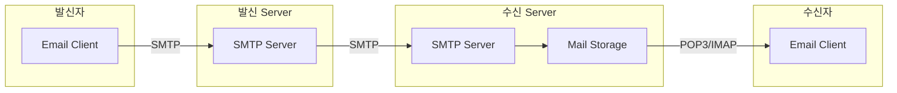
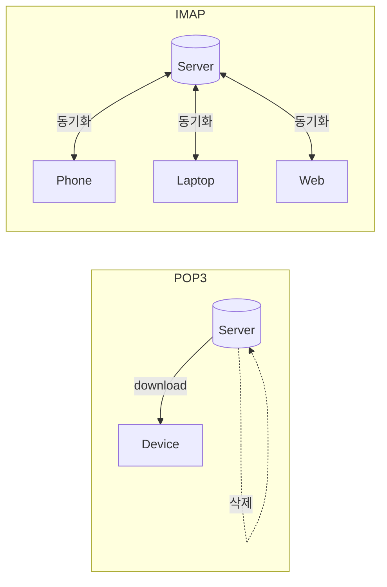
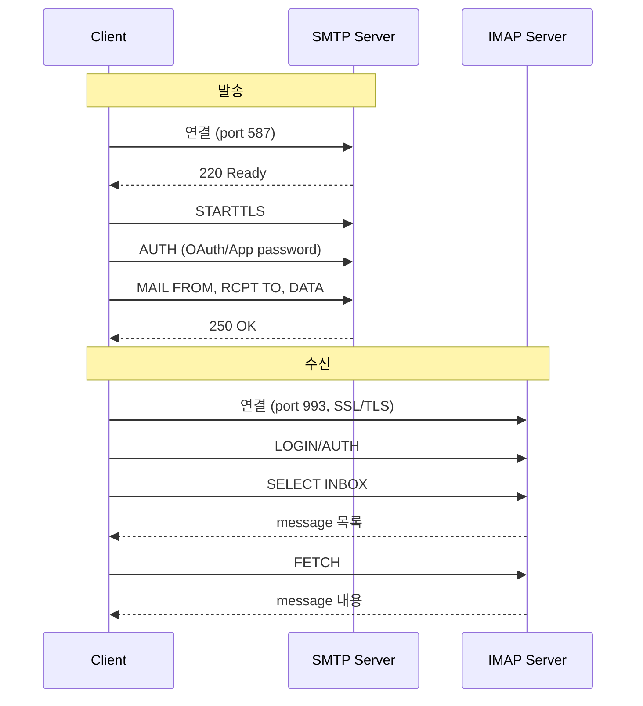

## Email Protocol

- email system은 **SMTP(발송), POP3(수신/download), IMAP(수신/동기화)** 세 가지 protocol로 구성됩니다.
    - 발송과 수신에 서로 다른 protocol을 사용하므로, 완전한 email 사용을 위해서는 두 가지를 모두 설정해야 합니다.
    - 현대 email service는 대부분 **SMTP + IMAP** 조합을 사용합니다.




---


## SMTP

- **SMTP(Simple Mail Transfer Protocol)**는 email **발송 전용** protocol입니다.
    - email client에서 mail server로, server에서 server로 message를 전송합니다.
    - 받는 기능은 없으며, 오직 보내는 역할만 담당합니다.


### Port 구성

- SMTP는 용도와 보안 수준에 따라 서로 다른 port를 사용합니다.

| Port | 용도 | 보안 |
| --- | --- | --- |
| **25** | server 간 relay | 암호화 없음, ISP 차단 일반적 |
| **587** | client → server 제출 | STARTTLS 필수, 권장 설정 |
| **465** | SMTPS (legacy) | 연결 시점부터 SSL/TLS |

- **port 587**이 현대 email client에서 가장 권장되는 설정입니다.


### SMTP 통신 과정

- SMTP는 text 기반 command-response 구조로 동작합니다.

```
Client: EHLO mail.example.com
Server: 250-mail.server.com Hello
Client: AUTH LOGIN
Server: 334 VXNlcm5hbWU6
Client: (base64 encoded username)
Server: 334 UGFzc3dvcmQ6
Client: (base64 encoded password)
Server: 235 Authentication successful
Client: MAIL FROM:<sender@example.com>
Server: 250 OK
Client: RCPT TO:<receiver@example.com>
Server: 250 OK
Client: DATA
Server: 354 Start mail input
Client: Subject: Test Email
Client:
Client: Hello, this is a test.
Client: .
Server: 250 OK
Client: QUIT
Server: 221 Bye
```

| Command | 설명 |
| --- | --- |
| **`EHLO`** | session 시작, server 기능 확인 |
| **`AUTH`** | 사용자 인증 |
| **`MAIL FROM`** | 발신자 지정 |
| **`RCPT TO`** | 수신자 지정 (여러 명이면 반복) |
| **`DATA`** | message 내용 전송, 단독 `.`으로 종료 |


---


## POP3

- **POP3(Post Office Protocol 3)**는 email을 **download하여 local에 저장**하는 수신 protocol입니다.
    - server에서 client로 message를 가져온 후 server에서 삭제하는 것이 기본 동작입니다.
    - 단일 device 환경에 적합합니다.


### Port 구성

| Port | 보안 |
| --- | --- |
| **110** | 암호화 없음 |
| **995** | SSL/TLS 암호화 (POP3S) |


### POP3 특징

- **offline 중심** : download 후 internet 연결 없이도 email 확인 가능합니다.
- **server storage 절약** : message를 가져온 후 server에서 삭제합니다.
- **단일 device** : 여러 device에서 같은 mailbox를 동기화할 수 없습니다.
- **단순한 구조** : folder 관리, 검색 등 고급 기능이 없습니다.


### POP3 동작 단계

- POP3 session은 세 단계로 진행됩니다.

| 단계 | 설명 | 주요 Command |
| --- | --- | --- |
| **Authorization** | 사용자 인증 | `USER`, `PASS` |
| **Transaction** | message 조회/download | `STAT`, `LIST`, `RETR`, `DELE` |
| **Update** | session 종료, 삭제 적용 | `QUIT` |


---


## IMAP

- **IMAP(Internet Message Access Protocol)**은 email을 **server에 보관하면서 동기화**하는 수신 protocol입니다.
    - 여러 device에서 동일한 mailbox 상태를 유지합니다.
    - 현대적인 multi-device 환경에 적합합니다.


### Port 구성

| Port | 보안 |
| --- | --- |
| **143** | 암호화 없음 (STARTTLS 가능) |
| **993** | SSL/TLS 암호화 (IMAPS) |


### IMAP 특징

- **server 중심** : message가 server에 보관되어 어디서든 접근 가능합니다.
- **multi-device 동기화** : 읽음 상태, folder 구조가 모든 device에서 동일합니다.
- **folder 관리** : hierarchical folder 구조를 지원합니다.
- **부분 download** : message header만 먼저 가져오고, 필요할 때 body를 download합니다.
- **server-side 검색** : server에서 검색을 수행하여 network traffic을 줄입니다.


### IMAP Message Flag

- IMAP는 각 message에 flag를 설정하여 상태를 관리합니다.

| Flag | 의미 |
| --- | --- |
| **`\Seen`** | 읽음 |
| **`\Answered`** | 답장함 |
| **`\Flagged`** | 중요 표시 |
| **`\Deleted`** | 삭제 예정 |
| **`\Draft`** | 임시 저장 |


---


## POP3 vs IMAP 비교

- 현재는 대부분 **IMAP**을 사용하며, POP3는 legacy 환경에서 제한적으로 사용됩니다.



| 항목 | POP3 | IMAP |
| --- | --- | --- |
| **Message 저장 위치** | local device | server |
| **Multi-device 동기화** | 불가능 | 가능 |
| **Offline 접근** | 완전 지원 | 제한적 (cache 의존) |
| **Server storage** | 적게 사용 | 많이 사용 |
| **Folder 관리** | 미지원 | 지원 |
| **검색 기능** | local만 | server-side 지원 |
| **적합한 환경** | 단일 device, offline 중심 | multi-device, 협업 환경 |


---


## Email Client 설정 예시

- email client에서는 발송(SMTP)과 수신(IMAP/POP3)을 별도로 설정합니다.
    - 각 provider마다 server 주소, port, 암호화 방식이 다릅니다.




### 발송 (SMTP) 설정

| Provider | Server | Port | 암호화 |
| --- | --- | --- | --- |
| **Gmail** | `smtp.gmail.com` | 587 | STARTTLS |
| **Outlook.com** | `smtp-mail.outlook.com` | 587 | STARTTLS |
| **Yahoo** | `smtp.mail.yahoo.com` | 465 | SSL/TLS |
| **iCloud** | `smtp.mail.me.com` | 587 | STARTTLS |


### 수신 (IMAP) 설정

| Provider | Server | Port | 암호화 |
| --- | --- | --- | --- |
| **Gmail** | `imap.gmail.com` | 993 | SSL/TLS |
| **Outlook.com** | `outlook.office365.com` | 993 | SSL/TLS |
| **Yahoo** | `imap.mail.yahoo.com` | 993 | SSL/TLS |
| **iCloud** | `imap.mail.me.com` | 993 | SSL/TLS |


### 인증 방식

- **OAuth 2.0** : Gmail, Outlook 등 주요 provider가 권장하는 방식입니다.
    - access token을 사용하여 password 노출 없이 인증합니다.
    - token 만료 시 자동 갱신됩니다.

- **App password** : 2단계 인증(2FA) 활성화 시 사용합니다.
    - provider 계정 설정에서 별도의 app 전용 password를 생성합니다.
    - 일반 password 대신 이 값을 email client에 입력합니다.

- **기본 인증 (Basic Auth)** : username과 password를 직접 사용합니다.
    - 보안상 취약하여 대부분의 provider에서 비활성화되었습니다.
    - Gmail은 2022년부터, Microsoft는 2023년부터 기본 인증을 차단했습니다.


### 설정 시 주의 사항

- **TLS/SSL 암호화**를 반드시 활성화해야 합니다.
- **2단계 인증** 사용 시 app password가 필요합니다.
- email service provider의 **보안 설정**에서 IMAP/POP3 접근을 허용해야 합니다.
- STARTTLS는 평문 연결 후 암호화로 전환하고, SSL/TLS는 연결 시점부터 암호화됩니다.


---


## Reference

- <https://datatracker.ietf.org/doc/html/rfc5321>
- <https://datatracker.ietf.org/doc/html/rfc1939>
- <https://datatracker.ietf.org/doc/html/rfc3501>

