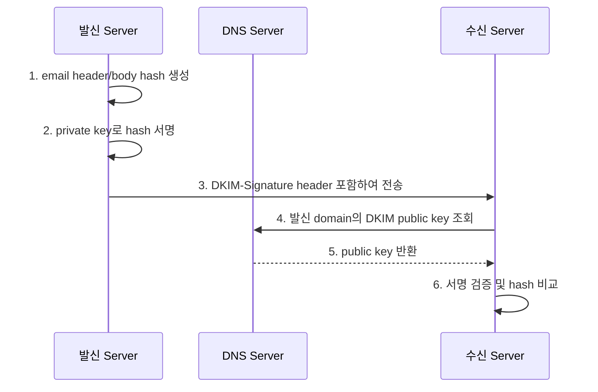
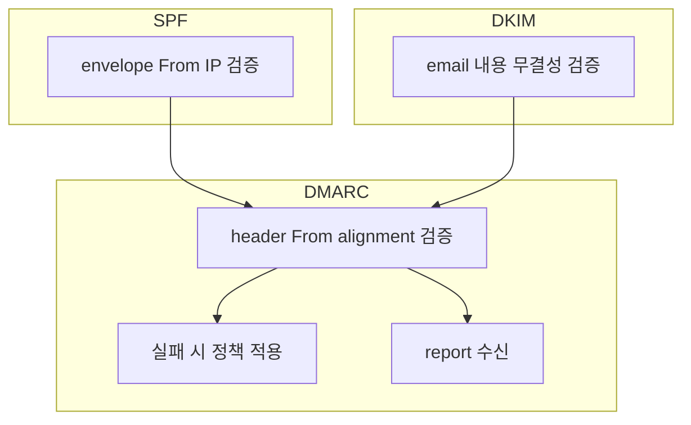

## Email 보안

- email은 설계 당시 보안을 고려하지 않았기 때문에, **발신자 위조와 내용 도청에 취약**합니다.
    - SMTP는 발신자 주소를 검증하지 않아 누구나 다른 사람으로 위장할 수 있습니다.
    - 기본 SMTP 통신은 평문으로 전송되어 중간에서 내용을 엿볼 수 있습니다.

- 이러한 문제를 해결하기 위해 **인증(authentication)**과 **암호화(encryption)** 기술이 추가되었습니다.
    - **SPF, DKIM, DMARC** : 발신자 domain이 진짜인지 검증합니다.
    - **TLS** : email 전송 구간을 암호화합니다.


---


## SPF

- **SPF(Sender Policy Framework)**는 특정 domain에서 email을 보낼 수 있는 **허용된 IP 주소 목록**을 정의합니다.
    - domain 소유자가 DNS TXT record에 SPF 정책을 등록합니다.
    - 수신 server는 발신 server의 IP가 SPF record에 포함되어 있는지 확인합니다.

```
v=spf1 ip4:192.168.1.0/24 include:_spf.google.com ~all
```


### SPF Mechanism

- SPF record는 여러 mechanism을 조합하여 정책을 정의합니다.

| Mechanism | 설명 |
| --- | --- |
| `ip4`, `ip6` | 허용할 IP 주소 또는 대역 |
| `a` | domain의 A record IP 허용 |
| `mx` | domain의 MX record IP 허용 |
| `include` | 다른 domain의 SPF record 참조 |
| `all` | 모든 IP (마지막에 사용) |


### SPF Qualifier

- mechanism 앞에 qualifier를 붙여 처리 방식을 지정합니다.

| Qualifier | 의미 | 권장 처리 |
| --- | --- | --- |
| `+` (기본값) | pass | 통과 |
| `-` | fail | 거부 |
| `~` | softfail | 의심 표시 후 통과 |
| `?` | neutral | 판단 보류 |


### SPF 한계

- SPF는 **envelope `From`**(`MAIL FROM`)만 검증하며, 사용자에게 표시되는 **header `From`**은 검증하지 않습니다.
    - 공격자가 SPF를 통과한 뒤 header `From`을 위조할 수 있습니다.
- email이 forwarding되면 중간 server IP가 SPF record에 없어 실패합니다.
- 이러한 한계를 보완하기 위해 DKIM과 DMARC가 함께 사용됩니다.


---


## DKIM

- **DKIM(DomainKeys Identified Mail)**은 email에 **전자 서명**을 추가하여 발신자 domain과 내용 무결성을 검증합니다.
    - 발신 server가 private key로 서명하고, 수신 server가 DNS에 등록된 public key로 검증합니다.
    - email이 전송 중 변조되지 않았음을 보장합니다.


### DKIM 동작 과정




### DKIM-Signature Header

- DKIM 서명은 `DKIM-Signature` header로 email에 추가됩니다.

```
DKIM-Signature: v=1; a=rsa-sha256; d=example.com; s=selector;
    h=from:to:subject:date; bh=base64_body_hash;
    b=base64_signature
```

| Tag | 설명 |
| --- | --- |
| `v` | DKIM version |
| `a` | 서명 algorithm (rsa-sha256) |
| `d` | 서명 domain |
| `s` | selector (DNS 조회 시 사용) |
| `h` | 서명에 포함된 header 목록 |
| `bh` | body의 hash 값 |
| `b` | header의 서명 값 |


### DKIM DNS Record

- public key는 `selector._domainkey.domain` 형식의 TXT record에 등록합니다.

```
selector._domainkey.example.com TXT "v=DKIM1; k=rsa; p=MIGfMA0GCSqGSIb3..."
```


### DKIM 한계

- DKIM은 email 내용의 무결성만 보장하며, **발신자 주소 자체는 검증하지 않습니다**.
    - `d=` tag의 domain과 header `From`이 다를 수 있습니다.
- 서명된 header만 보호되므로, 서명에 포함되지 않은 header는 변조될 수 있습니다.


---


## DMARC

- **DMARC(Domain-based Message Authentication, Reporting & Conformance)**는 SPF와 DKIM을 결합하여 **header `From`과의 일치성**을 검증합니다.
    - SPF와 DKIM 중 하나 이상이 통과하고, header `From`의 domain과 일치해야 합니다.
    - 인증 실패 시 email을 어떻게 처리할지 **정책(policy)**으로 지정합니다.


### DMARC Alignment

- DMARC의 핵심은 **alignment** 검사입니다.
    - **SPF alignment** : envelope `From` domain이 header `From` domain과 일치.
    - **DKIM alignment** : DKIM `d=` tag의 domain이 header `From` domain과 일치.

| 검증 | 확인 대상 | Alignment 대상 |
| --- | --- | --- |
| **SPF** | envelope `From` (`MAIL FROM`) | header `From` |
| **DKIM** | `d=` tag의 domain | header `From` |


### DMARC Policy

- domain 소유자는 인증 실패 시 처리 방식을 지정합니다.

| Policy | 동작 |
| --- | --- |
| `none` | 아무 조치 안 함 (monitoring만) |
| `quarantine` | spam folder로 격리 |
| `reject` | 수신 거부 |


### DMARC DNS Record

- DMARC 정책은 `_dmarc.domain` TXT record에 등록합니다.

```
_dmarc.example.com TXT "v=DMARC1; p=reject; rua=mailto:dmarc@example.com"
```

| Tag | 설명 |
| --- | --- |
| `v` | DMARC version |
| `p` | 정책 (none, quarantine, reject) |
| `rua` | aggregate report 수신 주소 |
| `ruf` | forensic report 수신 주소 |
| `pct` | 정책 적용 비율 (기본값 100) |


### DMARC Report

- DMARC는 **aggregate report**와 **forensic report** 두 가지 보고서를 제공합니다.
    - **aggregate report** : 일별 통계 정보.
        - 통과/실패 수, IP 주소 등.
    - **forensic report** : 개별 실패 email의 상세 정보.

- report를 분석하면 domain 도용 시도를 monitoring하고 정책을 조정할 수 있습니다.


---


## SPF, DKIM, DMARC 관계

- 세 기술은 각각 다른 측면을 검증하며, 함께 사용해야 효과적입니다.



| 기술 | 검증 대상 | 보호 영역 |
| --- | --- | --- |
| **SPF** | 발신 server IP | 허가되지 않은 server에서 발송 방지 |
| **DKIM** | email header/body | 전송 중 변조 방지 |
| **DMARC** | header `From`과 alignment | 발신자 위조(spoofing) 방지 |


---


## TLS

- **TLS(Transport Layer Security)**는 email 전송 구간을 **암호화**하여 도청을 방지합니다.
    - 평문 SMTP 연결을 암호화된 연결로 upgrade합니다.
    - email 내용과 인증 정보가 network에서 노출되지 않습니다.


### STARTTLS

- **STARTTLS**는 기존 평문 연결에서 TLS 암호화로 전환하는 SMTP 확장입니다.
    - port 587에서 주로 사용됩니다.
    - 연결 후 `STARTTLS` command를 보내 암호화를 시작합니다.

```
Client: EHLO mail.example.com
Server: 250-STARTTLS
Client: STARTTLS
Server: 220 Ready to start TLS
(TLS handshake)
Client: EHLO mail.example.com  (암호화된 연결에서 다시 시작)
```


### Implicit TLS (SMTPS)

- **SMTPS**는 연결 시점부터 TLS를 사용합니다.
    - port 465에서 사용됩니다.
    - STARTTLS와 달리 평문 통신 없이 바로 암호화됩니다.


### TLS 한계

- TLS는 **전송 구간(hop-to-hop)**만 암호화합니다.
    - 발신 client → 발신 server → 수신 server → 수신 client의 각 구간이 개별 암호화됩니다.
    - 중간 server에서는 email 내용을 볼 수 있습니다.

- **End-to-end 암호화**가 필요하면 S/MIME이나 PGP를 사용해야 합니다.


### MTA-STS

- **MTA-STS(Mail Transfer Agent Strict Transport Security)**는 TLS 사용을 강제합니다.
    - DNS와 HTTPS를 통해 정책을 게시합니다.
    - TLS가 실패하면 email 전송을 거부하여 downgrade 공격을 방지합니다.


---


## Email 인증 설정 순서

- email 인증 설정 시 단계적으로 적용하는 것이 안전합니다.

| 단계 | 작업 | 설명 |
| --- | --- | --- |
| 1 | **SPF 설정** | 허용 IP 목록 DNS에 등록 |
| 2 | **DKIM 설정** | key 생성 후 DNS에 public key 등록 |
| 3 | **DMARC `p=none`** | monitoring mode로 report 수집 |
| 4 | **Report 분석** | 정상 발송 source 확인, 문제 수정 |
| 5 | **DMARC `p=quarantine`** | 실패 email을 spam으로 격리 |
| 6 | **DMARC `p=reject`** | 실패 email 수신 거부 |


---


## Reference

- <https://datatracker.ietf.org/doc/html/rfc7208>
- <https://datatracker.ietf.org/doc/html/rfc6376>
- <https://datatracker.ietf.org/doc/html/rfc7489>
- <https://datatracker.ietf.org/doc/html/rfc8461>

