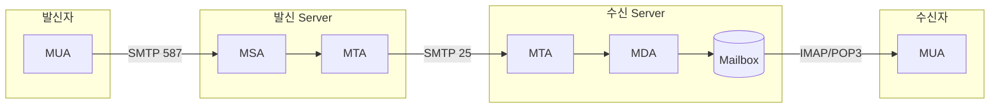
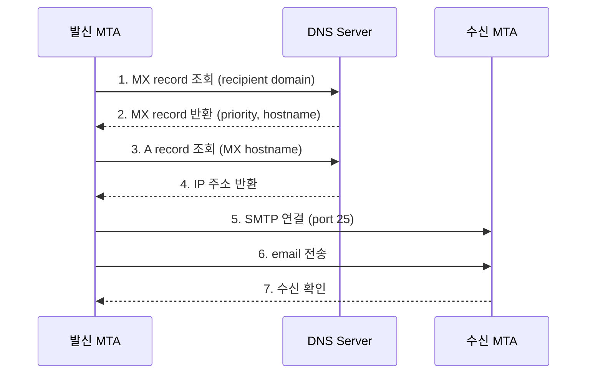
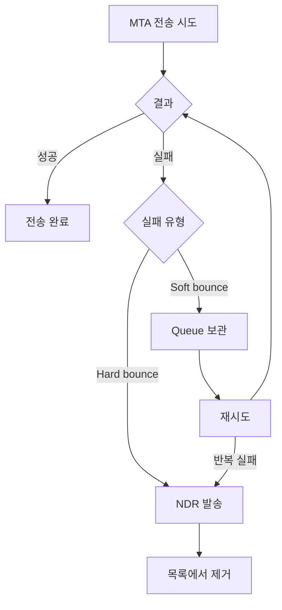
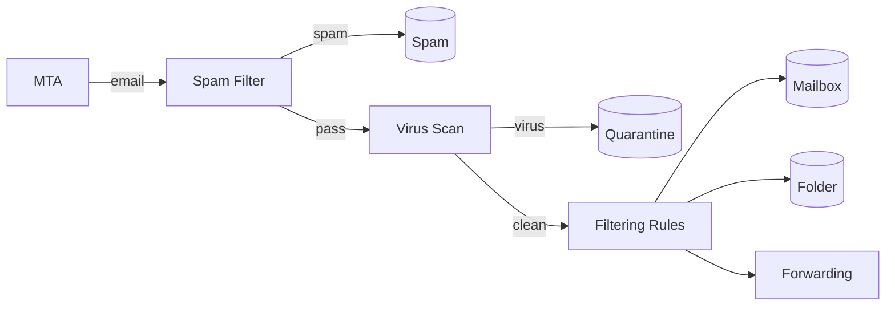

## Email Server 구조

- email system은 여러 **server component**가 협력하여 message를 전달합니다.
    - **MUA** : 사용자가 email을 읽고 쓰는 client.
    - **MSA** : client로부터 email을 받아 발송 준비.
    - **MTA** : email을 다른 server로 전송.
    - **MDA** : email을 사용자 mailbox에 저장.




---


## MUA

- **MUA(Mail User Agent)**는 사용자가 email을 읽고 작성하는 **client program**입니다.
    - email 작성, 읽기, 회신, 전달, 검색, folder 정리 기능을 제공합니다.
    - SMTP로 email을 발송하고, IMAP/POP3로 email을 수신합니다.


### MUA 종류

| 분류 | 예시 |
| --- | --- |
| **desktop client** | Microsoft Outlook, Apple Mail, Thunderbird |
| **web client** | Gmail, Outlook.com, Naver Mail |
| **mobile client** | Gmail app, Apple Mail app |
| **CLI client** | mutt, alpine |


### MUA의 역할

- email 작성 시 MIME 형식으로 message를 구성합니다.
- header 정보(From, To, Subject, Date)를 설정합니다.
- 첨부 file을 base64로 encoding하여 포함합니다.
- 발신 server(MSA)에 인증 후 email을 전달합니다.


---


## MSA

- **MSA(Mail Submission Agent)**는 MUA로부터 email을 받아 **발송을 준비**하는 component입니다.
    - **port 587**에서 동작하며, 사용자 인증이 필수입니다.
    - email 형식 검증, header 보완, 발신자 확인을 수행합니다.


### MSA와 MTA의 차이

| 항목 | MSA | MTA |
| --- | --- | --- |
| **주요 port** | 587 | 25 |
| **인증** | 필수 | 선택 |
| **통신 대상** | MUA (client) | 다른 MTA (server) |
| **역할** | email 제출 접수 | email 전송 |

- MSA는 인증된 사용자만 email을 발송할 수 있게 하여 **spam 발송을 방지**합니다.


### MSA가 수행하는 검증

- 발신자 주소가 인증된 계정과 일치하는지 확인합니다.
- message 형식이 RFC 표준을 준수하는지 검증합니다.
- 누락된 header(`Date`, `Message-ID`)를 자동으로 추가합니다.


---


## MTA

- **MTA(Mail Transfer Agent)**는 email을 **다른 server로 전송**하는 핵심 component입니다.
    - DNS MX record를 조회하여 수신자 domain의 mail server를 찾습니다.
    - SMTP protocol로 다른 MTA와 통신합니다.


### MTA Software

| Software | 특징 |
| --- | --- |
| **Postfix** | Linux 표준, 보안과 성능 우수 |
| **Sendmail** | 역사가 오래됨, 설정 복잡 |
| **Exim** | Debian 기본, 유연한 설정 |
| **Microsoft Exchange** | Windows 환경, 기업용 |
| **qmail** | 보안 중심 설계 |


### MTA의 동작 과정




### MX Record

- **MX(Mail Exchange) record**는 domain의 email을 받을 server를 지정하는 DNS record입니다.
    - priority 값이 낮을수록 우선순위가 높습니다.
    - 여러 MX record를 등록하여 장애 대비가 가능합니다.

```
example.com.  MX  10  mail1.example.com.
example.com.  MX  20  mail2.example.com.
```

- priority 10인 mail1에 먼저 시도하고, 실패하면 priority 20인 mail2로 시도합니다.


### MTA Queue

- email 전송이 즉시 되지 않으면 MTA는 **queue**에 message를 보관합니다.
    - 수신 server 장애, network 문제 등으로 전송이 실패할 수 있습니다.
    - **exponential backoff** 방식으로 재시도 간격을 점진적으로 늘립니다.
        - 실패할 때마다 대기 시간을 2배씩 늘려 server 부하를 줄이는 방식입니다.
        - 예 : 15분 → 30분 → 1시간 → 2시간 → 4시간.
    - 일정 기간(보통 4-5일) 내 전송에 실패하면 발신자에게 bounce message를 보냅니다.


### Bounce

- **bounce**는 email 전송이 실패하여 발신자에게 반환되는 것입니다.
    - MTA는 전송 실패 시 발신자에게 bounce message(NDR, Non-Delivery Report)를 보냅니다.

| 유형 | 원인 | 재시도 | 조치 |
| --- | --- | --- | --- |
| **Hard bounce** | 수신자 주소 없음, domain 없음 | 불필요 | 즉시 목록에서 제거 |
| **Soft bounce** | mailbox 용량 초과, server 일시 장애 | 가능 | 일정 기간 후 재시도 |



- **hard bounce**는 영구적인 실패입니다.
    - 존재하지 않는 email 주소 (`550 User not found`).
    - 존재하지 않는 domain.
    - 수신 server가 영구적으로 거부.
    - hard bounce가 발생한 주소는 **즉시 발송 목록에서 제거**해야 합니다.

- **soft bounce**는 일시적인 실패입니다.
    - mailbox 용량 초과 (`452 Mailbox full`).
    - 수신 server 일시 장애.
    - 발송량 제한 초과.
    - MTA가 자동으로 재시도하며, 반복 실패 시 hard bounce로 처리합니다.

- bounce rate 관리가 중요합니다.
    - **hard bounce rate**가 2%를 넘으면 IP reputation에 악영향을 줍니다.
    - 정기적으로 email 목록을 검증하여 유효하지 않은 주소를 제거해야 합니다.


---


## MDA

- **MDA(Mail Delivery Agent)**는 MTA로부터 받은 email을 **사용자 mailbox에 저장**하는 component입니다.
    - 수신 server 내에서 mailbox에 최종 저장하는 단계를 담당합니다.
    - filtering, sorting, 자동 응답 등의 처리를 수행합니다.


### MDA Software

| Software | 특징 |
| --- | --- |
| **Dovecot** | IMAP/POP3 server 겸용, 가장 널리 사용 |
| **Cyrus IMAP** | 대규모 환경에 적합 |
| **Procmail** | filtering 중심, 오래된 project |
| **Sieve** | filtering 언어, Dovecot 등에서 지원 |


### MDA가 수행하는 처리

- **spam filtering** : spam 점수 계산, spam folder로 이동.
- **virus scanning** : 첨부 file virus 검사.
- **filtering rule** : 사용자 정의 rule에 따라 folder 분류.
- **vacation reply** : 부재중 자동 응답.
- **forwarding** : 다른 주소로 전달.




### Mailbox 형식

- MDA는 email을 특정 형식으로 저장합니다.

| 형식 | 구조 | 특징 |
| --- | --- | --- |
| **mbox** | 단일 file에 모든 message | 간단, 동시 접근 문제 |
| **Maildir** | message별 개별 file | 안정적, NFS 호환 |
| **database** | DB에 저장 | 검색 빠름, 확장성 |


---


## Email 전송 흐름 요약

- email 한 통이 전달되기까지 **MUA → MSA → MTA → MDA → Mailbox**를 거치며, 각 단계마다 다른 protocol을 사용합니다.

| 단계 | 담당 | Protocol | 설명 |
| --- | --- | --- | --- |
| 1 | **MUA** | - | 사용자가 email 작성 |
| 2 | **MUA → MSA** | SMTP (587) | 인증 후 email 제출 |
| 3 | **MSA → MTA** | internal | email 발송 준비 |
| 4 | **MTA → DNS** | DNS | MX record 조회 |
| 5 | **MTA → MTA** | SMTP (25) | 수신 server로 전송 |
| 6 | **MTA → MDA** | internal | local 배달 |
| 7 | **MDA → Mailbox** | - | message 저장 |
| 8 | **MUA ← Mailbox** | IMAP/POP3 | 수신자가 email 확인 |


---


## Email Server 구축 시 고려 사항

- 자체 email server를 운영하려면 DNS record, IP reputation, 보안 설정을 올바르게 구성해야 합니다.
    - 설정이 잘못되면 발송한 email이 spam으로 분류되거나 거부됩니다.


### DNS 설정

| Record | 용도 |
| --- | --- |
| **MX** | mail server 지정 |
| **A/AAAA** | mail server IP 주소 |
| **SPF (TXT)** | 허용 발신 IP |
| **DKIM (TXT)** | public key |
| **DMARC (TXT)** | 인증 정책 |
| **PTR (reverse DNS)** | IP → hostname 역방향 조회 |


### Reverse DNS (PTR Record)

- **PTR record**는 IP 주소에서 hostname을 조회하는 역방향 DNS입니다.
    - 많은 mail server가 PTR record를 확인하여 spam을 filtering합니다.
    - PTR이 없거나 hostname과 일치하지 않으면 email이 거부될 수 있습니다.


### IP Reputation

- email server의 **IP reputation**은 email 전달 성공률에 큰 영향을 미칩니다.
    - 새로운 IP는 신뢰도가 낮아 초기에 제한적으로 발송해야 합니다.
    - spam 발송 이력이 있는 IP는 blacklist에 등록됩니다.
    - IP reputation 관리를 위해 **IP warming** 과정이 필요합니다.


### IP Warming

- **IP warming**은 새로운 IP 주소에서 email 발송량을 점진적으로 늘려 신뢰도를 쌓는 과정입니다.
    - 새 IP에서 갑자기 대량의 email을 보내면 spam으로 의심받아 차단됩니다.
    - 수신 server는 발송 이력이 없는 IP를 신뢰하지 않습니다.

- 일반적으로 **4주 이상**에 걸쳐 발송량을 단계적으로 늘립니다.

| 기간 | 일일 발송량 | 비고 |
| --- | --- | --- |
| **1주차** | 50 ~ 100통 | 가장 활성화된 수신자 대상 |
| **2주차** | 500 ~ 1,000통 | 점진적 증가 |
| **3주차** | 5,000 ~ 10,000통 | 반응률 monitoring |
| **4주차 이후** | 목표량까지 증가 | bounce rate 확인 |

- IP warming 중에는 **발송 품질을 철저히 관리**해야 합니다.
    - **engagement가 높은 수신자**부터 발송합니다.
        - 열람, click 이력이 있는 사용자.
    - **bounce rate**를 지속적으로 monitoring합니다 (5% 이상이면 중단).
    - 여러 ISP(Gmail, Outlook 등)에 **균등하게 분산**하여 발송합니다.


### Blacklist

- **blacklist**는 spam 발송 이력이 있는 IP나 domain 목록입니다.
    - 수신 server는 blacklist를 조회하여 email 수신 여부를 결정합니다.
    - blacklist에 등록되면 email이 거부되거나 spam folder로 분류됩니다.

- 수신 server가 참조하는 주요 blacklist입니다.

| Blacklist | 특징 |
| --- | --- |
| **Spamhaus** | 가장 널리 사용, SBL/XBL/PBL 구분 |
| **Barracuda** | 기업 환경에서 많이 참조 |
| **SpamCop** | 사용자 신고 기반 |
| **SORBS** | 다양한 list 제공 |
| **UCEProtect** | 3단계 level 구분 |

- blacklist에 등록된 경우 **확인 → 원인 파악 → 해결 → 해제 요청** 순서로 대응합니다.
    - **확인** : MXToolbox, MultiRBL 등에서 자신의 IP가 등록되었는지 확인합니다.
    - **원인 파악** : spam 발송, open relay, 보안 침해 등 원인을 파악합니다.
    - **문제 해결** : 원인을 제거하고 보안 설정을 강화합니다.
    - **해제 요청** : 각 blacklist site에서 delisting을 요청합니다.


### 보안 설정

- email server는 spam 발송, 무단 접근, data 유출의 대상이 되기 쉬우므로 보안 설정이 필수입니다.

| 분류 | 설정 | 목적 |
| --- | --- | --- |
| **전송 보안** | TLS 1.2 이상 필수 | 통신 암호화 |
| **인증** | SPF, DKIM, DMARC | 발신자 위조 방지 |
| **악용 방지** | rate limiting, fail2ban | spam/brute force 차단 |
| **접근 제어** | firewall, open relay 차단 | 무단 사용 방지 |

- **전송 보안** : 모든 통신에 TLS 암호화를 적용합니다.
    - TLS 1.2 이상만 허용하고, 취약한 cipher suite는 비활성화합니다.
    - certificate는 신뢰할 수 있는 CA에서 발급받고, 만료 전에 갱신합니다.

- **인증** : SPF, DKIM, DMARC를 모두 설정하여 발신자 위조를 방지합니다.
    - SMTP AUTH를 필수로 설정하여 인증된 사용자만 발송할 수 있게 합니다.

- **악용 방지** : spam 발송과 brute force 공격을 차단합니다.
    - **rate limiting** : IP당, 계정당 발송량을 제한합니다.
    - **fail2ban** : 인증 실패가 반복되면 해당 IP를 자동 차단합니다.
    - **outbound filtering** : 발송 email에도 spam filter를 적용하여 계정 탈취 시 피해를 줄입니다.

- **접근 제어** : 무단 사용을 방지합니다.
    - **open relay 차단** : 인증 없이 외부로 email을 중계하지 않도록 설정합니다.
    - **firewall** : 필요한 port(25, 587, 993)만 허용하고 나머지는 차단합니다.
    - **관리 interface** : SSH, web admin은 허용된 IP에서만 접근할 수 있게 제한합니다.

- **logging 및 monitoring** : 이상 징후를 탐지합니다.
    - 발송/수신 log를 보관하고 정기적으로 검토합니다.
    - 비정상적인 발송량 증가, 인증 실패 급증 시 alert를 설정합니다.


---


## 관리형 Email Service

- 자체 server 운영 대신 **관리형 service**를 사용하면 운영 부담을 줄일 수 있습니다.
    - IP reputation 관리가 자동화됩니다.
    - infrastructure 운영 부담이 없습니다.
    - deliverability 최적화가 되어 있습니다.
    - 분석 및 monitoring 도구가 제공됩니다.


### 대량 발송 Service

| Service | 특징 |
| --- | --- |
| **Amazon SES** | AWS 통합, 저렴한 비용 |
| **SendGrid** | API 중심, 분석 기능 |
| **Mailgun** | 개발자 친화적 |
| **Postmark** | transaction email 특화 |


### 기업용 Email Service

| Service | 특징 |
| --- | --- |
| **Google Workspace** | Gmail 기반, 협업 도구 포함 |
| **Microsoft 365** | Outlook 기반, Office 통합 |
| **Zoho Mail** | 중소기업용, 저렴 |


---


## Reference

- <https://datatracker.ietf.org/doc/html/rfc5321>
- <https://datatracker.ietf.org/doc/html/rfc5598>
- <https://www.postfix.org/documentation.html>
- <https://doc.dovecot.org/>

