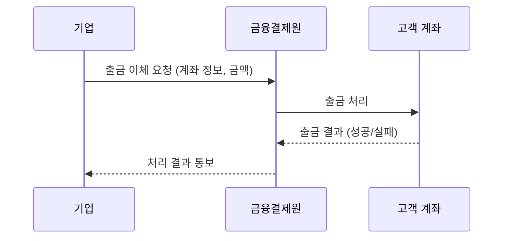
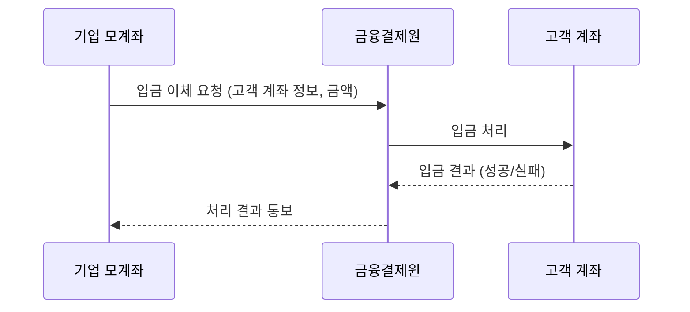

## CMS와 WBS

- CMS와 WBS는 **계좌 간 이체를 통해 결제와 환불을 처리하는 방식**입니다.
    - 카드 결제가 카드사를 통해 승인/매입/정산 과정을 거치는 것과 달리, 계좌 이체 방식은 은행 계좌 간 직접 자금을 이동시킵니다.

- 두 방식 모두 **기업의 모계좌**를 중심으로 거래가 이루어지지만, 이름은 고객 계좌 기준으로 지어졌습니다.
    - CMS = 출금 이체 = 고객 계좌에서 **출금**됨.
    - WBS = 입금 이체 = 고객 계좌에 **입금**됨.

| 구분 | 자금 흐름 | 용도 |
| --- | --- | --- |
| **CMS** (출금 이체) | 고객 계좌 -> 기업 모계좌 | 결제 |
| **WBS** (입금 이체) | 기업 모계좌 -> 고객 계좌 | 환불 |

### CMS와 WBS 비교

- CMS와 WBS는 계좌 이체라는 동일한 mechanism을 사용하지만, 자금 흐름의 방향이 반대입니다.

| 구분 | CMS (출금 이체) | WBS (입금 이체) |
| --- | --- | --- |
| **자금 방향** | 고객 -> 기업 | 기업 -> 고객 |
| **주요 용도** | 정기 결제 (보험료, 학원비, 구독료) | 환불, 보험금 지급, 급여 |
| **고객 동의** | 출금 동의 필요 | 불필요 |
| **처리 방식** | batch 처리 | batch 처리 |

---

## CMS : Cash Management Service

- CMS는 **고객의 계좌에서 기업의 모계좌로 자금을 출금하는 결제 방식**입니다.
    - 보험료, 학원비, 관리비, 구독료 등 **정기적으로 반복되는 결제**에 주로 사용됩니다.
    - 카드 결제와 달리 카드사 수수료가 발생하지 않아, 수수료 부담이 적습니다.

### 결제 방식

- CMS 결제는 **단건 결제**와 **자동 결제** 두 가지 방식이 있습니다.

- 두 방식 모두 고객의 계좌를 미리 등록해두고, 등록된 계좌에서 반복적으로 출금하는 구조입니다.
    - 계좌 등록 시 **계좌 인증**과 **출금 동의** 과정을 거쳐야 합니다.

### 출금 동의

- CMS 결제를 위해 계좌를 등록할 때, 고객의 **출금 동의 증빙**이 필요합니다.
    - 기업이 고객 계좌에서 임의로 출금하는 것을 방지하기 위한 절차입니다.

- 출금 동의 증빙 방식은 ARS 음성 녹음, 1원 인증, 서면 동의서 등이 있습니다.
    - ARS 인증 : 고객의 휴대전화로 전화를 걸어 음성으로 출금 동의를 녹음합니다.
    - 1원 인증 : 고객 계좌로 1원을 송금하고, 입금자명에 포함된 인증 code를 확인하여 본인 계좌임을 검증합니다.
    - 서면 동의서 : 고객이 직접 서명한 출금 동의서를 제출합니다.

### 처리 흐름

- 보통 CMS 출금 이체는 실시간으로 처리되지 않고, **batch 방식**으로 처리됩니다.

- 기업이 출금 이체를 요청하면, 금융결제원을 통해 고객 계좌에서 출금이 진행됩니다.
    - 잔액 부족, 계좌 해지 등의 사유로 출금이 실패할 수 있으며, 처리 결과는 이후에 통보됩니다.

---

## WBS : Web Banking Service

- WBS는 **기업의 모계좌에서 고객의 계좌로 자금을 입금하는 방식**입니다.
    - CMS와 반대 방향의 자금 흐름으로, 주로 **환불**이나 **지급** 목적으로 사용됩니다.

- WBS는 고객이 결제하는 거래가 아니라, **기업이 고객에게 돈을 보내는 거래**입니다.
    - 원거래를 취소하는 것이 아닌, 별도의 입금 거래로 처리됩니다.

- WBS 입금 이체를 위해서는 기업 모계좌 정보와 고객 계좌 정보가 모두 필요합니다.
    - 고객 계좌 정보는 CMS 등록 시 수집한 정보를 재사용하는 경우가 많습니다.

- CMS와 달리 고객의 출금 동의가 필요하지 않습니다.
    - 고객 계좌에서 돈을 빼는 것이 아니라 넣어주는 것이기 때문입니다.

