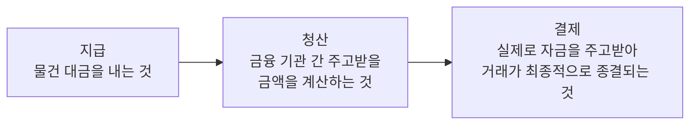

## 지급 결제 (Payment and Settlement)

- **경제 주체들이 경제 활동에 따른 채권·채무 관계를 지급 수단을 이용하여 해소하는 행위**를 지급 결제라고 합니다.
- "신용 카드로 대금을 치르는 것", "가까운 금융 기관을 통해 지방에 사는 친지에게 송금하는 것", "매달 자동 계좌 이체 service를 이용하여 휴대 전화 요금을 내는 것" 등의 행위가 모두 지급 결제에 포함됩니다.

---

## 지급 수단의 구분

- 지급 수단의 구분 기준은 크게 2가지가 있습니다.

### 현금 & 현금 이외의 지급 수단

- 지급 수단은 크게 **현금**과 **현금 이외의 지급 수단**으로 구분합니다.

1. 현금(화폐) : 가장 기본적이고 단순한 지급 수단.
    - 현금은 중앙 은행이 발행하는 지급 수단으로서 그 공신력을 국가가 보장하고 있습니다.
    - 따라서 어떤 거래에서든 현금을 지급하면, 더 이상의 결제 과정을 거칠 필요 없이 지급 결제가 마무리됩니다.

2. 현금 이외의 지급 수단 : 금융 기관을 거쳐 현금화할 수 있는 지급 수단.
    - 어음, 수표, 신용 카드, 계좌 이체 등이 포함됩니다.

### 장표 방식 지급 수단 & 전자 방식 지급 수단

- 지급 수단은 지급 결제 과정에서 종이로 된 지급 수단인 장표가 실제로 이동하는지의 여부에 따라 **장표 방식 지급 수단**과 **전자 방식 지급 수단**으로 구분하기도 합니다.

1. 장표 방식 지급 수단 : 어음, 수표, 지로 등.
2. 전자 방식 지급 수단 : 신용 카드, 직불 카드, 선불 카드, 계좌 이체 등.

---

## 지급 결제의 단계

1. **지급**은 개인이나 기업과 같은 경제 주체들이 서로 주고받을 채권·채무를 해소하기 위하여 어음, 수표, 신용 카드, 계좌 이체 등으로 대금을 지불하는 것입니다.
2. **청산**은 현금 이외의 지급 수단으로 지급이 이루어졌을 때, 금융 기관들이 서로 주고받을 금액을 계산하는 것입니다.
3. **결제**는 청산 과정을 통해 계산된 금액을 각 금융 기관이 중앙 은행에 개설한 당좌 예금 계정 간에 자금 이체 등을 통해 서로 주고받아 채권·채무 관계를 해소하는 과정입니다.

---

## 소액 결제와 거액 결제

- 지급 결제는 결제되는 자금의 특성에 따라 **소액 결제**와 **거액 결제**로 구분됩니다.
    - 소액 결제는 **건당 금액이 작은 거래에 따르는 지급 결제**로써, 개인이나 기업의 경제 활동에서 주로 발생합니다.
    - 거액 결제는 **건당 금액이 큰 거래에 따르는 지급 결제**로써, 금융 기관 간의 자금 거래에서 주로 발생합니다.

- 이에 따라 지급 결제 System도 그 대상이 되는 거래의 특성에 따라 **소액 결제 System**과 **거액 결제 System**으로 구분됩니다.
    - 소액 결제의 경우, 건당 거래 금액이 작은 반면 건수가 매우 많기 때문에, 건별로 결제하기 보다는 일정 기간(보통 1일) 중 발생한 모든 거래를 합산하여, 금융 기관별로 주고받을 금액을 상계한 후, 차액만을 결제하는 것이 일반적입니다.
    - 거액 결제의 경우에는 건당 거래 금액이 큰 반면 건수는 적기 때문에, 거래가 이루어지는 즉시 건별로 거래 금액을 주고받는 방식으로 결제하는 것이 일반적입니다.

---

## Reference

- <https://www.bok.or.kr/portal/main/contents.do?menuNo=200345>
- <https://umbum.dev/1002/>
