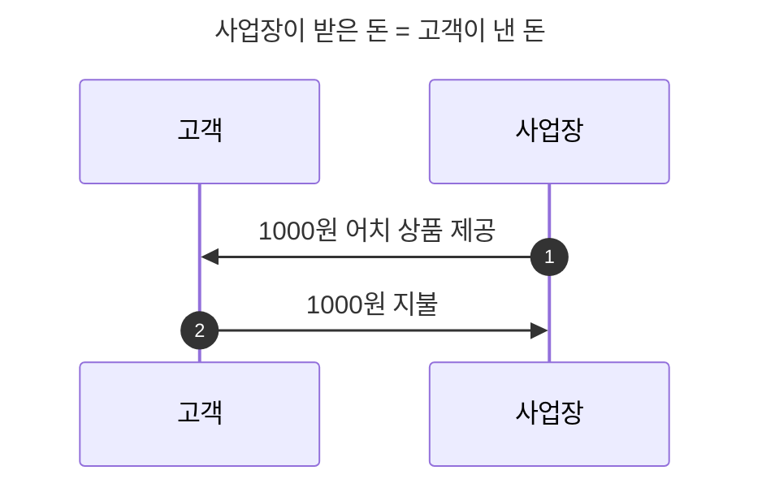
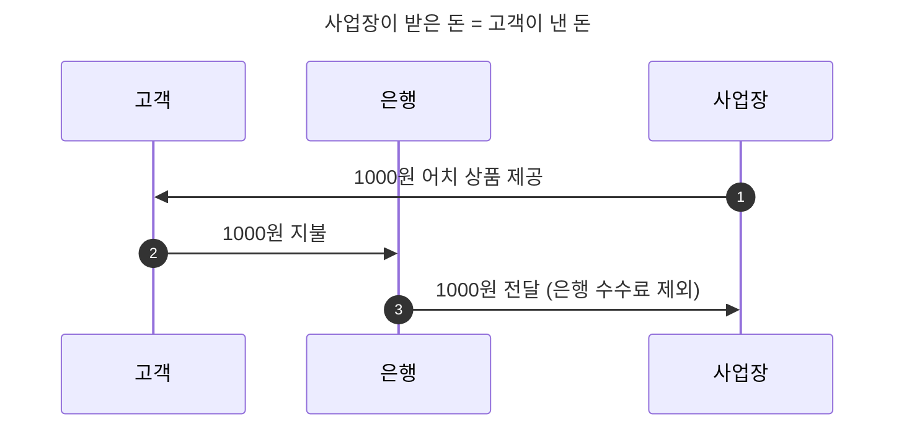
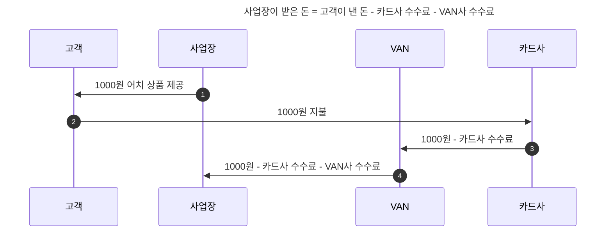
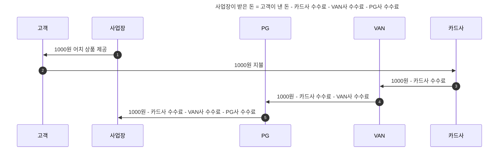
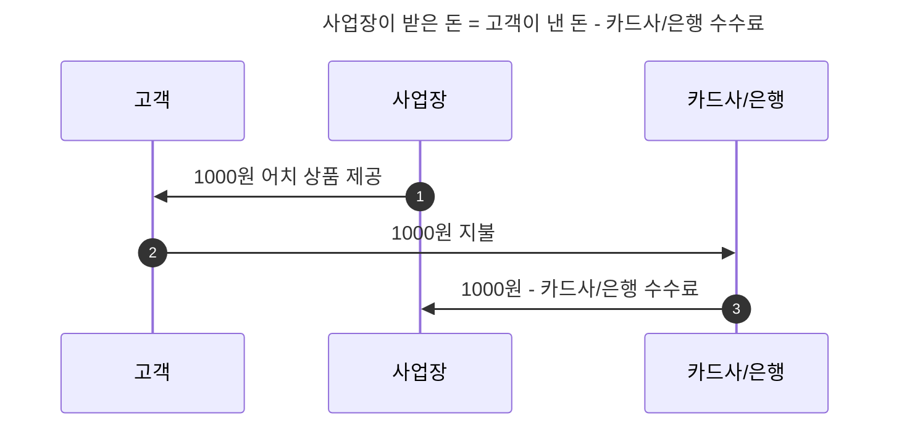

## 결제 수단 종류

- 상품을 구매할 때 고객은 사업장에 대가를 지불하게 되며, 그 방식은 다양합니다.
- 결제 수단은 크게 "현금 결제", "카드 결제", "계좌 이체", "간편 결제"가 있으며, 더 다양한 결제 수단이 존재하지만, 여기서는 대표적인 결제 수단에 대해서만 설명합니다.

---

## 현금 결제

- 현금 결제는 고객이 사업장에 직접 대가를 지불하는, 가장 기본적인 형태의 결제 방식입니다.
- 중간 정산 업체가 없기 때문에, 사업장과 고객 간의 직접적인 거래로 이루어지며, 따라서 수수료도 전혀 없습니다.
    - 수수료로 인한 손실이 없기 때문에, 사업장은 카드 결제보다 현금 결제를 선호하는 경우가 많습니다.

---

## 계좌 이체

- 계좌 이체란, 계좌에 예치된 자산을 다른 계좌로 보내는 것을 의미합니다.
- 일반적으로 개인 대 개인으로 이루어지는 계좌 이체에는 수수료가 발생하지 않기 때문에, 개인 사업장과 고객 간의 거래에서 많이 사용됩니다.
    - 법인 사업장 간의 거래에서는 수수료가 발생할 수 있습니다.

---

## 카드 결제

- 카드 결제는 고객이 **카드사에서 발급받은 카드를 사용**하여 사업장에 대가를 지불하는 방식입니다.
    - 신용카드 결제와 체크카드 결제 모두 포함됩니다.

- 카드 결제는 크게 **VAN 결제**와 **PG 결제**로 나눌 수 있습니다.
    - VAN 결제는 VAN사를 통해서, PG 결제는 PG사를 통해서 카드 결제를 진행하는 방식입니다.
    - **VAN사** : VAN사와 카드사 사이의 network를 구축하여 카드 사용에 따른 승인을 중계하고 카드사 대신 전표 매입 업무를 대행하는 업체.
    - **PG사** : 대표 사업장을 의미하며, 실제 사업장을 대신하여 결제/정산을 처리하는 업체.

- 카드 결제는 **결제 수수료가 발생**하며, 이 수수료는 카드사, VAN사, PG사 부과하는 것입니다.
    - 카드사는 카드 결제 service 이용에 대한 수수료를 부과합니다.
    - VAN사는 카드사와 가맹점 사이의 network 구축에 대한 수수료를 부과합니다.
    - PG사는 대표 가맹점과 하위 가맹점 사이의 network 구축에 대한 수수료를 부과합니다.

- 수수료는 정산 과정에서 차례대로 차감됩니다.

### VAN 결제

- **현장 카드 결제**(단말기 결제), **key-in 결제**(online key-in 포함) 등이 VAN 결제에 해당합니다.
    - 결제 과정에 PG사가 없어야 VAN 결제라고 할 수 있습니다.

- VAN 결제는 인증 수단의 한계로, **과거에는 단말기를 사용하여 offline에서만 사용 가능**했지만, **key-in, app-card 등의 인증 수단이 등장**함에 따라 **online에서도 사용 가능해지는 추세**로 변화하고 있습니다.
    - app-card는 카드사에서 제공하는 인증 수단으로, 카드사의 mobile app을 통해 인증을 진행합니다.
    - key-in은 카드 번호를 직접 입력하여 인증을 진행하는 방식입니다.
        - 카드 번호를 직접 입력 받는 행위는 offline에서 일어나는 일이기 때문에, online에서 결제하더라도 offline 결제로 취급됩니다.

### PG 결제

- **offline과 online 모두에서 사용 가능**하고, **등록이 간편**하기 때문에, 일반적으로 가장 많이 사용되는 결제 유형입니다.
    - 단말기 기반으로 이루어져 offline에서만 결제가 가능한 VAN 결제와는 달리, PG 결제는 online에서도 사용 가능하다는 점에서 VAN 결제와 차별화됩니다.
    - PG사는 online에서도 결제를 할 수 있는 자격을 얻은 대표 가맹점으로써, 하위 가맹점과의 network를 구축하여 결제를 처리합니다.

- VAN 결제와 비교하여 수수료가 비싸지만, 사업장 등록이 간편하고, 결제사와의 계약이 필요 없고, online 결제도 가능하기 때문에, 사업장 입장에서는 편리한 결제 수단입니다.

---

## 간편 결제

- 은행이나 카드사가 직접 제공하는 결제 service입니다.
- 카드 결제와 유사하지만, VAN사나 PG사를 거치지 않고, 카드사/은행과 사업장 간에 직접적인 정산이 이루어집니다.
    - 예외적으로, 중간 정산 업체가 따로 있을 수 있습니다.
