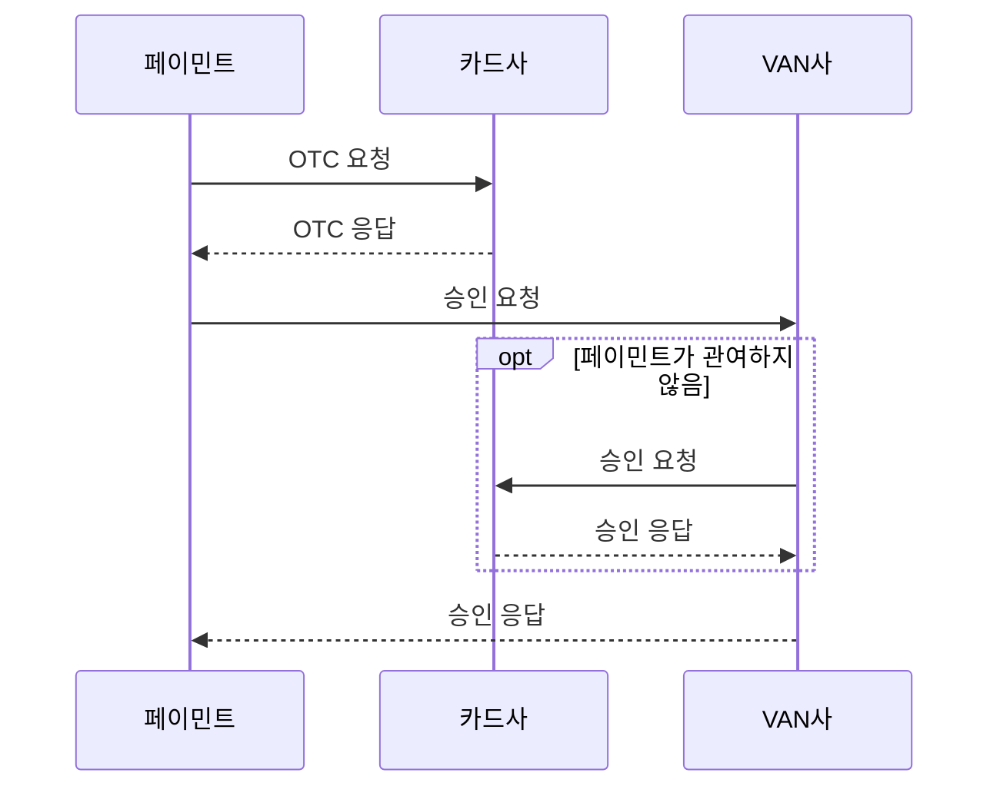
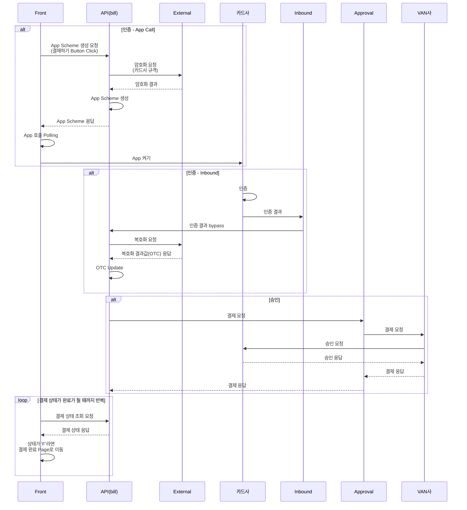
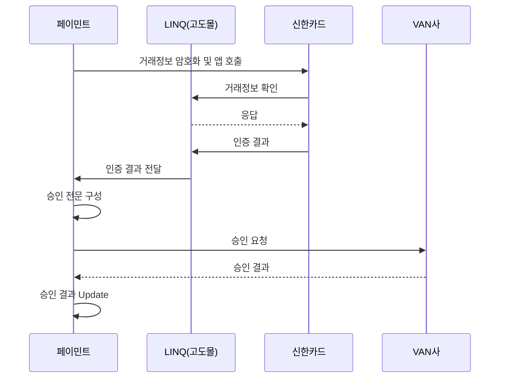
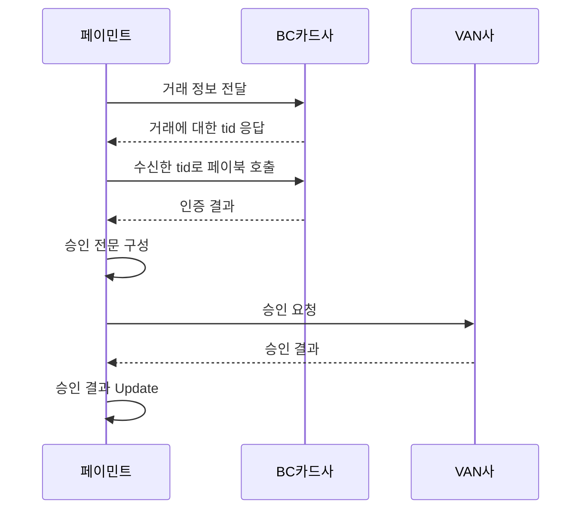

# AppCard 결제 Process (`CARD_VAN`)

- AppCard는 페이민트의 모든 service에서 제공하는 결제 수단임
    - pay_type = `CARD_VAN`

- 크게 "App 호출", "인증", "승인" 3가지 과정으로 이루어짐

---

## 공통

- 신한, 국민, BC, 삼성은 공통 process와 조금씩 다르지만, 큰 흐름은 같음

---

## 신한

- App 호출 방식은 공통 process와 같음
- 전용선이 필요하기 때문에 Godomall의 LinQ(`linq-api-place` project)를 통해 결제 승인함
- 암호화를 external server가 아니라 approval server에서 함

### 과정

1. 주문 확인 & 인증
    - 신한 App loading -> Linq -> 'OD', 'PL', 'SP' 구분해서 payssam, speeid, linq로 분기해서 보냄
    - 해당 service로 가서 인증함

2. OTC 전달
    - 인증 결과를 Godomall로 다시 줌
    - 해당 service의 OTC를 update

3. OTC를 이용하여 VAN사에 승인 요청

---

## BC

- BC는 App 호출 전, 카드사와 통신하는 규격이 추가적으로 필요함
- App을 호출하는 과정에서 카드사의 bridge page가 있음
- 인증 결과가 XML 형식임

---

## Lotte

- 인증 결과가 query string으로 오기 때문에 inbound에서 parsing하는 작업이 추가적으로 필요함
- 결제 과정은 공통 logic과 같음

# OTC와 CARD_ID : AppCard 결제의 인증 단계에 필요한 값

- AppCard 결제를 하기 위해서는 **OTC**라는 값이 필요함
    - OTC는 **One Time Code**의 약자로, **VAN사 결제 승인에 한 번만 사용할 수 있는 인증 token**임

- 카드사의 App을 통해 인증을 진행하는 것도, 결국 OTC를 발급받기 위함임
    - 카드사 App에서 인증을 완료하면, 카드사 server에서 페이민트 server로 OTC를 전달함

## 자동 결제에서 OTC를 발급하는 방법 : CARD_ID 이용

- **CARD_ID**란 App 인증 과정 없이 **OTC**를 발급받을 수 있는 영구적인 값임
    - CARD_ID만 가지고 있으면, 카드사의 App을 호출하여 인증하는 과정 없이 바로 카드사에서 OTC를 발급받을 수 있음
    - 자동 결제는 고객이 직접 App 내에서 인증을 할 수 없기 때문에, **카드사에서 자동 결제를 위해 App 인증 없이도 OTC를 발급받을 수 있는 CARD_ID를 제공**하고 있음
        - 페이민트는 이 CARD_ID를 암호화하여 DB에 저장해두고, 필요할 때 복호화하여 사용하고 있음
        - CARD_ID를 암호화에는 AWS KMS(Key Management System)를 사용함

- CARD_ID는 **AppCard 자동 결제**(pay_type = `CARD_RP`)를 진행하기 위해 사용함
    - AppCard 결제 시 VAN사에 승인 요청을 하려면 OTC가 필요한데, 보통 OTC는 카드사 App 인증을 완료해야 발급받을 수 있음
    - 그러나 자동 결제할 때는 고객이 직접 App 내에서 인증을 할 수 없기 때문에, 결제 수단을 등록할 때 저장해둔 CARD_ID를 사용하여 OTC를 발급함
        - 자동 결제를 위해 카드사에서 App 인증 없이도 OTC를 발급받을 수 있는 CARD_ID를 관리하고 대행사에게 제공함

### 예외 Case : BC 카드의 CARD_ID

- BC 카드는 다른 카드사와 OTC 처리가 다르게 되어 있음
- 보통 카드사에서 관리하는 별도의 CARD_ID가 아닌 카드 번호와 유효 기간으로 이루어진 고정 token을 저장함
    - `카드 번호 + 유효 기간(yyyymmdd)`을 KMS로 암호화한 값을 CARD_ID로 저장함