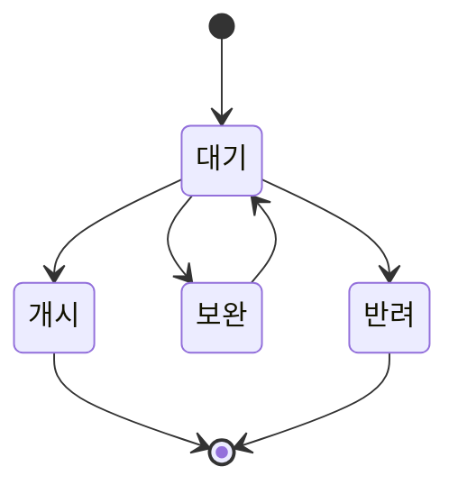

# 간편 계좌 이체 결제 수단 (`BANK`)

- 다른 말로는 "은행 App 간편 결제"라고도 함
    - AppCard 결제와 비슷하게, 은행 app을 열어서 결제하는 방식이기 때문

- 이 결제 수단으로 발생한 결제는 정산을 페이민트에서 하기 때문에, 정산 system이 갖춰져 있는 service에서만 사용할 수 있는 결제 수단
    - 현재는 결제선생에만 정산 system이 있으며, 결제선생에서만 사용하고 있음

- 각 은행사의 규격에 맞춰 전문이 구성되어 있음

- VAN사와 통신하지 않으며 은행에 바로 승인을 요청하는 방식
    - 은행 App을 통해 계좌 이체하는 방식으로 결제가 이루어짐

- 거래 시 현금 영수증을 발급함
    - `cash_receipt` table에 저장

- 거래 시 정산 원장에 결제 정보를 적용(`ccl_ledger` upsert)함
    - 간편 계좌 이체 결제에 대해서는 페이민트가 정산의 주체이기 때문에 페이민트가 정산에 필요한 원장을 관리하고 있음

| 결제 App 종류 | 설명 |
| --- | --- |
| **케이뱅크** (`KBANK`) | `payssam-api-bill` project의 `/process/bank`에서 결제 승인을 진행함 |
| **KB 스타플랫폼** (`KBSTARPLATFORM`) | `payssam-api-bill` project의 `/auth-result/{payApp}/pay-complete`에서 최종 승인 결과를 수신하여, 후처리하고 승인 완료 page로 redirect함 |
| **KB LiiV** (`KBLIIV`) | KB LiiV service 종료로 인해 더 이상 사용하지 않음 |

---

## 간편 계좌 이체 결제 수단 등록 심사 과정 (정산 계좌 등록)

- 정산의 대상이 되는 간편 계좌 이체 결제 수단은 등록 심사 과정을 통해 등록하고 있음

### 심사 과정

1. 심사 요청 - Manager

2. (Optional) 보완 or 반려 or 삭제 - Admin
    - '보완' 요청이 들어가서 사업자가 사진을 다시 등록하면, 재심사가 요청됨
    - 반려는 보완이 불가능한 경우이므로 무조건 반려된 심사는 삭제만 할 수 있음

3. 개시 - Admin
    1. 심사 완료 처리 (`ccl_account_review` table)
    2. 계좌이체 결제 수단(BANK) mapping (`pay_type_mapping` table)
    3. 해당 결제 수단과 관련된 결제 앱 mapping (`pay_app_mapping` table)
    4. 정산 계좌 정보 등록 (`ccl_merchant_info` table)
    5. 정산 기본 수수료 template 등록 (`ccl_merchant_fee_template_mapping` table)

### 간편 계좌 이체 결제 수단 심사 S3 Image Path 규칙

| 변수 | 설명 |
| --- | --- |
| `awsUrl` | `https://s3.ap-northeast-2.amazonaws.com` |
| `bucket` | `payssam.bank` |
| `environment` | `prod` / `dev` |
| `merchantCode` | 심사 받는 사업장의 code (`merchant` table의 `merchant_cd`) |
| `reviewSeq` | 심사 PK (`ccl_account_review` table의 `seq`) |
| `holdSeq` | 심사 보류 PK (`ccl_account_review_hold` table의 `seq`) |

#### 심사

- 통장 사본 : `{awsUrl}/{bucket}/{environment}/ccl/image/{merchantCode}/review.{reviewSeq}`
- 사업자 등록증 : `{awsUrl}/{bucket}/{environment}/ccl/image/{merchantCode}/review.{reviewSeq}.businessRegistration`

#### 심사 보류

- 통장 사본 : `{awsUrl}/{bucket}/{environment}/ccl/image/{merchant.merchant_cd}/review.{reviewSeq}.{holdSeq}`
- 사업자 등록증 : `{awsUrl}/{bucket}/{environment}/ccl/image/{merchant.merchant_cd}/review.{reviewSeq}.businessRegistration.{holdSeq}`

### 계좌 이체 결제 수단 등록 관련 DB Table

#### `ccl_account_review` : 정산 계좌 등록 심사 정보

- 정산 계좌 등록 심사의 진행 정보와 상태를 저장하는 table

#### `ccl_account_review_hold` : 정산 계좌 등록 심사 보류 정보

- '보완', '반려' 등 보류 상태에 대한 이력 관리를 위한 table

#### `ccl_merchant_info` : 정산 계좌 정보

- 심사가 마무리되면 이 table에 최종적으로 정산 계좌 정보가 들어감
    - 사업장이 정산 금액을 받을 계좌 정보, 세금계산서 발행에 필요한 정보 등