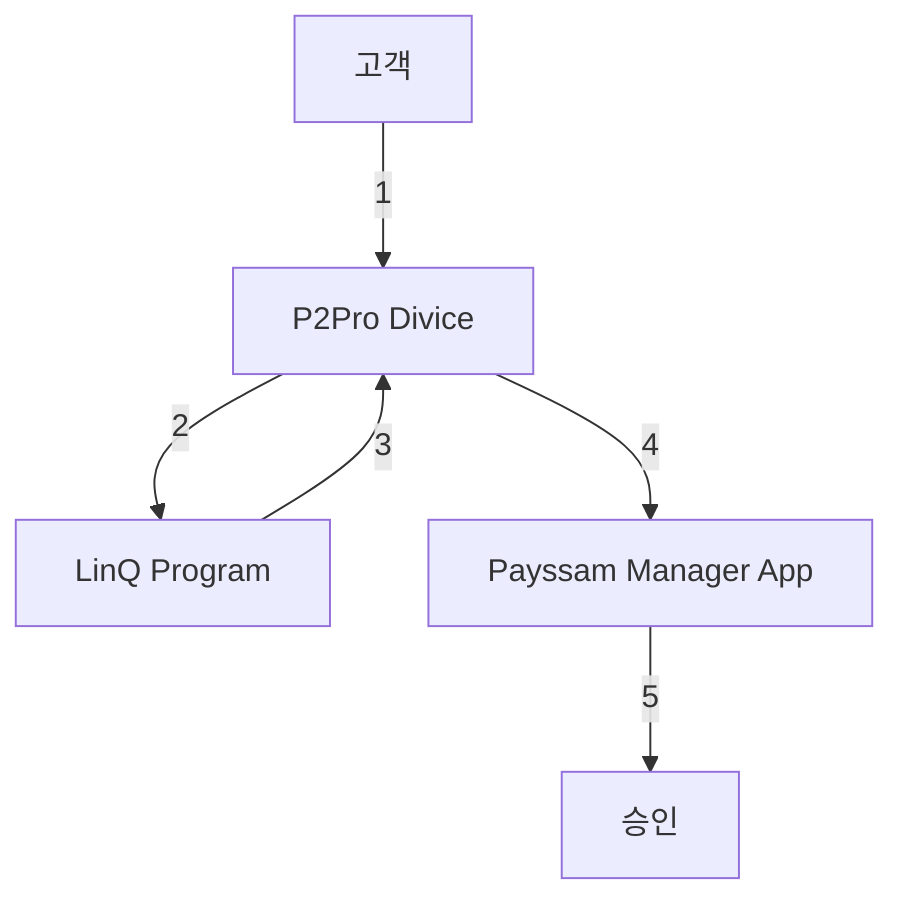

# 현장 카드 결제 (`OFFLINE_CARD`)

- 카드 정보를 IC나 MS를 통해 단말기가 직접 읽어서 결제하는 방식

- 현장 카드 결제에는 현장 결제 기기(단말기)가 필요하며, 인증 받은 기기만 개인 정보를 다룰 수 있기 때문에 장비 인증을 받는 심사가 필요함

- 현재 페이민트에서는 KSNET과 NICE의 단말기를 사용하고 있음
    - KSNET : P2PRO, BT 단말기
    - NICE : BT 단말기

---

## P2PRO 승인 과정

1. P2PRO에 card를 삽입하거나(IC) Swipe(MS)함

2. 단말기용 mobile program에서 LinQ program을 거쳐 card 정보를 생성함
    - P2PRO는 LinQ를 통해서 단말기 심사를 받았기 때문

3. 승인

