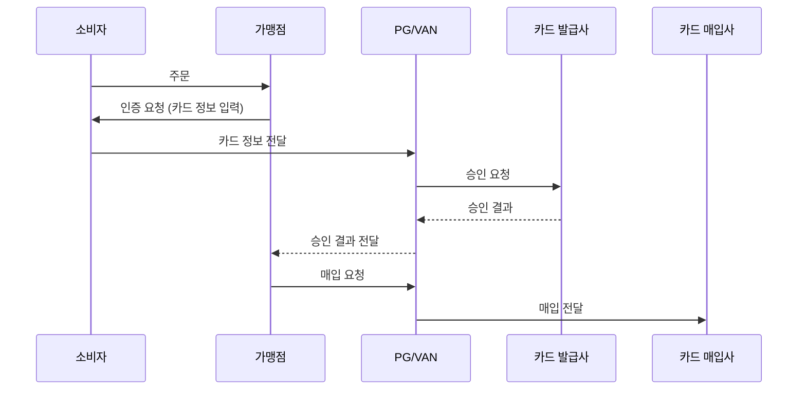

## 카드 결제의 흐름

- 카드 결제는 **인증 -> 승인 -> 매입** 세 단계를 거쳐 처리됩니다.
    - 소비자가 결제 화면에서 카드 정보를 입력하는 것은 인증 단계일 뿐, 이 단계만으로는 실제 결제가 이루어지지 않습니다.

---

## 인증 (Authentication)

- 인증은 **소비자의 카드가 유효한지 확인하는 과정**입니다.
    - 카드 번호, 유효기간, CVC 등의 정보를 입력하고, 해당 카드가 실제로 사용 가능한지 검증합니다.
    - 소비자가 "결제"라고 생각하는 화면이지만, 인증만으로는 금액이 차감되지 않습니다.

- 인증 단계에서 **일반 결제**와 **간편 결제**가 나뉩니다.

### 일반 결제

- 일반 결제는 소비자가 **카드사에서 제공하는 인증 module에 직접 카드 정보를 입력**하는 방식입니다.
    - 결제 화면에서 나타나는 카드사별 인증 창(ISP, 안심클릭 등)이 이 인증 module입니다.

### 간편 결제

- 간편 결제는 소비자가 직접 입력하던 카드 정보를 **pay service(카카오페이, 네이버페이 등)가 대신 입력**해주는 방식입니다.
    - 소비자는 최초 1회만 카드를 등록하면, 이후에는 간단한 인증(비밀번호, 생체 인증 등)만으로 결제할 수 있습니다.
    - 카드 번호 원본은 카드사만 보유하며, pay service는 카드사로부터 발급받은 token을 저장합니다.

---

## 승인 (Authorization)

- 승인은 **카드 발급사(issuer)에 결제 정보를 전달하여 카드 한도를 차감하는 과정**입니다.
    - PG 또는 VAN사를 통해 카드 발급사에 승인 요청을 보냅니다.
    - 카드 발급사는 카드 한도, 분실 여부, 연체 상태 등을 확인한 뒤 승인 또는 거부를 응답합니다.

- 승인이 완료되면 소비자의 카드 한도가 차감되고, **승인 번호**가 발급됩니다.
    - 승인 번호는 해당 거래를 식별하는 고유 번호로, 취소나 환불 시에 사용됩니다.

- 승인 단계에서 한도가 차감되지만, 실제 자금 이동은 아직 발생하지 않습니다.
    - 실제 자금 이동은 매입 단계 이후 정산 과정에서 이루어집니다.

---

## 매입 (Clearing / Capture)

- 매입은 **승인된 거래를 카드 매입사(acquirer)에 전달하여 거래를 확정하는 과정**입니다.
    - 가맹점이 VAN사를 통해 매입사에 매입 요청을 보내면, 해당 거래가 정산 대상으로 확정됩니다.

- 매입이 완료되어야 가맹점은 카드사로부터 대금을 정산받을 수 있습니다.
    - 승인만 받고 매입을 하지 않으면, 일정 기간 후 승인이 자동 취소됩니다.

- 매입 후 카드사는 정산 주기에 따라 가맹점에 대금을 지급합니다.
    - 이 과정에서 카드사 수수료가 차감됩니다.

---

## Reference

- <https://docs.tosspayments.com/resources/glossary/card-payment>

