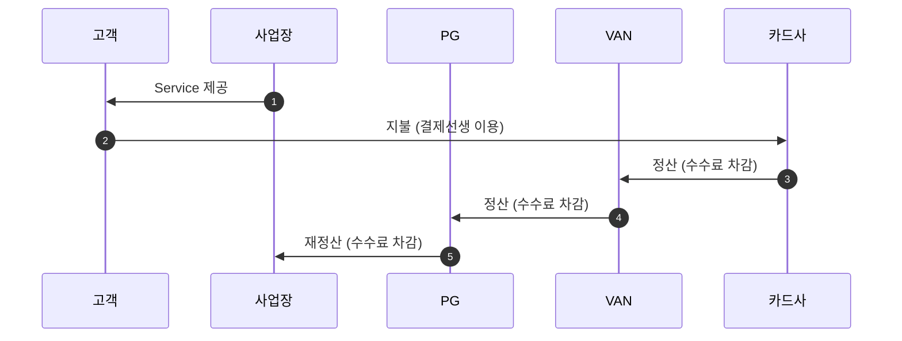
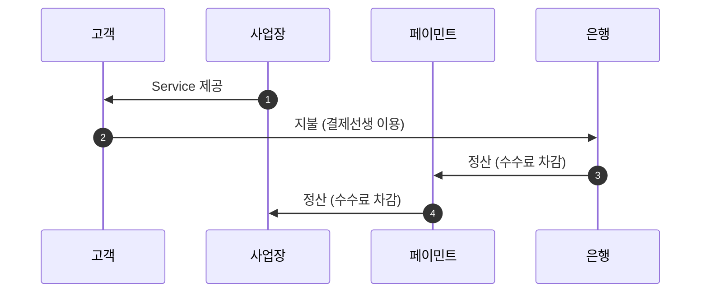

# 정산 개요

- 기획서 : <https://docs.google.com/presentation/d/13Q8vF1h9hxXAt7ZufT7zPEDRw8SHiKf2Tdop-kGhTVA/edit#slide=id.ge69ba05366_0_611>

- 정산 주체는 보통 매입사이지만, 은행 결제(`pay_type`이 `BANK`인 `pay_app`)에 대해서는 페이민트가 정산함

- 사업장은 정산 계좌를 등록하고 사업(판매)을 하다가, 정산일이 도래하면 일정 수수료를 제한 매출 금액을 정산 받음
    - 지급 업무(사업장에 정산 금액 송금)는 경영 관리 team이 매일 지급 목록을 확인하여 지급함

- 현재 정산 system은 결제선생에만 있음

---

## 기존의 정산

- 정산 : 카드사가 돈을 VAN에게 주고, VAN이 매장(또는 PG)에게 돈을 줌
- 재정산 : VAN이 돈을 PG에게 주고, PG가 매장에게 돈을 줌

---

## 페이민트의 정산

- 은행이 돈을 페이민트에게 주고, 페이민트가 매장에게 돈을 줌

### 페이민트가 정산했을 때의 장점

- 중간 과정이 없기 때문에 수수료가 적음
    - 이 수수료가 페이민트에게 들어옴

- 페이민트가 사업장을 개시하면서 CAT_ID를 무조건 받기 때문에 가맹점의 매출 내역이 투명하게 공유됨
    - 기존 정산 대상인 PG는 '대표 가맹점'이기 때문에 매출 내역이 '대표 가맹점'에 대해서만 나옴

