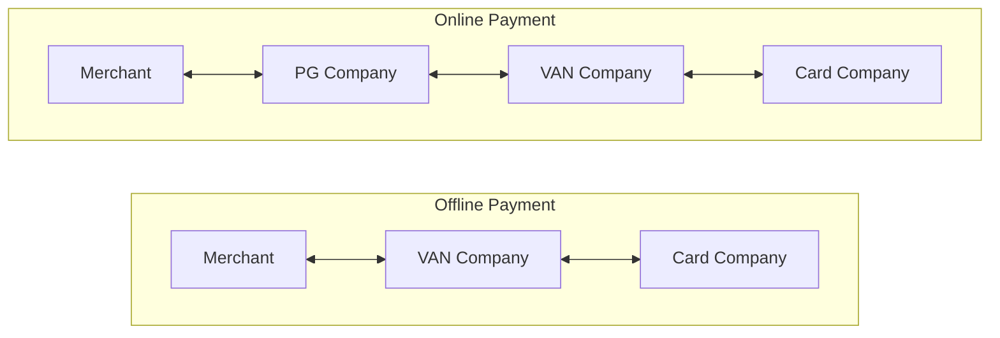

## VAN & PG : 카드 결제의 중계자

- **VAN사는 카드사와 가맹점 사이에서 결제 승인을 중개하는 역할**을 합니다.
    - 가맹점이 여러 카드사와 개별적으로 계약을 맺고 관리하는 것이 비효율적이기 때문에, VAN사가 중간에서 이를 대행하며 수수료를 통해 수익을 창출합니다.

- **PG사는 온라인 결제 환경에서 VAN사와 유사한 역할을 수행**합니다.
    - 물리적 카드 단말기 없이 이루어지는 온라인 결제에서, PG사는 결제 정보를 수집하고 이를 VAN사에 전달하여 최종적으로 카드사의 승인을 받는 과정을 관리합니다.

- VAN사와 PG사는 모두 결제 수수료를 통해 수익을 얻으며, 가맹점에 리베이트를 제공하는 방식으로 경쟁하고 있습니다.

- 그러나 최근에는 App to App service가 늘어나면서 기존의 VAN/PG를 사용하는 카드 결제 시스템이 점차 쇠퇴하고 있습니다
    - 소비자들이 간편결제나 모바일 페이먼트를 선호하면서 전통적인 VAN-PG 구조의 중요성이 감소하고 있습니다.

- Offline 카드 결제에서는 가맹점이 VAN사를 통해 카드사와 통신하며 결제를 처리합니다.
    - 전통적인 카드 결제 방식으로, 가맹점의 물리적 단말기(POS)를 통해 이루어집니다.

- Online 카드 결제의 경우, 가맹점은 PG사를 통해 결제를 시작하고, PG사는 다시 VAN사를 거쳐 카드사와 통신합니다.
    - 실물 카드 없이 온라인상에서 이루어지는 결제를 처리하기 위한 구조입니다.

---

## VAN : Value-Added Network

- VAN은 **Value-Added Network**의 약자로, **카드사와 가맹점 간의 network를 구축**해서 **소비자의 카드 사용 승인을 가맹점과 카드사 사이에서 중개해주는 역할**을 합니다.

- 예시 : 카페에 가서 5,000원 짜리 음료를 먹기 위해 BC 카드로 결제.
    1. 우리는 카드를 종업원에게 건네고 종업원은 6,000원이라는 금액을 카드기(POS)에 긁음.
    2. 카드 정보가 VAN사로 전송됨.
    3. VAN사는 BC에 '우리가 5,000원을 결제한다'는 사실에 대한 승인 여부를 요청.
    4. BC사에서는 우리의 카드에 잔액이 충분한지, 신용 정보가 올바른지 등을 판단하여 VAN사에 승인을 내리거나 거부를 함.
    5. VAN사는 승인 내역을 카드기(POS)에 송신.
    6. 결제가 완료되면 전표가 줄력되고 우리는 영수증을 받음.

### 카드사에서 직접 가맹점과 거래하지 않고 중간에 VAN사가 개입하는 이유

- 전표는 가맹점과 카드사 간의 거래를 번거롭게 합니다.
    - 가맹점은 전표를 카드사에 가져가서 확인받아야 그에 맞는 대금을 받을 수 있습니다.
    - 가맹점은 매장에서 상용하는 수많은 카드사에 직접 방문하기 어려우며, 카드사 역시 모든 가맹점을 대상으로 전표 거래를 진행하기엔 업무가 많아집니다.

- 따라서, VAN사는 카드사를 대신하여 가맹점의 카드 전표 내역에 따라 대리 지급을 하고, 그에 대한 수수료를 카드사로부터 제공받습니다.

- VAN사는 가맹점 전표에 대한 대금 결제를 해주는 댓가로 카드사로부터 수수료를 받고, 가맹점은 모든 카드사를 직접 방문하지 않고 VAN사를 통해 그 결제 금액을 받을 수 있게 됩니다.
    - 카드사 역시 고객의 소비에 따라 책정된 카드 수수료를 쉽게 납부받을 수 있습니다.

- 여러 카드사와 연결된 VAN사의 단말기는 전화선을 통해 가맹점과 연결되어 있으므로, 가맹점은 인증 과정을 VAN사에 온전히 맡길 수 있게 됩니다.

- VAN사는 보통 가맹점에 'rebate'를 권유하며 매장과의 계약을 따내고, 이를 통해 가맹점 역시 VAN사가 일부 챙겨간 수수료 중 일부를 다시 돌려받을 수 있습니다.
    - rebate : 지불한 돈 일부를 돌려받는 것 (a return of a part of a payment).
    1. 우리는 5,000원 짜리 커피를 신용카드로 구매.
    2. 카드사는 5,000원 중 일정율의 수수료를 가져감.
    3. VAN사는 그 일정 수수료 중 다시 또 일정 수수료를 가져감.
    4. 가맹점은 다시 그 일정 수수료의 일부를 rebate 받음.

- 한국에는 한국 정보통신, Nice 정보통신, KSNET, SMARTRO, KIS 정보통신 등의 VAN사가 있습니다.

---

## PG : Payment Gateway

- PG는 **Payment Gateway**의 약자로, **VAN사의 업무를 online으로 대행하는 회사**입니다.
    - online 결제시 단말기 없이 진행되는 과정에서 VAN사의 역할을 대신 수행하여 카드사와 소비자가 이어질 수 있도록 만드는 부가적인 option입니다.

- online shopping mall이 등장하면서 '단말기'에 대한 부분을 어떻게 수행해야할지 난점이 생겼고, 이를 해결하기 위해 PG라는 결제 model이 등장했습니다.
    - 항상 카드를 사용하면 단말기로 결제를 했고, 그 단말기에서 출력된 전표를 바탕으로 VAN이라는 system이 운영되어 왔습니다.
    - 그러나 online shopping mall은 소비자가 현장에 없기 때문에, 단말기를 사용하여 결제할 수 없습니다.

- 예시 : online shopping mall에서 20,000원 짜리 서적을 구매하기 위해 BC 카드 사용.
    1. online shopping mall에서 '신용카드 또는 체크카드 결제'를 click.
    2. 결제 인증을 위한 '개인 정보' 및 '카드 정보'에 관한 과정을 진행.
    3. 그럼 PG사에서 나의 정보를 받고 정리하여 VAN사로 결제에 대한 승인 요청을 함.
    4. VAN사에서는 그대로 카드 정보를 BC에 '내가 20,000원을 결제한다'는 사실에 대한 승인 여부를 요청.
    5. BC 카드사에서는 카드 잔액이 충분한지, 신용 정보가 올바른지 등을 판단하여 VAN사에 승인을 내리거나 거부함.
    6. VAN사는 BC 카드사에서 내려온 사안을 그대로 PG사에 전달.
    7. PG사는 여기서 승인 결과를 나, 그리고 shopping mall에 통보.
    8. shopping mall은 승인 결과를 확인하고 나에게 서적을 보냄.

- PG사 역시 VAN사처럼 '수수료'를 통한 수익을 business model로 하고 있습니다.
    - 또한 rebate를 통해 가맹주들에 의해 선택됩니다.

- 한국에는 PAYGATE, INICIS, NICE 등의 PG사가 있습니다.

---

## Reference

- <https://finance3.tistory.com/34?category=779493>
- <https://finance3.tistory.com/43>
- <https://finance3.tistory.com/53?category=779493>
