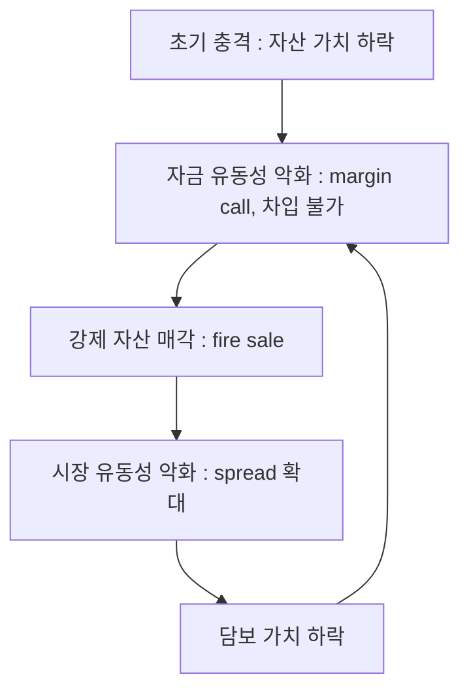

## 유동성

- **유동성(liquidity)**은 **자산을 빠르고 쉽게 현금으로 전환할 수 있는 정도**를 의미합니다.
    - 유동성이 높을수록 필요할 때 즉시 현금화됩니다.
    - 유동성이 낮을수록 현금화에 시간과 비용이 많이 듭니다.

- 유동성은 **재무 안정성과 투자 전략 수립**에 중요한 요소입니다.
    - 비상 상황에 대비하려면 일정 비율의 유동 자산이 필요합니다.
    - 유동성이 낮은 자산은 일반적으로 유동성 premium이 붙어 더 높은 수익률을 기대합니다.

---

## 시장 유동성과 자금 유동성

- 유동성은 **시장 유동성(market liquidity)**과 **자금 유동성(funding liquidity)** 두 가지 차원으로 구분됩니다.

### 시장 유동성

- **시장 유동성**은 **자산을 현재 가격 수준에 근접하게, 신속히 매도하는 능력**입니다.
    - bid-ask spread, 거래량, 시장 깊이(market depth) 등의 지표로 측정합니다.
    - 대형주는 시장 유동성이 높고, 소형주나 비상장 주식은 낮습니다.

### 자금 유동성

- **자금 유동성**은 **금융 기관 또는 투자자가 필요한 시점에 자금을 조달하는 능력**입니다.
    - 단기 차입, repo 시장, 신용 한도(credit line) 가용성에 의존합니다.
    - 은행의 예금 인출(bank run) 또는 hedge fund의 margin call 상황에서 자금 유동성이 고갈됩니다.

### 유동성 나선

- 시장 유동성과 자금 유동성은 서로 강화하며 악화되는 **유동성 나선(liquidity spiral)**을 형성합니다.
    - Brunnermeier & Pedersen(2009)이 제시한 이론입니다.

- 자금 유동성이 악화되면 투자자가 자산을 강제 매각(fire sale)하고, 이는 시장 유동성을 추가로 악화시킵니다.
    - 담보 가치가 하락하면서 추가 margin call이 발생하고, 악순환이 반복됩니다.

---

## 유동성을 결정하는 세 가지 요소

- 유동성은 **전환 속도, 가격 손실, 거래 비용** 세 가지 요소로 평가됩니다.

### 전환 속도

- **자산을 현금으로 바꾸는 데 걸리는 시간**입니다.
    - 즉시 : 현금, 보통 예금.
    - 1\~3일 : 주식, 채권.
    - 수주\~수개월 : 부동산.

### 가격 손실

- **현금화 과정에서 발생하는 가격 하락**입니다.
    - 급하게 팔면 시장 가격보다 낮은 가격에 팔아야 합니다.
    - 유동성이 높은 자산은 시장 가격 그대로 매도할 수 있어 가격 손실이 거의 없습니다.

### 거래 비용

- **매매에 드는 수수료, 세금, 중개 비용**입니다.
    - 주식 : 거래 수수료 0.1\~0.3%.
    - 부동산 : 중개 수수료, 취득세, 양도세 등 5\~10%.

- **bid-ask spread**는 유동성의 직접적인 비용을 반영하는 지표입니다.
    - bid price(매수 호가)와 ask price(매도 호가)의 차이로, spread가 좁을수록 유동성이 높습니다.
    - Apple(AAPL) 주식의 spread는 1 cent 이하이지만, 소형주는 수십 cent에 달합니다.
    - 국채는 0.01\~0.05%의 좁은 spread를 보이고, junk bond는 1\~2% 이상입니다.
    - 위기 시 spread가 급격히 확대됩니다.

- **Amihud 비유동성 지표**는 `|일일 수익률| / 거래량`으로 단위 거래량당 가격 충격을 측정합니다.
    - 값이 클수록 비유동성이 높습니다.

---

## 유동 자산

- **유동 자산(liquid asset)**은 **며칠 이내에 가격 손실 없이 현금으로 전환 가능한 자산**으로, 거래 비용이 낮고 수익률도 낮습니다.

### 주요 유동 자산

- **현금** : 가장 유동성이 높은 자산으로, 전환 과정이 필요 없이 즉시 사용 가능합니다.

- **보통 예금** : 은행 계좌에 예치된 돈으로, ATM이나 internet banking으로 즉시 인출합니다.

- **단기 예금** : 만기 3개월 이내의 정기 예금으로, 중도 해지 수수료가 적습니다.

- **MMF(money market fund)** : 단기 금융 상품에 투자하는 fund로, 1\~2일 내에 환매 가능합니다.
    - 예금보다 약간 높은 수익률을 보입니다.

- **상장 주식** : 거래소에서 거래되는 주식으로, 거래일 기준 2\~3일 내에 현금화됩니다.
    - 가격 변동성은 있지만 매도 자체는 즉시 가능합니다.

- **국채 및 우량 회사채** : 시장에서 활발하게 거래되어 쉽게 매도 가능합니다.

### 활용

- **비상 자금** : 실직, 질병 등 예상치 못한 지출에 대비합니다.

- **단기 목표** : 1년 이내에 사용할 돈을 보관합니다.

- **기회 포착** : 투자 기회가 생겼을 때 빠르게 대응합니다.

- **심리적 안정** : 언제든 현금화 가능하다는 안정감을 줍니다.

---

## 반유동 자산

- **반유동 자산(semi-liquid asset)**은 **수주에서 수개월의 시간이 걸리고 약간의 가격 손실 가능성이 있는 자산**으로, 유동 자산보다 높은 수익률을 기대합니다.

### 주요 반유동 자산

- **소형 부동산** : 소형 apartment, officetel, 상가로, 대형 부동산보다 수요가 많아 비교적 빠르게 매도됩니다.
    - 수주에서 수개월 정도 소요됩니다.

- **비상장 주식** : 거래소에 상장되지 않은 주식으로, 장외 거래나 개인 간 거래로 매도합니다.
    - 적절한 매수자를 찾는 데 시간이 걸립니다.

- **투자용 금** : 금괴, 금화로, 금은방이나 거래소에서 며칠 내에 매도 가능하지만 수수료가 있습니다.

- **미술품** : 중간 가격대의 그림이나 조각으로, 경매나 화랑을 통해 판매합니다.
    - 적절한 가격에 팔기까지 시간이 걸립니다.

- **수집품** : wine, 시계, 우표, 골동품 등으로, 수집가 시장에서 거래됩니다.

### 활용

- **중기 투자** : 3\~5년 정도의 투자 목표에 적합합니다.

- **수익 추구** : 유동 자산보다 높은 수익을 기대합니다.

- **portfolio 다각화** : 다양한 자산군에 분산 투자합니다.

---

## 비유동 자산

- **비유동 자산(illiquid asset)**은 **현금화에 수개월에서 수년이 걸리고 거래 비용이 매우 높은 자산**으로, 유동성 premium이 붙어 높은 수익률을 기대합니다.

### 주요 비유동 자산

- **대형 부동산** : 고가 apartment, 건물, 토지로, 매수자를 찾기 어려워 수개월에서 수년이 걸립니다.

- **사모 fund(private equity)** : 비상장 기업 투자 fund로, 보통 5\~10년 장기 투자이며 환매 제한 기간이 있습니다.

- **venture 투자** : 초기 startup 투자로, exit(IPO나 M&A)까지 수년이 걸리며 환금이 매우 어렵습니다.

- **hedge fund** : 대체 투자 fund로, lock-up period(환매 금지 기간)가 있으며 환매 신청 후에도 수개월이 소요됩니다.

- **고가 미술품** : 유명 작가의 작품으로, 경매에 출품해도 적절한 가격에 팔리기까지 수년이 걸리기도 합니다.

### 활용

- **장기 투자** : 10년 이상의 장기 목표에 해당합니다.

- **고수익 추구** : 유동성 premium을 받아 높은 수익을 기대합니다.

- **전문 투자자** : 충분한 유동 자산을 보유한 투자자에게 적절합니다.

---

## 유동성에 따른 자산 비교

- 유동성 수준에 따라 현금화 기간, 거래 비용, 평균 수익률이 달라집니다.

| 자산 | 유동성 수준 | 현금화 기간 | 거래 비용 | 평균 수익률 |
| --- | --- | --- | --- | --- |
| **현금, 예금** | 매우 높음 | 즉시 | 거의 없음 | 1\~2% |
| **MMF** | 높음 | 1\~2일 | 낮음 | 2\~3% |
| **주식, 채권** | 높음 | 2\~3일 | 낮음 | 5\~10% |
| **소형 부동산** | 중간 | 수주\~수개월 | 중간 | 6\~10% |
| **금, 미술품** | 중간 | 수일\~수주 | 중간 | 5\~8% |
| **대형 부동산** | 낮음 | 수개월\~수년 | 높음 | 8\~12% |
| **사모 fund, venture** | 매우 낮음 | 수년 | 매우 높음 | 10\~20% |

---

## 유동성 Premium

- **유동성 premium(liquidity premium)**은 **유동성이 낮은 자산에 대해 투자자가 요구하는 추가 수익률**입니다.
    - 유동성을 포기하면 필요할 때 현금화하기 어렵기 때문에, 그 대가로 더 높은 수익을 요구합니다.

### 유동성 Premium의 사례

- 1년 만기 정기 예금 금리 3%, 3년 만기 정기 예금 금리 4%인 경우, 3년간 자금을 묶어두는 대가로 1%p의 추가 수익을 받습니다.
    - %p(percentage point)는 percent 수치 자체의 차이를 나타내는 단위입니다.

- 상장 주식 기대 수익률 10%, 비상장 주식 기대 수익률 15%인 경우, 유동성이 낮은 비상장 주식에 5%p의 premium이 붙습니다.

### 투자 의사 결정

- 유동성 premium을 고려하여 **투자 기간과 자금 필요성을 판단**합니다.
    - 단기간 내에 돈이 필요하면 유동 자산에 투자합니다.
    - 장기간 돈이 필요 없으면 비유동 자산으로 더 높은 수익을 추구합니다.

---

## Portfolio에서의 유동성 관리

- 효과적인 portfolio는 **유동성 수준을 적절히 배분**하여, 비상 상황에 대비하면서도 수익을 극대화합니다.

### 비상 자금 확보

- **3\~6개월 생활비에 해당하는 유동 자산**을 보유합니다.
    - 실직, 질병 등 예상치 못한 상황에 대비합니다.
    - 현금, 보통 예금, MMF 등으로 보유합니다.

### 목적별 배분

- **단기 목표(1년 이내)** : 유동 자산 100%로, 가격 변동 위험을 피합니다.

- **중기 목표(3\~5년)** : 유동 자산 50%, 반유동 자산 50%로, 수익과 유동성을 모두 확보합니다.

- **장기 목표(10년 이상)** : 유동 자산 20%, 반유동 자산 30%, 비유동 자산 50%로, 유동성 premium을 최대한 활용합니다.

### 유동성 위기 방지

- **전체 자산 중 최소 20\~30%는 유동 자산**으로 유지합니다.
    - 비유동 자산에 과도하게 집중하면 현금이 필요할 때 급매도로 손실을 입습니다.

- **정기적으로 유동성을 점검**합니다.
    - 자산 가격 변화로 유동성 비율이 달라질 수 있습니다.
    - 비유동 자산 비중이 너무 높아지면 일부를 유동 자산으로 전환합니다.

---

## 유동성 함정

- **유동성 함정(liquidity trap)**은 유동 자산과 비유동 자산의 배분이 극단적일 때 발생하는 문제입니다.

### 과도한 유동 자산 보유

- 현금과 예금만 과도하게 보유하면 **수익 기회를 놓칩니다**.
    - inflation으로 실질 가치가 감소합니다.
    - 장기적으로 부의 축적이 어렵습니다.

### 과도한 비유동 자산 집중

- 비유동 자산에만 투자하면 **현금이 필요할 때 큰 손실을 봅니다**.
    - 급하게 팔면 시장 가격보다 훨씬 낮은 가격에 매도해야 합니다.
    - 다른 투자 기회가 생겨도 포착할 수 없습니다.

### 균형 잡힌 접근

- **자신의 상황에 맞는 유동성 비율**을 유지합니다.
    - 안정성과 수익성의 균형을 추구합니다.
    - 정기적으로 재조정하여 목표 비율을 유지합니다.

---

## 유동성 위기 사례

- 유동성 위기는 시장 유동성과 자금 유동성이 동시에 악화되면서 금융 system 전체로 확산되는 현상입니다.

### LTCM 사태 (1998)

- **LTCM(Long-Term Capital Management)**은 약 25:1의 leverage를 활용한 hedge fund로, 1998년 러시아 국채 default 이후 자금 유동성이 고갈되었습니다.
    - 강제 매각이 시장 유동성을 추가로 악화시키는 유동성 나선이 발생했습니다.
    - Fed가 14개 금융 기관을 조율하여 36억 dollar 규모의 구제 금융을 주도했습니다.

### 2008년 금융 위기

- MBS(Mortgage-Backed Securities)와 CDO(Collateralized Debt Obligation)의 가치 불확실성이 시장 유동성을 동결시켰습니다.
    - repo 시장이 사실상 마비되고, Ted spread(국채-은행간 금리 차이)가 평시 0.2\~0.5%에서 4.6%까지 급등했습니다.
    - Fed가 TAF(Term Auction Facility), TSLF(Term Securities Lending Facility) 등 비전통적 유동성 공급 수단을 도입했습니다.

### 2020년 COVID-19 유동성 충격

- 팬데믹 초기에 **"dash for cash"** 현상이 발생하여, 안전 자산인 미국 국채조차 유동성이 악화되었습니다.
    - hedge fund가 국채를 급매하면서 repo 시장이 경색되었습니다.
    - Fed가 무제한 양적 완화(QE)를 선언하고 여러 긴급 대출 창구를 도입하여 안정을 회복했습니다.

---

## 유동성 경색의 전파 Mechanism

- 유동성 경색(liquidity crunch)은 **네 가지 channel**을 통해 금융 system 전체로 전파됩니다.

1. **balance sheet channel** : 자산 가격 하락이 leverage 비율을 높여 추가 매각을 강제합니다.

2. **counterparty risk channel** : 거래 상대방의 default 위험이 증가하면서 자금 시장이 동결됩니다.

3. **information channel** : 자산 가치의 불확실성이 커지면서 "무엇이 안전한지 모른다"는 심리가 거래를 마비시킵니다.
    - 2008년 CDO 시장이 대표적인 사례입니다.

4. **collateral channel** : 담보 가치 하락으로 차입 가능액이 줄어드는 악순환이 발생합니다.

---

## Reference

- <https://www.investopedia.com/terms/l/liquidity.asp>
- <https://www.investopedia.com/terms/b/bid-askspread.asp>
- <https://www.investopedia.com/terms/l/liquidity-crisis.asp>
- <https://www.federalreservehistory.org/essays/financial-crisis-of-2007-09>
- <https://www.bogleheads.org/wiki/Emergency_fund>

