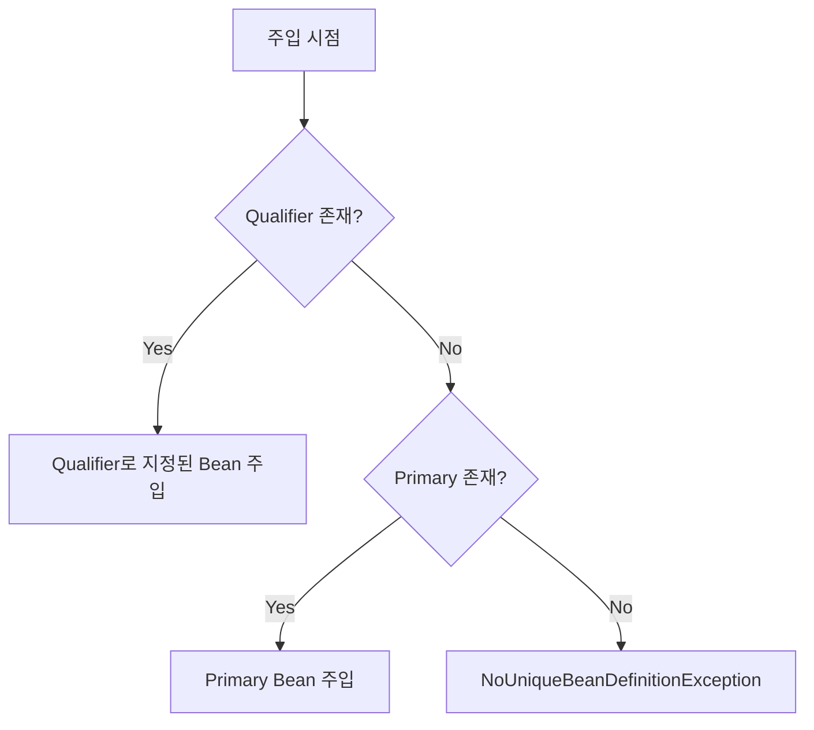

## 동일 Type Bean의 주입 문제

- Spring IoC container는 type을 기준으로 의존성을 자동 주입(autowiring)합니다.
    - 동일한 type의 bean이 여러 개 등록되어 있으면, Spring은 어떤 bean을 주입해야 할지 결정할 수 없습니다.
    - `NoUniqueBeanDefinitionException`이 발생하며 application context 초기화에 실패합니다.

```java
public interface MessageSender {
    void send(String message);
}

@Component
public class EmailSender implements MessageSender {
    @Override
    public void send(String message) {
        // email 전송 logic
    }
}

@Component
public class SmsSender implements MessageSender {
    @Override
    public void send(String message) {
        // SMS 전송 logic
    }
}
```

- `MessageSender` interface를 구현한 `EmailSender`와 `SmsSender` 두 개의 bean이 존재합니다.
- `MessageSender` type으로 의존성을 주입받으려 하면 Spring은 둘 중 어느 것을 선택해야 할지 알 수 없습니다.

```java
@Service
public class NotificationService {

    private final MessageSender messageSender;

    public NotificationService(MessageSender messageSender) {
        // NoUniqueBeanDefinitionException 발생
        this.messageSender = messageSender;
    }
}
```

- `@Primary`와 `@Qualifier`는 이 문제를 해결하는 두 가지 방식입니다.
    - `@Primary` : bean 정의 시점에 기본값을 지정합니다.
    - `@Qualifier` : 주입 시점에 특정 bean을 명시적으로 선택합니다.


---


## @Primary : 기본 Bean 지정

- `@Primary` annotation은 동일 type의 bean 중 **기본으로 주입될 bean을 지정**합니다.
    - bean 정의 시점에 선언하며, `@Qualifier`가 명시되지 않은 모든 주입 지점에서 해당 bean이 선택됩니다.
    - 대부분의 경우 하나의 구현체를 사용하고, 특수한 경우에만 다른 구현체가 필요할 때 유용합니다.

```java
@Component
@Primary
public class EmailSender implements MessageSender {
    @Override
    public void send(String message) {
        // email 전송 logic
    }
}

@Component
public class SmsSender implements MessageSender {
    @Override
    public void send(String message) {
        // SMS 전송 logic
    }
}
```

- `EmailSender`에 `@Primary`를 선언하면, `MessageSender` type 주입 시 `EmailSender`가 기본으로 선택됩니다.

```java
@Service
public class NotificationService {

    private final MessageSender messageSender;

    public NotificationService(MessageSender messageSender) {
        // EmailSender가 주입됨
        this.messageSender = messageSender;
    }
}
```


### @Primary의 특성

- **bean 정의 측에서 선언**합니다.
    - 주입받는 쪽이 아닌, bean을 제공하는 쪽에서 기본값 여부를 결정합니다.
    - bean 사용자는 별도 설정 없이 기본 bean을 주입받습니다.

- **동일 type에서 하나만 `@Primary`로 지정**할 수 있습니다.
    - 여러 bean에 `@Primary`를 선언하면 충돌이 발생합니다.
    - `NoUniqueBeanDefinitionException`과 동일한 문제가 발생합니다.

- **`@Bean` method와 `@Component` class 모두에 적용** 가능합니다.

```java
@Configuration
public class MessageConfig {

    @Bean
    @Primary
    public MessageSender emailSender() {
        return new EmailSender();
    }

    @Bean
    public MessageSender smsSender() {
        return new SmsSender();
    }
}
```


---


## @Qualifier : 명시적 Bean 선택

- `@Qualifier` annotation은 주입 시점에 **특정 bean을 명시적으로 지정**합니다.
    - bean의 이름이나 별도로 정의한 qualifier 값을 사용하여 원하는 bean을 선택합니다.
    - 여러 구현체를 상황에 따라 다르게 주입해야 할 때 유용합니다.

```java
@Service
public class NotificationService {

    private final MessageSender messageSender;

    public NotificationService(@Qualifier("smsSender") MessageSender messageSender) {
        // SmsSender가 주입됨
        this.messageSender = messageSender;
    }
}
```

- `@Qualifier("smsSender")`로 `SmsSender` bean을 명시적으로 지정했습니다.
    - 기본적으로 bean의 이름은 class 이름의 첫 글자를 소문자로 변환한 값입니다.
    - `SmsSender` class의 기본 bean 이름은 `smsSender`입니다.


### @Qualifier의 특성

- **주입받는 측에서 선언**합니다.
    - bean 정의와 독립적으로, 주입 지점마다 다른 bean을 선택할 수 있습니다.
    - 동일한 type이라도 상황에 따라 다른 구현체를 주입할 수 있습니다.

- **생성자, field, setter 주입 모두에 적용** 가능합니다.

```java
// field injection
@Service
public class NotificationService {

    @Autowired
    @Qualifier("smsSender")
    private MessageSender messageSender;
}

// setter injection
@Service
public class NotificationService {

    private MessageSender messageSender;

    @Autowired
    @Qualifier("smsSender")
    public void setMessageSender(MessageSender messageSender) {
        this.messageSender = messageSender;
    }
}
```


### Custom Qualifier 정의

- bean 이름 대신 **의미 있는 이름의 custom qualifier**를 정의하여 사용할 수 있습니다.
    - type safety와 가독성이 향상됩니다.
    - 문자열 오타로 인한 실수를 compile time에 방지할 수 있습니다.

```java
@Qualifier
@Retention(RetentionPolicy.RUNTIME)
@Target({ElementType.FIELD, ElementType.PARAMETER, ElementType.TYPE})
public @interface EmailType {
}

@Qualifier
@Retention(RetentionPolicy.RUNTIME)
@Target({ElementType.FIELD, ElementType.PARAMETER, ElementType.TYPE})
public @interface SmsType {
}
```

- custom qualifier annotation을 정의합니다.

```java
@Component
@EmailType
public class EmailSender implements MessageSender {
    @Override
    public void send(String message) {
        // email 전송 logic
    }
}

@Component
@SmsType
public class SmsSender implements MessageSender {
    @Override
    public void send(String message) {
        // SMS 전송 logic
    }
}
```

- bean 정의에 custom qualifier를 적용합니다.

```java
@Service
public class NotificationService {

    private final MessageSender messageSender;

    public NotificationService(@SmsType MessageSender messageSender) {
        this.messageSender = messageSender;
    }
}
```

- 문자열 대신 annotation type으로 bean을 선택하므로 안전합니다.


---


## @Primary와 @Qualifier의 우선순위

- `@Qualifier`가 `@Primary`보다 **우선순위가 높습니다**.
    - `@Primary`는 기본값을 정의하고, `@Qualifier`는 그 기본값을 override합니다.
    - `@Qualifier`가 명시된 주입 지점에서는 `@Primary` 설정이 무시됩니다.



- Spring이 bean을 선택하는 순서는 **`@Qualifier` > `@Primary` > 예외 발생**입니다.


### 함께 사용하는 전략

- `@Primary`로 기본 bean을 설정하고, **필요한 곳에서만 `@Qualifier`로 다른 bean을 주입**합니다.
    - 대부분의 경우 기본 구현체를 사용하고, 특수한 경우에만 명시적으로 다른 구현체를 선택합니다.
    - code의 중복을 줄이고, 유연성을 유지할 수 있습니다.

```java
@Component
@Primary
public class EmailSender implements MessageSender {
    // 기본 구현체
}

@Component
public class SmsSender implements MessageSender {
    // 대체 구현체
}
```

```java
@Service
public class DefaultNotificationService {

    private final MessageSender messageSender;

    public DefaultNotificationService(MessageSender messageSender) {
        // @Primary인 EmailSender 주입
        this.messageSender = messageSender;
    }
}

@Service
public class UrgentNotificationService {

    private final MessageSender messageSender;

    public UrgentNotificationService(@Qualifier("smsSender") MessageSender messageSender) {
        // @Qualifier로 SmsSender 명시적 주입
        this.messageSender = messageSender;
    }
}
```


---


## 실무 활용 사례

- `@Primary`와 `@Qualifier`는 multiple DataSource 환경, 환경별 구현체 교체, 전략 pattern 구현 등에서 자주 사용됩니다.
    - 하나의 interface에 여러 구현체가 존재하고, 상황에 따라 다른 구현체를 주입해야 하는 경우에 유용합니다.


### Multiple DataSource 환경

- 여러 database를 사용하는 환경에서 기본 `DataSource`를 `@Primary`로 지정합니다.
    - 대부분의 repository는 기본 `DataSource`를 사용합니다.
    - 특정 repository만 `@Qualifier`로 다른 `DataSource`를 주입받습니다.

```java
@Configuration
public class DataSourceConfig {

    @Bean
    @Primary
    public DataSource primaryDataSource() {
        // 주 database 연결
        return DataSourceBuilder.create()
            .url("jdbc:mysql://primary-db:3306/main")
            .build();
    }

    @Bean
    public DataSource analyticsDataSource() {
        // 분석용 database 연결
        return DataSourceBuilder.create()
            .url("jdbc:mysql://analytics-db:3306/analytics")
            .build();
    }
}
```

```java
@Repository
public class UserRepository {

    private final JdbcTemplate jdbcTemplate;

    public UserRepository(DataSource dataSource) {
        // primary DataSource 사용
        this.jdbcTemplate = new JdbcTemplate(dataSource);
    }
}

@Repository
public class AnalyticsRepository {

    private final JdbcTemplate jdbcTemplate;

    public AnalyticsRepository(@Qualifier("analyticsDataSource") DataSource dataSource) {
        // analytics DataSource 사용
        this.jdbcTemplate = new JdbcTemplate(dataSource);
    }
}
```


### 환경별 구현체 교체

- profile에 따라 다른 구현체를 기본값으로 설정하는 전략입니다.
    - 개발 환경에서는 mock 구현체를, 운영 환경에서는 실제 구현체를 사용합니다.

```java
@Component
@Profile("prod")
@Primary
public class RealPaymentGateway implements PaymentGateway {
    @Override
    public void pay(int amount) {
        // 실제 결제 처리
    }
}

@Component
@Profile("!prod")
@Primary
public class MockPaymentGateway implements PaymentGateway {
    @Override
    public void pay(int amount) {
        // mock 결제 처리 (logging만 수행)
    }
}
```

- 운영 환경(`prod`)에서는 `RealPaymentGateway`가, 그 외 환경에서는 `MockPaymentGateway`가 기본 bean이 됩니다.


### 전략 Pattern 구현

- 여러 전략 구현체 중 기본 전략을 `@Primary`로, 특정 상황에서는 `@Qualifier`로 선택합니다.

```java
public interface DiscountStrategy {
    int calculate(int price);
}

@Component
@Primary
public class NoDiscount implements DiscountStrategy {
    @Override
    public int calculate(int price) {
        return price;
    }
}

@Component("vipDiscount")
public class VipDiscount implements DiscountStrategy {
    @Override
    public int calculate(int price) {
        return (int) (price * 0.8);
    }
}

@Component("seasonalDiscount")
public class SeasonalDiscount implements DiscountStrategy {
    @Override
    public int calculate(int price) {
        return (int) (price * 0.9);
    }
}
```

```java
@Service
public class OrderService {

    private final DiscountStrategy defaultStrategy;
    private final DiscountStrategy vipStrategy;

    public OrderService(
            DiscountStrategy defaultStrategy,
            @Qualifier("vipDiscount") DiscountStrategy vipStrategy) {
        this.defaultStrategy = defaultStrategy;
        this.vipStrategy = vipStrategy;
    }

    public int calculatePrice(int price, boolean isVip) {
        return isVip
            ? vipStrategy.calculate(price)
            : defaultStrategy.calculate(price);
    }
}
```


---


## @Primary vs @Qualifier 선택 기준

| 기준 | @Primary | @Qualifier |
| --- | --- | --- |
| 선언 위치 | bean 정의 측 | 주입받는 측 |
| 사용 시점 | 대부분 하나의 구현체를 사용할 때 | 상황별로 다른 구현체가 필요할 때 |
| 유연성 | 낮음 (전역 기본값) | 높음 (개별 주입점 제어) |
| Code 중복 | 적음 (기본값 자동 주입) | 많을 수 있음 (매번 명시 필요) |
| 우선순위 | 낮음 | 높음 (@Primary를 override) |

- 두 annotation은 상호 배타적이지 않으며, **함께 사용하는 것이 가장 효과적**입니다.
    - `@Primary`로 합리적인 기본값을 제공합니다.
    - 특수한 경우에만 `@Qualifier`로 명시적 선택을 합니다.
    - 이 조합으로 code 중복을 줄이면서도 유연성을 확보할 수 있습니다.


---


## Reference

- <https://docs.spring.io/spring-framework/reference/core/beans/annotation-config/autowired-qualifiers.html>
- <https://www.baeldung.com/spring-qualifier-annotation>
- <https://www.baeldung.com/spring-primary>

