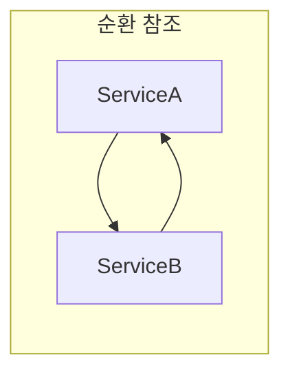
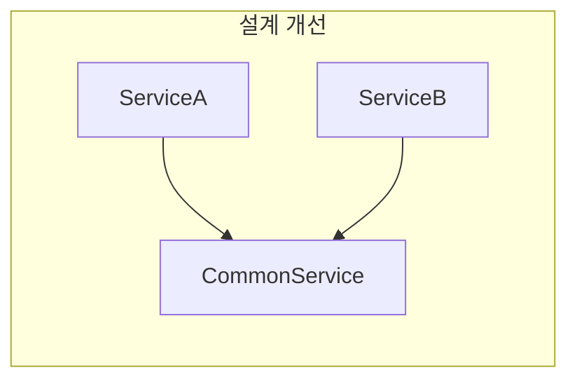

## Spring 의존성 주입 방식

- Spring은 **생성자 주입, field 주입, 수정자 주입** 세 가지 의존성 주입 방식을 지원합니다.
    - 각 방식은 의존성을 주입받는 시점과 방법이 다릅니다.
    - Spring team은 **생성자 주입을 공식적으로 권장**합니다.

| 방식 | 주입 시점 | final 선언 | 순환 참조 감지 | 권장 여부 |
| --- | --- | --- | --- | --- |
| 생성자 주입 | 객체 생성 시 | 가능 | 즉시 감지 | 권장 |
| Field 주입 | 객체 생성 후 | 불가능 | 지연 감지 | 비권장 |
| 수정자 주입 | 객체 생성 후 | 불가능 | 지연 감지 | 선택적 의존성에 한해 사용 |


---


## 생성자 주입

- **가장 권장되는 방식**으로, 생성자 parameter를 통해 의존성을 주입받습니다.
    - Spring 4.3부터 단일 생성자인 경우 `@Autowired`를 생략할 수 있습니다.
    - 객체 생성과 동시에 의존성 주입이 완료되어 완전한 상태의 객체가 보장됩니다.

```java
@Service
public class OrderService {

    private final OrderRepository orderRepository;
    private final PaymentService paymentService;

    public OrderService(OrderRepository orderRepository, PaymentService paymentService) {
        this.orderRepository = orderRepository;
        this.paymentService = paymentService;
    }
}
```


### 생성자 주입의 장점

- **불변성 보장** : 의존성을 `final`로 선언할 수 있습니다.
    - 객체 생성 이후 의존성이 변경되지 않음을 compile time에 보장합니다.
    - 실수로 의존성을 재할당하는 것을 방지합니다.

- **필수 의존성 명시** : 생성자 parameter로 필수 의존성이 명확히 드러납니다.
    - 의존성이 누락되면 compile time에 오류가 발생합니다.
    - 객체가 불완전한 상태로 생성되는 것을 방지합니다.

- **순환 참조 조기 발견** : application 시작 시점에 순환 참조를 감지합니다.
    - 생성자 주입은 bean 생성 시 의존 bean을 먼저 찾아야 하므로, 순환 참조가 있으면 즉시 실패합니다.
    - field 주입이나 수정자 주입은 runtime에 순환 참조가 발견되어 문제 파악이 늦어집니다.

- **Test 용이성** : Spring container 없이도 의존성을 주입할 수 있습니다.
    - 단위 test에서 mock 객체를 생성자에 직접 전달할 수 있습니다.
    - Mockito의 `@InjectMocks` 없이도 순수 Java code로 test가 가능합니다.

```java
@Test
void testPlaceOrder() {
    // Spring container 없이 직접 의존성 주입
    OrderRepository mockRepository = mock(OrderRepository.class);
    PaymentService mockPayment = mock(PaymentService.class);

    OrderService orderService = new OrderService(mockRepository, mockPayment);

    // test 수행
}
```


### Lombok을 활용한 간결한 작성

- `@RequiredArgsConstructor`를 사용하면 `final` field에 대한 생성자가 자동 생성됩니다.
    - boilerplate code를 줄이면서 생성자 주입의 장점을 유지합니다.

```java
@Service
@RequiredArgsConstructor
public class OrderService {

    private final OrderRepository orderRepository;
    private final PaymentService paymentService;
}
```

- Lombok이 compile time에 생성하는 code는 직접 작성한 생성자와 동일합니다.


---


## Field 주입

- field에 `@Autowired` annotation을 선언하여 의존성을 주입받는 방식입니다.
    - code가 가장 간결하지만, 여러 단점으로 인해 **비권장**됩니다.
    - 주로 legacy code나 간단한 prototype에서 볼 수 있습니다.

```java
@Service
public class OrderService {

    @Autowired
    private OrderRepository orderRepository;

    @Autowired
    private PaymentService paymentService;
}
```


### Field 주입의 단점

- **`final` 선언 불가** : field 주입은 객체 생성 후에 주입되므로 `final`을 사용할 수 없습니다.
    - 불변성이 보장되지 않아 의존성이 변경될 위험이 있습니다.

- **숨겨진 의존성** : 의존성이 class 내부에 숨겨져 외부에서 파악하기 어렵습니다.
    - 생성자 signature를 보면 의존성을 알 수 있는 생성자 주입과 달리, field 주입은 class 내부를 봐야 합니다.
    - 의존성이 많아져도 눈에 잘 띄지 않아 SRP(Single Responsibility Principle) 위반을 감지하기 어렵습니다.

- **Test 어려움** : Spring container 없이는 의존성을 주입할 방법이 없습니다.
    - reflection을 사용하거나 Mockito의 `@InjectMocks`가 필요합니다.
    - 순수 Java code만으로 test하기 어렵습니다.

```java
@ExtendWith(MockitoExtension.class)
class OrderServiceTest {

    @Mock
    private OrderRepository orderRepository;

    @Mock
    private PaymentService paymentService;

    @InjectMocks
    private OrderService orderService;

    // reflection 기반으로 의존성 주입
}
```

- **순환 참조 지연 감지** : application이 정상 시작된 후 runtime에 순환 참조 문제가 발생할 수 있습니다.
    - 특정 method가 호출될 때까지 문제가 드러나지 않습니다.


---


## 수정자 주입

- setter method에 `@Autowired`를 선언하여 의존성을 주입받는 방식입니다.
    - **선택적 의존성(optional dependency)**에 적합합니다.
    - 필수 의존성에는 생성자 주입을 사용하고, 선택적 의존성에만 수정자 주입을 사용합니다.

```java
@Service
public class OrderService {

    private OrderRepository orderRepository;
    private NotificationService notificationService;

    // 필수 의존성은 생성자 주입
    public OrderService(OrderRepository orderRepository) {
        this.orderRepository = orderRepository;
    }

    // 선택적 의존성은 수정자 주입
    @Autowired(required = false)
    public void setNotificationService(NotificationService notificationService) {
        this.notificationService = notificationService;
    }
}
```


### 수정자 주입의 특징

- **선택적 의존성 표현** : `required = false` 옵션으로 해당 bean이 없어도 application이 정상 시작됩니다.
    - 특정 기능이 있으면 사용하고 없으면 무시하는 pattern에 적합합니다.

- **runtime 의존성 변경** : 객체 생성 후에도 setter를 통해 의존성을 변경할 수 있습니다.
    - 유연하지만 불변성을 해치므로 신중하게 사용해야 합니다.

- **`final` 선언 불가** : field 주입과 마찬가지로 `final`을 사용할 수 없습니다.


### 수정자 주입 사용 시 주의 사항

- **필수 의존성에는 사용하지 않습니다**.
    - setter가 호출되지 않으면 의존성이 null인 상태로 객체가 사용될 수 있습니다.
    - `NullPointerException`이 runtime에 발생할 위험이 있습니다.

- **생성자 주입과 조합**하여 사용합니다.
    - 필수 의존성은 생성자로, 선택적 의존성은 setter로 주입합니다.

```java
@Service
public class ReportService {

    private final DataSource dataSource;  // 필수
    private CacheService cacheService;    // 선택

    public ReportService(DataSource dataSource) {
        this.dataSource = dataSource;
    }

    @Autowired(required = false)
    public void setCacheService(CacheService cacheService) {
        this.cacheService = cacheService;
    }

    public Report generate() {
        if (cacheService != null) {
            // cache 사용
        }
        // report 생성
    }
}
```


---


## 순환 참조 문제

- 순환 참조는 **두 개 이상의 bean이 서로를 의존**하는 상황입니다.
    - A가 B를 의존하고, B가 A를 의존하면 순환 참조가 발생합니다.
    - 순환 참조는 설계상의 문제를 나타내므로 해결이 필요합니다.


### 주입 방식에 따른 순환 참조 감지 시점

- **생성자 주입** : application 시작 시점에 즉시 감지됩니다.
    - bean 생성 순서를 결정할 수 없어 `BeanCurrentlyInCreationException`이 발생합니다.
    - 문제를 조기에 발견하여 설계를 개선할 기회를 제공합니다.

```java
@Component
public class ServiceA {
    public ServiceA(ServiceB serviceB) { }  // ServiceB 필요
}

@Component
public class ServiceB {
    public ServiceB(ServiceA serviceA) { }  // ServiceA 필요
}

// application 시작 시 실패
```

- **Field 주입 / 수정자 주입** : application이 정상 시작되고 runtime에 문제가 발생할 수 있습니다.
    - Spring은 proxy를 통해 순환 참조를 일시적으로 해결하지만, 실제 method 호출 시 문제가 발생합니다.
    - Spring Boot 2.6부터는 기본적으로 순환 참조를 금지합니다.


### 순환 참조 해결 방법

- **설계 개선** : 순환 참조가 발생하면 책임 분리가 잘못된 것입니다.
    - 공통 logic을 별도 class로 추출합니다.
    - interface를 도입하여 의존 방향을 단방향으로 변경합니다.





- **`@Lazy` 사용** : 의존성 주입을 지연시켜 순환 참조를 우회합니다.
    - 근본적인 해결책이 아니므로 임시 방편으로만 사용합니다.

```java
@Component
public class ServiceA {
    public ServiceA(@Lazy ServiceB serviceB) { }
}
```


---


## 권장 사항 정리

- **생성자 주입을 기본으로 사용합니다**.
    - 불변성, 필수 의존성 명시, test 용이성 등 모든 면에서 우수합니다.
    - Lombok의 `@RequiredArgsConstructor`로 간결하게 작성합니다.

- **Field 주입은 피합니다**.
    - test가 어렵고 의존성이 숨겨지는 단점이 있습니다.
    - legacy code에서만 볼 수 있는 방식입니다.

- **수정자 주입은 선택적 의존성에만 사용합니다**.
    - `required = false`와 함께 사용하여 optional한 기능을 표현합니다.
    - 필수 의존성은 반드시 생성자 주입을 사용합니다.

- **순환 참조가 발생하면 설계를 재검토합니다**.
    - `@Lazy`로 우회하기보다 책임 분리를 통해 근본적으로 해결합니다.


---


## Reference

- <https://docs.spring.io/spring-framework/reference/core/beans/dependencies/factory-collaborators.html>
- <https://docs.spring.io/spring-framework/reference/core/beans/dependencies/factory-autowire.html>

