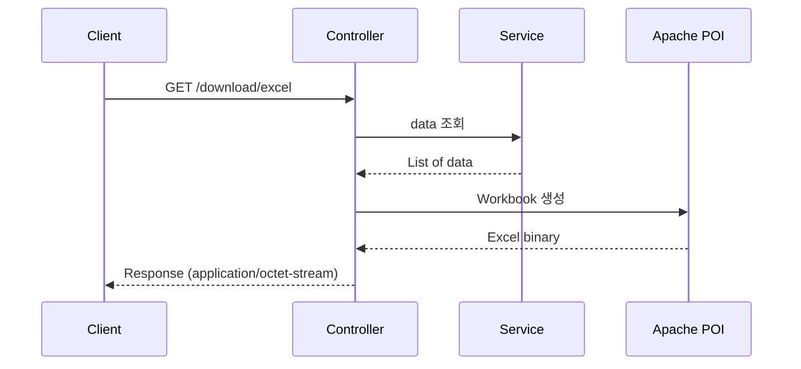

## Excel Download 구조

- web application에서 Excel download는 server에서 Excel file을 생성하고, HTTP response body에 binary data로 전달하는 방식입니다.
    - Apache POI library를 사용하여 Excel file을 생성합니다.
    - response header에 `Content-Type`과 `Content-Disposition`을 설정하여 browser가 file로 download하도록 합니다.




---


## Controller 구현

- controller에서 `Workbook`을 생성하고, `ByteArrayOutputStream`으로 변환하여 response body에 담습니다.

```java
@RestController
public class ExcelDownloadController {

    @GetMapping("/download/excel")
    public ResponseEntity<byte[]> downloadExcel() throws IOException {
        Workbook workbook = createExcelFile();

        ByteArrayOutputStream outputStream = new ByteArrayOutputStream();
        workbook.write(outputStream);
        workbook.close();

        HttpHeaders headers = new HttpHeaders();
        headers.setContentType(MediaType.APPLICATION_OCTET_STREAM);
        headers.setContentDispositionFormData("attachment", "data.xlsx");

        return ResponseEntity.ok()
                .headers(headers)
                .body(outputStream.toByteArray());
    }
}
```

- `Content-Type`을 `application/octet-stream`으로 설정하면 browser가 file download로 처리합니다.
- `Content-Disposition`의 `attachment` option은 browser에게 inline 표시가 아닌 file 저장을 유도합니다.


### File Name Encoding

- file name에 한글이 포함되면 browser에 따라 깨질 수 있으므로 UTF-8로 encoding합니다.

```java
String fileName = URLEncoder.encode("사용자목록.xlsx", StandardCharsets.UTF_8)
        .replaceAll("\\+", "%20");
headers.setContentDispositionFormData("attachment", fileName);
```


---


## Excel File 생성

- Apache POI의 `Workbook`, `Sheet`, `Row`, `Cell` 객체를 사용하여 Excel file을 생성합니다.

```java
private Workbook createExcelFile() {
    Workbook workbook = new XSSFWorkbook();
    Sheet sheet = workbook.createSheet("사용자 목록");

    // header row 생성
    Row headerRow = sheet.createRow(0);
    headerRow.createCell(0).setCellValue("이름");
    headerRow.createCell(1).setCellValue("Email");
    headerRow.createCell(2).setCellValue("가입일");

    // data row 생성
    List<User> users = userService.findAll();
    for (int i = 0; i < users.size(); i++) {
        Row row = sheet.createRow(i + 1);
        User user = users.get(i);
        row.createCell(0).setCellValue(user.getName());
        row.createCell(1).setCellValue(user.getEmail());
        row.createCell(2).setCellValue(user.getCreatedAt().toString());
    }

    return workbook;
}
```


### Cell Style 적용

- header에 배경색, 글꼴, 정렬 등의 style을 적용합니다.

```java
CellStyle headerStyle = workbook.createCellStyle();
headerStyle.setFillForegroundColor(IndexedColors.GREY_25_PERCENT.getIndex());
headerStyle.setFillPattern(FillPatternType.SOLID_FOREGROUND);

Font headerFont = workbook.createFont();
headerFont.setBold(true);
headerStyle.setFont(headerFont);

for (int i = 0; i < headerRow.getLastCellNum(); i++) {
    headerRow.getCell(i).setCellStyle(headerStyle);
}
```


---


## 대용량 Excel 처리

- `XSSFWorkbook`은 모든 data를 memory에 올리므로, 대량의 data를 처리하면 `OutOfMemoryError`가 발생합니다.
    - 10만 건 이상의 data를 처리할 때는 `SXSSFWorkbook`을 사용합니다.

- `SXSSFWorkbook`은 streaming 방식으로, 지정된 row 수만 memory에 유지하고 나머지는 disk에 임시 저장합니다.
    - 기본값은 100개 row를 memory에 유지합니다.
    - memory 사용량이 data 크기에 비례하지 않고 일정하게 유지됩니다.

```java
private Workbook createLargeExcelFile() {
    SXSSFWorkbook workbook = new SXSSFWorkbook(100);  // 100개 row만 memory에 유지
    Sheet sheet = workbook.createSheet("대용량 데이터");

    Row headerRow = sheet.createRow(0);
    headerRow.createCell(0).setCellValue("ID");
    headerRow.createCell(1).setCellValue("값");

    for (int i = 0; i < 500000; i++) {
        Row row = sheet.createRow(i + 1);
        row.createCell(0).setCellValue(i + 1);
        row.createCell(1).setCellValue("data-" + (i + 1));
    }

    return workbook;
}
```

- `SXSSFWorkbook` 사용 후에는 반드시 `dispose()`를 호출하여 임시 file을 정리합니다.

```java
ByteArrayOutputStream outputStream = new ByteArrayOutputStream();
workbook.write(outputStream);
((SXSSFWorkbook) workbook).dispose();
workbook.close();
```

| 구분 | `XSSFWorkbook` | `SXSSFWorkbook` |
| --- | --- | --- |
| memory 사용 | 전체 data를 memory에 적재 | 지정된 row 수만 memory에 유지 |
| 쓰기 성능 | data 크기에 비례하여 느려짐 | 일정한 성능 유지 |
| 읽기 지원 | 읽기, 쓰기 모두 지원 | 쓰기 전용 |
| 적합한 상황 | 소규모 data (수천 건 이하) | 대규모 data (수만 건 이상) |


---


## StreamingResponseBody

- `ByteArrayOutputStream`은 전체 Excel data를 memory에 담아두므로, 대용량 file에서는 memory 부담이 커집니다.
    - `StreamingResponseBody`를 사용하면 response output stream에 직접 쓰기 때문에 memory 사용을 줄입니다.

```java
@GetMapping("/download/excel")
public ResponseEntity<StreamingResponseBody> downloadExcel() {
    StreamingResponseBody body = outputStream -> {
        SXSSFWorkbook workbook = new SXSSFWorkbook(100);
        Sheet sheet = workbook.createSheet("데이터");

        // data 생성 logic

        workbook.write(outputStream);
        workbook.dispose();
        workbook.close();
    };

    HttpHeaders headers = new HttpHeaders();
    headers.setContentType(MediaType.APPLICATION_OCTET_STREAM);
    headers.setContentDispositionFormData("attachment", "data.xlsx");

    return ResponseEntity.ok()
            .headers(headers)
            .body(body);
}
```


---


## Reference

- <https://poi.apache.org/components/spreadsheet/>
- <https://poi.apache.org/components/spreadsheet/how-to.html#sxssf>

