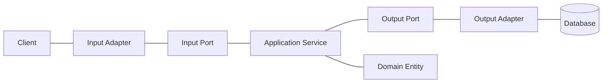
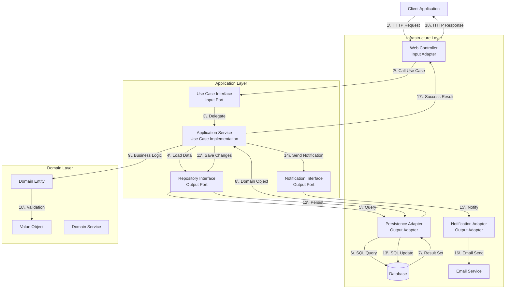
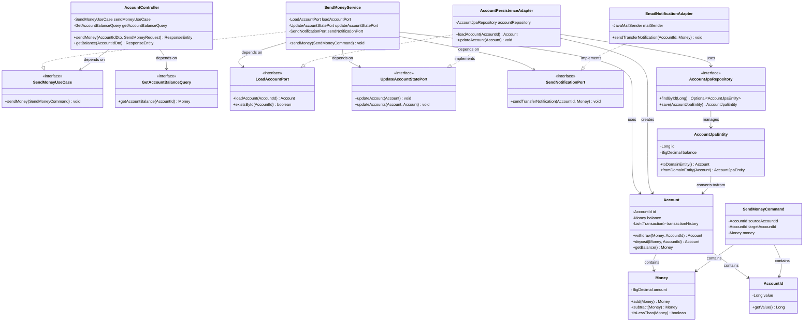

## Spring Boot로 Hexagonal Architecture 구현하기



- **Java**와 **Spring Boot**는 Hexagonal Architecture를 적용하기에 적합한 도구입니다.
- **dependency injection과 port/adapter pattern을 조합**하여 의존성 역전 원칙을 실현하고, test 가능성을 극대화합니다.
- 각 계층의 **책임을 명확히 분리**하여 유지 보수성(maintainability)과 확장성(extensibility)을 확보합니다.


---


## Hexagonal Architecture에서의 요청 처리 흐름

- Hexagonal Architecture에서는 API 요청부터 응답까지, 객체 간 통신 과정에 port와 adapter를 활용하여 **의존성 방향과 data 흐름**을 제어합니다.




---


## 핵심 원칙과 Spring Boot 적용 전략

- Hexagonal Architecture의 **의존성 방향 규칙**을 Spring container의 dependency injection으로 구현합니다.
    - domain layer는 framework에 대한 의존성을 갖지 않고 순수한 business logic만 포함합니다.
    - application layer는 **use case 중심**으로 설계하여 business workflow를 조정합니다.
    - adapter layer는 Spring annotation을 활용하여 외부 system과의 연동을 담당합니다.

- **port interface와 adapter 구현체의 분리**를 통해 compile time dependency를 제거합니다.
    - input port는 use case interface로 정의하고, application service가 구현합니다.
    - output port는 repository나 external service interface로 정의하고, adapter가 구현합니다.
    - Spring의 `@Component`, `@Service`, `@Repository` annotation으로 runtime에 의존성을 주입합니다.

- **module 구조**를 활용하여 architecture constraint를 강제합니다.
    - domain module은 외부 의존성 없이 독립적으로 구성합니다.
    - application module은 domain에만 의존하도록 제한합니다.
    - infrastructure module에서 Spring Boot와 외부 library를 관리합니다.


---


## Package 구조와 Module 설계

- **3-layer modular architecture**로 의존성 방향을 물리적으로 제어합니다.
- 각 module은 **명확한 책임**을 가지고, 다른 module과는 다른 module의 interface를 통해서만 소통합니다.

```
📦 hexagonal-banking-app
├── 📂 domain/
│   ├── 📄 Account.java
│   ├── 📄 Money.java
│   └── 📄 TransactionHistory.java
├── 📂 application/
│   ├── 📂 port/
│   │   ├── 📂 in/
│   │   │   ├── 📄 SendMoneyUseCase.java
│   │   │   └── 📄 GetAccountBalanceQuery.java
│   │   └── 📂 out/
│   │       ├── 📄 LoadAccountPort.java
│   │       ├── 📄 UpdateAccountStatePort.java
│   │       └── 📄 SendNotificationPort.java
│   ├── 📂 service/
│   │   ├── 📄 SendMoneyService.java
│   │   └── 📄 GetAccountBalanceService.java
│   └── 📂 command/
│       ├── 📄 SendMoneyCommand.java
│       └── 📄 GetAccountBalanceQuery.java
└── 📂 infrastructure/
    ├── 📂 adapter/
    │   ├── 📂 in/
    │   │   └── 📂 web/
    │   │       ├── 📄 AccountController.java
    │   │       └── 📂 dto/
    │   │           ├── 📄 SendMoneyRequest.java
    │   │           └── 📄 AccountBalanceResponse.java
    │   └── 📂 out/
    │       ├── 📂 persistence/
    │       │   ├── 📄 AccountPersistenceAdapter.java
    │       │   ├── 📄 AccountJpaRepository.java
    │       │   └── 📄 AccountJpaEntity.java
    │       └── 📂 notification/
    │           └── 📄 EmailNotificationAdapter.java
    └── 📂 configuration/
        └── 📄 BeanConfiguration.java
```


### Gradle Module 설정

```gradle
// settings.gradle
rootProject.name = 'hexagonal-banking-app'
include 'domain'
include 'application'
include 'infrastructure'

// domain/build.gradle
dependencies {
    // domain은 어떤 외부 라이브러리도 의존하지 않음
}

// application/build.gradle
dependencies {
    implementation project(':domain')
    // Spring 없이 순수 Java만 사용
}

// infrastructure/build.gradle
dependencies {
    implementation project(':domain')
    implementation project(':application')
    implementation 'org.springframework.boot:spring-boot-starter-web'
    implementation 'org.springframework.boot:spring-boot-starter-data-jpa'
    implementation 'com.h2database:h2'
}
```


### Class Diagram




---


## 1. Domain Layer 구현

- **순수한 business logic**만 포함하고 framework 의존성을 완전히 배제합니다.
- **rich domain model**로 설계하여 domain object가 자신의 business rule을 직접 관리합니다.


### Domain Entity

```java
// Account.java
public class Account {
    private final AccountId id;
    private final Money balance;
    private final List<Transaction> transactionHistory;
    
    public Account(AccountId id, Money balance, List<Transaction> transactionHistory) {
        this.id = id;
        this.balance = balance;
        this.transactionHistory = new ArrayList<>(transactionHistory);
        
        validateAccount();
    }
    
    public Money withdraw(Money amount, AccountId targetAccountId) {
        validateWithdrawal(amount);
        
        Money newBalance = balance.subtract(amount);
        Transaction transaction = Transaction.withdrawal(amount, targetAccountId);
        
        return createNewAccountState(newBalance, transaction);
    }
    
    public Money deposit(Money amount, AccountId sourceAccountId) {
        Money newBalance = balance.add(amount);
        Transaction transaction = Transaction.deposit(amount, sourceAccountId);
        
        return createNewAccountState(newBalance, transaction);
    }
    
    private void validateWithdrawal(Money amount) {
        if (balance.isLessThan(amount)) {
            throw new InsufficientBalanceException(
                "잔액이 부족합니다. 현재 잔액: " + balance + ", 출금 요청: " + amount
            );
        }
        
        if (amount.isNegativeOrZero()) {
            throw new InvalidAmountException("출금 금액은 0보다 커야 합니다.");
        }
    }
    
    private Money createNewAccountState(Money newBalance, Transaction transaction) {
        List<Transaction> newHistory = new ArrayList<>(transactionHistory);
        newHistory.add(transaction);
        
        return new Account(id, newBalance, newHistory);
    }
    
    private void validateAccount() {
        if (id == null) {
            throw new IllegalArgumentException("계정 ID는 null일 수 없습니다.");
        }
        if (balance == null) {
            throw new IllegalArgumentException("잔액 정보는 null일 수 없습니다.");
        }
    }
    
    // getter
    public AccountId getId() { return id; }
    public Money getBalance() { return balance; }
    public List<Transaction> getTransactionHistory() { 
        return Collections.unmodifiableList(transactionHistory); 
    }
}
```


### Value Object

```java
// Money.java
public class Money {
    private final BigDecimal amount;
    
    public Money(BigDecimal amount) {
        if (amount == null) {
            throw new IllegalArgumentException("금액은 null일 수 없습니다.");
        }
        if (amount.scale() > 2) {
            throw new IllegalArgumentException("금액은 소수점 둘째 자리까지만 허용됩니다.");
        }
        this.amount = amount.setScale(2, RoundingMode.HALF_UP);
    }
    
    public static Money of(double amount) {
        return new Money(BigDecimal.valueOf(amount));
    }
    
    public static Money zero() {
        return new Money(BigDecimal.ZERO);
    }
    
    public Money add(Money other) {
        return new Money(this.amount.add(other.amount));
    }
    
    public Money subtract(Money other) {
        return new Money(this.amount.subtract(other.amount));
    }
    
    public boolean isLessThan(Money other) {
        return amount.compareTo(other.amount) < 0;
    }
    
    public boolean isNegativeOrZero() {
        return amount.compareTo(BigDecimal.ZERO) <= 0;
    }
    
    @Override
    public boolean equals(Object obj) {
        if (this == obj) return true;
        if (obj == null || getClass() != obj.getClass()) return false;
        Money money = (Money) obj;
        return Objects.equals(amount, money.amount);
    }
    
    @Override
    public int hashCode() {
        return Objects.hash(amount);
    }
    
    @Override
    public String toString() {
        return amount.toString();
    }
    
    public BigDecimal getAmount() { return amount; }
}
```


### Domain Exception

```java
// InsufficientBalanceException.java
public class InsufficientBalanceException extends DomainException {
    public InsufficientBalanceException(String message) {
        super(message);
    }
}

// DomainException.java
public abstract class DomainException extends RuntimeException {
    protected DomainException(String message) {
        super(message);
    }
    
    protected DomainException(String message, Throwable cause) {
        super(message, cause);
    }
}
```


---


## 2. Application Layer 구현

- **use case 중심**으로 business workflow를 구성하고 domain logic을 조정합니다.
- **port interface를 통해 외부 의존성을 추상화**하여 testability를 확보합니다.


### Input Port Interface

```java
// SendMoneyUseCase.java
public interface SendMoneyUseCase {
    void sendMoney(SendMoneyCommand command);
}

// GetAccountBalanceQuery.java
public interface GetAccountBalanceQuery {
    Money getAccountBalance(AccountId accountId);
}
```


### Command와 Query Object

```java
// SendMoneyCommand.java
public class SendMoneyCommand {
    private final AccountId sourceAccountId;
    private final AccountId targetAccountId;
    private final Money money;
    
    public SendMoneyCommand(AccountId sourceAccountId, AccountId targetAccountId, Money money) {
        this.sourceAccountId = Objects.requireNonNull(sourceAccountId);
        this.targetAccountId = Objects.requireNonNull(targetAccountId);
        this.money = Objects.requireNonNull(money);
        
        validateCommand();
    }
    
    private void validateCommand() {
        if (sourceAccountId.equals(targetAccountId)) {
            throw new IllegalArgumentException("송금 계정과 수신 계정은 같을 수 없습니다.");
        }
        if (money.isNegativeOrZero()) {
            throw new IllegalArgumentException("송금 금액은 0보다 커야 합니다.");
        }
    }
    
    // getter
    public AccountId getSourceAccountId() { return sourceAccountId; }
    public AccountId getTargetAccountId() { return targetAccountId; }
    public Money getMoney() { return money; }
}
```


### Output Port Interface

```java
// LoadAccountPort.java
public interface LoadAccountPort {
    Account loadAccount(AccountId accountId);
    boolean existsById(AccountId accountId);
}

// UpdateAccountStatePort.java
public interface UpdateAccountStatePort {
    void updateAccount(Account account);
    void updateAccounts(Account sourceAccount, Account targetAccount);
}

// SendNotificationPort.java
public interface SendNotificationPort {
    void sendTransferNotification(AccountId accountId, Money amount);
}
```


### Application Service 구현

```java
// SendMoneyService.java
public class SendMoneyService implements SendMoneyUseCase {
    
    private final LoadAccountPort loadAccountPort;
    private final UpdateAccountStatePort updateAccountStatePort;
    private final SendNotificationPort sendNotificationPort;
    
    public SendMoneyService(
            LoadAccountPort loadAccountPort,
            UpdateAccountStatePort updateAccountStatePort,
            SendNotificationPort sendNotificationPort) {
        this.loadAccountPort = loadAccountPort;
        this.updateAccountStatePort = updateAccountStatePort;
        this.sendNotificationPort = sendNotificationPort;
    }
    
    @Override
    public void sendMoney(SendMoneyCommand command) {
        validateAccountsExist(command);
        
        Account sourceAccount = loadAccountPort.loadAccount(command.getSourceAccountId());
        Account targetAccount = loadAccountPort.loadAccount(command.getTargetAccountId());
        
        Account updatedSourceAccount = sourceAccount.withdraw(
            command.getMoney(), 
            command.getTargetAccountId()
        );
        Account updatedTargetAccount = targetAccount.deposit(
            command.getMoney(), 
            command.getSourceAccountId()
        );
        
        updateAccountStatePort.updateAccounts(updatedSourceAccount, updatedTargetAccount);
        
        sendNotificationPort.sendTransferNotification(
            command.getTargetAccountId(), 
            command.getMoney()
        );
    }
    
    private void validateAccountsExist(SendMoneyCommand command) {
        if (!loadAccountPort.existsById(command.getSourceAccountId())) {
            throw new AccountNotFoundException(
                "송금 계정을 찾을 수 없습니다: " + command.getSourceAccountId()
            );
        }
        if (!loadAccountPort.existsById(command.getTargetAccountId())) {
            throw new AccountNotFoundException(
                "수신 계정을 찾을 수 없습니다: " + command.getTargetAccountId()
            );
        }
    }
}
```


---


## 3. Infrastructure Layer - Input Adapter

- **REST API를 통한 외부 요청**을 받아 application layer로 위임합니다.
- **Spring MVC annotation**을 활용하여 HTTP 요청을 처리하고 적절한 응답을 생성합니다.


### Web Controller

```java
// AccountController.java
@RestController
@RequestMapping("/api/v1/accounts")
@Validated
public class AccountController {
    
    private final SendMoneyUseCase sendMoneyUseCase;
    private final GetAccountBalanceQuery getAccountBalanceQuery;
    
    public AccountController(
            SendMoneyUseCase sendMoneyUseCase,
            GetAccountBalanceQuery getAccountBalanceQuery) {
        this.sendMoneyUseCase = sendMoneyUseCase;
        this.getAccountBalanceQuery = getAccountBalanceQuery;
    }
    
    @PostMapping("/{accountId}/send-money")
    public ResponseEntity<TransferResponse> sendMoney(
            @PathVariable @Valid AccountIdDto accountId,
            @RequestBody @Valid SendMoneyRequest request) {
        
        SendMoneyCommand command = SendMoneyCommand.builder()
            .sourceAccountId(accountId.toAccountId())
            .targetAccountId(request.getTargetAccountId().toAccountId())
            .money(Money.of(request.getAmount()))
            .build();
        
        sendMoneyUseCase.sendMoney(command);
        
        return ResponseEntity.ok(
            TransferResponse.success("송금이 성공적으로 완료되었습니다.")
        );
    }
    
    @GetMapping("/{accountId}/balance")
    public ResponseEntity<AccountBalanceResponse> getBalance(
            @PathVariable @Valid AccountIdDto accountId) {
        
        Money balance = getAccountBalanceQuery.getAccountBalance(accountId.toAccountId());
        
        return ResponseEntity.ok(
            AccountBalanceResponse.of(accountId, balance)
        );
    }
    
    @ExceptionHandler(InsufficientBalanceException.class)
    public ResponseEntity<ErrorResponse> handleInsufficientBalance(
            InsufficientBalanceException ex) {
        return ResponseEntity.badRequest()
            .body(ErrorResponse.of("INSUFFICIENT_BALANCE", ex.getMessage()));
    }
    
    @ExceptionHandler(AccountNotFoundException.class)
    public ResponseEntity<ErrorResponse> handleAccountNotFound(
            AccountNotFoundException ex) {
        return ResponseEntity.notFound()
            .build();
    }
}
```


### DTO Class

```java
// SendMoneyRequest.java
public class SendMoneyRequest {
    
    @NotNull(message = "수신 계정 ID는 필수입니다")
    private AccountIdDto targetAccountId;
    
    @NotNull(message = "송금 금액은 필수입니다")
    @DecimalMin(value = "0.01", message = "송금 금액은 0.01 이상이어야 합니다")
    @Digits(integer = 10, fraction = 2, message = "송금 금액은 정수 10자리, 소수 2자리까지 허용됩니다")
    private BigDecimal amount;
    
    protected SendMoneyRequest() {} // Jackson 용
    
    public SendMoneyRequest(AccountIdDto targetAccountId, BigDecimal amount) {
        this.targetAccountId = targetAccountId;
        this.amount = amount;
    }
    
    // getter and setter
    public AccountIdDto getTargetAccountId() { return targetAccountId; }
    public void setTargetAccountId(AccountIdDto targetAccountId) { 
        this.targetAccountId = targetAccountId; 
    }
    
    public BigDecimal getAmount() { return amount; }
    public void setAmount(BigDecimal amount) { this.amount = amount; }
}

// TransferResponse.java
public class TransferResponse {
    private final String status;
    private final String message;
    private final LocalDateTime timestamp;
    
    private TransferResponse(String status, String message) {
        this.status = status;
        this.message = message;
        this.timestamp = LocalDateTime.now();
    }
    
    public static TransferResponse success(String message) {
        return new TransferResponse("SUCCESS", message);
    }
    
    public static TransferResponse failure(String message) {
        return new TransferResponse("FAILURE", message);
    }
    
    // getter
    public String getStatus() { return status; }
    public String getMessage() { return message; }
    public LocalDateTime getTimestamp() { return timestamp; }
}
```


---


## 4. Infrastructure Layer - Output Adapter

- **database persistence**와 **external service 호출**을 담당합니다.
- **Spring Data JPA**를 활용하여 data access logic을 구현합니다.


### JPA Entity

```java
// AccountJpaEntity.java
@Entity
@Table(name = "accounts")
public class AccountJpaEntity {
    
    @Id
    private Long id;
    
    @Column(name = "balance", precision = 19, scale = 2, nullable = false)
    private BigDecimal balance;
    
    @Column(name = "created_at", nullable = false)
    private LocalDateTime createdAt;
    
    @Column(name = "updated_at")
    private LocalDateTime updatedAt;
    
    @OneToMany(mappedBy = "account", cascade = CascadeType.ALL, fetch = FetchType.LAZY)
    private List<TransactionJpaEntity> transactions = new ArrayList<>();
    
    protected AccountJpaEntity() {} // JPA 용
    
    public AccountJpaEntity(Long id, BigDecimal balance) {
        this.id = id;
        this.balance = balance;
        this.createdAt = LocalDateTime.now();
    }
    
    public Account toDomainEntity() {
        List<Transaction> domainTransactions = transactions.stream()
            .map(TransactionJpaEntity::toDomainEntity)
            .collect(Collectors.toList());
            
        return new Account(
            new AccountId(id),
            new Money(balance),
            domainTransactions
        );
    }
    
    public static AccountJpaEntity fromDomainEntity(Account account) {
        AccountJpaEntity entity = new AccountJpaEntity(
            account.getId().getValue(),
            account.getBalance().getAmount()
        );
        entity.updatedAt = LocalDateTime.now();
        return entity;
    }
    
    @PreUpdate
    protected void onUpdate() {
        updatedAt = LocalDateTime.now();
    }
    
    // getter and setter
    public Long getId() { return id; }
    public void setId(Long id) { this.id = id; }
    
    public BigDecimal getBalance() { return balance; }
    public void setBalance(BigDecimal balance) { this.balance = balance; }
    
    public LocalDateTime getCreatedAt() { return createdAt; }
    public LocalDateTime getUpdatedAt() { return updatedAt; }
    
    public List<TransactionJpaEntity> getTransactions() { return transactions; }
}
```


### JPA Repository

```java
// AccountJpaRepository.java
@Repository
public interface AccountJpaRepository extends JpaRepository<AccountJpaEntity, Long> {
    
    @Query("SELECT a FROM AccountJpaEntity a LEFT JOIN FETCH a.transactions WHERE a.id = :id")
    Optional<AccountJpaEntity> findByIdWithTransactions(@Param("id") Long id);
    
    @Modifying
    @Query("UPDATE AccountJpaEntity a SET a.balance = :balance, a.updatedAt = :updatedAt WHERE a.id = :id")
    int updateBalance(@Param("id") Long id, @Param("balance") BigDecimal balance, @Param("updatedAt") LocalDateTime updatedAt);
    
    boolean existsById(Long id);
}
```


### Persistence Adapter

```java
// AccountPersistenceAdapter.java
@Component
@Transactional(readOnly = true)
public class AccountPersistenceAdapter implements LoadAccountPort, UpdateAccountStatePort {
    
    private final AccountJpaRepository accountRepository;
    
    public AccountPersistenceAdapter(AccountJpaRepository accountRepository) {
        this.accountRepository = accountRepository;
    }
    
    @Override
    public Account loadAccount(AccountId accountId) {
        AccountJpaEntity entity = accountRepository
            .findByIdWithTransactions(accountId.getValue())
            .orElseThrow(() -> new AccountNotFoundException(
                "계정을 찾을 수 없습니다: " + accountId.getValue()
            ));
            
        return entity.toDomainEntity();
    }
    
    @Override
    public boolean existsById(AccountId accountId) {
        return accountRepository.existsById(accountId.getValue());
    }
    
    @Override
    @Transactional
    public void updateAccount(Account account) {
        AccountJpaEntity entity = AccountJpaEntity.fromDomainEntity(account);
        accountRepository.save(entity);
    }
    
    @Override
    @Transactional
    public void updateAccounts(Account sourceAccount, Account targetAccount) {
        // 동시성 문제를 방지하기 위해 ID 순서로 정렬하여 deadlock 방지
        List<Account> accounts = Arrays.asList(sourceAccount, targetAccount);
        accounts.sort(Comparator.comparing(account -> account.getId().getValue()));
        
        for (Account account : accounts) {
            updateAccount(account);
        }
    }
}
```


### External Service Adapter

```java
// EmailNotificationAdapter.java
@Component
public class EmailNotificationAdapter implements SendNotificationPort {
    
    private final JavaMailSender mailSender;
    private final NotificationProperties notificationProperties;
    
    public EmailNotificationAdapter(
            JavaMailSender mailSender,
            NotificationProperties notificationProperties) {
        this.mailSender = mailSender;
        this.notificationProperties = notificationProperties;
    }
    
    @Override
    @Async("notificationExecutor")
    public void sendTransferNotification(AccountId accountId, Money amount) {
        try {
            MimeMessage message = createTransferNotificationEmail(accountId, amount);
            mailSender.send(message);
            
            log.info("송금 알림이 전송되었습니다. 계정: {}, 금액: {}", accountId, amount);
        } catch (Exception e) {
            log.error("송금 알림 전송 실패. 계정: {}, 금액: {}", accountId, amount, e);
            // 알림 전송 실패가 전체 transaction을 롤백시키지 않도록 예외를 던지지 않음
        }
    }
    
    private MimeMessage createTransferNotificationEmail(AccountId accountId, Money amount) 
            throws MessagingException {
        MimeMessage message = mailSender.createMimeMessage();
        MimeMessageHelper helper = new MimeMessageHelper(message, true, "UTF-8");
        
        helper.setFrom(notificationProperties.getFromEmail());
        helper.setTo(getAccountEmail(accountId));
        helper.setSubject("송금 알림");
        helper.setText(createEmailContent(amount), true);
        
        return message;
    }
    
    private String getAccountEmail(AccountId accountId) {
        // 실제 구현에서는 account service를 호출하여 email을 가져옴
        return "user" + accountId.getValue() + "@example.com";
    }
    
    private String createEmailContent(Money amount) {
        return String.format(
            "<h3>송금 완료 알림</h3>" +
            "<p>%s원이 귀하의 계정으로 송금되었습니다.</p>" +
            "<p>송금 시간: %s</p>",
            amount,
            LocalDateTime.now().format(DateTimeFormatter.ofPattern("yyyy-MM-dd HH:mm:ss"))
        );
    }
}
```


---


## Spring Configuration

- **dependency injection 설정**과 **bean 등록**을 통해 hexagonal architecture의 의존성을 관리합니다.
- **configuration class를 통해 application context를 구성**합니다.


### Bean Configuration

```java
// BeanConfiguration.java
@Configuration
@EnableJpaRepositories(basePackages = "com.example.banking.infrastructure.adapter.out.persistence")
@EntityScan(basePackages = "com.example.banking.infrastructure.adapter.out.persistence")
@EnableAsync
public class BeanConfiguration {
    
    @Bean
    @Primary
    public SendMoneyUseCase sendMoneyUseCase(
            LoadAccountPort loadAccountPort,
            UpdateAccountStatePort updateAccountStatePort,
            SendNotificationPort sendNotificationPort) {
        return new SendMoneyService(loadAccountPort, updateAccountStatePort, sendNotificationPort);
    }
    
    @Bean
    public GetAccountBalanceQuery getAccountBalanceQuery(LoadAccountPort loadAccountPort) {
        return new GetAccountBalanceService(loadAccountPort);
    }
    
    @Bean
    @Qualifier("notificationExecutor")
    public TaskExecutor notificationExecutor() {
        ThreadPoolTaskExecutor executor = new ThreadPoolTaskExecutor();
        executor.setCorePoolSize(2);
        executor.setMaxPoolSize(5);
        executor.setQueueCapacity(100);
        executor.setThreadNamePrefix("notification-");
        executor.setRejectedExecutionHandler(new ThreadPoolExecutor.CallerRunsPolicy());
        executor.initialize();
        return executor;
    }
    
    @Bean
    @ConfigurationProperties(prefix = "app.notification")
    public NotificationProperties notificationProperties() {
        return new NotificationProperties();
    }
}
```


### Application Property

```yaml
# application.yml
server:
  port: 8080

spring:
  application:
    name: hexagonal-banking-app
  
  datasource:
    url: jdbc:h2:mem:bankingdb;DB_CLOSE_DELAY=-1;DB_CLOSE_ON_EXIT=FALSE
    driver-class-name: org.h2.Driver
    username: sa
    password: 
  
  jpa:
    hibernate:
      ddl-auto: create-drop
    show-sql: false
    properties:
      hibernate:
        format_sql: true
        use_sql_comments: true
    open-in-view: false
  
  mail:
    host: smtp.gmail.com
    port: 587
    username: ${MAIL_USERNAME:}
    password: ${MAIL_PASSWORD:}
    properties:
      mail:
        smtp:
          auth: true
          starttls:
            enable: true

logging:
  level:
    com.example.banking: DEBUG
    org.springframework.mail: DEBUG

app:
  notification:
    from-email: noreply@banking-app.com
    enabled: true
```


---


## Test 전략과 구현

- **각 계층별로 독립적인 test**를 작성하여 빠른 feedback loop를 구성합니다.
- **port interface mocking**을 통해 외부 의존성 없이 business logic을 검증합니다.


### Domain Test

```java
// AccountTest.java
class AccountTest {
    
    private static final AccountId ACCOUNT_ID = new AccountId(1L);
    private static final AccountId TARGET_ACCOUNT_ID = new AccountId(2L);
    
    @Test
    @DisplayName("충분한 잔액이 있을 때 출금이 성공한다")
    void withdraw_WithSufficientBalance_Success() {
        // given
        Money initialBalance = Money.of(1000.00);
        Money withdrawAmount = Money.of(300.00);
        Account account = createAccountWithBalance(initialBalance);
        
        // when
        Account updatedAccount = account.withdraw(withdrawAmount, TARGET_ACCOUNT_ID);
        
        // then
        assertThat(updatedAccount.getBalance()).isEqualTo(Money.of(700.00));
        assertThat(updatedAccount.getTransactionHistory()).hasSize(1);
        assertThat(updatedAccount.getTransactionHistory().get(0).getAmount()).isEqualTo(withdrawAmount);
    }
    
    @Test
    @DisplayName("잔액이 부족할 때 출금이 실패한다")
    void withdraw_WithInsufficientBalance_ThrowsException() {
        // given
        Money initialBalance = Money.of(100.00);
        Money withdrawAmount = Money.of(500.00);
        Account account = createAccountWithBalance(initialBalance);
        
        // when & then
        assertThatThrownBy(() -> account.withdraw(withdrawAmount, TARGET_ACCOUNT_ID))
            .isInstanceOf(InsufficientBalanceException.class)
            .hasMessageContaining("잔액이 부족합니다");
    }
    
    @Test
    @DisplayName("음수 금액으로 출금을 시도하면 실패한다")
    void withdraw_WithNegativeAmount_ThrowsException() {
        // given
        Money initialBalance = Money.of(1000.00);
        Money negativeAmount = Money.of(-100.00);
        Account account = createAccountWithBalance(initialBalance);
        
        // when & then
        assertThatThrownBy(() -> account.withdraw(negativeAmount, TARGET_ACCOUNT_ID))
            .isInstanceOf(InvalidAmountException.class)
            .hasMessageContaining("출금 금액은 0보다 커야 합니다");
    }
    
    @Test
    @DisplayName("입금이 정상적으로 처리된다")
    void deposit_WithValidAmount_Success() {
        // given
        Money initialBalance = Money.of(500.00);
        Money depositAmount = Money.of(200.00);
        Account account = createAccountWithBalance(initialBalance);
        
        // when
        Account updatedAccount = account.deposit(depositAmount, TARGET_ACCOUNT_ID);
        
        // then
        assertThat(updatedAccount.getBalance()).isEqualTo(Money.of(700.00));
        assertThat(updatedAccount.getTransactionHistory()).hasSize(1);
    }
    
    private Account createAccountWithBalance(Money balance) {
        return new Account(ACCOUNT_ID, balance, new ArrayList<>());
    }
}

// MoneyTest.java
class MoneyTest {
    
    @Test
    @DisplayName("두 Money 객체의 덧셈이 정확히 계산된다")
    void add_TwoMoneyObjects_CorrectCalculation() {
        // given
        Money money1 = Money.of(100.50);
        Money money2 = Money.of(200.25);
        
        // when
        Money result = money1.add(money2);
        
        // then
        assertThat(result).isEqualTo(Money.of(300.75));
    }
    
    @Test
    @DisplayName("Money 객체 비교가 정확히 동작한다")
    void isLessThan_ComparisonLogic_WorksCorrectly() {
        // given
        Money smallerAmount = Money.of(50.00);
        Money largerAmount = Money.of(100.00);
        
        // when & then
        assertThat(smallerAmount.isLessThan(largerAmount)).isTrue();
        assertThat(largerAmount.isLessThan(smallerAmount)).isFalse();
        assertThat(smallerAmount.isLessThan(smallerAmount)).isFalse();
    }
    
    @Test
    @DisplayName("null 금액으로 Money 생성시 예외가 발생한다")
    void constructor_WithNullAmount_ThrowsException() {
        // when & then
        assertThatThrownBy(() -> new Money(null))
            .isInstanceOf(IllegalArgumentException.class)
            .hasMessageContaining("금액은 null일 수 없습니다");
    }
}
```


### Application Service Test

```java
// SendMoneyServiceTest.java
@ExtendWith(MockitoExtension.class)
class SendMoneyServiceTest {
    
    @Mock
    private LoadAccountPort loadAccountPort;
    
    @Mock
    private UpdateAccountStatePort updateAccountStatePort;
    
    @Mock
    private SendNotificationPort sendNotificationPort;
    
    @InjectMocks
    private SendMoneyService sendMoneyService;
    
    private static final AccountId SOURCE_ACCOUNT_ID = new AccountId(1L);
    private static final AccountId TARGET_ACCOUNT_ID = new AccountId(2L);
    private static final Money TRANSFER_AMOUNT = Money.of(300.00);
    
    @Test
    @DisplayName("정상적인 송금이 성공적으로 처리된다")
    void sendMoney_ValidTransfer_Success() {
        // given
        Account sourceAccount = createAccountWithBalance(Money.of(1000.00));
        Account targetAccount = createAccountWithBalance(Money.of(500.00));
        
        when(loadAccountPort.existsById(SOURCE_ACCOUNT_ID)).thenReturn(true);
        when(loadAccountPort.existsById(TARGET_ACCOUNT_ID)).thenReturn(true);
        when(loadAccountPort.loadAccount(SOURCE_ACCOUNT_ID)).thenReturn(sourceAccount);
        when(loadAccountPort.loadAccount(TARGET_ACCOUNT_ID)).thenReturn(targetAccount);
        
        SendMoneyCommand command = new SendMoneyCommand(
            SOURCE_ACCOUNT_ID, TARGET_ACCOUNT_ID, TRANSFER_AMOUNT
        );
        
        // when
        sendMoneyService.sendMoney(command);
        
        // then
        verify(loadAccountPort).existsById(SOURCE_ACCOUNT_ID);
        verify(loadAccountPort).existsById(TARGET_ACCOUNT_ID);
        verify(loadAccountPort).loadAccount(SOURCE_ACCOUNT_ID);
        verify(loadAccountPort).loadAccount(TARGET_ACCOUNT_ID);
        verify(updateAccountStatePort).updateAccounts(any(Account.class), any(Account.class));
        verify(sendNotificationPort).sendTransferNotification(TARGET_ACCOUNT_ID, TRANSFER_AMOUNT);
    }
    
    @Test
    @DisplayName("존재하지 않는 송금 계정으로 송금 시도시 예외가 발생한다")
    void sendMoney_SourceAccountNotExists_ThrowsException() {
        // given
        when(loadAccountPort.existsById(SOURCE_ACCOUNT_ID)).thenReturn(false);
        when(loadAccountPort.existsById(TARGET_ACCOUNT_ID)).thenReturn(true);
        
        SendMoneyCommand command = new SendMoneyCommand(
            SOURCE_ACCOUNT_ID, TARGET_ACCOUNT_ID, TRANSFER_AMOUNT
        );
        
        // when & then
        assertThatThrownBy(() -> sendMoneyService.sendMoney(command))
            .isInstanceOf(AccountNotFoundException.class)
            .hasMessageContaining("송금 계정을 찾을 수 없습니다");
        
        verify(loadAccountPort, never()).loadAccount(any());
        verify(updateAccountStatePort, never()).updateAccounts(any(), any());
        verify(sendNotificationPort, never()).sendTransferNotification(any(), any());
    }
    
    @Test
    @DisplayName("잔액이 부족한 계정에서 송금 시도시 예외가 발생한다")
    void sendMoney_InsufficientBalance_ThrowsException() {
        // given
        Account sourceAccount = createAccountWithBalance(Money.of(100.00));
        Account targetAccount = createAccountWithBalance(Money.of(500.00));
        
        when(loadAccountPort.existsById(SOURCE_ACCOUNT_ID)).thenReturn(true);
        when(loadAccountPort.existsById(TARGET_ACCOUNT_ID)).thenReturn(true);
        when(loadAccountPort.loadAccount(SOURCE_ACCOUNT_ID)).thenReturn(sourceAccount);
        when(loadAccountPort.loadAccount(TARGET_ACCOUNT_ID)).thenReturn(targetAccount);
        
        SendMoneyCommand command = new SendMoneyCommand(
            SOURCE_ACCOUNT_ID, TARGET_ACCOUNT_ID, TRANSFER_AMOUNT
        );
        
        // when & then
        assertThatThrownBy(() -> sendMoneyService.sendMoney(command))
            .isInstanceOf(InsufficientBalanceException.class);
        
        verify(updateAccountStatePort, never()).updateAccounts(any(), any());
        verify(sendNotificationPort, never()).sendTransferNotification(any(), any());
    }
    
    private Account createAccountWithBalance(Money balance) {
        return new Account(SOURCE_ACCOUNT_ID, balance, new ArrayList<>());
    }
}
```


### Integration Test

```java
// AccountControllerIntegrationTest.java
@SpringBootTest(webEnvironment = SpringBootTest.WebEnvironment.RANDOM_PORT)
@TestPropertySource(properties = {
    "spring.datasource.url=jdbc:h2:mem:testdb",
    "app.notification.enabled=false"
})
@Transactional
class AccountControllerIntegrationTest {
    
    @Autowired
    private TestRestTemplate restTemplate;
    
    @Autowired
    private AccountJpaRepository accountRepository;
    
    @Test
    @DisplayName("송금 API 통합 테스트")
    void sendMoney_IntegrationTest_Success() {
        // given
        AccountJpaEntity sourceEntity = new AccountJpaEntity(1L, new BigDecimal("1000.00"));
        AccountJpaEntity targetEntity = new AccountJpaEntity(2L, new BigDecimal("500.00"));
        
        accountRepository.saveAll(Arrays.asList(sourceEntity, targetEntity));
        
        SendMoneyRequest request = new SendMoneyRequest(
            new AccountIdDto(2L), 
            new BigDecimal("300.00")
        );
        
        // when
        ResponseEntity<TransferResponse> response = restTemplate.postForEntity(
            "/api/v1/accounts/1/send-money",
            request,
            TransferResponse.class
        );
        
        // then
        assertThat(response.getStatusCode()).isEqualTo(HttpStatus.OK);
        assertThat(response.getBody().getStatus()).isEqualTo("SUCCESS");
        assertThat(response.getBody().getMessage()).contains("송금이 성공적으로 완료되었습니다");
        
        // database 상태 확인
        AccountJpaEntity updatedSource = accountRepository.findById(1L).orElseThrow();
        AccountJpaEntity updatedTarget = accountRepository.findById(2L).orElseThrow();
        
        assertThat(updatedSource.getBalance()).isEqualByComparingTo(new BigDecimal("700.00"));
        assertThat(updatedTarget.getBalance()).isEqualByComparingTo(new BigDecimal("800.00"));
    }
    
    @Test
    @DisplayName("잔액 조회 API 통합 테스트")
    void getBalance_IntegrationTest_Success() {
        // given
        AccountJpaEntity accountEntity = new AccountJpaEntity(1L, new BigDecimal("1500.00"));
        accountRepository.save(accountEntity);
        
        // when
        ResponseEntity<AccountBalanceResponse> response = restTemplate.getForEntity(
            "/api/v1/accounts/1/balance",
            AccountBalanceResponse.class
        );
        
        // then
        assertThat(response.getStatusCode()).isEqualTo(HttpStatus.OK);
        assertThat(response.getBody().getBalance()).isEqualByComparingTo(new BigDecimal("1500.00"));
        assertThat(response.getBody().getAccountId().getValue()).isEqualTo(1L);
    }
    
    @Test
    @DisplayName("존재하지 않는 계정으로 송금 시도시 404 에러")
    void sendMoney_NonExistentAccount_Returns404() {
        // given
        SendMoneyRequest request = new SendMoneyRequest(
            new AccountIdDto(999L), 
            new BigDecimal("100.00")
        );
        
        // when
        ResponseEntity<ErrorResponse> response = restTemplate.postForEntity(
            "/api/v1/accounts/888/send-money",
            request,
            ErrorResponse.class
        );
        
        // then
        assertThat(response.getStatusCode()).isEqualTo(HttpStatus.NOT_FOUND);
    }
}
```


### Architecture Test

```java
// ArchitectureTest.java
@AnalyzeClasses(packages = "com.example.banking")
class ArchitectureTest {
    
    @ArchTest
    static final ArchRule domain_should_not_depend_on_infrastructure =
        noClasses()
            .that().resideInAPackage("..domain..")
            .should().dependOnClassesThat()
            .resideInAnyPackage("..infrastructure..", "..adapter..");
    
    @ArchTest
    static final ArchRule domain_should_not_depend_on_application =
        noClasses()
            .that().resideInAPackage("..domain..")
            .should().dependOnClassesThat()
            .resideInAPackage("..application..");
    
    @ArchTest
    static final ArchRule application_should_not_depend_on_infrastructure =
        noClasses()
            .that().resideInAPackage("..application..")
            .should().dependOnClassesThat()
            .resideInAPackage("..infrastructure..");
    
    @ArchTest
    static final ArchRule adapters_should_not_depend_on_other_adapters =
        noClasses()
            .that().resideInAPackage("..adapter..")
            .should().dependOnClassesThat()
            .resideInAnyPackage("..adapter..")
            .because("어댑터는 다른 어댑터에 의존해서는 안 됩니다");
    
    @ArchTest
    static final ArchRule input_ports_should_be_interfaces =
        classes()
            .that().resideInAPackage("..application.port.in..")
            .should().beInterfaces()
            .because("입력 포트는 인터페이스여야 합니다");
    
    @ArchTest
    static final ArchRule output_ports_should_be_interfaces =
        classes()
            .that().resideInAPackage("..application.port.out..")
            .should().beInterfaces()
            .because("출력 포트는 인터페이스여야 합니다");
    
    @ArchTest
    static final ArchRule services_should_implement_use_cases =
        classes()
            .that().resideInAPackage("..application.service..")
            .should().implement(JavaClass.Predicates.resideInAPackage("..application.port.in.."))
            .because("서비스는 유스케이스 인터페이스를 구현해야 합니다");
}
```


---


## 실무 적용 Guideline

- **점진적 도입 전략**을 통해 기존 project에 hexagonal architecture를 단계적으로 적용합니다.
- **team convention과 coding standard**를 수립하여 일관성 있는 architecture 구현을 보장합니다.


### 단계별 적용 전략

- **1단계 : 기존 code의 dependency 분석**을 수행하여 현재 architecture의 문제점을 파악합니다.
    - service layer와 repository layer 간의 직접적인 의존 관계를 식별합니다.
    - business logic이 controller나 repository에 분산되어 있는 부분을 찾습니다.
    - external library와 framework에 강하게 결합된 code를 식별합니다.

- **2단계 : port interface 도입**으로 기존 dependency를 점진적으로 역전시킵니다.
    - 기존 repository interface를 output port로 변환합니다.
    - service method를 input port interface로 추출합니다.
    - 단위별로 interface를 도입하여 큰 변경 없이 점진적으로 개선합니다.

- **3단계 : domain logic 분리**를 통해 business rule을 명확히 격리합니다.
    - entity에서 business logic을 추출하여 domain object로 이동합니다.
    - validation logic을 domain layer로 이동시킵니다.
    - business exception을 domain layer에서 정의합니다.

- **4단계 : adapter layer 구현**으로 infrastructure 관심사를 분리합니다.
    - controller를 input adapter로 재구성합니다.
    - repository 구현체를 output adapter로 분리합니다.
    - external service 호출을 별도 adapter로 추상화합니다.


### 성능 고려 사항

- **lazy loading과 transaction 경계**를 명확히 설정하여 database 성능을 최적화합니다.
    - application service에서 `@Transactional` annotation을 적절히 사용합니다.
    - query 최적화를 위해 필요한 경우 CQRS pattern을 도입합니다.
    - batch 처리가 필요한 경우 별도의 output port를 정의합니다.

- **caching 전략**을 adapter layer에서 구현하여 domain logic의 순수성을 유지합니다.
    - Spring Cache abstraction을 활용하여 output adapter에서 caching을 처리합니다.
    - cache invalidation logic을 event-driven 방식으로 구현합니다.

- **async processing**을 적절히 활용하여 응답 성능을 개선합니다.
    - notification과 같은 부가 기능은 `@Async`로 비동기 처리합니다.
    - message queue를 활용한 event-driven architecture와 조합합니다.


### Monitoring

- **logging strategy**를 계층별로 차별화하여 효과적인 troubleshooting을 지원합니다.
    - domain layer에서는 business event logging에 집중합니다.
    - application layer에서는 use case 실행 trace를 기록합니다.
    - infrastructure layer에서는 technical detail과 performance metric을 수집합니다.

- **metric 수집**을 위해 Micrometer와 Spring Boot Actuator를 활용합니다.
    - use case별 실행 시간과 성공/실패율을 측정합니다.
    - adapter별 external call latency를 monitoring합니다.
    - business metric을 custom meter로 수집합니다.


---


## 고급 Pattern과 확장

- **복잡한 business scenario**에 대응하기 위한 고급 pattern 적용 방법을 제시합니다.
- **확장성(scalability)과 유지 보수성(maintainability)**을 고려한 architecture 확장 전략을 다룹니다.


### Event-Driven Architecture 통합

```java
// DomainEvent.java
public abstract class DomainEvent {
    private final LocalDateTime occurredOn;
    private final String eventId;
    
    protected DomainEvent() {
        this.occurredOn = LocalDateTime.now();
        this.eventId = UUID.randomUUID().toString();
    }
    
    public LocalDateTime getOccurredOn() { return occurredOn; }
    public String getEventId() { return eventId; }
}

// MoneyTransferredEvent.java
public class MoneyTransferredEvent extends DomainEvent {
    private final AccountId sourceAccountId;
    private final AccountId targetAccountId;
    private final Money amount;
    
    public MoneyTransferredEvent(AccountId sourceAccountId, AccountId targetAccountId, Money amount) {
        super();
        this.sourceAccountId = sourceAccountId;
        this.targetAccountId = targetAccountId;
        this.amount = amount;
    }
    
    // getter
    public AccountId getSourceAccountId() { return sourceAccountId; }
    public AccountId getTargetAccountId() { return targetAccountId; }
    public Money getAmount() { return amount; }
}

// EventPublisher.java (Output Port)
public interface EventPublisher {
    void publish(DomainEvent event);
}

// SpringEventPublisherAdapter.java
@Component
public class SpringEventPublisherAdapter implements EventPublisher {
    
    private final ApplicationEventPublisher applicationEventPublisher;
    
    public SpringEventPublisherAdapter(ApplicationEventPublisher applicationEventPublisher) {
        this.applicationEventPublisher = applicationEventPublisher;
    }
    
    @Override
    public void publish(DomainEvent event) {
        applicationEventPublisher.publishEvent(event);
    }
}
```


### CQRS Pattern 적용

```java
// ReadModel용 별도 포트 정의
public interface AccountBalanceQueryPort {
    AccountBalanceView getAccountBalance(AccountId accountId);
    List<AccountBalanceView> getAccountBalances(List<AccountId> accountIds);
    Page<TransactionHistoryView> getTransactionHistory(AccountId accountId, Pageable pageable);
}

// ReadModel View 객체
public class AccountBalanceView {
    private final AccountId accountId;
    private final Money balance;
    private final LocalDateTime lastUpdated;
    
    public AccountBalanceView(AccountId accountId, Money balance, LocalDateTime lastUpdated) {
        this.accountId = accountId;
        this.balance = balance;
        this.lastUpdated = lastUpdated;
    }
    
    // getter
    public AccountId getAccountId() { return accountId; }
    public Money getBalance() { return balance; }
    public LocalDateTime getLastUpdated() { return lastUpdated; }
}

// Query 전용 Adapter
@Component
@Transactional(readOnly = true)
public class AccountQueryAdapter implements AccountBalanceQueryPort {
    
    private final AccountJpaRepository accountRepository;
    
    public AccountQueryAdapter(AccountJpaRepository accountRepository) {
        this.accountRepository = accountRepository;
    }
    
    @Override
    public AccountBalanceView getAccountBalance(AccountId accountId) {
        return accountRepository.findById(accountId.getValue())
            .map(this::toBalanceView)
            .orElseThrow(() -> new AccountNotFoundException("계정을 찾을 수 없습니다"));
    }
    
    private AccountBalanceView toBalanceView(AccountJpaEntity entity) {
        return new AccountBalanceView(
            new AccountId(entity.getId()),
            new Money(entity.getBalance()),
            entity.getUpdatedAt()
        );
    }
}
```


---


## Reference

- <https://www.baeldung.com/hexagonal-architecture-ddd-spring>
- <https://www.arhohuttunen.com/hexagonal-architecture-spring-boot/>
- <https://reflectoring.io/spring-hexagonal/>
- <https://www.happycoders.eu/software-craftsmanship/hexagonal-architecture-spring-boot/>
- <https://github.com/thombergs/buckpal>
- <https://alistair.cockburn.us/hexagonal-architecture/>
