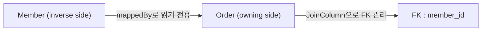

## 연관 관계 Mapping이란

- 객체는 참조(reference)로 연관 관계를 표현하지만, DB는 FK(foreign key)로 관계를 표현합니다.
    - 객체 model에서는 `member.getTeam()`처럼 참조를 통해 탐색하고, DB에서는 `JOIN`을 통해 관련 row를 조회합니다.
    - JPA는 이 두 model 사이의 간극을 annotation으로 mapping하여 객체 참조가 FK column으로 자동 변환되도록 합니다.

- 연관 관계를 정의할 때, 방향성과 다중성을 고려애햐 합니다.
    - **방향성(directionality)** : 단방향인지 양방향인지 결정합니다.
    - **다중성(cardinality)** : `@ManyToOne`, `@OneToMany`, `@OneToOne`, `@ManyToMany` 중 어떤 관계인지 결정합니다.


---


## 방향성

- 방향성은 객체 참조의 방향을 결정합니다.
- 단방향과 양방향 두 가지가 있습니다.


### 단방향 (Unidirectional)

- 한쪽 entity에만 annotation을 선언하면 단방향이 됩니다.
    - `Order`에만 `@ManyToOne`을 선언하면, `Order`는 `Member`를 참조할 수 있지만 `Member`는 `Order`를 알지 못합니다.

```java
@Entity
public class Order {
    @ManyToOne(fetch = FetchType.LAZY)
    @JoinColumn(name = "member_id")
    private Member member; // Order -> Member 참조 가능
}

@Entity
public class Member {
    // Order에 대한 참조 없음
}
```


### 양방향 (Bidirectional)

- 양쪽 entity 모두에 annotation을 선언하면 양방향이 됩니다.
    - 객체에서 양방향처럼 보이는 것은 사실 단방향 참조 두 개를 설정한 것입니다.
    - DB 입장에서는 FK 하나로 양방향 JOIN이 가능하므로, 추가 column 없이 양쪽 조회가 가능합니다.
    - 반대 방향에서도 참조가 필요한 경우에만 양방향을 추가하며, 불필요한 양방향은 복잡성만 증가시킵니다.

```java
@Entity
public class Order {
    @ManyToOne(fetch = FetchType.LAZY)
    @JoinColumn(name = "member_id")
    private Member member; // Order -> Member 참조 가능
}

@Entity
public class Member {
    @OneToMany(mappedBy = "member")
    private List<Order> orders = new ArrayList<>(); // Member -> Order 참조 가능
}
```

#### 연관 관계 주인 (mappedBy)

- 양방향 관계에서 실제 FK column을 관리하는 쪽을 **연관 관계 주인(owning side)**이라 합니다.
    - DB table에는 FK가 하나만 존재하므로, 두 객체 참조 중 하나만 FK를 관리해야 합니다.
    - 주인만 `INSERT`/`UPDATE` 시 FK 값이 DB에 반영됩니다.

- 주인 결정 규칙은 **FK를 가진 entity**가 주인이 되는 것입니다.
    - 보통 `@ManyToOne` 쪽이 FK를 가지므로 owning side가 됩니다.
    - `mappedBy`를 선언한 쪽은 **inverse side**로, 읽기 전용이며 DB에 반영되지 않습니다.



- owning side에서만 FK가 반영되므로, 양방향 관계에서는 반드시 owning side의 값을 설정해야 합니다.
    - `team.getMembers().add(member)`만 호출하고 `member.setTeam(team)`을 누락하면 FK가 DB에 반영되지 않습니다.


---


## 관계 유형별 Mapping

- 연관 관계의 cardinality에 따라 mapping 방식과 권장 구조가 달라집니다.


### @ManyToOne / @OneToMany

- 가장 흔한 연관 관계이며, FK는 Many 쪽 table에 위치합니다.

#### 단방향 @ManyToOne (권장)

- Many 쪽에서만 One을 참조하는 단순한 구조입니다.

```java
@Entity
public class Order {
    @ManyToOne(fetch = FetchType.LAZY)
    @JoinColumn(name = "member_id")
    private Member member;
}
```

#### 단방향 @OneToMany (비권장)

- One 쪽에서만 Many를 참조하는 구조로, FK가 자신의 table에 없어 추가적인 SQL이 발생합니다.
    - Hibernate가 중간 join table을 자동 생성하거나, 자식 `INSERT` 후 FK 설정을 위한 추가 `UPDATE` SQL이 발생합니다.
    - 불필요한 query 발생으로 성능이 저하되므로 양방향으로 변경하는 것이 낫습니다.

#### 양방향 @OneToMany + @ManyToOne (권장)

- 양쪽 모두 참조가 필요한 경우의 권장 구조입니다.
    - `@ManyToOne` 쪽이 owning side가 되고, `@OneToMany` 쪽은 `mappedBy`로 inverse side가 됩니다.

```java
@Entity
public class Member {
    @OneToMany(mappedBy = "member")
    private List<Order> orders = new ArrayList<>();
}

@Entity
public class Order {
    @ManyToOne(fetch = FetchType.LAZY)
    @JoinColumn(name = "member_id")
    private Member member;
}
```


### @OneToOne

- 단일 entity 간의 1:1 관계를 mapping합니다.

#### 기본 구조

- FK를 가진 쪽이 owning side가 됩니다.

```java
@Entity
public class Member {
    @OneToOne(fetch = FetchType.LAZY)
    @JoinColumn(name = "locker_id")
    private Locker locker;
}
```

#### LAZY 미동작 문제

- inverse side(`mappedBy` 쪽)에서는 FK가 없어 연관 entity의 존재 여부(null 여부)를 판단할 수 없습니다.
    - proxy 객체는 null이 아닌 상태로 생성되므로, null 가능성이 있는 관계에서는 proxy 생성이 불가합니다.
    - 결과적으로 inverse side에서는 `LAZY`가 동작하지 않고 즉시 `SELECT`가 실행됩니다.

#### @MapsId 활용 (권장)

- `@MapsId`로 PK를 공유하면 FK column이 불필요해지고, owning side에서 `LAZY`가 정상 동작합니다.

```java
@Entity
public class MemberProfile {
    @Id
    private Long id;

    @OneToOne(fetch = FetchType.LAZY)
    @MapsId
    @JoinColumn(name = "member_id")
    private Member member;
}
```


### @ManyToMany

- 기본 `@ManyToMany`는 join table에 두 FK만 존재하여 추가 column(등록일, 상태 등)을 넣을 수 없습니다.

#### 중간 Entity로 분리 (권장)

- 실무에서는 `@ManyToMany` 대신 중간 entity를 직접 생성하여 `@ManyToOne` 두 개로 분리합니다.
    - 추가 속성을 자유롭게 정의할 수 있고, query도 명확해집니다.

```java
@Entity
public class MemberProduct {
    @Id @GeneratedValue
    private Long id;

    @ManyToOne(fetch = FetchType.LAZY)
    @JoinColumn(name = "member_id")
    private Member member;

    @ManyToOne(fetch = FetchType.LAZY)
    @JoinColumn(name = "product_id")
    private Product product;

    private LocalDateTime createdAt;
}
```

- `@ManyToMany`에 `CascadeType.ALL` 또는 `REMOVE`를 사용하면 공유 entity가 의도치 않게 삭제될 위험이 있으므로 사용하지 않습니다.


---


## Cascade

- cascade(영속성 전이)는 부모 entity의 영속성 상태 변화를 자식 entity에 전파하는 기능입니다.
    - lifecycle이 완전히 동일한 부모-자식 관계에만 사용하며, aggregate root pattern에서 주로 활용합니다.
    - 자식이 여러 부모에 의해 공유되는 관계에서는 cascade를 사용하지 않습니다.

| cascade type | 동작 |
| --- | --- |
| `PERSIST` | 부모 persist 시 자식도 persist |
| `MERGE` | 부모 merge 시 자식도 merge |
| `REMOVE` | 부모 삭제 시 자식도 삭제 |
| `REFRESH` | 부모 refresh 시 자식도 DB 상태로 덮어씀 |
| `DETACH` | 부모 detach 시 자식도 분리 |
| `ALL` | 위 5가지 모두 적용 |

```java
@OneToMany(mappedBy = "order", cascade = CascadeType.ALL)
private List<OrderItem> items = new ArrayList<>();
```


---


## orphanRemoval

- `orphanRemoval = true`는 collection에서 자식을 제거하면 해당 자식 entity를 DB에서 자동 삭제합니다.
    - 부모와의 연관 관계가 끊어진 entity를 orphan(고아)으로 간주하여 DB에서 제거하는 방식입니다.

- `CascadeType.REMOVE`와 동작 범위가 다릅니다.

| scenario | `CascadeType.REMOVE` | `orphanRemoval = true` |
| --- | --- | --- |
| **부모 entity 삭제** | 자식도 삭제 | 자식도 삭제 |
| **collection에서 자식 제거** | 자식 DB에 유지 | 자식 DB에서 삭제 |

```java
@OneToMany(mappedBy = "order", cascade = CascadeType.ALL, orphanRemoval = true)
private List<OrderItem> items = new ArrayList<>();

// collection에서 제거 시 DB에서도 삭제
order.getItems().remove(0);
```

- `@ManyToMany`에서는 `orphanRemoval`을 사용하지 않습니다.
    - 한 부모에서 제거한 entity가 다른 부모에서도 참조되고 있을 수 있으며, 공유 entity가 삭제되면 data 정합성이 깨집니다.


---


## 연관 관계 편의 Method

- JPA는 양방향 관계에서 양쪽 객체를 자동 동기화하지 않으므로 개발자가 직접 양쪽 모두 설정해야 합니다.
    - owning side만 설정하면 DB에는 반영되지만, 같은 transaction 내에서 inverse side의 collection에는 반영되지 않아 객체 상태와 DB 상태가 불일치합니다.

- 편의 method를 작성하면 양쪽 참조를 한 번에 처리하여 누락을 방지합니다.

```java
@Entity
public class Team {
    @OneToMany(mappedBy = "team")
    private List<Member> members = new ArrayList<>();

    public void addMember(Member member) {
        members.add(member);
        member.setTeam(this);
    }

    public void removeMember(Member member) {
        members.remove(member);
        member.setTeam(null);
    }
}
```

- 편의 method는 연관 관계 주인이 아닌 쪽(부모)에 작성하는 것이 일반적입니다.
    - 부모 쪽에서 자식을 추가/제거하는 흐름이 business logic과 자연스럽게 일치합니다.

- `equals`/`hashCode`에 연관 관계 field를 포함하면 양방향 참조로 인한 무한 순환이 발생하여 `StackOverflowError`가 발생합니다.
    - 연관 관계 field는 `equals`/`hashCode` 대상에서 제외합니다.


---


## Reference

- <https://vladmihalcea.com/the-best-way-to-map-a-onetomany-association-with-jpa-and-hibernate/>
- <https://vladmihalcea.com/the-best-way-to-map-a-onetoone-relationship-with-jpa-and-hibernate/>
- <https://vladmihalcea.com/the-best-way-to-use-the-manytomany-annotation-with-jpa-and-hibernate/>
- <https://vladmihalcea.com/jpa-hibernate-synchronize-bidirectional-entity-associations/>
- <https://jakarta.ee/specifications/persistence/3.1/jakarta-persistence-spec-3.1.html>

