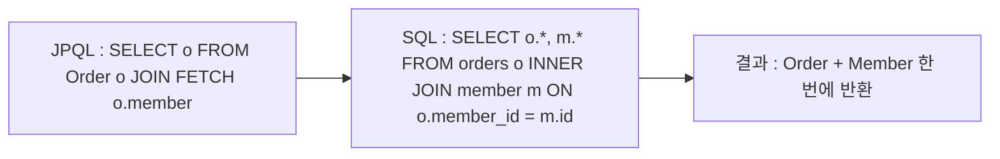
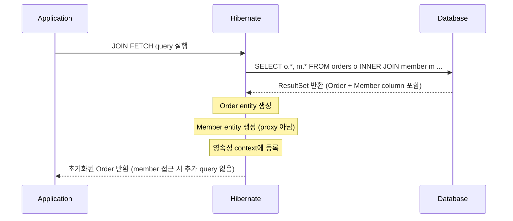
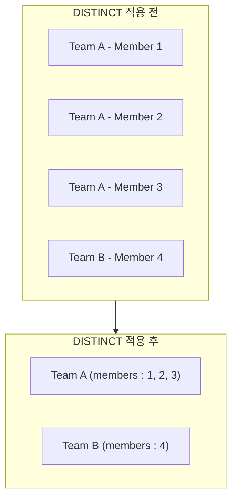

## Fetch Join이란

- fetch join은 JPQL에서 `JOIN FETCH` keyword를 사용하여 연관 entity를 한 번의 SQL JOIN으로 함께 조회하는 기능입니다.
    - JPA 표준 명세에 정의된 기능이며, 일반 SQL에는 없는 JPQL 전용 문법입니다.
    - 모든 연관 관계를 `LAZY`로 설정한 뒤, 연관 entity가 필요한 query에서만 fetch join을 적용하는 것이 실무 권장 pattern입니다.

- 일반 `JOIN`은 `SELECT` 대상에 연관 entity를 포함하지 않지만, `JOIN FETCH`는 연관 entity까지 `SELECT` 대상에 포함합니다.
    - 일반 `JOIN`으로 조회하면 연관 entity는 여전히 proxy 상태이므로, 접근 시 추가 SELECT가 발생합니다.
    - `JOIN FETCH`는 연관 entity를 이미 초기화된 상태로 반환하여 추가 query 없이 바로 접근 가능합니다.

```java
// 일반 JOIN : member는 proxy 상태, 접근 시 추가 SELECT 발생
em.createQuery("SELECT o FROM Order o JOIN o.member m", Order.class);

// fetch join : member가 초기화된 상태로 반환, 추가 query 없음
em.createQuery("SELECT o FROM Order o JOIN FETCH o.member", Order.class);
```


---


## 동작 원리

- JPQL의 `JOIN FETCH`는 SQL의 `INNER JOIN`으로 변환되고, 연관 entity의 column이 `SELECT` 절에 포함됩니다.
    - `LEFT JOIN FETCH`를 사용하면 연관 entity가 없는 row도 포함하여 조회합니다.



- Hibernate는 결과 `ResultSet`에서 연관 entity의 column을 읽어 proxy 대신 실제 entity 객체를 생성합니다.
    - 영속성 context에 이미 초기화된 entity가 등록되므로, 이후 LAZY field에 접근해도 추가 query가 발생하지 않습니다.
    - entity가 초기화된 상태로 반환되므로 Detached 상태에서도 접근이 가능합니다.




---


## 기본 사용법

- Spring Data JPA에서는 `@Query` annotation에 JPQL fetch join을 작성합니다.


### @ManyToOne Fetch Join

- `@ManyToOne` 관계는 단일 entity를 참조하므로 fetch join 시 결과 row 수가 변하지 않습니다.

```java
@Query("SELECT o FROM Order o JOIN FETCH o.member")
List<Order> findAllWithMember();
```

- 생성되는 SQL은 `INNER JOIN`으로 변환됩니다.

```sql
SELECT o.*, m.*
FROM orders o
INNER JOIN member m ON o.member_id = m.id
```


### @OneToMany Fetch Join

- `@OneToMany` 관계는 collection을 참조하므로 join 결과에 부모 entity가 중복됩니다.
    - 자식이 3건인 부모는 결과에 3번 등장하므로, `DISTINCT`를 추가하여 중복을 제거해야 합니다.
    - Hibernate 6부터는 collection fetch join에 `DISTINCT`가 자동 적용됩니다.

```java
// Hibernate 5 : DISTINCT 명시 필요
@Query("SELECT DISTINCT t FROM Team t JOIN FETCH t.members")
List<Team> findAllWithMembers();

// Hibernate 6 : DISTINCT 자동 적용
@Query("SELECT t FROM Team t JOIN FETCH t.members")
List<Team> findAllWithMembers();
```




### LEFT JOIN FETCH

- `LEFT JOIN FETCH`는 연관 entity가 없는 부모도 결과에 포함합니다.
    - `JOIN FETCH`(INNER)는 연관 entity가 없는 부모를 결과에서 제외합니다.
    - 연관 entity가 없을 수 있는 경우 `LEFT JOIN FETCH`를 사용합니다.

```java
// member가 없는 Order는 제외됨
@Query("SELECT o FROM Order o JOIN FETCH o.member")
List<Order> findAllWithMember();

// member가 없는 Order도 포함됨
@Query("SELECT o FROM Order o LEFT JOIN FETCH o.member")
List<Order> findAllWithMemberIncludeNull();
```


---


## @EntityGraph

- `@EntityGraph`는 annotation 기반으로 fetch join과 동일한 효과를 제공하는 JPA 표준 기능입니다.
    - JPQL을 직접 작성하지 않아도 되므로 method naming query와 함께 사용하기 편리합니다.
    - `attributePaths`에 함께 조회할 연관 field 이름을 지정합니다.

```java
@EntityGraph(attributePaths = {"member"})
List<Order> findByStatus(OrderStatus status);

// 여러 연관 entity를 동시에 지정
@EntityGraph(attributePaths = {"member", "delivery"})
List<Order> findAll();
```

- `@EntityGraph`는 기본적으로 `LEFT OUTER JOIN`을 생성합니다.
    - `JOIN FETCH`와 달리 연관 entity가 없는 부모도 항상 결과에 포함됩니다.

| 구분 | `JOIN FETCH` | `@EntityGraph` |
| --- | --- | --- |
| **문법** | JPQL 직접 작성 | annotation 선언 |
| **기본 JOIN 방식** | `INNER JOIN` | `LEFT OUTER JOIN` |
| **조건 추가** | JPQL `WHERE` 절 자유 | method naming 조건 |
| **복잡한 query** | 유연하게 대응 | 단순 fetch에 적합 |


---


## 한계점과 주의 사항

- fetch join은 강력한 N+1 해결 수단이지만, collection fetch join에서 pagination과 다중 collection에 대한 제약이 있습니다.


### Collection Fetch Join + Pagination

- `@OneToMany` fetch join에 `Pageable`을 함께 사용하면 DB level에서 `LIMIT`을 적용하지 못합니다.
    - join으로 인해 부모 entity가 중복된 상태에서 `LIMIT`을 걸면 부모 기준이 아닌 row 기준으로 잘려 결과가 부정확해집니다.
    - Hibernate는 전체 결과를 memory에 올린 뒤 application level에서 paging하며, `HHH90003004` 경고를 출력합니다.
    - 대용량 data에서 OOM(Out of Memory) 위험이 있습니다.

```
HHH90003004: firstResult/maxResults specified with collection fetch; applying in memory
```

#### 해결 방법 1 : 2-Query 방식

- 부모 ID를 pagination으로 먼저 조회한 뒤, 해당 ID 목록으로 fetch join을 실행합니다.
    - 첫 번째 query에서 DB level `LIMIT`이 정상 적용되고, 두 번째 query에서 연관 entity를 한 번에 조회합니다.

```java
// 1단계 : 부모 ID paging
@Query("SELECT t.id FROM Team t")
Page<Long> findTeamIds(Pageable pageable);

// 2단계 : ID로 fetch join
@Query("SELECT DISTINCT t FROM Team t JOIN FETCH t.members WHERE t.id IN :ids")
List<Team> findByIdsWithMembers(@Param("ids") List<Long> ids);
```

#### 해결 방법 2 : @BatchSize 사용

- collection fetch join 대신 `@BatchSize`를 적용하면 pagination이 DB level에서 정상 동작합니다.
    - query 수는 `1 + ceil(N / size)`로 증가하지만, memory 안전성을 확보합니다.

```java
@OneToMany(mappedBy = "team")
@BatchSize(size = 100)
private List<Member> members;
```


### MultipleBagFetchException

- `List`(bag) type의 `@OneToMany` collection 2개 이상을 동시에 fetch join하면 `MultipleBagFetchException`이 발생합니다.
    - bag은 중복을 허용하는 비순서 collection이며, 두 bag의 Cartesian product로 인해 Hibernate가 정확한 row-entity mapping을 보장할 수 없습니다.

```java
// Team이 members(List)와 projects(List)를 모두 가진 경우
@Query("SELECT t FROM Team t JOIN FETCH t.members JOIN FETCH t.projects")
List<Team> findAllWithMembersAndProjects(); // MultipleBagFetchException 발생
```

- bag을 제거하거나 동시 fetch join을 피하는 방향으로 해결합니다.
    - **`Set`으로 변경** : collection type을 `Set`으로 변경하면 bag이 아니므로 다중 fetch join이 가능합니다.
        - 단, 순서가 보장되지 않습니다.
    - **하나만 fetch join + @BatchSize** : 한 collection은 fetch join으로, 나머지는 `@BatchSize`로 처리합니다.
    - **query 분리** : 각 collection을 별도 query로 조회합니다.

```java
// 해결 1 : Set으로 변경
@OneToMany(mappedBy = "team")
private Set<Member> members = new HashSet<>();

// 해결 2 : 하나만 fetch join, 나머지 @BatchSize
@Query("SELECT t FROM Team t JOIN FETCH t.members")
List<Team> findAllWithMembers(); // projects는 @BatchSize로 처리
```


### Fetch Join에서 ON 절 제한

- fetch join에서는 `ON` 절로 연관 entity에 조건을 적용하면 안 됩니다.
    - fetch join의 목적은 연관 entity 전체를 loading하는 것이며, 조건으로 일부만 가져오면 collection의 data 정합성이 깨집니다.
    - 조건이 필요한 경우 일반 `JOIN`과 `WHERE` 절을 사용하거나, 조회 후 application level에서 filtering합니다.

```java
// 잘못된 사용 : fetch join에 ON 조건
@Query("SELECT t FROM Team t JOIN FETCH t.members m ON m.status = 'ACTIVE'")
// -> members collection에 ACTIVE만 들어가 data 정합성 훼손

// 올바른 사용 : WHERE 절로 전체 결과 필터링
@Query("SELECT t FROM Team t JOIN FETCH t.members m WHERE m.status = 'ACTIVE'")
```


---


## Fetch Join vs 다른 N+1 해결 방법

- N+1 해결 방법마다 query 수, 적용 방식, 적합한 상황이 다르므로 용도에 맞게 선택합니다.

| 구분 | Fetch Join | @EntityGraph | @BatchSize | @Fetch(SUBSELECT) |
| --- | --- | --- | --- | --- |
| **query 수** | 1 | 1 | `1 + ceil(N / size)` | 2 |
| **적용 방식** | JPQL `JOIN FETCH` | annotation | annotation / global 설정 | annotation |
| **표준 여부** | JPA 표준 | JPA 표준 | Hibernate 전용 | Hibernate 전용 |
| **pagination 호환** | `@ManyToOne`만 가능 | `@ManyToOne`만 가능 | 가능 | 가능 |
| **다중 collection** | 1개만 가능 | 1개만 가능 | 제한 없음 | 제한 없음 |
| **적합한 상황** | 특정 query의 N+1 해결 | method naming query | 전역 N+1 완화 | 전체 연관 collection 조회 |

- 실무에서는 `@BatchSize`를 global 설정으로 적용하여 기본적인 N+1을 완화하고, 성능이 중요한 query에 fetch join을 추가하는 조합이 효과적입니다.

```yaml
# global BatchSize로 기본 N+1 완화
spring:
  jpa:
    properties:
      hibernate:
        default_batch_fetch_size: 100
```

```java
// 성능이 중요한 query에 fetch join 추가
@Query("SELECT o FROM Order o JOIN FETCH o.member WHERE o.status = :status")
List<Order> findByStatusWithMember(@Param("status") OrderStatus status);
```


---


## Reference

- <https://docs.jboss.org/hibernate/orm/6.6/userguide/html_single/Hibernate_User_Guide.html#fetching>
- <https://jakarta.ee/specifications/persistence/3.1/jakarta-persistence-spec-3.1.html>
- <https://vladmihalcea.com/hibernate-facts-the-importance-of-fetch-strategy/>
- <https://vladmihalcea.com/hibernate-multiplebagfetchexception/>

