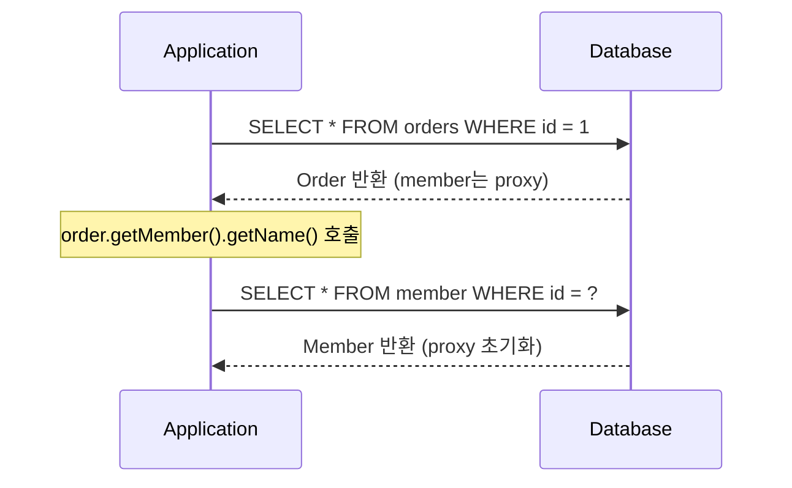
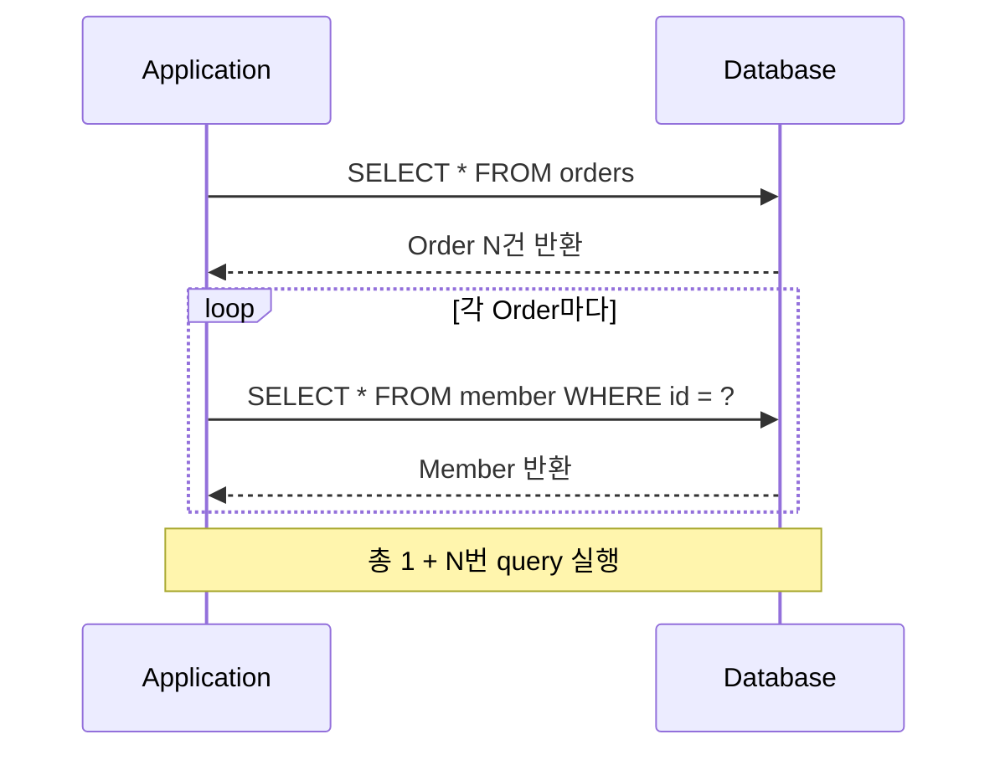

## FetchType이란

- FetchType은 연관 entity를 DB에서 가져오는 시점을 결정하는 전략입니다.
    - `FetchType.LAZY`(지연 loading)와 `FetchType.EAGER`(즉시 loading) 두 가지 option이 있습니다.
    - 각 연관 관계 annotation의 `fetch` 속성으로 지정하며, 명시하지 않아도 annotation마다 정해진 기본값이 적용되어 항상 둘 중 하나로 동작합니다.

```java
@ManyToOne(fetch = FetchType.LAZY)
private Member member;
```

- JPA는 객체 참조(`order.getMember()`)를 DB query로 변환하는데, 연관 entity를 언제 가져올지 결정하지 않으면 모든 연관 entity를 항상 즉시 load하게 됩니다.
    - 객체 graph가 깊어질수록 불필요한 data까지 모두 조회되어 성능이 저하됩니다.
    - FetchType은 이 loading 시점을 개발자가 제어할 수 있도록 제공하는 수단입니다.

| 구분 | LAZY | EAGER |
| --- | --- | --- |
| **query 실행 시점** | 연관 field 접근 시 | 부모 entity 조회 시 |
| **proxy 사용** | proxy 객체 반환 | 실제 entity 반환 |
| **N+1 위험** | 접근 시 발생 가능 | JPQL 사용 시 항상 발생 |
| **불필요한 loading** | 접근하지 않으면 loading 없음 | 항상 연관 entity 포함 |
| **주의 사항** | transaction 범위 내 접근 필요 | 불필요한 data loading, N+1 문제 |


---


## FetchType.LAZY

- 연관 field에 실제로 접근하는 시점에 `SELECT` query를 실행합니다.
    - Hibernate는 연관 entity 자리에 실제 객체 대신 proxy 객체를 반환하며, field에 접근하는 순간 proxy가 초기화되면서 DB query가 발생합니다.

```java
Order order = em.find(Order.class, 1L);   // member는 proxy 상태
String name = order.getMember().getName(); // 이 시점에 SELECT 실행
```




### LazyInitializationException

- transaction 범위 밖(Detached 상태)에서 초기화되지 않은 proxy에 접근하면 `LazyInitializationException`이 발생합니다.
    - entity가 영속성 context에서 분리된 상태에서는 DB 연결을 사용할 수 없기 때문입니다.

```java
@Transactional
public Order findOrder(Long id) {
    return orderRepository.findById(id).get();
} // transaction 종료, entity Detached 상태

// 이후 code
Order order = findOrder(1L);
order.getMember().getName(); // LazyInitializationException 발생
```


---


## FetchType.EAGER

- 부모 entity를 조회하는 시점에 연관 entity를 즉시 함께 loading합니다.
    - EAGER는 "즉시 loading 보장"이지 "단일 query 보장"이 아닙니다.

- `em.find()`처럼 단건 조회는 N+1이 발생하지 않습니다.
    - ID로 특정 entity를 조회하는 경우 Hibernate가 연관 entity를 JOIN으로 함께 가져와 1번의 query로 처리합니다.

```java
Order order = em.find(Order.class, 1L);
// -> SELECT o.*, m.* FROM orders o JOIN member m ON o.member_id = m.id WHERE o.id = 1
```

- JPQL은 fetch type을 무시하고 root entity만 조회하므로 N+1이 발생합니다.
    - JPQL은 SQL로 직접 변환되는 query 언어로, 연관 관계의 fetch type을 처리하지 않습니다.
    - JPA provider가 결과를 받은 뒤 EAGER 설정을 감지하여 각 entity마다 추가 SELECT를 실행합니다.
    - Spring Data JPA의 `findAll()`, `findBy~()` 등은 내부적으로 JPQL을 사용하므로 동일하게 발생합니다.

```java
List<Order> orders = em.createQuery("select o from Order o", Order.class)
    .getResultList();
// -> SELECT * FROM orders (1번)
// -> SELECT * FROM member WHERE id = 1 (EAGER에 의해 추가 query)
// -> SELECT * FROM member WHERE id = 2
// -> ... (N번)
```




---


## 각 Annotation의 기본 FetchType

- 연관 관계의 cardinality에 따라 기본 FetchType이 다릅니다.
    - `~ToOne` 관계는 기본값이 `EAGER`, `~ToMany` 관계는 기본값이 `LAZY`입니다.
    - 단일 entity를 참조하는 `~ToOne`은 추가 비용이 적다고 판단하여 EAGER가 기본값이지만, 실무에서는 N+1 문제를 유발하므로 주의가 필요합니다.

| annotation | 기본 FetchType | cardinality |
| --- | --- | --- |
| `@ManyToOne` | `EAGER` | 단일 entity 참조 |
| `@OneToOne` | `EAGER` | 단일 entity 참조 |
| `@OneToMany` | `LAZY` | collection 참조 |
| `@ManyToMany` | `LAZY` | collection 참조 |


---


## 실무 권장 설정

- 모든 연관 관계를 `LAZY`로 설정하는 것이 권장됩니다.
    - 기본값이 `EAGER`인 `@ManyToOne`과 `@OneToOne`도 명시적으로 `LAZY`로 변경합니다.

```java
@ManyToOne(fetch = FetchType.LAZY)
@JoinColumn(name = "member_id")
private Member member;

@OneToOne(fetch = FetchType.LAZY)
@JoinColumn(name = "delivery_id")
private Delivery delivery;
```

- 연관 entity를 함께 조회해야 하는 경우에는 fetch join 또는 `@EntityGraph`를 사용합니다.
    - 필요한 시점에 명시적으로 즉시 loading을 지정하면 query 제어가 가능합니다.

```java
// fetch join
@Query("select o from Order o join fetch o.member")
List<Order> findAllWithMember();

// @EntityGraph
@EntityGraph(attributePaths = {"member", "delivery"})
List<Order> findByStatus(OrderStatus status);
```

- EAGER를 사용하는 경우는 항상 함께 조회되는 관계에만 제한적으로 적용합니다.
    - 대부분의 상황에서 LAZY + fetch join 조합이 EAGER보다 유연하고 성능 예측이 용이합니다.


---


## Reference

- <https://docs.jboss.org/hibernate/orm/6.2/userguide/html_single/Hibernate_User_Guide.html>
- <https://jakarta.ee/specifications/persistence/3.0/>
- <https://vladmihalcea.com/n-plus-1-query-problem/>

