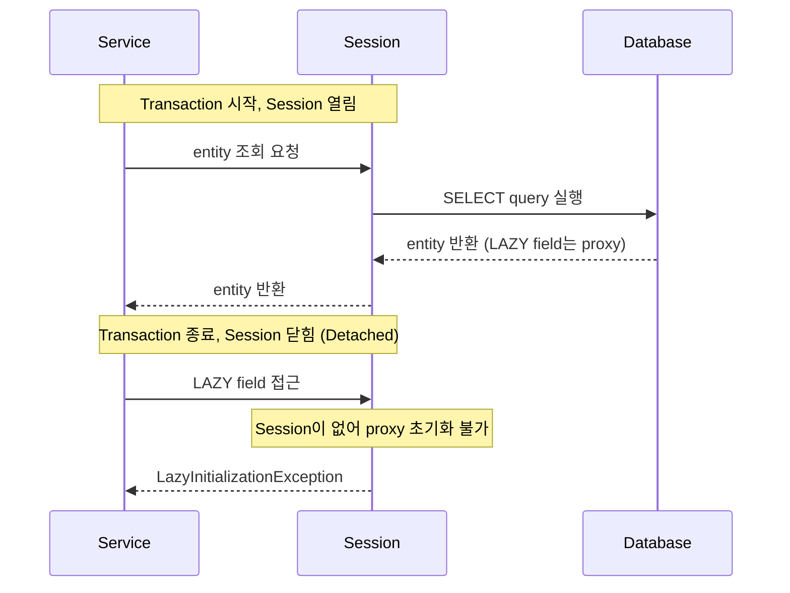
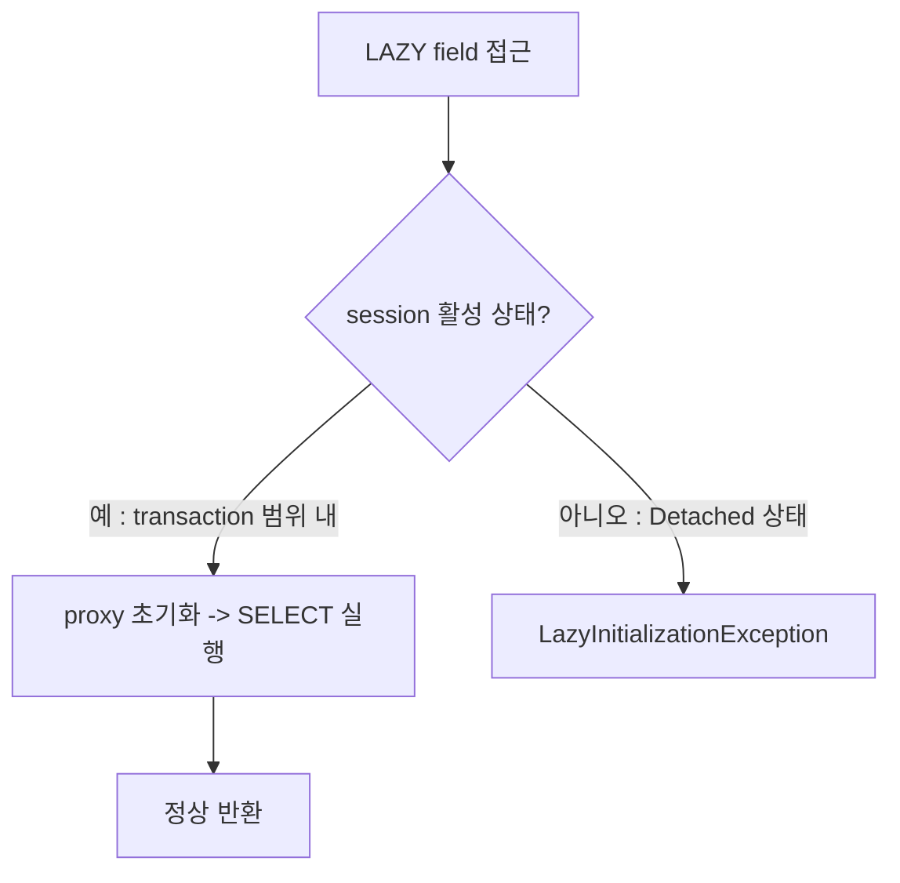
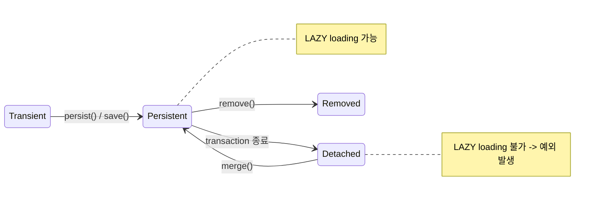

## LazyInitializationException이란

- Hibernate가 열린 session 없이 아직 fetch되지 않은 LAZY proxy를 초기화하려 할 때 발생하는 예외입니다.
    - LAZY loading은 연관 entity 자리에 proxy 객체를 두고, 실제 접근 시점에 DB query를 실행하는 방식입니다.
    - proxy가 초기화되려면 활성화된 session(영속성 context)이 필요한데, transaction 종료 후에는 session이 닫혀 있어 예외가 발생합니다.

- proxy 내부의 `LazyInitializer.getSession()`이 `null`을 반환하면 Hibernate는 `LazyInitializationException`을 던집니다.




### 발생 원인

- JPA entity는 영속성 context(Persistence Context)가 살아있는 동안만 LAZY loading이 가능합니다.
    - Hibernate는 LAZY 연관 field 자리에 proxy 객체를 두고, field에 접근하는 순간 활성화된 session을 통해 DB에 SELECT를 실행합니다.
    - transaction이 종료되면 session이 닫히고 entity는 Detached 상태가 됩니다.
    - Detached 상태에서 초기화되지 않은 proxy에 접근하면 Hibernate가 session을 찾지 못해 예외가 발생합니다.



- entity는 생명 주기에 따라 네 가지 상태를 가지며, LAZY loading은 Persistent 상태에서만 가능합니다.
    - **Transient** : 영속성 context에 등록되지 않은 새 객체.
    - **Persistent** : session이 활성화된 상태, LAZY loading 가능.
    - **Detached** : transaction 종료 후 session과 분리된 상태, LAZY loading 불가.
    - **Removed** : 삭제 예약된 상태.




---


## 발생 Pattern

- 공통 원인은 "session이 닫힌 상태에서 초기화되지 않은 proxy에 접근"하는 것이며, 이 상황이 발생하는 pattern은 다양합니다.
    - `@Transactional`이 없어 repository 호출 직후 session이 종료되는 경우.
    - `@Transactional` method가 종료되어 entity가 Detached 상태로 반환된 후 접근하는 경우.
    - Open-In-View를 비활성화하여 session이 service 경계에서 종료되는 경우.
    - controller가 entity를 직접 반환하여 Jackson이 JSON 직렬화 시 LAZY field에 접근하는 경우.
    - `@Async` method에서 호출 thread의 session 없이 LAZY field에 접근하는 경우.


### `@Transactional`이 없는 경우

- `@Transactional`이 없으면 repository 호출 직후 session이 종료됩니다.
    - 반환된 entity는 즉시 Detached 상태가 되어, 이후 LAZY field에 접근하면 예외가 발생합니다.

```java
// @Transactional 없음 -> repository 호출 직후 session 종료
public Order findOrder(Long id) {
    return orderRepository.findById(id).orElseThrow();
}

// controller에서 LAZY field 접근 -> 예외 발생
Order order = findOrder(1L);
order.getMember().getName(); // LazyInitializationException
```


### `@Transactional` 종료 후 접근

- `@Transactional` method가 종료되면 transaction과 함께 session이 닫힙니다.
    - method가 반환한 entity는 Detached 상태이므로, 호출부에서 LAZY field에 접근하면 예외가 발생합니다.

```java
@Transactional
public Order findOrder(Long id) {
    return orderRepository.findById(id).orElseThrow();
} // transaction 종료, entity Detached 상태

// transaction 바깥에서 접근
Order order = findOrder(1L);
order.getMember().getName(); // LazyInitializationException
```


### Open-In-View 비활성화 후

- Spring Boot는 기본적으로 Open-In-View가 활성화되어 HTTP request 전체 범위로 session을 유지합니다.
    - `spring.jpa.open-in-view=false`로 비활성화하면 session이 service 경계에서 종료됩니다.
    - controller나 JSON 직렬화 시점에 LAZY field에 접근하면 예외가 발생합니다.


### Entity를 직접 반환하는 경우 (JSON 직렬화)

- controller가 entity를 그대로 반환하면, Jackson이 JSON 직렬화 과정에서 LAZY field에 접근합니다.
    - 직렬화는 transaction 종료 후에 실행되므로, LAZY field가 초기화되지 않은 상태에서 접근하여 예외가 발생합니다.

```java
@GetMapping("/orders/{id}")
public Order getOrder(@PathVariable Long id) {
    return orderService.findOrder(id); // entity 직접 반환
    // Jackson이 order.getMember() 직렬화 시도 -> LazyInitializationException
}
```

- entity 대신 DTO로 변환하여 반환하면 이 문제를 방지할 수 있습니다.


### `@Async` method에서 접근

- `@Async` method는 새로운 thread에서 실행되므로, 호출 thread의 session을 공유하지 않습니다.
    - 호출부에서 조회한 entity를 `@Async` method에 전달하면, 해당 method에서 LAZY field에 접근할 때 session이 없어 예외가 발생합니다.

```java
@Transactional
public void processOrder(Long id) {
    Order order = orderRepository.findById(id).orElseThrow();
    asyncService.process(order); // 새 thread로 entity 전달
}

@Async
public void process(Order order) {
    order.getMember().getName(); // 새 thread에는 session 없음 -> LazyInitializationException
}
```

- `@Async` method에는 entity 대신 필요한 data만 추출하여 전달합니다.


---


## 해결 방법

- `LazyInitializationException`을 해결하는 방법은 다섯 가지이며, 상황에 따라 적합한 방식이 다릅니다.

| 방법 | 설명 | 장점 | 단점 |
| --- | --- | --- | --- |
| **Fetch Join** | `JOIN FETCH`로 미리 loading | 단일 SQL, N+1 해결 | 다수 collection 동시 불가, pagination 주의 |
| **`@EntityGraph`** | annotation으로 선언적 fetch join | 재사용 가능, 선언적 | 복잡한 중첩 표현 제한 |
| **DTO 변환** | transaction 안에서 DTO로 변환 후 반환 | 최고 성능, Persistence Context overhead 없음 | DTO class 유지 비용 |
| **`@Transactional` 범위 확장** | 접근이 필요한 layer까지 transaction 유지 | 구현 간단 | 불필요한 data loading, N+1 잠복 |
| **`Hibernate.initialize()`** | transaction 안에서 명시적 초기화 | 기존 code 변경 최소화 | N+1 위험, architecture 재검토 신호 |


### Fetch Join

- JPQL의 `JOIN FETCH` 구문으로 연관 entity를 한 번의 query에 함께 조회합니다.
    - N+1 문제를 근본적으로 해결하며, entity가 이미 초기화된 상태로 반환되어 Detached 상태에서도 접근이 가능합니다.

```java
@Query("SELECT o FROM Order o LEFT JOIN FETCH o.member WHERE o.id = :id")
Optional<Order> findByIdWithMember(@Param("id") Long id);
```


### `@EntityGraph`

- annotation으로 fetch join을 선언적으로 지정합니다.
    - JPQL을 직접 작성하지 않아도 되어 간결하며, Spring Data JPA의 method naming query와 함께 사용할 수 있습니다.

```java
@EntityGraph(attributePaths = {"member"})
Optional<Order> findById(Long id);
```


### DTO 변환 (권장)

- transaction 안에서 필요한 data를 DTO로 변환하여 반환하면 LAZY loading 문제가 원천적으로 발생하지 않습니다.
    - entity를 외부에 노출하지 않으므로 Persistence Context overhead도 없어 성능상 가장 유리합니다.

```java
@Transactional(readOnly = true)
public OrderResponse findOrder(Long id) {
    Order order = orderRepository.findById(id).orElseThrow();
    return new OrderResponse(order.getId(), order.getMember().getName()); // transaction 안에서 접근
}
```


### `Hibernate.initialize()`

- transaction 안에서 LAZY field를 명시적으로 초기화하여 Detached 상태에서도 접근 가능하게 합니다.
    - 기존 code 변경을 최소화할 수 있지만, 연관 entity마다 추가 query가 발생하여 N+1 위험이 있습니다.
    - 이 방법이 필요하다면 architecture 설계를 재검토하는 것이 더 적절합니다.

```java
@Transactional
public Order findOrderWithMember(Long id) {
    Order order = orderRepository.findById(id).orElseThrow();
    Hibernate.initialize(order.getMember()); // transaction 안에서 명시적 초기화
    return order;
}
```


---


## Open-In-View와의 관계

- Spring Boot는 `OpenEntityManagerInViewInterceptor`를 자동 등록하여 HTTP request 전체에 걸쳐 session을 유지합니다.
    - controller나 view layer에서도 LAZY loading이 가능하므로 `LazyInitializationException`이 발생하지 않습니다.

- Open-In-View는 anti-pattern으로 간주됩니다.
    - view layer에서 DB query가 실행되어 책임 분리 원칙에 위배됩니다.
    - N+1 문제를 숨기고, 의도치 않은 query가 발생해도 인지하기 어렵습니다.
    - DB connection을 HTTP request 전체 동안 점유하여 connection pool 고갈 위험이 있습니다.

- `spring.jpa.open-in-view=false` 설정 후 DTO 변환 방식으로 전환하는 것이 권장됩니다.

```yaml
spring:
  jpa:
    open-in-view: false
```


---


## Reference

- <https://vladmihalcea.com/the-best-way-to-handle-the-lazyinitializationexception/>
- <https://vladmihalcea.com/the-open-session-in-view-anti-pattern/>
- <https://thorben-janssen.com/lazyinitializationexception/>
- <https://docs.jboss.org/hibernate/orm/6.6/javadocs/org/hibernate/LazyInitializationException.html>
