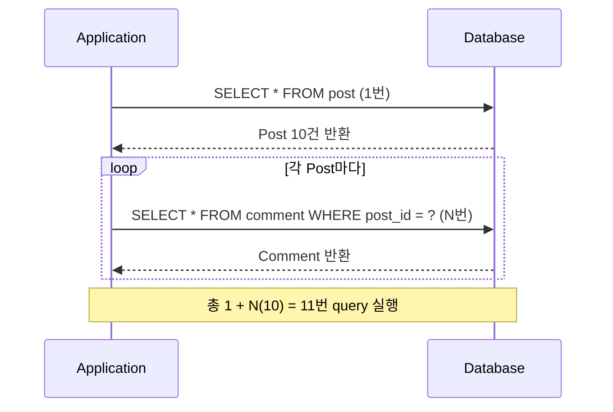
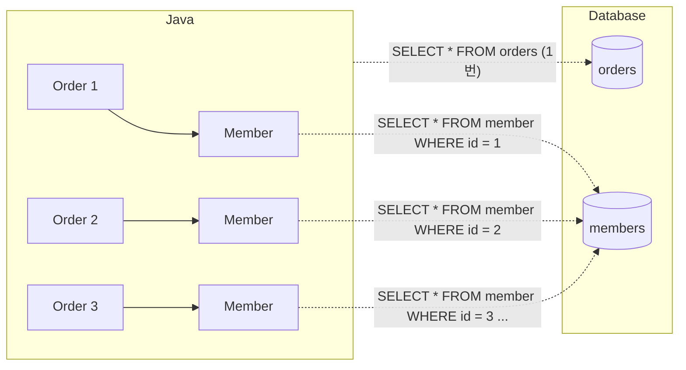

## N+1 문제란

- `Post` 10건을 조회하면 1번의 query가 실행되고, 각 `Post`의 `Comment`에 접근할 때마다 추가 query가 실행되어 총 11번의 query가 발생합니다.




### 발생 원인

- Java에서는 객체 참조로 연관 관계에 접근하지만, DB에서는 연관 entity가 별도의 table에 저장된 독립적인 row입니다.
- JPA는 이 간극을 연관 entity마다 개별 SELECT를 실행하는 방식으로 메웁니다.



- `order.getMember()`처럼 단순한 field 접근처럼 보이지만 내부적으로 SELECT가 실행되기 때문에, 개발자가 query 발생 자체를 인지하기 어렵습니다.


---


## FetchType별 발생 상황

- `FetchType`에 따라 N+1 query의 실행 시점이 달라집니다.


### LAZY Loading

- 연관 field에 실제로 접근하는 시점에 SELECT가 실행됩니다.
- JPA는 연관 entity 자리에 proxy 객체를 두었다가, loop 안에서 각 proxy에 접근할 때마다 개별 SELECT가 순차적으로 발생합니다.

```java
List<Order> orders = em.createQuery("select o from Order o", Order.class)
    .getResultList();
// → SELECT * FROM orders (1번, member는 proxy 상태)

for (Order order : orders) {
    order.getMember().getName(); // proxy 초기화 → SELECT 실행
    // → SELECT * FROM member WHERE id = 1
    // → SELECT * FROM member WHERE id = 2
    // → ... (N번)
}
```


### EAGER Loading

- 조회 직후 연관 entity를 즉시 가져오지만, 각 entity마다 개별 SELECT가 발생하는 구조는 동일합니다.
- EAGER는 "즉시 loading 보장"이지 "단일 query 보장"이 아닙니다.

```java
// EAGER 설정 (기본값)
@ManyToOne(fetch = FetchType.EAGER)
private Member member;

List<Order> orders = em.createQuery("select o from Order o", Order.class)
    .getResultList();
// → SELECT * FROM orders (1번)
// → SELECT * FROM member WHERE id = 1 (EAGER에 의해 즉시 추가 query)
// → SELECT * FROM member WHERE id = 2
// → ... (N번)
```


---


## 해결 방법

- N+1 문제를 해결하는 방법은 fetch join, `@EntityGraph`, `@BatchSize`, `@Fetch(FetchMode.SUBSELECT)` 네 가지가 있습니다.

| 방법 | query 수 | 적용 방식 | 표준 여부 |
| --- | --- | --- | --- |
| **Fetch Join** | 1 | JPQL `JOIN FETCH` | JPA 표준 |
| **@EntityGraph** | 1 | annotation | JPA 표준 |
| **@BatchSize** | `1 + ceil(N / size)` | annotation 또는 global 설정 | Hibernate 전용 |
| **@Fetch(SUBSELECT)** | 2 | annotation | Hibernate 전용 |


### Fetch Join

- JPQL의 `JOIN FETCH` keyword로 연관 entity를 한 번의 query에 포함하여 조회합니다.
    - `OneToMany` 관계에서는 join으로 인해 부모 entity가 중복되므로 `DISTINCT`를 추가해야 합니다.

```java
List<Team> teams = em.createQuery(
    "select distinct t from Team t join fetch t.members", Team.class
).getResultList();
```

- fetch join에는 두 가지 주요 한계점이 있습니다.
    - collection fetch join과 pagination을 함께 사용하면 DB에서 `LIMIT`을 적용하지 못하고 전체 결과를 memory에 올린 뒤 paging하므로, 대용량 data에서 OOM(Out of Memory) 위험이 있습니다.
    - `List`(bag) type의 collection 2개 이상을 동시에 fetch join하면 `MultipleBagFetchException`이 발생합니다.


### @EntityGraph

- Spring Data JPA에서 annotation 방식으로 fetch join을 적용합니다.
    - `attributePaths`에 함께 조회할 연관 entity의 field 이름을 지정합니다.

```java
@EntityGraph(attributePaths = {"member", "delivery"})
List<Order> findByStatus(OrderStatus status);
```


### @BatchSize

- Hibernate의 batch fetching 기능으로, 미초기화된 연관 entity의 ID를 모아 `IN` 절로 한 번에 조회합니다.
    - N+1 query가 `1 + ceil(N / size)` query로 감소합니다.
    - entity class의 `@BatchSize` annotation 또는 global 설정으로 적용합니다.

```java
@OneToMany(mappedBy = "team")
@BatchSize(size = 100)
private List<Member> members;
```

- global 설정은 application 전체에 일괄 적용됩니다.

```yaml
spring:
  jpa:
    properties:
      hibernate:
        default_batch_fetch_size: 100
```

- 생성되는 SQL은 `IN` 절을 사용하여 한 번에 여러 연관 entity를 조회합니다.

```sql
SELECT m.* FROM member m WHERE m.team_id IN (?, ?, ?, ..., ?)
```


### @Fetch(FetchMode.SUBSELECT)

- 첫 번째 collection에 접근하는 시점에, 부모 entity의 조회 조건을 subquery로 재사용하여 모든 연관 entity를 한 번에 조회합니다.
    - Hibernate 전용 기능이며 JPA 표준이 아닙니다.

```java
@OneToMany(mappedBy = "team")
@Fetch(FetchMode.SUBSELECT)
private List<Member> members;
```

- 생성되는 SQL은 원래 부모 조회 query를 subquery로 포함합니다.

```sql
SELECT m.* FROM member m WHERE m.team_id IN (
    SELECT t.id FROM team t WHERE ...
)
```


---


## Fetch Join과 Pagination 조합 문제

- collection fetch join에 `Pageable`을 함께 사용하면 Hibernate가 `HHH90003004` 경고를 출력합니다.
    - DB level에서 `LIMIT`을 적용하지 못하고 전체 결과를 memory에 올린 뒤 application level에서 paging하므로, 대용량 data에서 OOM 위험이 있습니다.


### 해결 방법 1 : 2-Query 방식

- 먼저 부모 entity의 ID만 pagination하여 조회한 뒤, 해당 ID 목록으로 fetch join query를 실행합니다.

```java
// 1단계 : ID paging
@Query("select p.id from Post p order by p.id")
Page<Long> findPostIds(Pageable pageable);

// 2단계 : ID로 fetch join
@Query("select distinct p from Post p left join fetch p.comments where p.id in :ids")
List<Post> findByIdsWithComments(@Param("ids") List<Long> ids);
```


### 해결 방법 2 : @BatchSize 사용

- collection fetch join 대신 `@BatchSize`를 적용하면 pagination이 정상적으로 DB level에서 동작합니다.
    - query 수는 증가하지만 memory 안전성을 확보합니다.


---


## Reference

- <https://vladmihalcea.com/n-plus-1-query-problem/>
- <https://vladmihalcea.com/hibernate-multiplebagfetchexception/>
- <https://docs.spring.io/spring-data/jpa/reference/>

