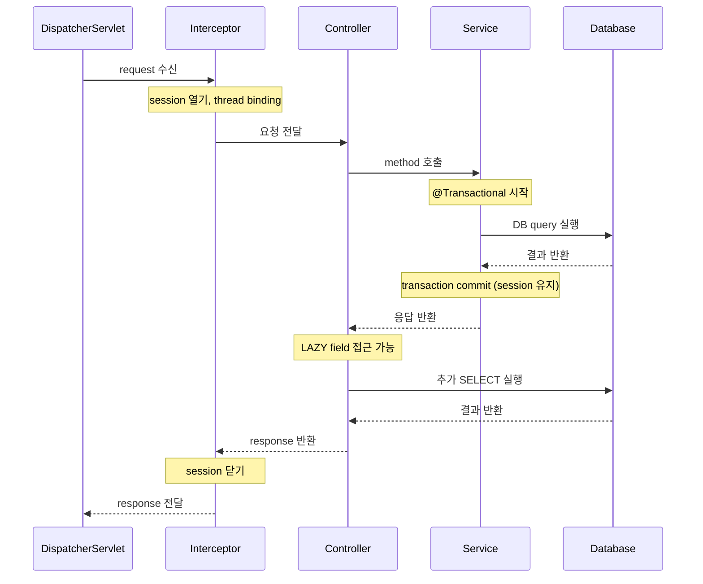

## Open-In-View란

- Open-In-View는 HTTP request 전체 수명 주기 동안 JPA `EntityManager`(Hibernate의 경우 `Session`)를 현재 thread에 binding하는 pattern입니다.
    - service 계층의 `@Transactional`이 끝난 후에도 view rendering이나 JSON 직렬화(serialization) 단계까지 LAZY loading이 가능합니다.
    - Spring Boot는 `OpenEntityManagerInViewInterceptor`를 자동 등록하여 기본적으로 활성화합니다.

- session이 request 전체 동안 열려 있으므로, controller에서 LAZY field에 접근해도 `LazyInitializationException` 없이 추가 `SELECT` query가 실행됩니다.


---


## 동작 방식

- request 수신 시점에 session을 생성하여 thread에 binding하고, response 완료 후 session을 닫습니다.
    - `@Transactional` service method는 이미 binding된 session을 재사용합니다.
    - transaction commit 후에도 session은 열린 상태를 유지하며, controller나 JSON 직렬화 단계에서 LAZY field에 접근하면 추가 `SELECT`가 실행됩니다.




---


## 기본값이 True인 이유

- Spring Boot 1.1.11부터 `spring.jpa.open-in-view`의 기본값은 `true`입니다.
    - 개발 편의성을 우선하여 `LazyInitializationException` 없이 어디서든 LAZY loading이 가능하도록 설계되었습니다.

- Spring Boot 2.0에서 기본값이 `true`일 때 경고 log를 출력하도록 변경되었습니다.
    - Spring Boot 4.0에서도 기본값은 `true`로 유지되었습니다.

```
spring.jpa.open-in-view is enabled by default. Therefore, database queries may be
performed during view rendering. Explicitly configure spring.jpa.open-in-view to
disable this warning
```


---


## 문제점

- Open-In-View는 개발 편의성을 높이지만, 운영 환경에서 성능과 일관성 문제를 유발하는 anti-pattern으로 간주됩니다.


### View 계층에서 DB Query 실행

- service transaction 종료 후 controller나 JSON 직렬화 단계에서 LAZY field에 접근하면 추가 `SELECT`가 실행됩니다.
    - Spring Boot 공식 경고 message도 "database queries may be performed during view rendering"이라 명시합니다.
    - DB 접근 logic이 service 계층이 아닌 view 계층에서 발생하므로 책임 분리 원칙에 위배됩니다.


### N+1 문제 은폐

- view 계층에서 연관 entity 접근이 N+1 query를 유발해도 Open-In-View가 투명하게 처리합니다.
    - 개발 단계에서 N+1을 인지하기 어렵고, 운영 환경에서 성능 저하가 발생한 뒤에야 뒤늦게 발견하는 원인이 됩니다.


### DB Connection 점유 시간 증가

- 첫 DB I/O 시점에 connection pool에서 connection을 빌린 후 HTTP request 종료까지 반환하지 않습니다.
    - 외부 API 호출 등 느린 작업과 결합되면 고트래픽 환경에서 connection pool 고갈 위험이 있습니다.


### Transaction 일관성 훼손

- service transaction 종료 후 view 계층의 LAZY loading은 별도 auto-commit transaction으로 실행됩니다.
    - service가 읽은 data와 view 계층이 나중에 읽은 연관 data 간에 불일치(inconsistent read)가 발생할 수 있습니다.


### Auto-Commit 남발로 DB 부하 증가

- view 계층의 LAZY loading이 statement마다 별도 auto-commit transaction으로 실행됩니다.
    - 개별 transaction마다 DB log 기록 비용이 발생하여 전체 DB 부하가 증가합니다.


---


## 비활성화 방법

- `spring.jpa.open-in-view`를 `false`로 설정하면 session이 `@Transactional` 경계 내에서만 유지됩니다.

```yaml
spring:
  jpa:
    open-in-view: false
```

- 비활성화 후 controller에서 LAZY field에 접근하면 `LazyInitializationException`이 발생합니다.
    - 문제가 즉시 가시화되어 N+1 등 잠재적 성능 문제를 개발 단계에서 발견할 수 있습니다.


---


## 비활성화 후 대안

- service 계층에서 필요한 data를 모두 fetch하고 DTO로 변환하여 반환하는 방식이 권장됩니다.
    - `@Transactional` 범위 안에서 모든 연관 data 접근과 변환을 완료하면 view 계층에서 추가 query가 발생하지 않습니다.


### Service 계층 DTO 변환

- transaction 안에서 필요한 연관 entity에 접근하고, DTO로 변환하여 반환합니다.

```java
@Transactional(readOnly = true)
public OrderResponse findOrder(Long id) {
    Order order = orderRepository.findWithMemberById(id).orElseThrow();
    return new OrderResponse(order.getId(), order.getMember().getName()); // transaction 안에서 변환 완료
}
```


### Fetch Join

- JPQL의 `JOIN FETCH`를 사용하면 연관 entity를 단일 query로 함께 조회합니다.

```java
@Query("SELECT DISTINCT o FROM Order o LEFT JOIN FETCH o.member WHERE o.id = :id")
Optional<Order> findWithMemberById(@Param("id") Long id);
```


### @EntityGraph

- `@EntityGraph`는 annotation 기반으로 fetch join과 동일한 효과를 제공합니다.

```java
@EntityGraph(attributePaths = {"member"})
Optional<Order> findById(Long id);
```


---


## 활성/비활성 비교

- Open-In-View 활성화 여부에 따라 session 수명 주기, LAZY loading 동작, connection 점유, N+1 가시성이 달라집니다.

| 구분 | open-in-view=true | open-in-view=false |
| --- | --- | --- |
| **session 생명주기** | HTTP request 시작 ~ 종료 | `@Transactional` 경계 내 |
| **view 계층 LAZY loading** | 가능 (추가 SELECT 실행) | `LazyInitializationException` 발생 |
| **DB connection 점유** | request 전체 동안 | transaction 종료 시 반환 |
| **N+1 가시성** | 은폐됨 | 개발 단계에서 즉시 노출 |


---


## Reference

- <https://vladmihalcea.com/the-open-session-in-view-anti-pattern/>
- <https://www.baeldung.com/spring-open-session-in-view>
- <https://github.com/spring-projects/spring-boot/issues/7107>
- <https://docs.spring.io/spring-framework/docs/current/javadoc-api/org/springframework/orm/jpa/support/OpenEntityManagerInViewInterceptor.html>

