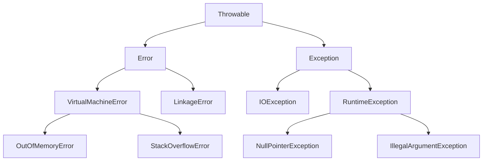

## Java 예외 계층 구조

- Java의 모든 예외와 오류는 **`Throwable` class를 최상위**로 하는 계층 구조를 가집니다.
    - `Error`는 복구 불가능한 시스템 수준의 문제입니다.
    - `Exception`은 program에서 처리할 수 있는 예외입니다.
    - `Throwable`을 상속받은 type만 `throw` keyword로 던질 수 있습니다.




---


## Throwable

- `Throwable`은 **모든 예외와 오류의 최상위 class**입니다.
    - `Error`와 `Exception`의 공통 부모 class입니다.
    - 직접 사용하기보다는 하위 class를 통해 예외를 처리합니다.
    - JVM이나 `throw` keyword로 던질 수 있는 유일한 type 계열입니다.


### 주요 Method

- `Throwable`은 **예외 정보를 제공하는 공통 method**를 정의합니다.

| Method | 설명 |
| --- | --- |
| `getMessage()` | 예외 message 반환 |
| `getCause()` | 원인이 되는 예외 반환 |
| `printStackTrace()` | stack trace를 출력 |
| `getStackTrace()` | stack trace를 배열로 반환 |


---


## Error

- `Error`는 **application이 복구할 수 없는 심각한 문제**를 나타냅니다.
    - runtime에 발생하며 예측이 불가능합니다.
    - JVM 수준의 문제로 code 수정 없이는 해결할 수 없습니다.
    - 예외 처리 대신 application이 종료되도록 두는 것이 일반적입니다.


### 주요 Error Type

- `VirtualMachineError`는 **JVM 동작에 치명적인 문제**가 발생했을 때 던져집니다.

| Error | 설명 |
| --- | --- |
| `OutOfMemoryError` | heap memory 부족 |
| `StackOverflowError` | stack memory 초과 (무한 재귀 등) |
| `InternalError` | JVM 내부 오류 |

- `LinkageError`는 **class loading 과정에서 문제**가 발생했을 때 던져집니다.

| Error | 설명 |
| --- | --- |
| `NoClassDefFoundError` | compile time에 존재하던 class를 찾을 수 없음 |
| `ClassFormatError` | class file 형식이 잘못됨 |
| `UnsatisfiedLinkError` | native library를 찾을 수 없음 |


### Error 대응 방법

- `Error`는 **예외 처리보다 근본적인 해결**이 필요합니다.
    - `OutOfMemoryError` : memory 사용량을 줄이거나 JVM heap 크기를 조정합니다.
    - `StackOverflowError` : 무한 재귀를 수정하거나 반복문으로 변경합니다.
    - `NoClassDefFoundError` : classpath와 dependency를 확인합니다.


---


## Exception

- `Exception`은 **program에서 처리할 수 있는 예외**를 나타냅니다.
    - `Error`와 달리 적절한 처리를 통해 program을 계속 실행할 수 있습니다.
    - checked exception과 unchecked exception으로 구분됩니다.


### Checked Exception과 Unchecked Exception

- Java의 `Exception`은 **처리 강제 여부**에 따라 두 종류로 나뉩니다.

| 구분 | Checked Exception | Unchecked Exception |
| --- | --- | --- |
| 처리 여부 | 반드시 처리해야 함 | 처리를 강제하지 않음 |
| 확인 시점 | compile time | runtime |
| 상속 관계 | `RuntimeException`을 제외한 `Exception` 하위 class | `RuntimeException` 하위 class |


### 주요 Checked Exception

- checked exception은 **compile time에 처리를 강제**합니다.

| Exception | 설명 |
| --- | --- |
| `IOException` | 입출력 작업 실패 |
| `FileNotFoundException` | file을 찾을 수 없음 |
| `SQLException` | database 작업 실패 |
| `ClassNotFoundException` | class를 동적으로 load할 수 없음 |


### 주요 Unchecked Exception

- unchecked exception은 **runtime에 발생하며 처리를 강제하지 않습니다.**

| Exception | 설명 |
| --- | --- |
| `NullPointerException` | null 참조에 접근 |
| `IllegalArgumentException` | 잘못된 인자 전달 |
| `IndexOutOfBoundsException` | 배열 또는 list 범위 초과 |
| `ClassCastException` | 잘못된 type casting |


---


## Exception 처리 전략

- 예외 처리에는 **세 가지 주요 전략**이 있습니다.
    - 예외 복구 : 문제를 해결하고 정상 흐름으로 복귀합니다.
    - 예외 회피 : 호출자에게 예외 처리를 위임합니다.
    - 예외 전환 : 더 명확한 예외로 변환하여 던집니다.


### 예외 복구

- 예외 상황을 파악하고 **정상 상태로 복구**하는 방법입니다.
    - 재시도 logic을 통해 일시적인 오류를 극복합니다.
    - 최대 재시도 횟수를 초과하면 예외를 발생시킵니다.

```java
public Object fetchWithRetry() {
    int maxRetry = 3;

    while (maxRetry > 0) {
        try {
            return externalService.fetch();
        } catch (TemporaryException e) {
            maxRetry--;
            sleep(1000);
        }
    }

    throw new RetryFailedException("재시도 횟수 초과");
}
```


### 예외 회피

- 예외 처리를 직접 수행하지 않고 **호출자에게 위임**하는 방법입니다.
    - method signature에 `throws`를 선언하여 예외를 전파합니다.
    - 긴밀한 역할 분담이 있는 경우에만 사용해야 합니다.

```java
public void processFile(String path) throws IOException {
    BufferedReader reader = new BufferedReader(new FileReader(path));
    // file 처리 logic
}
```

- 예외를 log로 기록한 후 다시 던지는 pattern도 있습니다.

```java
public void processFile(String path) throws IOException {
    try {
        BufferedReader reader = new BufferedReader(new FileReader(path));
        // file 처리 logic
    } catch (IOException e) {
        logger.error("file 처리 실패 : {}", path, e);
        throw e;
    }
}
```


### 예외 전환

- 발생한 예외를 **더 명확한 의미의 예외로 변환**하여 던지는 방법입니다.
    - 저수준 예외를 domain에 맞는 고수준 예외로 변환합니다.
    - 여러 예외를 하나의 포괄적인 예외로 wrapping합니다.

```java
public void createUser(User user) throws DuplicateUserException {
    try {
        userRepository.save(user);
    } catch (SQLException e) {
        if (e.getErrorCode() == DUPLICATE_KEY_ERROR) {
            throw new DuplicateUserException("이미 존재하는 사용자", e);
        }
        throw new DataAccessException("database 오류", e);
    }
}
```


---


## 예외 처리 권장 사항

- 예외를 효과적으로 처리하기 위한 **권장 pattern**입니다.


### 구체적인 예외 사용

- `Exception`보다 **구체적인 예외 type**을 사용합니다.
    - 문제의 원인을 명확히 전달합니다.
    - 호출자가 적절한 처리를 할 수 있도록 합니다.

```java
// 권장하지 않음
throw new Exception("오류 발생");

// 권장
throw new IllegalArgumentException("사용자 ID는 null일 수 없습니다");
```


### 예외 원인 보존

- 예외를 전환할 때 **원인 예외를 함께 전달**합니다.
    - 생성자의 `cause` parameter를 활용합니다.
    - debugging 시 원래 stack trace를 확인할 수 있습니다.

```java
catch (SQLException e) {
    throw new DataAccessException("database 연결 실패", e);  // 원인 포함
}
```


### 예외 무시 금지

- catch block에서 **예외를 무시하지 않습니다.**
    - 최소한 log를 기록해야 합니다.
    - 빈 catch block은 문제 진단을 어렵게 합니다.

```java
// 잘못된 예
catch (Exception e) {
    // 아무것도 하지 않음
}

// 올바른 예
catch (Exception e) {
    logger.warn("예외 발생, 무시함", e);
}
```


---


## Reference

- <https://docs.oracle.com/javase/tutorial/essential/exceptions/>
- <https://docs.oracle.com/javase/8/docs/api/java/lang/Throwable.html>

