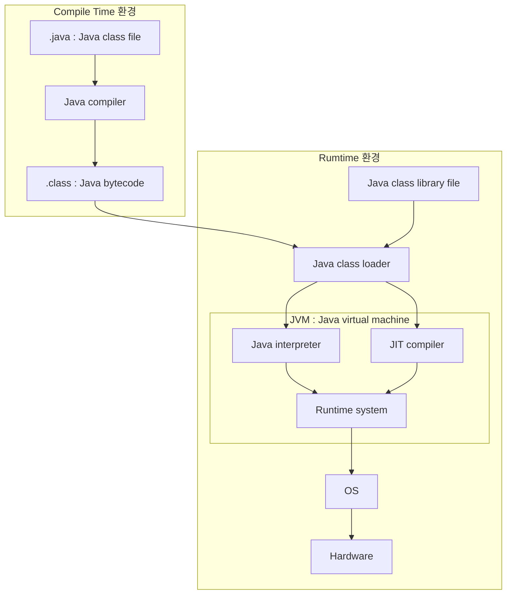

## Java : 가장 인기 있는 객체 지향 Programming 언어

- Java는 Sun Microsystems에서 개발하여 1996년에 공식적으로 발표되었습니다.
- Java의 slogan은 WORA(`Write Once Run Anywhere`)입니다.
    - program을 한번 작성해서 실행하고 나면, 언제 어디서든 system 상관없이 사용할 수 있다는 뜻입니다.
    - 예를 들어, C 언어 program은 운영 체제에 따라 달라지는 부분을 source code에서 수정해야 하지만, Java program은 모든 운영 체제에서 동일한 source code로 실행할 수 있습니다.
- 대표적인 객체 지향 programming 언어입니다.

---

## Web 출현과 Java의 발전

- Java는 **internet**과 **WWW**(World Wide Web)의 출현으로 당시 software project의 선두로 부상하게 됩니다.
    - Web 환경은 이식 가능한 언어를 요구합니다.
        - internet은 다양한 computer, 운영 체제, CPU로 넘쳐나는 광대한 분산형 system이기 때문입니다.
    - Java의 뛰어난 이식성은 Web 개발에 적합합니다.

---

## Java의 특징

### 객체 지향 Programming 언어

- Java는 OOP(Object-Oriented Programming)에 적합한 언어입니다.
- 객체 지향적으로 개발하면 직관적으로 code를 분석할 수 있어 유지 보수가 쉬워집니다.

### Multi Thread 지원

- multi thread로 여러 작업을 나눠서 동시에 수행할 수 있고, 작업을 보다 효율적으로 처리할 수 있습니다.

### ️뛰어닌 이식성

- 운영 체제와 CPU에 상관없이 다양한 환경에서 실행할 수 있습니다.
    - JVM(Java Virtual Machine)에서 작동하기 때문입니다.

### Memory 관리

- **memory를 Java가 직접 관리**하며, 개발자는 memory에 접근할 수 없습니다.
    - Java가 객체를 생성할 때 알아서 memory에 할당합니다.
    - Java가 **Garbage Collector**를 주기적으로 실행시켜 사용 완료된 객체를 memory에서 반환해줍니다.

### 방대한 Open Source Library

- Java는 open source 언어이며, Java program에서 사용하는 open source library가 많습니다.
- 고급 기능을 구현하는 code를 직접 작성하는 대신 검증된 open source library를 사용할 수 있습니다.

---

## Java Program의 실행

1. Java로 code(`.java` file)를 작성합니다.
2. Java compiler(`javac`)로 compile하여 bytecode(`.class` file)를 만듭니다.
3. Java class loader로 bytecode를 JVM Runtime Data Area에 loading합니다.
4. load된 bytecode를 실행 장비에 설치된 JVM(Java Virtual Machine)에 가져갑니다.
5. 장비가 Java program 실행을 요청할 때마다 JVM이 bytecode를 기계어로 해석하여 실행합니다.

---

## Reference

- <https://coding-factory.tistory.com/827>
