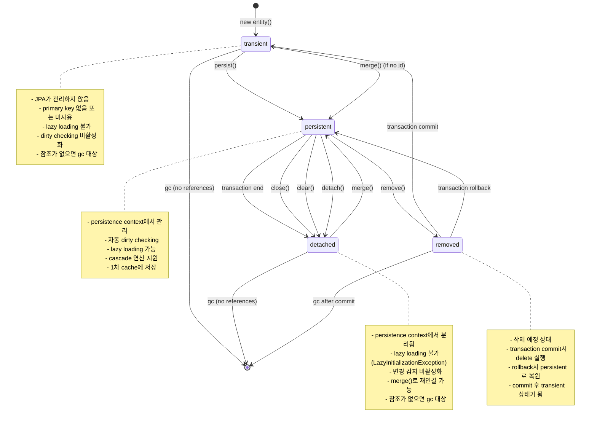

## JPA Entity 생명 주기

- JPA entity는 **Transient**, **Persistent**, **Detached**, **Removed**의 네 가지 상태를 가집니다.
- 각 상태 간의 **전환**은 EntityManager의 method 호출이나 **transaction 경계**에 의해 발생합니다.
- entity 상태를 정확히 이해하는 것은 **JPA 활용의 핵심**이며, 성능과 data 일관성에 직접적인 영향을 미칩니다.


---


## Entity 상태

- JPA entity의 상태는 **persistence context와의 관계**에 따라 결정됩니다.
- 각 상태에서 **사용 가능한 기능**과 **제약 사항**이 다르므로 정확한 이해가 필요합니다.
- 상태 전환은 **예측 가능한 규칙**에 따라 발생하며, 개발자가 **명시적으로 제어**할 수 있습니다.


### Entity State Diagram




---


## Entity 상태 상세 설명

- JPA entity의 상태는 **persistence context와의 관계**에 따라 결정됩니다.
- 각 상태에서 **사용 가능한 기능**과 **제약 사항**이 다르므로 정확한 이해가 필요합니다.
- 상태 전환은 **예측 가능한 규칙**에 따라 발생하며, 개발자가 **명시적으로 제어**할 수 있습니다.


### 상태 분류 기준

- **persistence context 관리 여부** : JPA가 해당 entity를 추적하고 관리하는지가 핵심 기준입니다.
    - Persistent 상태만 persistence context에서 관리됩니다.
    - 나머지 상태는 JPA 관리 영역 밖에 있거나 특수한 상태입니다.

- **database 동기화 상태** : entity가 database와 동기화되어 있는지 여부입니다.
    - Persistent 상태에서만 자동 동기화가 이루어집니다.
    - Detached 상태는 과거에 동기화되었지만 현재는 분리된 상태입니다.

- **JPA 기능 활용 가능성** : lazy loading, dirty checking, cascade 등의 JPA 고급 기능 사용 여부입니다.
    - Persistent 상태에서만 모든 JPA 기능을 활용할 수 있습니다.
    - 다른 상태에서는 기능이 제한되거나 완전히 비활성화됩니다.


### 상태 전환 Trigger

- **EntityManager method 호출** : `persist()`, `merge()`, `remove()`, `detach()` 등의 method가 상태를 변경합니다.
    - 각 method는 특정한 상태 전환 규칙을 가지고 있습니다.
    - method 호출 즉시 상태가 변경되지만, database 반영은 transaction commit 시점에 발생합니다.

- **transaction 경계** : transaction의 시작과 종료가 entity 상태에 영향을 미칩니다.
    - transaction commit 시 변경 사항이 database에 반영됩니다.
    - transaction 종료 시 entity는 보통 Detached 상태가 됩니다.

- **EntityManager 생명 주기** : EntityManager의 close나 clear 호출이 상태를 변경합니다.
    - EntityManager가 close되면 관리하던 모든 entity가 Detached 상태가 됩니다.
    - `clear()` 호출 시 persistence context의 모든 entity가 detach됩니다.


## 상태별 특징 비교

| 특성 | Transient | Persistent | Detached | Removed |
| --- | --- | --- | --- | --- |
| **JPA 관리 여부** | 관리하지 않음 | 관리함 | 관리하지 않음 | 관리함 |
| **Persistence Context 포함** | 아니오 | 예 | 아니오 | 예 |
| **Primary Key** | 없거나 미사용 | 있음 | 있음 | 있음 |
| **Database 동기화** | 없음 | 자동 동기화 | 분리됨 | 삭제 예정 |
| **Dirty Checking** | 비활성화 | 활성화 | 비활성화 | 비활성화 |
| **Lazy Loading** | 불가능 | 가능 | 불가능 (LazyInitializationException) | 가능 |
| **Cascade 연산** | 적용 안됨 | 적용됨 | 적용 안됨 | 적용됨 |
| **1차 Cache** | 없음 | 저장됨 | 없음 | 저장됨 |
| **Transaction Commit 시** | 영향 없음 | INSERT/UPDATE | 영향 없음 | DELETE |
| **상태 전환 방법** | persist(), merge() | detach(), remove(), transaction 종료 | merge() | commit → Transient, rollback → Persistent |
| **Memory 관리** | GC 대상 | JPA가 관리 | GC 대상 | JPA가 관리 (임시) |
| **사용 사례** | 새 객체 생성, 임시 객체 | 일반적인 CRUD 작업 | View layer 전달, Long conversation | 삭제 작업 |


---


## Transient State (비영속 상태) : Persistence Context에 들어가기 전 상태

- **JPA가 관리하지 않는 상태**로, 일반적인 Java 객체와 동일합니다.
- `new` keyword로 생성된 직후의 entity가 이 상태에 해당합니다.
- database에 저장되지 않았고, **JPA의 어떤 기능도 사용할 수 없는** 순수한 Java 객체 상태입니다.


### Transient 상태의 특징

- **persistence context 비관리** : JPA가 이 객체의 존재를 알지 못합니다.
    - persistence context와 아무런 연관이 없으며, entity manager가 추적하지 않습니다.
    - 객체의 변경 사항이 database에 자동으로 반영되지 않습니다.
    - primary key 값이 없거나 있어도 database와 연결되지 않은 상태입니다.

- **JPA 기능 비활성화** : 모든 JPA 고급 기능이 동작하지 않습니다.
    - lazy loading 시도 시 관련 객체가 loading되지 않고 null이나 초기값을 유지합니다.
    - cascade 연산이 수행되지 않아 연관 entity에 영향을 주지 않습니다.
    - dirty checking이 동작하지 않아 변경 감지가 이루어지지 않습니다.

- **memory 관리** : 일반적인 Java 객체와 동일한 memory 관리 규칙을 따릅니다.
    - garbage collection의 대상이 되며, 참조가 없으면 memory에서 제거됩니다.
    - JPA와 무관하게 Java의 객체 생명 주기를 따릅니다.


### Transient 상태 사용 사례

- **entity 생성 초기 단계** : 새로운 entity를 생성하고 필수 정보를 설정하는 단계입니다.
    - business logic에서 entity의 초기값을 설정하고 validation을 수행합니다.
    - 여러 entity를 조합하여 복잡한 domain object를 구성할 때 사용합니다.

- **temporary object** : 일시적으로 사용되는 계산용 객체나 transfer object로 활용합니다.
    - database에 저장할 필요 없이 business logic 처리에만 사용되는 경우입니다.
    - client로 전송되는 response object나 internal processing용 object로 사용합니다.

- **batch processing 준비** : 대량의 entity를 생성한 후 한 번에 persist하는 경우에 사용합니다.
    - file이나 external system에서 읽어온 data로 entity를 생성합니다.
    - validation과 transformation을 거친 후 batch로 database에 저장합니다.


### Persistent 상태로의 전환

- **persist() method 사용** : transient entity를 persistence context에 등록합니다.
    - `entityManager.persist(entity)` 호출로 즉시 Persistent 상태가 됩니다.
    - entity에 primary key가 자동 생성되는 경우 즉시 할당됩니다.
    - transaction commit 시점에 INSERT query가 실행됩니다.

- **cascade persist** : 연관 entity의 cascade 설정을 통해 자동으로 persist될 수 있습니다.
    - `CascadeType.PERSIST`나 `CascadeType.ALL` 설정이 있는 관계에서 발생합니다.
    - 부모 entity가 persist될 때 자식 entity도 함께 persist됩니다.
    - 복잡한 객체 그래프를 한 번에 저장할 때 유용합니다.

- **merge() method 사용** : 경우에 따라 transient entity도 merge를 통해 persistent가 될 수 있습니다.
    - primary key가 없는 transient entity를 merge하면 새로운 persistent entity가 생성됩니다.
    - 하지만 일반적으로는 persist() 사용을 권장합니다.


---


## Persistent State (영속 상태) : Persistence Context에 관리되고 있는 상태

- **persistence context에서 관리되는 상태**로, JPA의 모든 기능을 활용할 수 있습니다.
    - JPA 명세에서는 persistent, Hibernate 등 구현체에서는 managed라고도 부르며 같은 의미입니다.
- database의 record와 **동기화된 상태**를 유지하며, entity의 변경 사항이 **자동으로 감지**됩니다.
- JPA의 **핵심 기능들**이 모두 활성화되어 개발자에게 최대한의 편의성을 제공합니다.


### Persistent 상태의 핵심 기능

- **자동 변경 감지 (Dirty Checking)** : entity의 상태 변화를 자동으로 감지하고 database에 반영합니다.
    - transaction commit 시점에 변경된 field에 대해 UPDATE query가 자동 생성됩니다.
    - 개발자가 명시적으로 save나 update method를 호출할 필요가 없습니다.
    - snapshot 비교를 통해 변경 여부를 판단하며, 변경된 field만 UPDATE에 포함됩니다.

- **1차 cache 지원** : 같은 persistence context 내에서 entity의 uniqueness를 보장합니다.
    - primary key를 기반으로 같은 entity는 하나의 instance만 존재합니다.
    - 같은 entity를 여러 번 조회해도 database 접근은 한 번만 발생합니다.
    - memory 내에서 entity 간 참조 무결성이 자동으로 유지됩니다.

- **lazy loading 지원** : 연관된 entity나 collection을 필요한 시점에 loading합니다.
    - proxy 객체를 통해 실제 database 접근을 필요한 시점까지 지연시킵니다.
    - `@OneToMany(fetch = FetchType.LAZY)` 등의 설정에 따라 지연 loading이 수행됩니다.
    - persistence context가 활성화된 상태에서만 lazy loading이 정상 동작합니다.

- **cascade 연산 지원** : 연관된 entity에 대한 cascade 작업이 자동으로 수행됩니다.
    - CascadeType 설정에 따라 연관 entity의 상태 변화도 함께 전파됩니다.
    - 복잡한 객체 그래프의 일관성을 자동으로 유지할 수 있습니다.
    - parent-child 관계에서 부모의 상태 변화가 자식에게 자동으로 적용됩니다.


### Dirty Checking Mechanism

- **snapshot 기반 변경 감지** : entity가 persistence context에 등록될 때 초기 상태의 snapshot을 생성합니다.
    - transaction commit 시점에 현재 상태와 snapshot을 비교하여 변경 사항을 파악합니다.
    - 변경된 field만 식별하여 최적화된 UPDATE query를 생성합니다.
    - primitive type과 immutable object의 변경은 reference 비교로 빠르게 감지됩니다.

- **변경 감지 timing** : 특정 시점에 변경 감지와 SQL 생성이 수행됩니다.
    - transaction commit 시점이 기본적인 dirty checking 수행 시점입니다.
    - `flush()` method 호출 시에도 변경 감지가 수행됩니다.
    - JPQL query 실행 전에 auto flush가 발생하여 consistency를 보장합니다.

- **성능 최적화** : 불필요한 UPDATE를 방지하여 성능을 최적화합니다.
    - 실제로 변경된 field가 없으면 UPDATE query가 생성되지 않습니다.
    - 같은 값으로 설정하더라도 dirty checking에서 변경으로 감지되지 않습니다.
    - Hibernate의 경우 `@DynamicUpdate` annotation으로 변경된 column만 UPDATE할 수 있습니다.


### Persistent 상태에서의 연관 관계 관리

- **bidirectional relationship 동기화** : 양방향 연관 관계에서 양쪽 entity의 상태를 동기화합니다.
    - 한쪽에서 관계를 설정하면 반대쪽에서도 관계가 자동으로 설정되어야 합니다.
    - convenience method를 통해 양방향 관계의 일관성을 보장할 수 있습니다.
    - 관계 설정 시 기존 관계의 정리도 함께 수행해야 합니다.

- **collection 관리** : 연관된 collection의 변경 사항도 자동으로 추적됩니다.
    - collection에 element를 추가하거나 제거하면 적절한 INSERT/DELETE query가 생성됩니다.
    - `@OneToMany`의 경우 foreign key update나 join table manipulation이 수행됩니다.
    - collection의 순서 변경도 감지되어 database에 반영됩니다.

- **orphan removal** : 부모와의 관계가 끊어진 자식 entity를 자동으로 삭제합니다.
    - `orphanRemoval = true` 설정 시 부모에서 제거된 자식 entity가 database에서도 삭제됩니다.
    - collection에서 element를 제거할 때 해당 entity가 완전히 삭제됩니다.
    - parent-child 관계에서 data 일관성을 자동으로 유지하는 강력한 기능입니다.


---


## Detached State (준영속 상태) : Persistence Context에서 분리된 상태

- **persistence context에서 분리된 상태**로, database와의 동기화가 끊어진 상태입니다.
- 과거에는 persistent 상태였지만 현재는 JPA 관리 영역 밖에 있는 entity입니다.
- **JPA 기능이 제한**되지만 entity 자체는 여전히 존재하며, **재연결**을 통해 다시 persistent 상태로 만들 수 있습니다.


### Detached 상태가 되는 경우

- **transaction 종료** : transaction이 commit되거나 rollback될 때 entity가 detached됩니다.
    - transaction 범위를 벗어나면 persistence context가 종료되면서 모든 entity가 detached됩니다.
    - Spring의 `@Transactional` method가 끝나면 해당 scope의 entity들이 detached됩니다.
    - 이는 JPA의 기본적인 생명 주기 pattern입니다.

- **EntityManager 종료** : EntityManager가 close되거나 clear될 때 detached됩니다.
    - `entityManager.close()` 호출 시 관리하던 모든 entity가 detached됩니다.
    - `entityManager.clear()` 호출 시 persistence context의 모든 entity가 detach됩니다.
    - container 환경에서는 EntityManager의 생명 주기가 자동으로 관리됩니다.

- **명시적 detach** : 개발자가 의도적으로 entity를 detach시킬 수 있습니다.
    - `entityManager.detach(entity)` 호출로 특정 entity만 detach합니다.
    - memory 사용량 최적화나 특수한 business logic에서 사용됩니다.
    - 일반적으로는 거의 사용되지 않는 고급 기능입니다.


### Detached 상태의 제약 사항

- **lazy loading 불가** : 연관된 entity나 collection을 loading할 수 없습니다.
    - lazy loading 시도 시 `LazyInitializationException`이 발생합니다.
    - proxy 객체에 접근해도 실제 data가 loading되지 않습니다.
    - 필요한 data는 persistent 상태에서 미리 loading해야 합니다.

- **자동 변경 감지 비활성화** : entity의 변경 사항이 database에 자동으로 반영되지 않습니다.
    - field 값을 변경해도 UPDATE query가 생성되지 않습니다.
    - 변경 사항을 반영하려면 merge()를 통해 다시 persistent 상태로 만들어야 합니다.
    - dirty checking이 동작하지 않아 개발자가 직접 관리해야 합니다.

- **cascade 연산 비활성화** : 연관 entity에 대한 cascade 작업이 수행되지 않습니다.
    - 연관 entity를 추가하거나 제거해도 database에 반영되지 않습니다.
    - cascade delete나 cascade persist가 동작하지 않습니다.
    - 각 entity를 개별적으로 관리해야 합니다.


### Detached Entity 활용 Pattern

- **presentation layer 전달** : web application에서 view layer로 entity를 전달할 때 사용됩니다.
    - service layer에서 조회한 entity를 controller나 view에서 사용합니다.
    - JSON serialization을 통해 client에게 전달되는 경우가 많습니다.
    - lazy loading 문제를 피하기 위해 필요한 data를 미리 fetch합니다.

- **long conversation** : 여러 request에 걸쳐 entity를 유지해야 하는 경우 사용됩니다.
    - wizard 형태의 multi-step form에서 entity를 session에 보관합니다.
    - 사용자가 여러 화면에서 entity를 수정한 후 최종적으로 저장합니다.
    - optimistic locking을 통해 concurrent modification을 방지합니다.

- **cache 활용** : application level cache에서 entity를 보관할 때 detached 상태로 유지됩니다.
    - 2차 cache에서 조회된 entity는 detached 상태입니다.
    - cache hit 시 detached entity를 다시 persistent 상태로 만들어 사용합니다.
    - cache 전략과 entity lifecycle을 조화롭게 관리해야 합니다.


### Persistent 상태로의 복귀

- **merge() method 사용** : detached entity를 다시 persistent 상태로 만드는 표준 방법입니다.
    - `Entity managedEntity = entityManager.merge(detachedEntity)`로 사용합니다.
    - 기존 persistent entity와 detached entity를 비교하여 변경 사항을 반영합니다.
    - 새로운 persistent instance가 반환되며, 원래 detached instance는 그대로 유지됩니다.

- **merge 동작 mechanism** : database의 현재 상태와 detached entity를 비교합니다.
    - primary key를 기준으로 database에서 최신 data를 조회합니다.
    - detached entity의 변경 사항과 database의 현재 상태를 비교합니다.
    - 필요한 경우 UPDATE query를 생성하여 변경 사항을 반영합니다.

- **version 기반 optimistic locking** : concurrent modification을 방지합니다.
    - `@Version` annotation을 사용하여 entity의 version을 관리합니다.
    - merge 시 version 비교를 통해 다른 transaction의 변경 여부를 확인합니다.
    - version conflict 발생 시 `OptimisticLockException`이 발생합니다.


---


## Removed State (삭제 상태) : Persistence Context에서 삭제 예정인 상태

- **삭제 예정 상태**로, database에서 제거될 예정인 entity를 나타냅니다.
- transaction commit 시점까지는 persistence context에 존재하지만, **DELETE query 실행 예정**인 특수한 상태입니다.
- transaction의 **rollback 가능성**을 고려하여 즉시 삭제하지 않고 commit 시점까지 유예합니다.


### Removed 상태로의 전환

- **remove() method 호출** : persistent entity를 removed 상태로 전환합니다.
    - `entityManager.remove(entity)` 호출로 즉시 removed 상태가 됩니다.
    - entity는 여전히 persistence context에 존재하지만 삭제 예정으로 marking됩니다.
    - transaction commit 시점에 DELETE query가 실행됩니다.

- **cascade remove** : 연관 entity의 cascade 설정을 통해 자동으로 removed 상태가 될 수 있습니다.
    - `CascadeType.REMOVE`나 `CascadeType.ALL` 설정이 있는 관계에서 발생합니다.
    - 부모 entity가 삭제될 때 자식 entity도 함께 삭제됩니다.
    - `orphanRemoval = true` 설정 시에도 자동으로 removed 상태가 됩니다.

- **bulk delete** : JPQL의 DELETE 문을 통해 여러 entity를 한 번에 removed 상태로 만들 수 있습니다.
    - `DELETE FROM Entity e WHERE e.condition = :value` 형태로 사용합니다.
    - 하지만 bulk delete는 persistence context를 bypass하므로 주의가 필요합니다.


### Removed 상태의 특징

- **persistence context 유지** : 삭제 예정이지만 여전히 persistence context에서 관리됩니다.
    - transaction 내에서는 여전히 entity에 접근할 수 있습니다.
    - lazy loading이나 연관 관계 탐색도 여전히 가능합니다.
    - 하지만 새로운 연관 관계 설정은 제한될 수 있습니다.

- **DELETE query 지연 실행** : 실제 DELETE query는 transaction commit 시점에 실행됩니다.
    - SQL 실행 순서는 JPA provider가 최적화하여 결정합니다.
    - foreign key 제약 조건을 고려하여 적절한 순서로 DELETE를 수행합니다.
    - 연관된 entity들의 삭제 순서도 자동으로 조정됩니다.

- **rollback 시 복원** : transaction rollback 시 removed 상태가 취소됩니다.
    - entity는 다시 persistent 상태로 돌아갑니다.
    - database에는 여전히 record가 존재하므로 data 손실이 없습니다.
    - 이는 transaction의 ACID 특성을 보장하는 중요한 mechanism입니다.


### 삭제 과정에서의 고려 사항

- **foreign key 제약 조건** : 연관된 entity와의 관계를 고려하여 삭제 순서를 결정해야 합니다.
    - 자식 entity를 먼저 삭제한 후 부모 entity를 삭제하는 것이 일반적입니다.
    - foreign key 제약 조건 위반 시 database error가 발생할 수 있습니다.
    - cascade delete 설정을 통해 관련 entity들을 자동으로 정리할 수 있습니다.

- **orphan removal과의 차이** : orphanRemoval과 cascade remove는 서로 다른 개념입니다.
    - orphanRemoval은 부모와의 관계가 끊어진 자식을 삭제합니다.
    - cascade remove는 부모가 삭제될 때 자식도 함께 삭제합니다.
    - 두 기능을 함께 사용하면 강력한 data 정리 mechanism을 구현할 수 있습니다.

- **soft delete pattern** : 물리적 삭제 대신 논리적 삭제를 구현할 수 있습니다.
    - `deleted` flag나 `deletedAt` timestamp를 사용하여 삭제 표시만 합니다.
    - `@Where` annotation이나 `@Filter`를 통해 삭제된 record를 자동으로 제외합니다.
    - audit trail이나 data recovery가 필요한 system에서 유용합니다.


### Transaction 종료 후 상태

- **commit 후 transient 상태** : transaction commit 후에는 transient 상태가 됩니다.
    - database에서 완전히 제거되므로 더 이상 persistent entity가 아닙니다.
    - Java 객체 자체는 여전히 memory에 존재할 수 있지만 JPA 관리 대상이 아닙니다.
    - 해당 객체를 다시 사용하려면 새로운 entity로 persist해야 합니다.

- **rollback 후 persistent 상태** : transaction rollback 시에는 다시 persistent 상태로 돌아갑니다.
    - 삭제 작업이 취소되어 원래 상태로 복원됩니다.
    - 모든 JPA 기능이 다시 활성화되어 정상적으로 사용할 수 있습니다.
    - 이는 transaction의 atomicity를 보장하는 중요한 특성입니다.


---


## 상태 전환 실습 예제

- entity 상태 전환을 이해하기 위해서는 **실제 code를 통한 실습**이 필요합니다.
- 각 상태에서 **어떤 일이 발생하는지** 직접 확인하고 **SQL 생성 pattern**을 관찰해야 합니다.
- **transaction 경계**와 **EntityManager 생명 주기**에 따른 상태 변화를 체험해야 합니다.


### 기본 상태 전환 예제

```java
// Transient 상태
User user = new User("John", "john@example.com");
// 이 시점에서는 JPA가 관리하지 않음

// Persistent 상태로 전환
entityManager.persist(user);
// 즉시 Persistent 상태가 되지만 아직 INSERT SQL은 실행되지 않음

// Persistent 상태에서 변경
user.setEmail("john.doe@example.com");
// dirty checking에 의해 변경 사항이 추적됨

// transaction commit 시점에 INSERT와 UPDATE SQL 실행
```

- **SQL 실행 timing** : persist() 호출 시점이 아닌 transaction commit 시점에 SQL이 실행됩니다.
    - `hibernate.show_sql=true` 설정으로 실제 SQL 실행을 확인할 수 있습니다.
    - flush() method를 호출하여 강제로 SQL을 실행할 수도 있습니다.

- **primary key 생성** : entity의 ID generation 전략에 따라 다르게 동작합니다.
    - IDENTITY 전략 사용 시 persist() 호출 즉시 INSERT가 실행될 수 있습니다.
    - SEQUENCE나 TABLE 전략 사용 시 ID만 미리 할당하고 INSERT는 지연됩니다.


### Detached 상태 처리 예제

```java
// transaction 1에서 entity 조회
User user;
@Transactional
public void findUser() {
    user = entityManager.find(User.class, 1L);
    // 이 시점에서는 Persistent 상태
}
// transaction 종료 시 Detached 상태가 됨

// transaction 2에서 변경 시도
@Transactional
public void updateUser() {
    user.setEmail("new@example.com");
    // Detached 상태이므로 변경이 database에 반영되지 않음
    
    // merge를 통해 다시 Persistent 상태로 만들어야 함
    User managedUser = entityManager.merge(user);
    managedUser.setEmail("new@example.com");
    // 이제 변경 사항이 database에 반영됨
}
```

- **merge() 동작 확인** : merge는 새로운 persistent instance를 반환합니다.
    - 원래 detached instance는 여전히 detached 상태로 남아있습니다.
    - 반환된 managed instance를 사용해야 변경 사항이 반영됩니다.
    - 실수로 detached instance를 계속 사용하면 변경이 무시됩니다.

- **LazyInitializationException 처리** : detached entity의 lazy property에 접근할 때 발생합니다.
    - persistent 상태에서 필요한 연관 entity를 미리 fetch해야 합니다.
    - `JOIN FETCH`를 사용하여 연관 entity를 함께 조회합니다.
    - DTO projection을 활용하여 필요한 data만 조회하는 방법도 있습니다.


### Removed 상태 처리 예제

```java
@Transactional
public void deleteUser() {
    User user = entityManager.find(User.class, 1L);
    // Persistent 상태
    
    entityManager.remove(user);
    // 즉시 Removed 상태가 되지만 아직 DELETE SQL은 실행되지 않음
    
    // 여전히 persistence context에 존재하므로 접근 가능
    System.out.println(user.getName()); // 정상 동작
    
    // transaction commit 시점에 DELETE SQL 실행
}
```

- **cascade delete 확인** : 연관 entity도 함께 삭제되는 과정을 관찰합니다.
    - `CascadeType.REMOVE` 설정이 있는 관계에서 자동 삭제가 발생합니다.
    - foreign key 제약 조건을 고려한 삭제 순서를 확인할 수 있습니다.
    - orphanRemoval과 cascade delete의 차이점을 실습으로 이해할 수 있습니다.

- **rollback 시 복원** : transaction rollback 시 removed entity가 복원되는 과정을 확인합니다.
    - exception 발생 시 entity가 다시 persistent 상태로 돌아갑니다.
    - database에는 여전히 record가 존재하므로 data 무결성이 보장됩니다.


### 복잡한 상태 전환 Scenario

```java
@Transactional
public void complexStateTransition() {
    // 1. Transient -> Persistent
    User user = new User("Alice", "alice@example.com");
    entityManager.persist(user);
    
    // 2. Persistent 상태에서 변경
    user.setEmail("alice.smith@example.com");
    
    // 3. 일시적으로 detach
    entityManager.detach(user);
    user.setName("Alice Smith"); // 이 변경은 무시됨
    
    // 4. 다시 merge로 persistent 상태로
    User managedUser = entityManager.merge(user);
    
    // 5. 최종적으로 remove
    entityManager.remove(managedUser);
    
    // commit 시점에 INSERT -> UPDATE -> DELETE 순서로 SQL 실행
}
```

- **SQL 실행 순서 최적화** : JPA provider가 효율적인 SQL 실행 순서를 결정합니다.
    - 불필요한 INSERT 후 DELETE를 피하기 위해 SQL을 최적화할 수 있습니다.
    - Hibernate의 경우 entity 상태 변화를 분석하여 최소한의 SQL만 실행합니다.


---


## 상태 관리 Best Practice

- entity 상태를 올바르게 관리하기 위한 **실무 지침**과 **주의 사항**을 숙지해야 합니다.
- **성능 최적화**와 **data 일관성**을 동시에 고려한 설계가 필요합니다.
- **common pitfalls**를 피하고 **안정적인 application**을 구축해야 합니다.


### Transaction 경계 설계

- **적절한 transaction scope** : business logic의 단위에 맞춰 transaction 경계를 설정합니다.
    - 하나의 business operation은 하나의 transaction으로 처리하는 것이 원칙입니다.
    - 너무 긴 transaction은 lock contention과 memory 사용량 증가를 야기합니다.
    - 너무 짧은 transaction은 data 일관성 문제를 발생시킬 수 있습니다.

- **service layer transaction 관리** : presentation layer와 persistence layer를 분리합니다.
    - `@Transactional` annotation을 service method에 적용하여 명확한 경계를 설정합니다.
    - controller에서는 detached entity를 다루고, service에서 persistent entity를 관리합니다.
    - 여러 service method를 조합할 때는 transaction propagation을 신중히 고려합니다.

- **read-only transaction 활용** : 조회 전용 작업에서는 read-only transaction을 사용합니다.
    - `@Transactional(readOnly = true)` 설정으로 성능을 최적화합니다.
    - dirty checking이 비활성화되어 memory 사용량과 CPU 사용량이 줄어듭니다.
    - database connection pool에서도 read-only connection을 별도로 관리할 수 있습니다.


### Lazy Loading 전략

- **필요한 data 미리 fetch** : detached 상태에서 필요한 data를 사용할 수 있도록 준비합니다.
    - `JOIN FETCH`를 사용하여 연관 entity를 함께 조회합니다.
    - entity graph를 활용하여 동적으로 fetch 전략을 결정합니다.
    - batch fetching을 통해 N+1 query 문제를 해결합니다.

- **DTO projection 활용** : 복잡한 entity 대신 필요한 data만 담은 DTO를 사용합니다.
    - presentation layer에서는 entity 대신 DTO를 사용하여 lazy loading 문제를 원천 차단합니다.
    - query 성능도 향상되고 network traffic도 줄어듭니다.
    - API response에서 불필요한 data 노출을 방지할 수 있습니다.

- **Open Session in View pattern 주의** : web application에서 OSIV pattern 사용 시 주의가 필요합니다.
    - Spring Boot에서는 기본적으로 OSIV가 활성화되어 있습니다.
    - view rendering 중에도 database connection이 유지되어 성능 문제를 야기할 수 있습니다.
    - production 환경에서는 OSIV를 비활성화하고 명시적인 fetch 전략을 사용하는 것을 권장합니다.


### 성능 최적화 전략

- **batch size 조정** : 연관 entity loading과 SQL batch 실행의 batch size를 최적화합니다.
    - `@BatchSize` annotation으로 연관 entity batch loading size를 설정합니다.
    - `hibernate.jdbc.batch_size` property로 SQL batch 실행 size를 조정합니다.
    - 적절한 batch size는 보통 10-50 정도이며, 환경에 따라 tuning이 필요합니다.

- **cache 전략 수립** : 1차 cache와 2차 cache를 효과적으로 활용합니다.
    - 자주 조회되는 reference data는 2차 cache를 적용합니다.
    - cache invalidation 전략을 수립하여 data 일관성을 보장합니다.
    - cache hit ratio를 monitoring하여 cache 효과를 측정합니다.

- **bulk operation 활용** : 대량 data 처리 시에는 bulk operation을 사용합니다.
    - JPQL의 UPDATE/DELETE 문으로 여러 record를 한 번에 처리합니다.
    - persistence context를 bypass하므로 cache와 lifecycle event가 동작하지 않음에 주의합니다.
    - bulk operation 후에는 `entityManager.clear()`로 persistence context를 정리합니다.


### 일반적인 실수 방지

- **detached entity 혼동** : detached entity를 persistent entity로 착각하여 발생하는 문제를 방지합니다.
    - merge() 호출 후 반환된 instance를 사용해야 합니다.
    - 원래 detached instance를 계속 사용하면 변경이 무시됩니다.
    - IDE의 warning이나 static analysis tool을 활용하여 이런 실수를 방지합니다.

- **cascade 설정 오용** : cascade 설정을 과도하게 사용하여 의도하지 않은 연산이 수행되는 것을 방지합니다.
    - CascadeType.ALL은 신중하게 사용해야 하며, 특히 REMOVE cascade는 주의가 필요합니다.
    - bidirectional relationship에서 cascade를 양쪽에 모두 설정하면 무한 loop가 발생할 수 있습니다.
    - 각 cascade type의 정확한 의미를 이해하고 필요한 것만 설정합니다.

- **memory leak 방지** : 장기간 유지되는 entity reference로 인한 memory leak을 방지합니다.
    - detached entity를 장시간 보관할 때는 memory 사용량을 고려합니다.
    - application scope cache나 static collection에 entity를 보관할 때 특히 주의합니다.
    - 필요에 따라 weak reference나 soft reference를 활용합니다.


### Debugging과 문제 해결

- **entity 상태 확인** : runtime에 entity의 현재 상태를 확인하는 방법을 익힙니다.
    - `PersistenceUtil.isLoaded(entity)`로 entity가 loading되었는지 확인합니다.
    - `entityManager.contains(entity)`로 entity가 persistence context에 있는지 확인합니다.
    - logging을 통해 entity 상태 변화를 추적합니다.

- **SQL logging 활용** : 생성되는 SQL을 확인하여 예상과 다른 동작을 파악합니다.
    - `hibernate.show_sql=true`로 SQL 출력을 활성화합니다.
    - `hibernate.format_sql=true`로 SQL을 읽기 쉽게 formatting합니다.
    - parameter binding 정보도 함께 확인하여 정확한 SQL을 파악합니다.

- **performance monitoring** : entity lifecycle이 성능에 미치는 영향을 monitoring합니다.
    - Hibernate statistics를 활용하여 query 실행 횟수와 cache hit ratio를 확인합니다.
    - slow query detection을 통해 성능 문제가 있는 query를 식별합니다.
    - application performance monitoring tool을 활용하여 지속적으로 성능을 추적합니다.


---


## Reference

- <https://docs.oracle.com/javaee/7/tutorial/persistence-entityops.htm>
- <https://vladmihalcea.com/jpa-entity-lifecycle/>
- <https://hibernate.org/orm/documentation/6.0/userguide/html_single/Hibernate_User_Guide.html#pc>
- <https://thorben-janssen.com/entity-lifecycle-model/>

