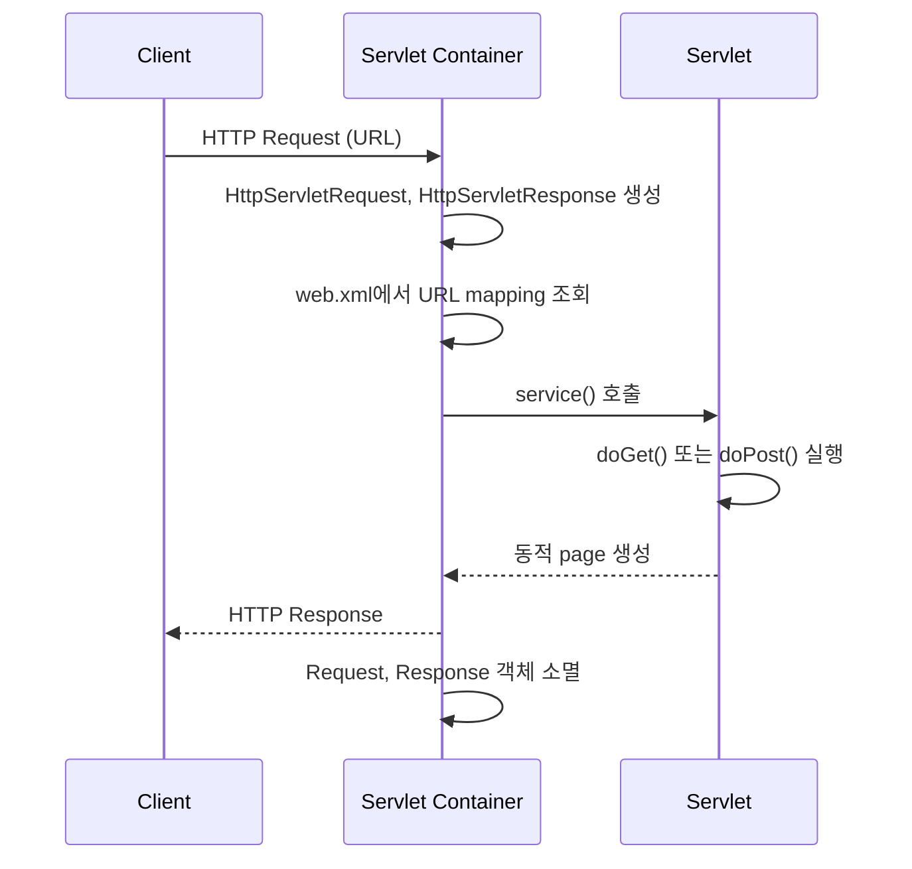
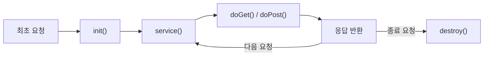

## Servlet

- **Servlet**은 client의 요청을 처리하고 그 결과를 반환하는 Java web programming 기술입니다.
    - `HttpServlet` class를 상속하고 `doGet()`, `doPost()` 등의 method를 overriding하여 구현합니다.
    - Java를 사용하여 web application을 만들기 위해 필요합니다.

```java
import javax.servlet.http.HttpServlet;
import javax.servlet.http.HttpServletRequest;
import javax.servlet.http.HttpServletResponse;

public class HelloServlet extends HttpServlet {
    @Override
    protected void doGet(HttpServletRequest request, HttpServletResponse response)
            throws ServletException, IOException {
        response.setContentType("text/html");
        response.getWriter().println("<h1>Hello, World!</h1>");
    }
}
```


### Servlet 특징

- servlet은 HTTP protocol 기반의 동적 web application component입니다.

| 특징 | 설명 |
| --- | --- |
| **동적 응답** | client 요청에 대해 동적으로 HTML을 생성하여 응답 |
| **Thread 기반** | Java thread를 이용하여 동작 |
| **MVC Controller** | MVC pattern에서 controller 역할 수행 |
| **HttpServlet 상속** | `javax.servlet.http.HttpServlet` class를 상속 |
| **Recompile 필요** | HTML 변경 시 servlet을 다시 compile해야 하는 단점 |


---


## Servlet 동작 방식

- client가 URL을 요청하면 servlet container가 해당 servlet을 찾아 실행하고, 동적 page를 생성하여 응답합니다.



1. client가 URL을 입력하면 HTTP request가 servlet container로 전송됩니다.
2. 요청을 받은 servlet container는 `HttpServletRequest`, `HttpServletResponse` 객체를 생성합니다.
3. `web.xml`을 기반으로 사용자가 요청한 URL이 어느 servlet에 대한 요청인지 찾습니다.
4. 해당 servlet에서 `service()` method를 호출한 후, client의 GET/POST 여부에 따라 `doGet()` 또는 `doPost()`를 호출합니다.
5. `doGet()` 또는 `doPost()` method는 동적 page를 생성한 후 `HttpServletResponse` 객체에 응답을 보냅니다.
6. 응답이 끝나면 `HttpServletRequest`, `HttpServletResponse` 두 객체를 소멸시킵니다.

- `web.xml`에서 servlet class와 URL pattern을 mapping하여, 어떤 URL이 어떤 servlet을 호출할지 지정합니다.

```xml
<web-app>
    <servlet>
        <servlet-name>hello</servlet-name>
        <servlet-class>com.example.HelloServlet</servlet-class>
    </servlet>
    <servlet-mapping>
        <servlet-name>hello</servlet-name>
        <url-pattern>/hello</url-pattern>
    </servlet-mapping>
</web-app>
```


---


## Servlet Container

- **Servlet Container**는 servlet을 관리하는 runtime 환경입니다.
    - servlet 자체는 동작 방식을 정의한 class이고, servlet container가 이를 실행합니다.
    - client의 요청을 받아주고 응답할 수 있게 web server와 socket으로 통신합니다.
    - 대표적인 예로 Tomcat이 있으며, web server와 통신하여 JSP와 servlet이 작동하는 환경을 제공합니다.


### Servlet Container의 역할

- servlet container는 web server 통신, servlet lifecycle 관리, multi-thread 처리, 보안 관리를 담당하여 개발자가 business logic에만 집중하게 합니다.

| 역할 | 설명 |
| --- | --- |
| **web server 통신 지원** | socket 생성, listen, accept 등의 과정을 API로 추상화하여 servlet과 web server 간 통신을 단순화 |
| **lifecycle 관리** | servlet class를 loading, instance화, 초기화하고, 요청 시 적절한 method 호출, 종료 시 garbage collection 수행 |
| **multi-thread 지원** | 요청마다 새로운 Java thread를 생성하여 HTTP service method를 실행하고, thread 관리를 자동으로 수행 |
| **선언적 보안 관리** | 보안 설정을 XML 배포 서술자에 기록하여, Java source code 수정 없이 보안 관리가 가능 |


---


## Servlet의 생명 주기

- servlet의 lifecycle은 `init()`, `service()`, `destroy()` 세 단계로 구성되며, container가 각 단계를 자동으로 호출합니다.




### init()

- container는 servlet이 **최초로 요청될 때 한 번만** `init()`을 호출하여 servlet을 memory에 적재합니다.
    - DB connection pool 초기화, 설정 file 읽기 등 공통 초기화 작업을 이 method에서 수행합니다.
    - 실행 중 servlet이 변경될 경우, 기존 servlet을 파괴하고 `init()`을 통해 새로운 내용을 다시 memory에 적재합니다.

```java
@Override
public void init() throws ServletException {
    // 최초 한 번만 실행
    // DB connection pool 초기화, 설정 file 읽기 등
    this.config = loadConfiguration();
    System.out.println("Servlet 초기화 완료");
}
```


### service(), doGet(), doPost()

- client 요청이 들어올 때마다 `service()` method가 호출되고, HTTP method에 따라 `doGet()` 또는 `doPost()`로 분기됩니다.
    - servlet container가 생성한 `HttpServletRequest`, `HttpServletResponse` 객체가 parameter로 전달됩니다.

```java
@Override
protected void doGet(HttpServletRequest request, HttpServletResponse response)
        throws ServletException, IOException {
    response.setContentType("text/html");
    PrintWriter out = response.getWriter();
    out.println("<h1>Hello, Servlet!</h1>");
}

@Override
protected void doPost(HttpServletRequest request, HttpServletResponse response)
        throws ServletException, IOException {
    String name = request.getParameter("name");
    response.setContentType("text/html");
    PrintWriter out = response.getWriter();
    out.println("<h1>Hello, " + name + "!</h1>");
}
```


### destroy()

- container가 servlet에 종료 요청을 하면 **한 번만** `destroy()` method를 호출합니다.
    - resource 해제, connection 종료 등 정리 작업을 이 method에서 수행합니다.

```java
@Override
public void destroy() {
    // 종료 시 한 번만 실행
    // resource 해제, connection 종료 등
    this.connectionPool.close();
    System.out.println("Servlet 종료");
}
```


---


## JSP (Java Server Page)

- **JSP**는 HTML code 속에 Java code가 들어가는 구조로, servlet과 반대 방향의 접근입니다.
    - servlet은 Java source code 속에 HTML code가 들어가는 형태입니다.
    - JSP는 `<% source code %>`, `<%= source code %>` 형태로 Java code를 삽입합니다.
    - 이 부분은 web browser로 보내는 것이 아니라 web server에서 실행됩니다.

```jsp
<%@ page contentType="text/html;charset=UTF-8" language="java" %>
<html>
<body>
    <h1>Hello, <%= request.getParameter("name") %>!</h1>
    
    <%
        // Java code 영역 - server에서 실행됨
        String role = "admin";
        if (role.equals("admin")) {
    %>
        <p>관리자 page입니다.</p>
    <% } %>
</body>
</html>
```

- compile 과정 없이 JSP page를 작성하여 web server의 directory에 추가하면 바로 사용 가능합니다.
    - 최종적으로 JSP는 WAS(Web Application Server)에 의해 servlet class로 변환되어 실행됩니다.


### JSP 동작 구조

- JSP는 servlet의 `out.println()` 방식의 번거로움을 해소하고, business logic과 presentation logic을 분리합니다.
    - web server가 사용자로부터 servlet 요청을 받으면, servlet container에 요청을 넘깁니다.
    - container는 `HttpServletRequest`, `HttpServletResponse` 객체를 만들어 servlet의 `doPost()`나 `doGet()`을 호출합니다.
    - servlet만으로 web page를 보여주려면 `out.println()`으로 HTML을 직접 작성해야 하므로, 추가/수정이 어렵고 가독성이 떨어집니다.
    - servlet은 data 처리에 대한 제어를 JSP에게 넘겨서 presentation logic을 수행한 후, container에게 response를 전달합니다.
    - JSP page가 요청되면 compile되어 Java file에서 `.class` file로 변환되고, business logic과 presentation logic이 결합되어 실행됩니다.


---


## Reference

- <https://mangkyu.tistory.com/14>

