## Generics

- **Generics**는 **type을 parameter로 받아** class, interface, function을 정의합니다.
    - compile 시점에 type을 검증하여 runtime error를 방지합니다.
    - code 중복 없이 여러 type에서 동작하는 logic을 작성합니다.
    - Java generics와 호환되며 추가 기능을 제공합니다.

```kotlin
// generic 없이 : 각 type마다 별도 class
class IntBox(val value: Int)
class StringBox(val value: String)

// generic 사용 : 하나의 class로 모든 type 지원
class Box<T>(val value: T)

val intBox: Box<Int> = Box(1)
val stringBox: Box<String> = Box("hello")
```


---


## Generic Class

- **generic class**는 **type parameter를 가진 class**입니다.
    - `<T>`로 type parameter를 선언합니다.
    - 여러 개의 type parameter를 가질 수 있습니다.

```kotlin
class Box<T>(val value: T) {
    fun get(): T = value
}

// 사용 시 type 지정
val box1: Box<Int> = Box(42)
val box2 = Box("hello")  // type 추론 : Box<String>

println(box1.get())  // 42
println(box2.get())  // hello
```


### 여러 Type Parameter

- **여러 개의 type parameter**를 comma로 구분하여 선언합니다.

```kotlin
class Pair<A, B>(val first: A, val second: B)

val pair = Pair("name", 25)  // Pair<String, Int>
println(pair.first)   // name
println(pair.second)  // 25

class Triple<A, B, C>(val first: A, val second: B, val third: C)
```


### Generic Interface

- **generic interface**도 class와 동일하게 type parameter를 선언합니다.

```kotlin
interface Repository<T> {
    fun findById(id: Long): T?
    fun save(entity: T): T
    fun delete(entity: T)
}

class UserRepository : Repository<User> {
    override fun findById(id: Long): User? = TODO()
    override fun save(entity: User): User = TODO()
    override fun delete(entity: User) = TODO()
}
```


---


## Generic Function

- **generic function**은 **함수 레벨에서 type parameter를 선언**합니다.
    - 함수 이름 앞에 `<T>`를 붙입니다.
    - class가 generic이 아니어도 함수만 generic일 수 있습니다.

```kotlin
fun <T> singletonList(item: T): List<T> = listOf(item)

val list1 = singletonList(1)        // List<Int>
val list2 = singletonList("hello")  // List<String>
```

```kotlin
// 여러 type parameter
fun <K, V> mapOf(key: K, value: V): Map<K, V> = mapOf(key to value)

// extension function에서 generic
fun <T> List<T>.secondOrNull(): T? = if (size >= 2) this[1] else null

listOf(1, 2, 3).secondOrNull()  // 2
listOf("a").secondOrNull()      // null
```


---


## Type Constraint

- **type constraint**는 **type parameter에 상한(upper bound)을 지정**합니다.
    - 특정 type이나 그 subtype만 허용합니다.
    - constraint를 통해 해당 type의 member에 접근합니다.

```kotlin
// T는 Comparable을 구현해야 함
fun <T : Comparable<T>> max(a: T, b: T): T = if (a > b) a else b

max(1, 2)          // 2
max("a", "b")      // b
// max(listOf(1), listOf(2))  // error : List는 Comparable 아님
```


### where 절

- **여러 constraint**를 지정할 때 `where` 절을 사용합니다.

```kotlin
fun <T> ensureTrailingPeriod(seq: T): T
    where T : CharSequence,
          T : Appendable {
    if (!seq.endsWith('.')) {
        seq.append('.')
    }
    return seq
}

val sb = StringBuilder("Hello")
ensureTrailingPeriod(sb)
println(sb)  // Hello.
```


### Nullable Constraint

- type parameter는 기본적으로 nullable입니다.
    - non-null을 강제하려면 `Any`를 upper bound로 지정합니다.

```kotlin
class Processor<T> {
    fun process(value: T) {
        value?.hashCode()  // T가 nullable일 수 있으므로 safe call 필요
    }
}

class NonNullProcessor<T : Any> {
    fun process(value: T) {
        value.hashCode()  // T는 non-null 보장
    }
}
```


---


## Variance

- **variance**는 **generic type 간의 subtype 관계**를 정의합니다.
    - `List<Dog>`가 `List<Animal>`의 subtype인지를 결정합니다.
    - Java의 `? extends`와 `? super`에 해당합니다.


### Invariance

- **invariance(무공변)**은 **type parameter가 정확히 일치해야** 합니다.
    - Kotlin의 mutable collection은 invariant입니다.

```kotlin
open class Animal
class Dog : Animal()

// MutableList는 invariant
val dogs: MutableList<Dog> = mutableListOf(Dog())
// val animals: MutableList<Animal> = dogs  // error

// 만약 허용된다면
// animals.add(Cat())  // Cat을 Dog list에 추가!
```


### Covariance (out)

- **covariance(공변)**은 **subtype 관계를 유지**합니다.
    - `out` keyword로 선언합니다.
    - type parameter를 **반환(output)**만 할 수 있습니다.
    - `Producer<Dog>`는 `Producer<Animal>`의 subtype입니다.

```kotlin
interface Producer<out T> {
    fun produce(): T
    // fun consume(item: T)  // error : out 위치에서 사용 불가
}

class DogProducer : Producer<Dog> {
    override fun produce(): Dog = Dog()
}

val dogProducer: Producer<Dog> = DogProducer()
val animalProducer: Producer<Animal> = dogProducer  // 허용
```

```kotlin
// List는 covariant (읽기 전용)
val dogs: List<Dog> = listOf(Dog())
val animals: List<Animal> = dogs  // 허용

// immutable이므로 Cat 추가 불가 -> 안전
```


### Contravariance (in)

- **contravariance(반공변)**은 **subtype 관계를 역전**합니다.
    - `in` keyword로 선언합니다.
    - type parameter를 **받기(input)**만 할 수 있습니다.
    - `Consumer<Animal>`은 `Consumer<Dog>`의 subtype입니다.

```kotlin
interface Consumer<in T> {
    fun consume(item: T)
    // fun produce(): T  // error : in 위치에서 사용 불가
}

class AnimalConsumer : Consumer<Animal> {
    override fun consume(item: Animal) {
        println("Consuming ${item::class.simpleName}")
    }
}

val animalConsumer: Consumer<Animal> = AnimalConsumer()
val dogConsumer: Consumer<Dog> = animalConsumer  // 허용

// Animal을 처리할 수 있으면 Dog도 처리 가능
```


### Variance 정리

| 구분 | Keyword | 사용 위치 | Subtype 관계 | 예시 |
| --- | --- | --- | --- | --- |

```mermaid
flowchart TD
    subgraph Covariance["Covariance (out)"]
        direction TB
        Dog1[Dog] --> Animal1[Animal]
        PD["Producer&#60;Dog&#62;"] --> PA["Producer&#60;Animal&#62;"]
    end

    subgraph Contravariance["Contravariance (in)"]
        direction TB
        Dog2[Dog] --> Animal2[Animal]
        CA["Consumer&#60;Animal&#62;"] --> CD["Consumer&#60;Dog&#62;"]
    end
```

| 공변 | `out` | 반환만 | 유지 | `Producer<out T>` |
| 반공변 | `in` | 받기만 | 역전 | `Consumer<in T>` |
| 무공변 | 없음 | 모두 | 없음 | `MutableList<T>` |




---


## Use-Site Variance

- **declaration-site variance**는 class 선언 시 지정합니다.
- **use-site variance**는 사용 시점에 지정합니다.
    - Java의 wildcard(`? extends`, `? super`)와 유사합니다.

```kotlin
// MutableList는 invariant로 선언됨
// 하지만 사용 시점에 variance 지정 가능

fun copy(from: MutableList<out Animal>, to: MutableList<Animal>) {
    for (animal in from) {
        to.add(animal)
    }
}

val dogs: MutableList<Dog> = mutableListOf(Dog())
val animals: MutableList<Animal> = mutableListOf()

copy(dogs, animals)  // dogs는 out Animal로 projection
```

```kotlin
// in projection
fun fill(list: MutableList<in Dog>, dog: Dog) {
    list.add(dog)
}

val animals: MutableList<Animal> = mutableListOf()
fill(animals, Dog())  // Animal list에 Dog 추가 가능
```


---


## Star Projection

- **star projection(`*`)**은 **type argument를 모를 때** 사용합니다.
    - Java의 raw type이나 unbounded wildcard(`?`)에 해당합니다.
    - 안전하게 읽기만 가능합니다.

```kotlin
fun printAll(list: List<*>) {
    for (item in list) {
        println(item)  // Any?로 취급
    }
}

printAll(listOf(1, 2, 3))
printAll(listOf("a", "b"))
```

```kotlin
// MutableList<*>는 MutableList<out Any?>로 취급
fun readOnly(list: MutableList<*>) {
    val first: Any? = list[0]  // 읽기 가능
    // list.add("x")  // error : 쓰기 불가
}
```


### Star Projection 규칙

| 선언 | Star Projection 의미 |
| --- | --- |
| `Foo<out T>` | `Foo<*>` = `Foo<out Any?>` |
| `Foo<in T>` | `Foo<*>` = `Foo<in Nothing>` |
| `Foo<T>` | 읽기 : `out Any?`, 쓰기 : `in Nothing` |


---


## Type Erasure

- **JVM에서 generic type 정보는 compile 후 지워집니다**.
    - runtime에 `List<String>`과 `List<Int>`를 구분할 수 없습니다.
    - `is List<String>` 같은 type check는 불가능합니다.

```kotlin
val list = listOf("a", "b", "c")

// if (list is List<String>) { }  // error : Cannot check for erased type

// raw type check는 가능
if (list is List<*>) {
    println("It's a List")
}
```


### Type Erasure 우회

- class에 type 정보를 저장하여 우회합니다.

```kotlin
abstract class TypedList<T>(private val clazz: Class<T>) {
    fun isOfType(item: Any): Boolean = clazz.isInstance(item)
}

class StringList : TypedList<String>(String::class.java)

val stringList = StringList()
println(stringList.isOfType("hello"))  // true
println(stringList.isOfType(123))      // false
```


---


## Reified Type Parameter

- **`reified`**는 inline 함수에서 **runtime에 type 정보를 유지**합니다.
    - type erasure를 우회합니다.
    - type check, casting, class 참조가 가능합니다.

```kotlin
inline fun <reified T> isType(value: Any): Boolean = value is T

isType<String>("hello")  // true
isType<Int>("hello")     // false
isType<List<*>>(listOf(1, 2))  // true
```


### reified 활용

- `reified`를 활용하면 type filtering, class 참조, JSON parsing 등을 간결하게 작성합니다.

```kotlin
// type으로 filtering
inline fun <reified T> List<*>.filterIsInstance2(): List<T> =
    filter { it is T }.map { it as T }

val mixed = listOf(1, "a", 2, "b", 3)
val strings: List<String> = mixed.filterIsInstance2()  // [a, b]
val ints: List<Int> = mixed.filterIsInstance2()        // [1, 2, 3]
```

```kotlin
// class 참조
inline fun <reified T> printClassName() {
    println(T::class.simpleName)
}

printClassName<String>()  // String
printClassName<Int>()     // Int
```

```kotlin
// JSON parsing
inline fun <reified T> Gson.fromJson(json: String): T =
    fromJson(json, T::class.java)

val user: User = gson.fromJson("""{"name": "Kim"}""")
```


### reified 제약

- **inline 함수에서만 사용** 가능합니다.
- **class나 property에서는 사용 불가**합니다.

```kotlin
inline fun <reified T> works() { }

// class Foo<reified T>  // error
// val <reified T> prop: T  // error
```


---


## 실전 예제

- Generics를 활용한 실전 pattern입니다.


### Generic Repository

- **generic repository**는 entity type에 독립적인 CRUD 연산을 정의합니다.

```kotlin
interface Repository<T, ID> {
    fun findById(id: ID): T?
    fun findAll(): List<T>
    fun save(entity: T): T
    fun delete(entity: T)
}

abstract class InMemoryRepository<T, ID> : Repository<T, ID> {
    protected val store = mutableMapOf<ID, T>()

    abstract fun getId(entity: T): ID

    override fun findById(id: ID): T? = store[id]
    override fun findAll(): List<T> = store.values.toList()
    override fun save(entity: T): T {
        store[getId(entity)] = entity
        return entity
    }
    override fun delete(entity: T) {
        store.remove(getId(entity))
    }
}

data class User(val id: Long, val name: String)

class UserRepository : InMemoryRepository<User, Long>() {
    override fun getId(entity: User): Long = entity.id
}
```


### Result Type

- **Result type**은 성공 또는 실패를 표현하는 generic sealed class입니다.

```kotlin
sealed class Result<out T> {
    data class Success<T>(val data: T) : Result<T>()
    data class Failure(val error: Throwable) : Result<Nothing>()

    fun <R> map(transform: (T) -> R): Result<R> = when (this) {
        is Success -> Success(transform(data))
        is Failure -> this
    }

    fun getOrNull(): T? = when (this) {
        is Success -> data
        is Failure -> null
    }

    fun getOrElse(default: @UnsafeVariance T): T = when (this) {
        is Success -> data
        is Failure -> default
    }
}

fun fetchUser(id: Long): Result<User> =
    try {
        Result.Success(api.getUser(id))
    } catch (e: Exception) {
        Result.Failure(e)
    }

val result = fetchUser(1)
    .map { it.name.uppercase() }
    .getOrElse("Unknown")
```


---


## Reference

- <https://kotlinlang.org/docs/generics.html>
- <https://kotlinlang.org/docs/inline-functions.html#reified-type-parameters>

