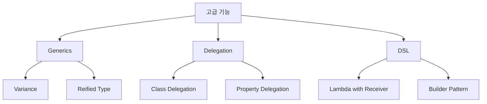

## Kotlin 고급 기능

- Kotlin은 **type safety와 code 재사용성을 높이는 고급 기능**을 제공합니다.
    - Generics로 type을 parameter화하여 재사용 가능한 component를 만듭니다.
    - Delegation으로 구현을 위임하여 boilerplate를 줄입니다.
    - DSL로 domain 특화 언어를 만들어 가독성을 높입니다.




---


## Generics

- **Generics**는 type을 parameter로 받아 **다양한 type에서 동작하는 code**를 작성합니다.
    - compile 시점에 type을 검증하여 runtime error를 방지합니다.
    - code 중복 없이 여러 type을 지원합니다.

```kotlin
// generic class
class Box<T>(val value: T)

val intBox = Box(1)        // Box<Int>
val stringBox = Box("Hi")  // Box<String>

// generic function
fun <T> List<T>.secondOrNull(): T? = if (size >= 2) this[1] else null

listOf(1, 2, 3).secondOrNull()       // 2
listOf("a").secondOrNull()           // null
```


### Variance

- **variance**는 generic type 간의 상속 관계를 정의합니다.
    - `out` : covariant, producer 역할, 값을 반환만 합니다.
    - `in` : contravariant, consumer 역할, 값을 받기만 합니다.

```kotlin
// out : 공변성, T를 반환만 함
interface Producer<out T> {
    fun produce(): T
}

// in : 반공변성, T를 받기만 함
interface Consumer<in T> {
    fun consume(item: T)
}

// Producer<Dog>는 Producer<Animal>의 subtype
// Consumer<Animal>은 Consumer<Dog>의 subtype
```


### Reified Type Parameter

- **`reified`**는 inline 함수에서 **runtime에 type 정보를 유지**합니다.
    - 일반적으로 JVM에서 generic type은 compile 후 지워집니다.
    - `reified`를 사용하면 type check와 casting이 가능합니다.

```kotlin
inline fun <reified T> isType(value: Any): Boolean = value is T

isType<String>("hello")  // true
isType<Int>("hello")     // false

inline fun <reified T> Gson.fromJson(json: String): T =
    fromJson(json, T::class.java)
```


---


## Delegation

- **Delegation**은 **기능 구현을 다른 객체에 위임**하는 pattern입니다.
    - 상속 대신 composition을 사용하여 유연성을 높입니다.
    - Kotlin은 언어 차원에서 delegation을 지원합니다.


### Class Delegation

- **`by` keyword**로 interface 구현을 다른 객체에 위임합니다.
    - boilerplate 없이 decorator pattern을 구현합니다.

```kotlin
interface Printer {
    fun print(message: String)
}

class ConsolePrinter : Printer {
    override fun print(message: String) = println(message)
}

// ConsolePrinter에 위임
class LoggingPrinter(printer: Printer) : Printer by printer {
    override fun print(message: String) {
        println("[LOG] Printing...")
        printer.print(message)
    }
}
```


### Property Delegation

- **property의 getter/setter를 delegate 객체에 위임**합니다.
    - `lazy`, `observable`, `vetoable` 등 표준 delegate를 제공합니다.
    - custom delegate를 만들어 반복 logic을 재사용합니다.

```kotlin
// lazy : 첫 접근 시 초기화
val expensive: String by lazy {
    println("Computing...")
    "result"
}

// observable : 변경 감지
var name: String by Delegates.observable("initial") { _, old, new ->
    println("$old -> $new")
}

// map delegate : Map에서 값 읽기
class User(map: Map<String, Any?>) {
    val name: String by map
    val age: Int by map
}
```


---


## DSL

- **DSL(Domain-Specific Language)**은 **특정 domain에 최적화된 언어**입니다.
    - Kotlin의 lambda with receiver로 type-safe한 DSL을 구축합니다.
    - 선언적이고 가독성 높은 API를 설계합니다.

```kotlin
// HTML DSL 예시
html {
    head {
        title("My Page")
    }
    body {
        h1("Welcome")
        p("This is a paragraph")
    }
}

// Gradle Kotlin DSL
plugins {
    kotlin("jvm") version "1.9.0"
}

dependencies {
    implementation("org.jetbrains.kotlin:kotlin-stdlib")
}
```


### Lambda with Receiver

- **lambda with receiver**는 **특정 객체를 context로 하는 lambda**입니다.
    - receiver 객체의 member에 직접 접근합니다.
    - DSL의 핵심 building block입니다.

```kotlin
fun html(init: HTML.() -> Unit): HTML {
    val html = HTML()
    html.init()
    return html
}

class HTML {
    fun head(init: Head.() -> Unit) { }
    fun body(init: Body.() -> Unit) { }
}

// 사용
html {
    // this는 HTML instance
    head { }
    body { }
}
```


### Type-Safe Builder

- **type-safe builder**는 compile 시점에 **구조의 유효성을 검증**합니다.
    - 잘못된 nesting을 compile error로 방지합니다.
    - IDE 자동 완성을 지원합니다.

```kotlin
// 잘못된 구조는 compile error
html {
    // head { body { } }  // error : Head에 body 함수 없음
    body {
        // title("wrong")  // error : Body에 title 함수 없음
    }
}
```


---


## Reference

- <https://kotlinlang.org/docs/generics.html>
- <https://kotlinlang.org/docs/delegation.html>
- <https://kotlinlang.org/docs/type-safe-builders.html>

