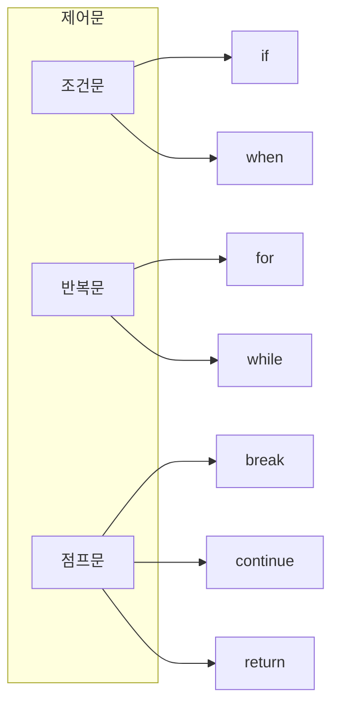

## 제어문

- Kotlin의 제어문은 **표현식(expression)**으로 동작하여 값을 반환할 수 있습니다.
    - `if`와 `when`은 값을 반환하는 표현식입니다.
    - Java의 삼항 연산자(`? :`)가 없는 대신 `if` 표현식을 사용합니다.




---


## if 표현식

- `if`는 **문(statement)이 아닌 표현식**입니다.
    - 값을 반환하므로 변수에 할당할 수 있습니다.
    - Java의 삼항 연산자를 대체합니다.

```kotlin
// 표현식으로 사용
val max = if (a > b) a else b

// block으로 사용 시 마지막 표현식이 반환값
val max = if (a > b) {
    println("a is bigger")
    a    // 반환값
} else {
    println("b is bigger")
    b    // 반환값
}
```

- 표현식으로 사용할 때는 **`else`가 필수**입니다.

```kotlin
// compile error : else 필요
// val result = if (condition) "yes"

val result = if (condition) "yes" else "no"    // 정상
```

- **문(statement)으로도 사용**할 수 있습니다.

```kotlin
if (score >= 90) {
    println("A")
} else if (score >= 80) {
    println("B")
} else {
    println("C")
}
```


---


## when 표현식

- `when`은 **Java의 `switch`를 대체**하는 강력한 표현식입니다.
    - 다양한 조건을 간결하게 처리합니다.
    - 값을 반환하는 표현식으로 사용할 수 있습니다.

```kotlin
val result = when (x) {
    1 -> "one"
    2 -> "two"
    else -> "other"
}
```


### 다양한 조건 Matching

- `when`은 여러 가지 형태의 조건을 지원합니다.

```kotlin
when (x) {
    // 여러 값 matching
    1, 2 -> println("1 or 2")

    // 범위 matching
    in 3..10 -> println("between 3 and 10")
    !in 11..20 -> println("not between 11 and 20")

    // type matching
    is String -> println("String of length ${x.length}")

    // 임의의 표현식
    parseInt(input) -> println("matches parsed input")

    else -> println("otherwise")
}
```


### 인자 없는 when

- **인자 없이 `if-else` chain을 대체**할 수 있습니다.

```kotlin
when {
    x < 0 -> println("negative")
    x == 0 -> println("zero")
    x > 0 -> println("positive")
}

val description = when {
    score >= 90 -> "Excellent"
    score >= 80 -> "Good"
    score >= 70 -> "Average"
    else -> "Poor"
}
```


### when과 Smart Cast

- `when`의 `is` 조건에서 **smart cast**가 적용됩니다.

```kotlin
fun describe(obj: Any): String = when (obj) {
    is Int -> "Integer : ${obj * 2}"       // obj가 Int로 cast
    is String -> "String : ${obj.length}"  // obj가 String으로 cast
    is List<*> -> "List : ${obj.size}"     // obj가 List로 cast
    else -> "Unknown"
}
```


### when의 반환값 사용

- 표현식으로 사용 시 **`else`가 필수**입니다.
    - 단, `enum`이나 `sealed class`에서 모든 경우를 처리하면 생략 가능합니다.

```kotlin
enum class Color { RED, GREEN, BLUE }

val colorName = when (color) {
    Color.RED -> "Red"
    Color.GREEN -> "Green"
    Color.BLUE -> "Blue"
    // else 불필요 : 모든 enum 값 처리됨
}
```


---


## for Loop

- `for`는 **`in` keyword로 iterable을 순회**합니다.
    - Java의 enhanced for loop와 유사합니다.
    - index 기반 loop는 range를 사용합니다.


### Range 순회

- **`..` 연산자로 range**를 생성합니다.

```kotlin
// 1부터 5까지 (5 포함)
for (i in 1..5) {
    println(i)    // 1, 2, 3, 4, 5
}

// 5부터 1까지 역순
for (i in 5 downTo 1) {
    println(i)    // 5, 4, 3, 2, 1
}

// 2씩 증가
for (i in 1..10 step 2) {
    println(i)    // 1, 3, 5, 7, 9
}

// 마지막 값 제외
for (i in 1 until 5) {
    println(i)    // 1, 2, 3, 4
}
```


### Collection 순회

- **collection의 요소를 직접 순회**합니다.

```kotlin
val items = listOf("apple", "banana", "cherry")

for (item in items) {
    println(item)
}
```

- **index와 함께 순회**하려면 `withIndex()`를 사용합니다.

```kotlin
for ((index, item) in items.withIndex()) {
    println("$index: $item")
}
// 0: apple
// 1: banana
// 2: cherry
```

- **index만 필요한 경우** `indices`를 사용합니다.

```kotlin
for (i in items.indices) {
    println("$i: ${items[i]}")
}
```


### Map 순회

- **destructuring으로 key-value를 분리**합니다.

```kotlin
val map = mapOf("a" to 1, "b" to 2, "c" to 3)

for ((key, value) in map) {
    println("$key = $value")
}
```


---


## while과 do-while

- **`while`과 `do-while`**은 Java와 동일합니다.

```kotlin
// while : 조건을 먼저 검사
var i = 0
while (i < 5) {
    println(i)
    i++
}

// do-while : 최소 한 번 실행 후 조건 검사
var j = 0
do {
    println(j)
    j++
} while (j < 5)
```


---


## break와 continue

- **`break`**는 loop를 종료합니다.
- **`continue`**는 현재 iteration을 건너뜁니다.

```kotlin
for (i in 1..10) {
    if (i == 3) continue    // 3 건너뜀
    if (i == 7) break       // 7에서 종료
    println(i)
}
// 출력 : 1, 2, 4, 5, 6
```


### Label

- **중첩 loop에서 외부 loop를 제어**하려면 label을 사용합니다.
    - label은 `이름@` 형식으로 지정합니다.

```kotlin
outer@ for (i in 1..3) {
    for (j in 1..3) {
        if (i == 2 && j == 2) break@outer    // 외부 loop 종료
        println("$i, $j")
    }
}
// 출력 : 1,1 / 1,2 / 1,3 / 2,1
```

```kotlin
outer@ for (i in 1..3) {
    for (j in 1..3) {
        if (j == 2) continue@outer    // 외부 loop의 다음 iteration
        println("$i, $j")
    }
}
// 출력 : 1,1 / 2,1 / 3,1
```


---


## return

- **`return`은 가장 가까운 함수에서 반환**합니다.

```kotlin
fun findFirst(numbers: List<Int>, target: Int): Int? {
    for (n in numbers) {
        if (n == target) return n    // 함수에서 반환
    }
    return null
}
```


### Lambda에서의 return

- lambda 내부에서 `return`은 **바깥 함수를 종료**(non-local return)합니다.

```kotlin
fun process(numbers: List<Int>) {
    numbers.forEach {
        if (it == 0) return    // process 함수 종료
        println(it)
    }
    println("Done")    // 0이 있으면 실행 안 됨
}
```

- **lambda만 종료**하려면 label을 사용합니다.

```kotlin
fun process(numbers: List<Int>) {
    numbers.forEach {
        if (it == 0) return@forEach    // lambda만 종료 (continue처럼 동작)
        println(it)
    }
    println("Done")    // 항상 실행
}
```

- **암시적 label**은 함수 이름과 동일합니다.

```kotlin
numbers.forEach {
    if (it == 0) return@forEach    // forEach가 암시적 label
}

// 명시적 label 지정
numbers.forEach myLabel@{
    if (it == 0) return@myLabel
}
```


---


## Reference

- <https://kotlinlang.org/docs/control-flow.html>
- <https://kotlinlang.org/docs/returns.html>

