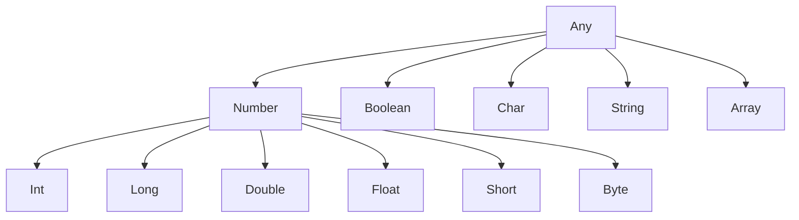

## 기본 Type

- Kotlin의 **모든 type은 객체**입니다.
    - Java의 primitive type과 달리 method를 호출할 수 있습니다.
    - compiler가 성능 최적화를 위해 내부적으로 primitive type으로 변환합니다.

```kotlin
val number = 42
val text = number.toString()    // method 호출 가능
val hash = number.hashCode()
```




---


## 숫자 Type

- Kotlin은 **정수와 실수를 위한 여러 숫자 type**을 제공합니다.


### 정수 Type

- 정수 type은 크기에 따라 4가지로 구분됩니다.

| type | 크기 | 범위 |
| --- | --- | --- |
| Byte | 8bit | -128 ~ 127 |
| Short | 16bit | -32,768 ~ 32,767 |
| Int | 32bit | -2^31 ~ 2^31-1 |
| Long | 64bit | -2^63 ~ 2^63-1 |

```kotlin
val byte: Byte = 127
val short: Short = 32767
val int: Int = 2147483647
val long: Long = 9223372036854775807L    // L 접미사

// type 추론
val inferredInt = 100        // Int
val inferredLong = 100L      // Long
val bigNumber = 3000000000   // Long (Int 범위 초과)
```

- **underscore로 숫자 가독성**을 높일 수 있습니다.

```kotlin
val million = 1_000_000
val creditCard = 1234_5678_9012_3456L
val hexBytes = 0xFF_EC_DE_5E
```


### 실수 Type

- 실수 type은 Float와 Double이 있습니다.

| type | 크기 | 유효 자릿수 |
| --- | --- | --- |
| Float | 32bit | 6-7자리 |
| Double | 64bit | 15-16자리 |

```kotlin
val pi: Double = 3.14159265358979
val rate: Float = 0.5f    // f 접미사 필수

// type 추론
val inferredDouble = 3.14    // Double
val scientific = 1.5e10      // Double (과학적 표기법)
```

- 기본 추론 type은 **Double**입니다.
    - Float를 사용하려면 `f` 접미사를 붙여야 합니다.


### 숫자 Literal

- 다양한 진법으로 숫자를 표현할 수 있습니다.

```kotlin
val decimal = 123        // 10진수
val hexadecimal = 0x7B   // 16진수
val binary = 0b1111011   // 2진수

// 8진수는 지원하지 않음
```


---


## Boolean

- **`true`와 `false` 두 가지 값**을 가지는 논리 type입니다.

```kotlin
val isKotlin: Boolean = true
val isJava = false    // type 추론

// 논리 연산
val and = true && false    // false
val or = true || false     // true
val not = !true            // false
```

- **lazy evaluation**을 지원합니다.
    - `&&`는 첫 번째가 false면 두 번째를 평가하지 않습니다.
    - `||`는 첫 번째가 true면 두 번째를 평가하지 않습니다.

```kotlin
fun check(): Boolean {
    println("Evaluated")
    return true
}

val result = false && check()    // "Evaluated" 출력 안 됨
```


---


## Char

- **단일 문자**를 나타내는 type입니다.
    - 작은따옴표(`'`)로 감싸서 표현합니다.
    - 숫자로 직접 처리할 수 없습니다.

```kotlin
val letter: Char = 'A'
val digit: Char = '1'
val unicode: Char = '\uAC00'    // '가'

// 숫자로 직접 할당 불가
// val char: Char = 65    // compile error
```

- **escape sequence**를 지원합니다.

| 표현 | 의미 |
| --- | --- |
| `\t` | tab |
| `\n` | 줄바꿈 |
| `\r` | carriage return |
| `\'` | 작은따옴표 |
| `\"` | 큰따옴표 |
| `\\` | backslash |
| `\$` | dollar 기호 |


---


## String

- **문자열**을 나타내는 type입니다.
    - 불변(immutable)이며, 한 번 생성되면 변경할 수 없습니다.
    - 큰따옴표(`"`)로 감싸서 표현합니다.

```kotlin
val greeting: String = "Hello, Kotlin!"
val empty = ""

// index로 문자 접근
val first = greeting[0]    // 'H'

// 반복
for (char in greeting) {
    println(char)
}
```


### String Template

- **`$` 기호로 변수나 표현식을 문자열에 삽입**할 수 있습니다.

```kotlin
val name = "Kotlin"
val version = 2.0

// 변수 삽입
val message = "Hello, $name!"    // "Hello, Kotlin!"

// 표현식 삽입 (중괄호 사용)
val info = "Version: ${version * 10}"    // "Version: 20.0"
val length = "Length: ${name.length}"    // "Length: 6"
```

- Java의 문자열 연결보다 **간결하고 가독성이 높습니다**.

```java
// Java
String message = "Hello, " + name + "! Length: " + name.length();
```

```kotlin
// Kotlin
val message = "Hello, $name! Length: ${name.length}"
```


### Raw String

- **삼중 따옴표(`"""`)로 여러 줄 문자열**을 표현합니다.
    - escape sequence 없이 문자 그대로 사용할 수 있습니다.
    - `trimMargin()`으로 들여쓰기를 정리합니다.

```kotlin
val json = """
    {
        "name": "Kotlin",
        "version": 2.0
    }
""".trimIndent()

val text = """
    |First line
    |Second line
    |Third line
""".trimMargin()    // | 기준으로 정리
```


---


## Array

- **고정 크기의 요소 집합**입니다.
    - `Array<T>` class로 표현됩니다.
    - primitive type을 위한 특수 array class가 있습니다.

```kotlin
// Array 생성
val numbers = arrayOf(1, 2, 3, 4, 5)
val strings = arrayOf("a", "b", "c")
val nulls = arrayOfNulls<String>(5)    // null로 초기화

// lambda로 생성
val squares = Array(5) { i -> i * i }    // [0, 1, 4, 9, 16]

// 접근
val first = numbers[0]
numbers[0] = 10
```


### Primitive Array

- **primitive type 전용 array**는 boxing overhead가 없습니다.

| type | 생성 함수 |
| --- | --- |
| IntArray | `intArrayOf()` |
| LongArray | `longArrayOf()` |
| DoubleArray | `doubleArrayOf()` |
| FloatArray | `floatArrayOf()` |
| BooleanArray | `booleanArrayOf()` |
| CharArray | `charArrayOf()` |
| ByteArray | `byteArrayOf()` |
| ShortArray | `shortArrayOf()` |

```kotlin
val intArray: IntArray = intArrayOf(1, 2, 3)
val doubleArray = doubleArrayOf(1.0, 2.0, 3.0)

// 크기 지정 생성
val zeros = IntArray(5)    // [0, 0, 0, 0, 0]
val ones = IntArray(5) { 1 }    // [1, 1, 1, 1, 1]
```


---


## Type 변환

- Kotlin은 **암시적 type 변환을 지원하지 않습니다**.
    - 더 큰 type으로의 자동 변환도 불가능합니다.
    - 명시적 변환 함수를 사용해야 합니다.

```kotlin
val intValue: Int = 100
// val longValue: Long = intValue    // compile error

val longValue: Long = intValue.toLong()    // 명시적 변환
```

- **변환 함수** 목록입니다.

| 함수 | 변환 대상 |
| --- | --- |
| `toByte()` | Byte |
| `toShort()` | Short |
| `toInt()` | Int |
| `toLong()` | Long |
| `toFloat()` | Float |
| `toDouble()` | Double |
| `toChar()` | Char |
| `toString()` | String |

```kotlin
val d = 3.14
val i = d.toInt()        // 3 (소수점 버림)
val s = i.toString()     // "3"

val str = "123"
val num = str.toInt()    // 123
val invalid = "abc".toIntOrNull()    // null (변환 실패 시)
```


---


## 특수 Type

- Kotlin은 **Any, Unit, Nothing** 세 가지 특수 type을 제공합니다.
    - Any는 모든 type의 최상위 type입니다.
    - Unit은 반환값이 없음을 나타냅니다.
    - Nothing은 정상적으로 반환되지 않는 함수의 type입니다.


### Any

- **모든 class의 최상위 type**입니다.
    - Java의 `Object`와 유사합니다.
    - `equals()`, `hashCode()`, `toString()` method를 가집니다.

```kotlin
val anything: Any = "Hello"
val number: Any = 42
val list: Any = listOf(1, 2, 3)

println(anything.toString())
```


### Unit

- **반환값이 없음**을 나타내는 type입니다.
    - Java의 `void`와 유사하지만, Unit은 실제 객체입니다.
    - 함수가 반환 type을 명시하지 않으면 Unit입니다.

```kotlin
fun printMessage(message: String): Unit {
    println(message)
}

// Unit 생략 가능
fun printMessage(message: String) {
    println(message)
}
```


### Nothing

- **정상적으로 반환되지 않는 함수**의 반환 type입니다.
    - 항상 exception을 throw하거나 무한 loop에 빠지는 함수에 사용합니다.
    - 모든 type의 subtype입니다.

```kotlin
fun fail(message: String): Nothing {
    throw IllegalArgumentException(message)
}

fun infiniteLoop(): Nothing {
    while (true) {
        // 무한 loop
    }
}

// 활용 : elvis operator와 함께
val name = nullableName ?: fail("Name is required")
```


---


## Java Primitive Type과의 비교

- Kotlin은 **source code에서 primitive type을 구분하지 않습니다**.
    - compile 후 JVM에서는 성능을 위해 primitive type으로 변환됩니다.
    - nullable type은 boxing된 type으로 유지됩니다.

| Kotlin | Java (non-null) | Java (nullable) |
| --- | --- | --- |
| Int | int | Integer |
| Long | long | Long |
| Double | double | Double |
| Boolean | boolean | Boolean |

```kotlin
val nonNull: Int = 42       // JVM에서 int
val nullable: Int? = 42     // JVM에서 Integer
```

- Java interop 시 **null 처리에 주의**해야 합니다.
    - Java에서 온 값은 platform type으로 처리됩니다.


---


## Reference

- <https://kotlinlang.org/docs/basic-types.html>
- <https://kotlinlang.org/docs/strings.html>
- <https://kotlinlang.org/docs/arrays.html>

