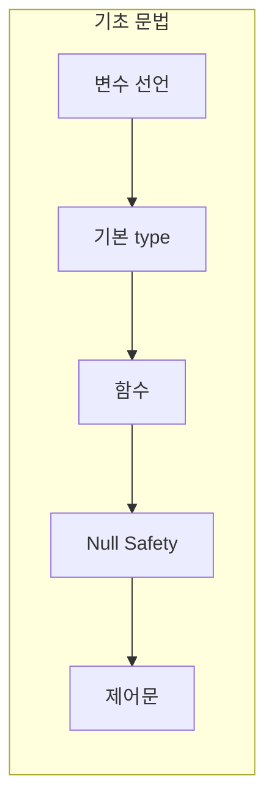

## Kotlin 기초 문법

- Kotlin은 **간결하고 안전한 문법**을 제공하는 현대적인 programming 언어입니다.
    - Java와 100% 호환되면서도 boilerplate를 크게 줄였습니다.
    - type 추론, null safety, 표현식 기반 문법 등 생산성을 높이는 기능을 제공합니다.

- Kotlin의 기초 문법은 **변수, type, 함수, null 처리, 제어문**으로 구성됩니다.




---


## 변수 선언 : val과 var

- Kotlin은 **`val`과 `var` keyword로 변수를 선언**합니다.
    - `val` : 읽기 전용 변수로, 한 번 할당하면 변경할 수 없습니다.
    - `var` : 가변 변수로, 값을 변경할 수 있습니다.

```kotlin
val name = "Kotlin"    // 불변, type 추론으로 String
var count = 0          // 가변, type 추론으로 Int

count = 10             // 가능
// name = "Java"       // compile error
```

- **`val`을 기본으로 사용**하고, 변경이 필요한 경우에만 `var`을 사용하는 것이 권장됩니다.
    - 불변성을 유지하면 code의 예측 가능성과 안전성이 높아집니다.

- Kotlin은 **type 추론**을 지원하여 type을 명시하지 않아도 됩니다.
    - 필요한 경우 `val name: String = "Kotlin"`처럼 명시할 수 있습니다.


---


## 기본 Type

- Kotlin의 기본 type은 **모두 객체**입니다.
    - Java의 primitive type과 달리 method를 호출할 수 있습니다.
    - compiler가 자동으로 primitive type으로 최적화합니다.

| type | 설명 | 예시 |
| --- | --- | --- |
| Int | 32bit 정수 | `val n: Int = 42` |
| Long | 64bit 정수 | `val l: Long = 42L` |
| Double | 64bit 실수 | `val d: Double = 3.14` |
| Float | 32bit 실수 | `val f: Float = 3.14f` |
| Boolean | 참/거짓 | `val b: Boolean = true` |
| Char | 단일 문자 | `val c: Char = 'A'` |
| String | 문자열 | `val s: String = "Hello"` |

```kotlin
val age: Int = 25
val pi: Double = 3.14159
val isKotlin: Boolean = true
val initial: Char = 'K'

// 객체이므로 method 호출 가능
val text = 123.toString()    // "123"
```


---


## 함수

- Kotlin은 **`fun` keyword로 함수를 선언**합니다.

```kotlin
fun greet(name: String): String {
    return "Hello, $name!"
}
```

- **단일 표현식 함수**는 `=`로 간결하게 작성할 수 있습니다.
    - return type도 추론됩니다.

```kotlin
fun add(a: Int, b: Int) = a + b
fun greet(name: String) = "Hello, $name!"
```

- **기본값**과 **named argument**를 지원합니다.

```kotlin
fun createUser(name: String, age: Int = 0, active: Boolean = true) {
    // ...
}

// 호출
createUser("Kim")                        // 기본값 사용
createUser("Lee", age = 25)              // named argument
createUser(name = "Park", active = false)
```


---


## Null Safety

- Kotlin은 **type system에서 null 가능 여부를 구분**합니다.
    - 기본적으로 모든 type은 null을 허용하지 않습니다.
    - null을 허용하려면 type 뒤에 `?`를 붙입니다.

```kotlin
var name: String = "Kotlin"    // non-null
// name = null                 // compile error

var nickname: String? = "K"    // nullable
nickname = null                // 가능
```

- **safe call operator (`?.`)** : null이면 null 반환, 아니면 연산 수행.

```kotlin
val length = nickname?.length    // nickname이 null이면 null
```

- **elvis operator (`?:`)** : null일 때 대체값 지정.

```kotlin
val len = nickname?.length ?: 0    // null이면 0
```

- **non-null assertion (`!!`)** : null이 아님을 단언. null이면 NPE 발생.

```kotlin
val len = nickname!!.length    // null이면 NullPointerException
```


---


## 제어문

- Kotlin의 제어문은 **표현식(expression)**으로 동작하여 값을 반환할 수 있습니다.


### if 표현식

- `if`는 문(statement)이 아닌 **표현식**입니다.

```kotlin
val max = if (a > b) a else b
```


### when 표현식

- `when`은 Java의 `switch`를 대체하며, 더 강력한 pattern matching을 지원합니다.

```kotlin
val result = when (x) {
    1 -> "one"
    2 -> "two"
    in 3..10 -> "between 3 and 10"
    is String -> "it's a string"
    else -> "unknown"
}
```


### 반복문

- `for`는 `in` keyword와 함께 사용합니다.

```kotlin
for (i in 1..5) {
    println(i)    // 1, 2, 3, 4, 5
}

for (i in 5 downTo 1 step 2) {
    println(i)    // 5, 3, 1
}

val list = listOf("a", "b", "c")
for (item in list) {
    println(item)
}
```

- `while`과 `do-while`은 Java와 동일합니다.

```kotlin
while (condition) {
    // ...
}

do {
    // ...
} while (condition)
```


---


## Reference

- <https://kotlinlang.org/docs/basic-syntax.html>
- <https://kotlinlang.org/docs/basic-types.html>

