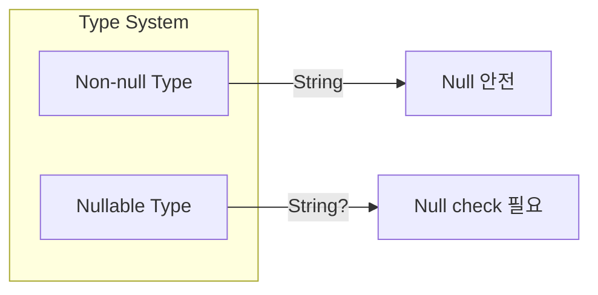

## Null Safety

- Kotlin은 **type system 수준에서 null 가능 여부를 구분**합니다.
    - nullable type과 non-null type을 명확히 분리합니다.
    - compile time에 null 관련 오류를 감지하여 `NullPointerException`을 방지합니다.



- Java에서 흔히 발생하는 `NullPointerException`을 언어 차원에서 예방합니다.


---


## Nullable Type과 Non-null Type

- 기본적으로 **모든 type은 null을 허용하지 않습니다**.
    - null을 허용하려면 type 뒤에 `?`를 붙입니다.

```kotlin
// non-null type
var name: String = "Kotlin"
// name = null    // compile error

// nullable type
var nickname: String? = "K"
nickname = null    // 가능
```

- nullable type은 **null check 없이 직접 사용할 수 없습니다**.

```kotlin
val nickname: String? = "Kotlin"

// compile error : nullable type에 직접 접근 불가
// val length = nickname.length

// null check 후 사용
if (nickname != null) {
    val length = nickname.length    // smart cast로 String으로 처리
}
```


---


## Safe Call Operator (`?.`)

- **null이면 null을 반환하고, 아니면 연산을 수행**합니다.
    - null check와 method 호출을 한 번에 처리합니다.

```kotlin
val name: String? = "Kotlin"
val nullName: String? = null

println(name?.length)       // 6
println(nullName?.length)   // null
```

- **chaining**으로 여러 단계의 null check를 간결하게 처리합니다.

```kotlin
val city: String? = user?.address?.city

// 위 code는 아래와 동일
val city: String? = if (user != null && user.address != null) {
    user.address.city
} else {
    null
}
```


---


## Elvis Operator (`?:`)

- **null일 때 대체값을 지정**합니다.
    - 좌측이 null이 아니면 좌측 값, null이면 우측 값을 반환합니다.

```kotlin
val name: String? = null

val displayName = name ?: "Unknown"    // "Unknown"
val length = name?.length ?: 0         // 0
```

- **early return**이나 **exception throw**와 함께 사용할 수 있습니다.

```kotlin
fun process(name: String?) {
    val validName = name ?: return    // null이면 함수 종료
    println(validName)
}

fun getLength(name: String?): Int {
    val validName = name ?: throw IllegalArgumentException("Name is required")
    return validName.length
}
```


---


## Non-null Assertion (`!!`)

- **null이 아님을 단언**합니다.
    - null이면 `NullPointerException`이 발생합니다.
    - 가능하면 사용을 피하는 것이 좋습니다.

```kotlin
val name: String? = "Kotlin"
val length = name!!.length    // 6

val nullName: String? = null
// val error = nullName!!.length    // NullPointerException 발생
```

- `!!` 사용이 적절한 경우는 제한적입니다.
    - 외부에서 null이 아님이 보장되지만 compiler가 인식하지 못하는 경우.
    - test code에서 의도적으로 NPE를 발생시키는 경우.


---


## Safe Cast (`as?`)

- **casting 실패 시 null을 반환**합니다.
    - 일반 cast(`as`)는 실패 시 `ClassCastException`을 발생시킵니다.

```kotlin
val obj: Any = "Kotlin"

val str: String? = obj as? String    // "Kotlin"
val num: Int? = obj as? Int          // null (casting 실패)
```

- **elvis operator와 함께** 사용하면 유용합니다.

```kotlin
val length = (obj as? String)?.length ?: 0
```


---


## let 함수와 Null 처리

- **`let`과 safe call을 조합**하여 null이 아닐 때만 block을 실행합니다.

```kotlin
val name: String? = "Kotlin"

name?.let {
    println("Name is $it")           // "Name is Kotlin"
    println("Length is ${it.length}") // "Length is 6"
}

val nullName: String? = null
nullName?.let {
    println("This won't print")    // 실행되지 않음
}
```

- **nullable 값을 non-null로 변환**할 때 유용합니다.

```kotlin
val input: String? = readLine()

val result = input?.let { value ->
    // value는 non-null String
    value.trim().uppercase()
} ?: "DEFAULT"
```


---


## lateinit과 Null Safety

- `lateinit`은 **non-null 변수의 초기화를 지연**합니다.
    - nullable type 대신 사용하여 null check를 피할 수 있습니다.
    - 초기화 전 접근 시 `UninitializedPropertyAccessException`이 발생합니다.

```kotlin
class UserService {
    lateinit var repository: UserRepository

    fun init(repo: UserRepository) {
        repository = repo
    }

    fun getUser(id: Long): User {
        // null check 없이 사용 가능
        return repository.findById(id)
    }
}
```

- **`isInitialized`로 초기화 여부를 확인**할 수 있습니다.

```kotlin
if (::repository.isInitialized) {
    repository.findById(id)
}
```


---


## Platform Type

- **Java code에서 온 type**은 null 가능 여부를 알 수 없습니다.
    - Kotlin compiler는 이를 platform type으로 처리합니다.
    - `String!`처럼 표기되며, nullable로도 non-null로도 사용할 수 있습니다.

```kotlin
// Java method : String getName() { return null; }

val name = javaObject.getName()    // String! (platform type)

// 두 가지 모두 가능하지만 위험
val length1 = name.length          // NPE 발생 가능
val length2 = name?.length         // 안전
```

- **Java code와 상호 운용 시 주의**해야 합니다.
    - Java의 `@Nullable`, `@NotNull` annotation이 있으면 Kotlin이 인식합니다.

```java
// Java
@NotNull
public String getName() { return "Kotlin"; }

@Nullable
public String getNickname() { return null; }
```

```kotlin
// Kotlin
val name: String = obj.getName()         // non-null로 인식
val nickname: String? = obj.getNickname() // nullable로 인식
```


---


## Null Safety Best Practice

- **nullable type 사용을 최소화**합니다.
    - 가능하면 non-null type을 기본으로 설계합니다.
    - nullable이 필요한 경우에만 `?`를 사용합니다.

- **`!!` 사용을 피합니다**.
    - `?.`, `?:`, `let` 등 안전한 대안을 우선 사용합니다.
    - 불가피한 경우에만 명확한 이유와 함께 사용합니다.

- **early return pattern**을 활용합니다.

```kotlin
fun process(user: User?) {
    val validUser = user ?: return
    // 이후 validUser는 non-null
    println(validUser.name)
}
```

- **collection의 null 처리**에 주의합니다.

```kotlin
// List<String>? : list 자체가 null 가능
// List<String?> : list 요소가 null 가능
// List<String?>? : 둘 다 null 가능

val list: List<String?> = listOf("A", null, "B")
val filtered = list.filterNotNull()    // List<String>
```


---


## Reference

- <https://kotlinlang.org/docs/null-safety.html>
- <https://kotlinlang.org/docs/java-interop.html#null-safety-and-platform-types>

