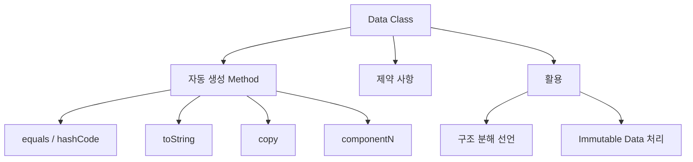

## Data Class 개요

- **data class**는 data 보관을 주된 목적으로 하는 class입니다.
    - `data` keyword를 class 앞에 붙여 선언합니다.
    - compiler가 `equals()`, `hashCode()`, `toString()`, `copy()`, `componentN()`을 자동 생성합니다.
    - Java의 POJO, DTO pattern을 간결하게 대체합니다.

```kotlin
data class User(val name: String, val age: Int)

val user = User("Kim", 25)
println(user)                    // User(name=Kim, age=25)
println(user == User("Kim", 25)) // true (equals 비교)
```




---


## 자동 생성 Method

- data class는 **primary constructor의 property를 기반**으로 method를 자동 생성합니다.
    - `val`/`var`로 선언된 parameter만 대상입니다.
    - class body에 선언된 property는 자동 생성 대상이 아닙니다.


### equals()와 hashCode()

- **구조적 동등성(structural equality)**을 비교합니다.
    - 두 객체의 모든 property 값이 같으면 동등합니다.
    - HashMap, HashSet 등에서 key로 사용할 수 있습니다.

```kotlin
data class User(val name: String, val age: Int)

val user1 = User("Kim", 25)
val user2 = User("Kim", 25)
val user3 = User("Lee", 30)

println(user1 == user2)              // true (equals 비교)
println(user1 === user2)             // false (reference 비교)
println(user1.hashCode() == user2.hashCode())  // true

// HashSet에서 활용
val set = hashSetOf(user1)
println(user2 in set)                // true
```

- **일반 class와 비교**하면 차이가 명확합니다.

```kotlin
class RegularUser(val name: String, val age: Int)

val regular1 = RegularUser("Kim", 25)
val regular2 = RegularUser("Kim", 25)

println(regular1 == regular2)        // false (reference 비교)
```


### toString()

- **읽기 쉬운 문자열 표현**을 제공합니다.
    - `ClassName(property1=value1, property2=value2)` 형식입니다.
    - debugging과 logging에 유용합니다.

```kotlin
data class User(val name: String, val age: Int)

val user = User("Kim", 25)
println(user)                        // User(name=Kim, age=25)
println(user.toString())             // User(name=Kim, age=25)
```


### copy()

- **일부 property를 변경한 복사본**을 생성합니다.
    - immutable data를 다룰 때 유용합니다.
    - 변경하지 않은 property는 원본 값을 유지합니다.

```kotlin
data class User(val name: String, val age: Int)

val user = User("Kim", 25)
val olderUser = user.copy(age = 26)
val renamedUser = user.copy(name = "Lee")
val newUser = user.copy(name = "Park", age = 30)

println(user)           // User(name=Kim, age=25)
println(olderUser)      // User(name=Kim, age=26)
println(renamedUser)    // User(name=Lee, age=25)
println(newUser)        // User(name=Park, age=30)
```

- **원본 객체는 변경되지 않습니다**.

```kotlin
data class User(val name: String, val age: Int)

val original = User("Kim", 25)
val modified = original.copy(age = 26)

println(original === modified)       // false (다른 객체)
println(original.age)                // 25 (원본 유지)
```


### componentN()

- **구조 분해 선언(destructuring declaration)**을 지원합니다.
    - `component1()`, `component2()`, ... 순서대로 property를 반환합니다.
    - primary constructor의 선언 순서를 따릅니다.

```kotlin
data class User(val name: String, val age: Int, val email: String)

val user = User("Kim", 25, "kim@example.com")

// 구조 분해 선언
val (name, age, email) = user
println(name)    // Kim
println(age)     // 25
println(email)   // kim@example.com

// componentN() 직접 호출
println(user.component1())    // Kim
println(user.component2())    // 25
println(user.component3())    // kim@example.com
```


---


## 구조 분해 선언

- **구조 분해 선언**은 객체를 여러 변수로 분해합니다.
    - data class의 `componentN()` 함수를 활용합니다.
    - 필요 없는 값은 `_`로 건너뛸 수 있습니다.

```kotlin
data class User(val name: String, val age: Int, val email: String)

val user = User("Kim", 25, "kim@example.com")

// 일부 값만 사용
val (name, _, email) = user
println("$name : $email")    // Kim : kim@example.com
```


### Loop에서의 활용

- **collection 순회 시 구조 분해**를 사용할 수 있습니다.

```kotlin
data class User(val name: String, val age: Int)

val users = listOf(
    User("Kim", 25),
    User("Lee", 30),
    User("Park", 28)
)

for ((name, age) in users) {
    println("$name is $age years old")
}
```


### Map Entry에서의 활용

- **Map 순회 시 key, value를 분해**할 수 있습니다.
    - `Map.Entry`가 `component1()`(key), `component2()`(value)를 제공합니다.

```kotlin
val map = mapOf("A" to 1, "B" to 2, "C" to 3)

for ((key, value) in map) {
    println("$key = $value")
}
```


### 함수 반환값에서의 활용

- **여러 값을 반환하는 함수**에서 유용합니다.

```kotlin
data class Result(val value: Int, val status: String)

fun compute(): Result {
    return Result(42, "success")
}

val (value, status) = compute()
println("Value: $value, Status: $status")
```


---


## 제약 사항

- data class는 **특정 조건을 충족**해야 합니다.


### Primary Constructor 요구 사항

- **primary constructor에 최소 하나의 parameter**가 필요합니다.
    - 모든 parameter는 `val` 또는 `var`로 선언해야 합니다.

```kotlin
// 올바른 선언
data class User(val name: String)
data class Point(var x: Int, var y: Int)

// compile error : parameter가 없음
// data class Empty()

// compile error : val/var 없음
// data class Invalid(name: String)
```


### 상속 제한

- data class는 **`abstract`, `open`, `sealed`, `inner`가 될 수 없습니다**.
    - data class는 암묵적으로 `final`입니다.
    - 다른 class를 상속받을 수는 있습니다.

```kotlin
// 불가능
// abstract data class AbstractData(val x: Int)
// open data class OpenData(val x: Int)
// sealed data class SealedData(val x: Int)
// inner data class InnerData(val x: Int)

// 가능 : interface 구현
interface Identifiable {
    val id: Long
}

data class User(override val id: Long, val name: String) : Identifiable
```


---


## Body Property

- **class body에 선언된 property**는 자동 생성 method에 포함되지 않습니다.
    - `equals()`, `hashCode()`, `toString()`, `copy()`에서 제외됩니다.
    - 동등성 비교에 영향을 주지 않아야 하는 property에 활용합니다.

```kotlin
data class User(val name: String) {
    var visitCount: Int = 0
}

val user1 = User("Kim")
val user2 = User("Kim")

user1.visitCount = 10
user2.visitCount = 20

println(user1 == user2)          // true (visitCount 무시)
println(user1.toString())        // User(name=Kim) (visitCount 없음)

val copied = user1.copy()
println(copied.visitCount)       // 0 (복사되지 않음)
```

- **의도적으로 비교에서 제외할 property**를 body에 선언합니다.

```kotlin
data class CacheEntry(val key: String, val value: String) {
    val timestamp: Long = System.currentTimeMillis()
    var accessCount: Int = 0
}

// key와 value만 비교, timestamp와 accessCount는 무시
val entry1 = CacheEntry("user", "data")
Thread.sleep(100)
val entry2 = CacheEntry("user", "data")

println(entry1 == entry2)        // true
```


---


## Java와의 비교

- Kotlin data class는 **Java의 POJO와 Record를 대체**합니다.
    - POJO 대비 boilerplate code를 대폭 줄입니다.
    - Java 16+의 Record와 유사하지만 가변성과 `copy()` 지원에서 차이가 있습니다.


### Java POJO와 비교

- **Kotlin data class**는 Java POJO의 boilerplate를 제거합니다.

```java
// Java : 동일한 기능을 위한 POJO
public class User {
    private final String name;
    private final int age;

    public User(String name, int age) {
        this.name = name;
        this.age = age;
    }

    public String getName() { return name; }
    public int getAge() { return age; }

    @Override
    public boolean equals(Object o) {
        if (this == o) return true;
        if (o == null || getClass() != o.getClass()) return false;
        User user = (User) o;
        return age == user.age && Objects.equals(name, user.name);
    }

    @Override
    public int hashCode() {
        return Objects.hash(name, age);
    }

    @Override
    public String toString() {
        return "User{name='" + name + "', age=" + age + "}";
    }

    // copy 기능은 직접 구현 필요
}
```

```kotlin
// Kotlin : 한 줄로 동일한 기능
data class User(val name: String, val age: Int)
```


### Java Record와 비교

- **Java 14+의 Record**는 Kotlin data class와 유사합니다.
    - 둘 다 불변 data holder를 간결하게 정의합니다.

| 기능 | Kotlin data class | Java Record |
| --- | --- | --- |
| 도입 버전 | Kotlin 1.0 | Java 14 (preview), 16 (정식) |
| 가변성 | `val`(불변), `var`(가변) 선택 | 항상 불변 |
| copy() | 자동 생성 | 직접 구현 필요 |
| 상속 | 다른 class 상속 가능 | 상속 불가 |
| body property | 가능 | 가능 |

```java
// Java Record (Java 16+)
public record User(String name, int age) {}
```

```kotlin
// Kotlin data class
data class User(val name: String, val age: Int)
```


---


## 활용 Pattern

- data class는 **다양한 상황에서 data holder로 활용**됩니다.
    - DTO, API 응답/요청 객체로 사용합니다.
    - 불변 상태(immutable state) 관리에 적합합니다.
    - `Pair`, `Triple` 대신 명확한 의미를 가진 type을 정의합니다.


### DTO로 활용

- **API 응답이나 요청 data**를 표현합니다.

```kotlin
data class ApiResponse<T>(
    val success: Boolean,
    val data: T?,
    val errorMessage: String? = null
)

data class UserDto(
    val id: Long,
    val username: String,
    val email: String
)
```


### State 표현

- **불변 상태(immutable state)**를 표현합니다.
    - `copy()`로 상태 변경을 처리합니다.

```kotlin
data class UiState(
    val isLoading: Boolean = false,
    val data: List<String> = emptyList(),
    val error: String? = null
)

var state = UiState()

// 상태 변경
state = state.copy(isLoading = true)
state = state.copy(isLoading = false, data = listOf("Item1", "Item2"))
state = state.copy(error = "Network error")
```


### Pair와 Triple 대체

- **의미 있는 이름**으로 가독성을 높입니다.

```kotlin
// Pair 사용 (의미 불명확)
fun findUser(): Pair<String, Int> = Pair("Kim", 25)
val (a, b) = findUser()    // a, b가 무엇인지 불명확

// data class 사용 (명확한 의미)
data class UserInfo(val name: String, val age: Int)
fun findUser(): UserInfo = UserInfo("Kim", 25)
val (name, age) = findUser()    // 명확한 의미
```


---


## Reference

- <https://kotlinlang.org/docs/data-classes.html>
- <https://kotlinlang.org/docs/destructuring-declarations.html>

