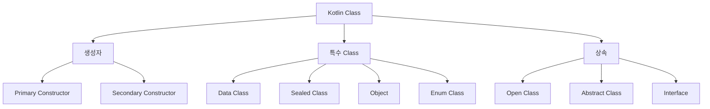

## Kotlin Class

- Kotlin은 **간결하고 강력한 class 시스템**을 제공합니다.
    - primary constructor로 boilerplate를 줄입니다.
    - `data class`, `sealed class`, `object` 등 특수 class를 지원합니다.
    - 기본적으로 `final`이며, 상속하려면 `open`을 명시해야 합니다.




---


## Class 선언

- `class` keyword로 class를 선언합니다.
    - body가 없으면 중괄호를 생략할 수 있습니다.

```kotlin
class Person

class User {
    // properties, methods
}
```


### Primary Constructor

- **class 이름 뒤에 constructor를 선언**합니다.
    - `val`/`var`로 property를 동시에 선언할 수 있습니다.
    - Java의 field 선언, 생성자, getter/setter를 한 줄로 대체합니다.

```kotlin
class User(val name: String, var age: Int)

// 위 코드는 아래 Java code와 동일
// public class User {
//     private final String name;
//     private int age;
//     public User(String name, int age) { ... }
//     public String getName() { ... }
//     public int getAge() { ... }
//     public void setAge(int age) { ... }
// }
```

- **default parameter**로 여러 생성자를 대체합니다.

```kotlin
class User(
    val name: String,
    val email: String = "",
    val age: Int = 0
)

val user1 = User("Kim")
val user2 = User("Lee", "lee@example.com")
val user3 = User("Park", age = 25)
```


### init Block

- **초기화 logic**은 `init` block에 작성합니다.
    - 여러 `init` block을 가질 수 있으며 순서대로 실행됩니다.

```kotlin
class User(val name: String) {
    val upperName: String

    init {
        require(name.isNotBlank()) { "Name cannot be blank" }
        upperName = name.uppercase()
    }
}
```


---


## Data Class

- **data class**는 data 보관 목적의 class입니다.
    - `equals()`, `hashCode()`, `toString()`, `copy()`를 자동 생성합니다.
    - primary constructor에 최소 하나의 property가 필요합니다.

```kotlin
data class User(val name: String, val age: Int)

val user = User("Kim", 25)
println(user)                        // User(name=Kim, age=25)

val copy = user.copy(age = 26)       // User(name=Kim, age=26)

val (name, age) = user               // destructuring
```


---


## Sealed Class

- **sealed class**는 제한된 class 계층을 정의합니다.
    - 모든 subclass가 compile time에 알려져 있습니다.
    - `when` 표현식에서 `else` 없이 모든 경우를 처리할 수 있습니다.

```kotlin
sealed class Result {
    data class Success(val data: String) : Result()
    data class Error(val message: String) : Result()
    object Loading : Result()
}

fun handle(result: Result): String = when (result) {
    is Result.Success -> "Data: ${result.data}"
    is Result.Error -> "Error: ${result.message}"
    Result.Loading -> "Loading..."
    // else 불필요
}
```


---


## Object

- **`object`는 singleton**을 선언합니다.
    - class 선언과 instance 생성을 동시에 처리합니다.

```kotlin
object DatabaseConfig {
    val url = "jdbc:mysql://localhost:3306/db"
    val maxConnections = 10

    fun connect() { /* ... */ }
}

// 사용
val url = DatabaseConfig.url
DatabaseConfig.connect()
```


### Companion Object

- **companion object**는 class 내부의 singleton입니다.
    - Java의 `static` member를 대체합니다.
    - factory method pattern에 유용합니다.

```kotlin
class User private constructor(val name: String) {
    companion object {
        fun create(name: String): User {
            return User(name.trim())
        }
    }
}

val user = User.create("  Kim  ")
```


---


## 상속

- Kotlin class는 **기본적으로 `final`**입니다.
    - 상속을 허용하려면 `open`을 명시해야 합니다.
    - method override도 `open`이 필요합니다.

```kotlin
open class Animal(val name: String) {
    open fun speak() = println("...")
}

class Dog(name: String) : Animal(name) {
    override fun speak() = println("Woof!")
}
```


### Interface

- **interface**는 abstract method와 default implementation을 가질 수 있습니다.
    - 상태(property)를 가질 수 있지만 backing field는 없습니다.

```kotlin
interface Drawable {
    fun draw()
    fun describe() = println("Drawable object")    // default implementation
}

class Circle : Drawable {
    override fun draw() = println("Drawing circle")
}
```


### Abstract Class

- **abstract class**는 instance를 생성할 수 없습니다.
    - abstract member는 subclass에서 반드시 구현해야 합니다.

```kotlin
abstract class Shape {
    abstract fun area(): Double
    fun describe() = println("Area: ${area()}")
}

class Rectangle(val width: Double, val height: Double) : Shape() {
    override fun area() = width * height
}
```


---


## Visibility Modifier

- Kotlin은 4가지 visibility modifier를 제공합니다.

| modifier | class member | top-level |
| --- | --- | --- |
| `public` (기본값) | 어디서나 접근 가능 | 어디서나 접근 가능 |
| `private` | class 내부에서만 | 파일 내부에서만 |
| `protected` | class와 subclass에서 | 사용 불가 |
| `internal` | 같은 module에서 | 같은 module에서 |

```kotlin
class User(private val id: Long) {
    internal fun validate() { /* ... */ }
    protected open fun process() { /* ... */ }
}
```


---


## Reference

- <https://kotlinlang.org/docs/classes.html>
- <https://kotlinlang.org/docs/data-classes.html>
- <https://kotlinlang.org/docs/sealed-classes.html>
- <https://kotlinlang.org/docs/object-declarations.html>

