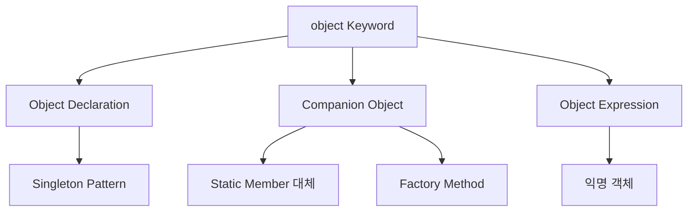

## Object : 진정한 Singleton 객체

- **`object`는 class 선언과 instance 생성을 동시에 수행**합니다.
    - 일반 class는 `class` keyword로 선언하고, 별도로 instance를 생성합니다.
    - `object`는 선언과 동시에 단 하나의 instance가 만들어집니다.
    - 해당 instance는 program 전체에서 공유됩니다.

```kotlin
// 일반 class : 선언과 생성이 분리됨
class RegularClass {
    fun doSomething() = println("Regular")
}
val instance = RegularClass()    // instance 생성 필요

// object : 선언과 동시에 instance 생성
object SingletonObject {
    fun doSomething() = println("Singleton")
}
SingletonObject.doSomething()    // 바로 사용 가능
```

- **Kotlin에는 `static` keyword가 없습니다**.
    - Java의 `static` member는 class에 속하지만, instance와 무관하게 존재합니다.
    - Kotlin은 `static` 대신 `object`와 `companion object`로 이 역할을 대체합니다.
    - `object`는 진정한 singleton 객체이므로, 상속과 interface 구현이 가능합니다.


### Object를 사용하는 이유

- **singleton pattern을 언어 차원에서 지원**합니다.
    - Java에서 thread-safe singleton을 구현하려면 복잡한 boilerplate가 필요합니다.
    - Kotlin `object`는 자동으로 thread-safe하고 lazy initialization됩니다.

```java
// Java : thread-safe singleton 구현
public class Singleton {
    private static volatile Singleton instance;

    private Singleton() {}

    public static Singleton getInstance() {
        if (instance == null) {
            synchronized (Singleton.class) {
                if (instance == null) {
                    instance = new Singleton();
                }
            }
        }
        return instance;
    }
}
```

```kotlin
// Kotlin : 한 줄로 동일한 기능
object Singleton
```

- **전역적으로 하나만 존재해야 하는 것**을 표현합니다.
    - 설정(configuration), logger, cache, database connection pool 등에 적합합니다.
    - application 전체에서 동일한 상태를 공유해야 할 때 사용합니다.


### Object Keyword의 세 가지 용도

- **`object` keyword**는 Kotlin에서 세 가지 형태로 사용됩니다.
    - **Object Declaration** : singleton instance를 선언합니다.
    - **Companion Object** : class 내부에 static-like member를 정의합니다.
    - **Object Expression** : 익명 객체를 생성합니다.




---


## Object Declaration

- **object declaration**은 singleton pattern을 간결하게 구현합니다.
    - class 선언과 단일 instance 생성을 동시에 처리합니다.
    - 처음 접근할 때 초기화(lazy initialization)됩니다.
    - thread-safe합니다.

```kotlin
object DatabaseConfig {
    val url = "jdbc:mysql://localhost:3306/db"
    val maxConnections = 10

    fun connect() {
        println("Connecting to $url")
    }
}

// 사용 : class 이름으로 직접 접근
val url = DatabaseConfig.url
DatabaseConfig.connect()
```


### Property와 Method

- **object는 일반 class처럼 property와 method**를 가질 수 있습니다.
    - `init` block으로 초기화 logic을 실행할 수 있습니다.
    - 다른 class를 상속하거나 interface를 구현할 수 있습니다.

```kotlin
object Logger {
    private val logs = mutableListOf<String>()

    init {
        println("Logger initialized")
    }

    fun log(message: String) {
        logs.add("[${System.currentTimeMillis()}] $message")
    }

    fun printLogs() {
        logs.forEach { println(it) }
    }
}
```


### Interface 구현

- **object가 interface를 구현**할 수 있습니다.
    - singleton으로 동작하는 구현체를 정의합니다.

```kotlin
interface Serializer {
    fun serialize(data: Any): String
    fun deserialize(json: String): Any
}

object JsonSerializer : Serializer {
    override fun serialize(data: Any): String {
        return """{"data": "$data"}"""
    }

    override fun deserialize(json: String): Any {
        return json
    }
}

val json = JsonSerializer.serialize("Hello")
```


### Class 상속

- **object가 class를 상속**할 수 있습니다.

```kotlin
open class Vehicle(val name: String) {
    open fun start() = println("$name starting")
}

object ServiceCar : Vehicle("Service Car") {
    override fun start() {
        println("Service car is ready")
        super.start()
    }
}

ServiceCar.start()
// Service car is ready
// Service Car starting
```


### 초기화 시점

- **object는 처음 접근할 때 초기화**됩니다.
    - application 시작 시점이 아닌 실제 사용 시점에 초기화됩니다.
        - lazy initialization이 자동으로 적용됩니다.
    - 무거운 초기화 작업이 있어도 사용하지 않으면 비용이 발생하지 않습니다.

```kotlin
object HeavyResource {
    init {
        println("HeavyResource initialized")
        // 무거운 초기화 작업
    }

    val data = "Important data"
}

fun main() {
    println("Before accessing HeavyResource")
    println(HeavyResource.data)    // 이 시점에 초기화
    println("After accessing HeavyResource")
}

// 출력:
// Before accessing HeavyResource
// HeavyResource initialized
// Important data
// After accessing HeavyResource
```


---


## Companion Object

- **companion object**는 class 내부에 정의된 singleton입니다.
    - Java의 `static` member를 대체합니다.
    - class 이름으로 직접 접근할 수 있습니다.
    - class당 하나의 companion object만 가질 수 있습니다.

```kotlin
class User(val name: String) {
    companion object {
        const val MIN_AGE = 0
        const val MAX_AGE = 150

        fun create(name: String): User {
            return User(name.trim())
        }
    }
}

// class 이름으로 접근
val minAge = User.MIN_AGE
val user = User.create("  Kim  ")
```


### Factory Method Pattern

- **companion object로 factory method**를 구현합니다.
    - private constructor와 함께 사용하여 객체 생성을 제어합니다.
    - 다양한 생성 방식을 명확한 이름으로 제공합니다.

```kotlin
class User private constructor(
    val id: Long,
    val name: String,
    val email: String
) {
    companion object {
        private var nextId = 1L

        fun fromName(name: String): User {
            return User(nextId++, name, "")
        }

        fun fromEmail(email: String): User {
            val name = email.substringBefore("@")
            return User(nextId++, name, email)
        }

        fun fromJson(json: String): User {
            // JSON parsing logic
            return User(nextId++, "parsed", "parsed@example.com")
        }
    }
}

val user1 = User.fromName("Kim")
val user2 = User.fromEmail("lee@example.com")
val user3 = User.fromJson("""{"name": "Park"}""")
```


### Companion Object 이름

- **companion object에 이름을 지정**할 수 있습니다.
    - 이름을 지정하지 않으면 `Companion`이 기본 이름입니다.
    - Java에서 접근할 때 이름이 사용됩니다.

```kotlin
class User(val name: String) {
    companion object Factory {
        fun create(name: String) = User(name)
    }
}

// 이름 없이 접근 (일반적인 방식)
val user1 = User.create("Kim")

// 이름으로 접근
val user2 = User.Factory.create("Lee")

// 기본 이름 Companion
class Product(val name: String) {
    companion object {
        fun create(name: String) = Product(name)
    }
}

val product = Product.Companion.create("Phone")
```


### Interface 구현

- **companion object가 interface를 구현**할 수 있습니다.
    - class 자체를 interface type으로 전달할 수 있습니다.

```kotlin
interface Factory<T> {
    fun create(): T
}

class User(val name: String) {
    companion object : Factory<User> {
        override fun create(): User {
            return User("Default")
        }
    }
}

fun <T> createInstance(factory: Factory<T>): T {
    return factory.create()
}

// User의 companion object가 Factory<User>를 구현
val user = createInstance(User)
```


### Extension Function

- **companion object에 extension function**을 추가할 수 있습니다.
    - 외부에서 companion object의 기능을 확장합니다.

```kotlin
class User(val name: String) {
    companion object
}

// companion object에 extension function 추가
fun User.Companion.fromCsv(csv: String): User {
    val name = csv.split(",").first()
    return User(name)
}

val user = User.fromCsv("Kim,25,Seoul")
```


---


## Object Expression

- **object expression**은 익명 객체를 생성합니다.
    - Java의 anonymous inner class를 대체합니다.
    - interface나 abstract class의 일회성 구현에 사용합니다.

```kotlin
interface ClickListener {
    fun onClick()
}

fun setClickListener(listener: ClickListener) {
    listener.onClick()
}

// object expression으로 익명 객체 생성
setClickListener(object : ClickListener {
    override fun onClick() {
        println("Clicked!")
    }
})
```


### 여러 Interface 구현

- **하나의 익명 객체가 여러 interface를 구현**할 수 있습니다.

```kotlin
interface A {
    fun methodA()
}

interface B {
    fun methodB()
}

val obj = object : A, B {
    override fun methodA() = println("A")
    override fun methodB() = println("B")
}

obj.methodA()
obj.methodB()
```


### Class 상속과 Interface 구현

- **class 상속과 interface 구현을 동시에** 할 수 있습니다.

```kotlin
open class Base(val x: Int) {
    open fun print() = println("Base: $x")
}

interface Printable {
    fun printFormatted()
}

val obj = object : Base(10), Printable {
    override fun print() = println("Overridden: $x")
    override fun printFormatted() = println("Formatted: [$x]")
}
```


### Type 없는 Object Expression

- **type 지정 없이 익명 객체를 생성**할 수 있습니다.
    - local 또는 private 범위에서만 사용 가능합니다.
    - property에 직접 접근할 수 있습니다.

```kotlin
fun main() {
    val point = object {
        val x = 10
        val y = 20
    }

    println("x: ${point.x}, y: ${point.y}")
}

class Example {
    // private이므로 내부에서 property 접근 가능
    private val data = object {
        val name = "Secret"
        val value = 42
    }

    fun printData() {
        println("${data.name}: ${data.value}")
    }
}
```


### 외부 변수 접근

- **object expression은 외부 scope의 변수에 접근**할 수 있습니다.
    - Java anonymous class는 `final` 변수만 접근할 수 있습니다.
    - Kotlin은 `final` 여부와 관계없이 접근할 수 있고, 값을 수정할 수도 있습니다.

```kotlin
fun countClicks(button: Button) {
    var clickCount = 0    // var : 변경 가능한 변수

    button.setOnClickListener(object : ClickListener {
        override fun onClick() {
            clickCount++    // 외부 변수 수정 가능 (Java에서는 불가능)
            println("Clicked $clickCount times")
        }
    })
}
```


---


## Object Declaration vs Object Expression

- **object declaration과 object expression**은 다른 특성을 가집니다.

| 특성 | Object Declaration | Object Expression |
| --- | --- | --- |
| 초기화 시점 | 처음 접근 시 (lazy) | 선언 즉시 |
| instance 수 | singleton (하나) | 매번 새 instance |
| 이름 | 있음 | 없음 (익명) |
| 위치 | top-level 또는 class 내부 | expression이 필요한 곳 |

```kotlin
// Object Declaration : singleton
object Singleton {
    val id = System.currentTimeMillis()
}

println(Singleton.id)    // 항상 같은 값
println(Singleton.id)    // 항상 같은 값

// Object Expression : 매번 새 instance
fun createObject() = object {
    val id = System.currentTimeMillis()
}

println(createObject().id)    // 매번 다른 값
println(createObject().id)    // 매번 다른 값
```


---


## Java와의 비교

- **Kotlin object**는 Java의 여러 pattern을 대체합니다.


### Static Member 비교

- **Kotlin은 `static` keyword가 없습니다**.
    - companion object로 static-like 동작을 구현합니다.

```java
// Java : static member
public class User {
    private static int count = 0;
    private String name;

    public User(String name) {
        this.name = name;
        count++;
    }

    public static int getCount() {
        return count;
    }

    public static User create(String name) {
        return new User(name);
    }
}
```

```kotlin
// Kotlin : companion object
class User(val name: String) {
    companion object {
        private var count = 0

        fun getCount() = count
        fun create(name: String) = User(name)
    }

    init {
        count++
    }
}
```


### Singleton Pattern 비교

- **Kotlin object declaration**은 Java의 singleton boilerplate를 제거합니다.

```java
// Java : thread-safe singleton
public class Singleton {
    private static volatile Singleton instance;
    private String data;

    private Singleton() {
        data = "initialized";
    }

    public static Singleton getInstance() {
        if (instance == null) {
            synchronized (Singleton.class) {
                if (instance == null) {
                    instance = new Singleton();
                }
            }
        }
        return instance;
    }

    public String getData() {
        return data;
    }
}
```

```kotlin
// Kotlin : 한 줄로 thread-safe singleton
object Singleton {
    val data = "initialized"
}
```


### Anonymous Class 비교

- **Kotlin object expression**은 Java anonymous class보다 유연합니다.

```java
// Java : anonymous inner class
button.setOnClickListener(new OnClickListener() {
    @Override
    public void onClick(View v) {
        // final 변수만 접근 가능
        System.out.println("Clicked");
    }
});
```

```kotlin
// Kotlin : object expression
button.setOnClickListener(object : OnClickListener {
    override fun onClick(v: View) {
        // final 여부와 관계없이 외부 변수 접근 및 수정 가능
        println("Clicked")
    }
})

// SAM 변환으로 더 간결하게 (Java interface인 경우)
button.setOnClickListener { println("Clicked") }
```


### Java에서 Kotlin Object 접근

- **Java code에서 Kotlin object에 접근**하는 방법입니다.

```kotlin
// Kotlin
object Utils {
    fun doSomething() = println("Done")
}

class User(val name: String) {
    companion object {
        fun create(name: String) = User(name)
    }
}
```

```java
// Java에서 접근
Utils.INSTANCE.doSomething();

User user = User.Companion.create("Kim");
```

- **`@JvmStatic`으로 Java에서 더 자연스럽게 접근**할 수 있습니다.

```kotlin
object Utils {
    @JvmStatic
    fun doSomething() = println("Done")
}

class User(val name: String) {
    companion object {
        @JvmStatic
        fun create(name: String) = User(name)
    }
}
```

```java
// Java에서 접근 (@JvmStatic 사용 시)
Utils.doSomething();    // INSTANCE 없이 접근

User user = User.create("Kim");    // Companion 없이 접근
```


---


## Reference

- <https://kotlinlang.org/docs/object-declarations.html>
- <https://kotlinlang.org/docs/object-declarations.html#companion-objects>

