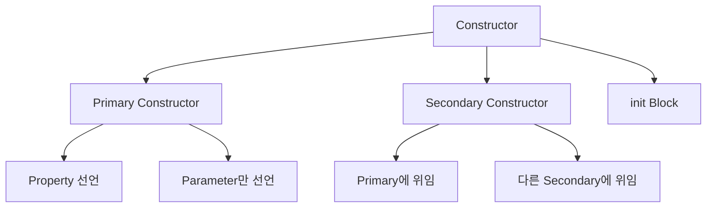
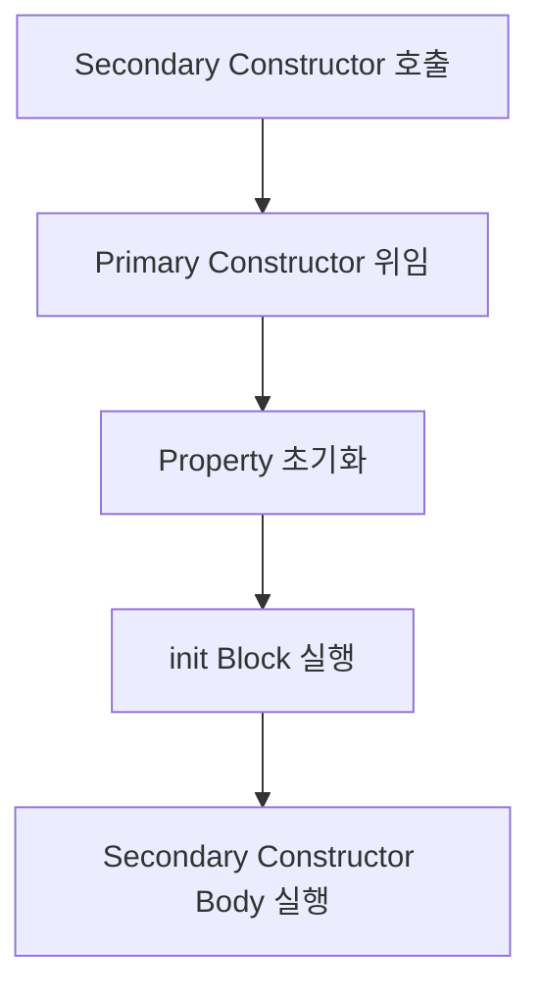

## Constructor 개요

- Kotlin class는 **primary constructor와 secondary constructor**를 가질 수 있습니다.
    - primary constructor는 class header에 선언하며, 가장 간결한 형태입니다.
    - secondary constructor는 class body에 `constructor` keyword로 선언합니다.
    - `init` block은 primary constructor의 초기화 logic을 담습니다.




---


## Primary Constructor

- **primary constructor는 class 이름 뒤에 선언**합니다.
    - `constructor` keyword는 생략할 수 있습니다.
    - annotation이나 visibility modifier가 있으면 `constructor`를 명시해야 합니다.

```kotlin
// 기본 형태
class User constructor(name: String)

// constructor keyword 생략 (일반적인 형태)
class User(name: String)

// visibility modifier가 있으면 constructor 필요
class User private constructor(name: String)

// annotation이 있으면 constructor 필요
class User @Inject constructor(name: String)
```


### Property 선언

- **primary constructor에서 `val`/`var`로 property를 동시에 선언**할 수 있습니다.
    - constructor parameter와 property 선언을 한 줄로 결합합니다.
    - Java의 field 선언, 생성자 할당, getter/setter를 대체합니다.

```kotlin
class User(val name: String, var age: Int)

val user = User("Kim", 25)
println(user.name)    // Kim
user.age = 26         // var이므로 수정 가능
```

- **Java code와 비교**하면 간결함이 명확합니다.

```java
// Java : 동일한 기능을 위해 필요한 code
public class User {
    private final String name;
    private int age;

    public User(String name, int age) {
        this.name = name;
        this.age = age;
    }

    public String getName() { return name; }
    public int getAge() { return age; }
    public void setAge(int age) { this.age = age; }
}
```

```kotlin
// Kotlin : 한 줄로 동일한 기능
class User(val name: String, var age: Int)
```


### Parameter와 Property의 차이

- **`val`/`var` 없이 선언한 parameter**는 constructor scope에서만 유효합니다.
    - `init` block이나 property 초기화에서 사용할 수 있습니다.
    - class의 다른 method에서는 접근할 수 없습니다.

```kotlin
class User(name: String, age: Int) {
    // property 초기화에 parameter 사용
    val upperName = name.uppercase()
    val birthYear = 2025 - age

    init {
        // init block에서 parameter 사용
        println("Creating user: $name")
    }

    fun greet() {
        // compile error : name은 property가 아님
        // println("Hello, $name")
    }
}
```

- **property로 선언**하면 class 전체에서 접근 가능합니다.

```kotlin
class User(val name: String, val age: Int) {
    fun greet() {
        println("Hello, $name")    // 가능
    }
}
```


### Default Parameter

- **primary constructor에 default value를 지정**할 수 있습니다.
    - 여러 생성자 overloading을 하나의 constructor로 대체합니다.
    - named argument와 함께 사용하면 유연한 객체 생성이 가능합니다.

```kotlin
class User(
    val name: String,
    val email: String = "",
    val age: Int = 0,
    val active: Boolean = true
)

// 다양한 방식으로 객체 생성
val user1 = User("Kim")
val user2 = User("Lee", "lee@example.com")
val user3 = User("Park", age = 30)
val user4 = User("Choi", active = false, age = 25)
```


---


## init Block

- **`init` block은 primary constructor의 초기화 logic**을 담습니다.
    - primary constructor는 body를 가질 수 없으므로 `init` block을 사용합니다.
    - 여러 `init` block을 가질 수 있으며, 선언 순서대로 실행됩니다.

```kotlin
class User(val name: String) {
    init {
        println("First init block: $name")
    }

    val nameLength = name.length

    init {
        println("Second init block: length = $nameLength")
    }
}

// 출력:
// First init block: Kim
// Second init block: length = 3
```


### 유효성 검사

- **`init` block에서 parameter 유효성을 검증**할 수 있습니다.
    - `require`는 `IllegalArgumentException`을 발생시킵니다.
    - `check`는 `IllegalStateException`을 발생시킵니다.

```kotlin
class User(val name: String, val age: Int) {
    init {
        require(name.isNotBlank()) { "Name cannot be blank" }
        require(age >= 0) { "Age cannot be negative" }
    }
}

// val user = User("", 25)    // IllegalArgumentException
// val user = User("Kim", -1)    // IllegalArgumentException
```


### Property 초기화와 init Block의 순서

- **property 초기화와 `init` block은 선언 순서대로 실행**됩니다.
    - 순서에 따라 초기화되지 않은 property에 접근할 수 있으므로 주의해야 합니다.

```kotlin
class Example(val input: String) {
    // 1. 첫 번째 property 초기화
    val first = input.length

    // 2. 첫 번째 init block
    init {
        println("first = $first")
    }

    // 3. 두 번째 property 초기화
    val second = first * 2

    // 4. 두 번째 init block
    init {
        println("second = $second")
    }
}
```

- **잘못된 순서로 인한 문제** 예시입니다.

```kotlin
class Wrong(val input: String) {
    init {
        // processed가 아직 초기화되지 않음
        println("Length: ${processed.length}")    // NullPointerException 위험
    }

    val processed = input.uppercase()
}
```


---


## Secondary Constructor

- **secondary constructor는 class body에 `constructor` keyword로 선언**합니다.
    - primary constructor가 있으면 반드시 직접 또는 간접적으로 위임해야 합니다.
    - `this` keyword로 다른 constructor에 위임합니다.

```kotlin
class User(val name: String, val age: Int) {
    var email: String = ""

    // primary constructor에 위임
    constructor(name: String) : this(name, 0)

    // 다른 secondary constructor에 위임
    constructor(name: String, email: String) : this(name) {
        this.email = email
    }
}

val user1 = User("Kim", 25)
val user2 = User("Lee")
val user3 = User("Park", "park@example.com")
```


### 초기화 순서

- **primary constructor 위임과 `init` block이 먼저 실행**됩니다.
    - secondary constructor body는 `init` block 이후에 실행됩니다.

```kotlin
class User(val name: String) {
    init {
        println("1. init block")
    }

    constructor(name: String, age: Int) : this(name) {
        println("2. secondary constructor body")
    }
}

val user = User("Kim", 25)
// 출력:
// 1. init block
// 2. secondary constructor body
```




### Secondary Constructor만 있는 경우

- **primary constructor 없이 secondary constructor만 선언**할 수 있습니다.
    - 이 경우 위임 없이 직접 초기화합니다.
    - Java class를 상속할 때 자주 사용합니다.

```kotlin
class User {
    val name: String
    val age: Int

    constructor(name: String) {
        this.name = name
        this.age = 0
    }

    constructor(name: String, age: Int) {
        this.name = name
        this.age = age
    }
}
```

- **primary constructor + default parameter가 더 간결**합니다.
    - 가능하면 secondary constructor 대신 default parameter를 사용합니다.

```kotlin
// secondary constructor 대신 default parameter 사용
class User(val name: String, val age: Int = 0)
```


---


## Visibility Modifier

- **constructor에 visibility modifier를 적용**할 수 있습니다.
    - private constructor는 외부에서 객체 생성을 막습니다.
    - factory method pattern이나 singleton 구현에 사용합니다.

```kotlin
class User private constructor(val name: String) {
    companion object {
        fun create(name: String): User {
            // 유효성 검사 후 생성
            require(name.isNotBlank())
            return User(name.trim())
        }
    }
}

// val user = User("Kim")    // compile error : constructor is private
val user = User.create("Kim")    // factory method 사용
```

- **internal constructor**는 같은 module 내에서만 접근 가능합니다.

```kotlin
class InternalUser internal constructor(val name: String)
```


---


## 상속에서의 Constructor

- **subclass는 superclass의 constructor를 호출**해야 합니다.
    - primary constructor에서 superclass 초기화를 수행합니다.

```kotlin
open class Animal(val name: String)

class Dog(name: String, val breed: String) : Animal(name)

val dog = Dog("Buddy", "Golden Retriever")
println(dog.name)     // Buddy
println(dog.breed)    // Golden Retriever
```

- **secondary constructor에서 superclass 호출**은 `super` keyword를 사용합니다.

```kotlin
open class Animal(val name: String)

class Dog : Animal {
    val breed: String

    constructor(name: String) : super(name) {
        this.breed = "Unknown"
    }

    constructor(name: String, breed: String) : super(name) {
        this.breed = breed
    }
}
```


---


## Java와의 비교

- Kotlin constructor는 Java보다 **간결하고 유연**합니다.

| Java | Kotlin | 설명 |
| --- | --- | --- |
| 생성자 + field + getter/setter | `val`/`var` parameter | property 자동 생성 |
| 생성자 overloading | default parameter | 선택적 인자 |
| 생성자 내 초기화 | init block | 초기화 logic 분리 |
| factory method | companion object | 생성 로직 캡슐화 |

```java
// Java : 생성자 overloading
public class User {
    private String name;
    private int age;

    public User(String name) {
        this(name, 0);
    }

    public User(String name, int age) {
        this.name = name;
        this.age = age;
    }
}
```

```kotlin
// Kotlin : default parameter로 해결
class User(val name: String, val age: Int = 0)
```


---


## Reference

- <https://kotlinlang.org/docs/classes.html#constructors>
- <https://kotlinlang.org/docs/classes.html#secondary-constructors>

