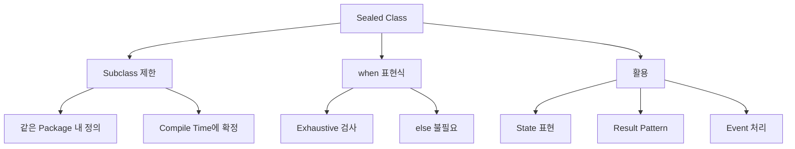

## Sealed Class 개요

- **"sealed"는 "봉인된"**이라는 뜻입니다.
    - 상속을 봉인하여 **정해진 subclass만 허용**합니다.
    - 외부 module에서 새로운 subclass를 추가할 수 없습니다.

- **sealed class**는 제한된 class 계층(restricted class hierarchy)을 정의합니다.
    - sealed class를 상속받는 subclass가 compile time에 모두 알려져 있습니다.
    - `when` 표현식에서 `else` 분기 없이 모든 경우를 처리할 수 있습니다.
    - 상태(state), 결과(result), 이벤트(event) 등을 type-safe하게 표현합니다.


### Sealed Class를 사용하는 이유

- **enum class의 한계를 극복**합니다.
    - enum은 각 값이 singleton이며, 값마다 다른 property를 가질 수 없습니다.
    - sealed class의 subclass는 각각 다른 property와 상태를 가질 수 있습니다.

```kotlin
// enum : 각 값이 동일한 구조
enum class ResultEnum { SUCCESS, ERROR, LOADING }

// sealed class : 각 subclass가 다른 구조
sealed class Result {
    data class Success(val data: String) : Result()        // data 보유
    data class Error(val code: Int, val message: String) : Result()    // code, message 보유
    object Loading : Result()                              // 상태 없음
}
```

- **abstract class보다 안전한 분기 처리**를 제공합니다.
    - abstract class는 어디서든 상속 가능하여 `when`에서 `else`가 필요합니다.
    - sealed class는 subclass가 고정되어 있어 compiler가 모든 경우를 검증합니다.

```kotlin
// abstract class : 새로운 subclass가 언제든 추가될 수 있음
abstract class AbstractResult
fun handle(result: AbstractResult) = when (result) {
    is Success -> "success"
    is Error -> "error"
    else -> "unknown"    // else 필수 : 다른 subclass가 있을 수 있음
}

// sealed class : subclass가 고정됨
sealed class SealedResult
fun handle(result: SealedResult) = when (result) {
    is Success -> "success"
    is Error -> "error"
    // else 불필요 : 모든 subclass를 compiler가 알고 있음
}
```


### 기본 예제

```kotlin
sealed class Result {
    data class Success(val data: String) : Result()
    data class Error(val message: String) : Result()
    object Loading : Result()
}

fun handle(result: Result): String = when (result) {
    is Result.Success -> "Data: ${result.data}"
    is Result.Error -> "Error: ${result.message}"
    Result.Loading -> "Loading..."
    // else 불필요 : 모든 경우가 처리됨
}
```




---


## Sealed Class 선언

- **`sealed` keyword**를 class 앞에 붙여 선언합니다.
    - sealed class 자체는 abstract이므로 직접 instance를 생성할 수 없습니다.
    - constructor는 `protected`(기본값) 또는 `private`만 가능합니다.

```kotlin
sealed class Shape {
    abstract fun area(): Double
}

class Circle(val radius: Double) : Shape() {
    override fun area() = Math.PI * radius * radius
}

class Rectangle(val width: Double, val height: Double) : Shape() {
    override fun area() = width * height
}

// val shape = Shape()    // compile error : sealed class는 직접 생성 불가
```


### Subclass 정의 위치

- **Kotlin 1.5 이전** : 같은 file 내에서만 subclass를 정의할 수 있습니다.
- **Kotlin 1.5 이후** : 같은 package 내 어디서든 subclass를 정의할 수 있습니다.
    - 단, 다른 module에서는 subclass를 정의할 수 없습니다.

```kotlin
// Shape.kt
sealed class Shape

// Circle.kt (같은 package)
class Circle(val radius: Double) : Shape()

// Rectangle.kt (같은 package)
class Rectangle(val width: Double, val height: Double) : Shape()
```


### 중첩 Class로 정의

- **sealed class 내부에 subclass를 정의**하는 것이 일반적입니다.
    - 관련 type들이 하나의 file에 모여 가독성이 높아집니다.
    - subclass 접근 시 `SealedClass.Subclass` 형태로 사용합니다.

```kotlin
sealed class NetworkResult {
    data class Success(val data: String) : NetworkResult()
    data class Error(val code: Int, val message: String) : NetworkResult()
    object Loading : NetworkResult()
}

val result: NetworkResult = NetworkResult.Success("data")
```


---


## when 표현식과 Exhaustive 검사

- **sealed class를 `when` 표현식과 함께 사용**하면 compiler가 모든 경우를 처리했는지 검사합니다.
    - 모든 subclass를 처리하면 `else`가 필요 없습니다.
    - 새로운 subclass를 추가하면 처리하지 않은 `when` 표현식에서 compile error가 발생합니다.

```kotlin
sealed class Response {
    data class Success(val data: String) : Response()
    data class Error(val message: String) : Response()
    object Loading : Response()
}

// 모든 경우를 처리 : else 불필요
fun handleResponse(response: Response): String = when (response) {
    is Response.Success -> "Success: ${response.data}"
    is Response.Error -> "Error: ${response.message}"
    Response.Loading -> "Loading..."
}
```


### 새로운 Subclass 추가 시 안전성

- **subclass를 추가하면 compiler가 누락된 분기를 알려줍니다**.
    - runtime error 대신 compile error로 문제를 미리 발견합니다.

```kotlin
sealed class Response {
    data class Success(val data: String) : Response()
    data class Error(val message: String) : Response()
    object Loading : Response()
    object Empty : Response()    // 새로운 subclass 추가
}

// compile error : 'when' expression must be exhaustive,
// add necessary 'Empty' branch or 'else' branch instead
fun handleResponse(response: Response): String = when (response) {
    is Response.Success -> "Success: ${response.data}"
    is Response.Error -> "Error: ${response.message}"
    Response.Loading -> "Loading..."
    // Response.Empty 처리 누락
}
```


### when을 Statement로 사용할 때

- **`when`을 statement로 사용**하면 exhaustive 검사가 적용되지 않습니다.
    - 반환값을 사용하지 않으면 `else` 없이도 compile됩니다.
    - 안전을 위해 expression으로 사용하는 것을 권장합니다.

```kotlin
sealed class Event {
    object Click : Event()
    object Scroll : Event()
}

// statement : exhaustive 검사 없음
fun logEvent(event: Event) {
    when (event) {
        Event.Click -> println("Clicked")
        // Scroll 처리 누락해도 compile 가능
    }
}

// expression으로 변환하여 안전하게 사용
fun logEventSafe(event: Event) = when (event) {
    Event.Click -> println("Clicked")
    Event.Scroll -> println("Scrolled")
}
```


---


## Sealed Interface

- **Kotlin 1.5부터 sealed interface**를 지원합니다.
    - sealed class와 동일한 제한된 계층 구조를 제공합니다.
    - 여러 sealed interface를 구현할 수 있습니다.

```kotlin
sealed interface Error {
    val message: String
}

class NetworkError(override val message: String) : Error
class DatabaseError(override val message: String) : Error
class UnknownError(override val message: String) : Error

fun handleError(error: Error) = when (error) {
    is NetworkError -> "Network: ${error.message}"
    is DatabaseError -> "Database: ${error.message}"
    is UnknownError -> "Unknown: ${error.message}"
}
```


### Sealed Class와 Sealed Interface의 차이

- **sealed interface**는 다중 구현이 가능합니다.
    - 하나의 class가 여러 sealed interface를 구현할 수 있습니다.
    - sealed class는 단일 상속만 가능합니다.

```kotlin
sealed interface Drawable {
    fun draw()
}

sealed interface Clickable {
    fun onClick()
}

// 여러 sealed interface 구현
class Button : Drawable, Clickable {
    override fun draw() = println("Drawing button")
    override fun onClick() = println("Button clicked")
}
```

| 특성 | sealed class | sealed interface |
| --- | --- | --- |
| 상속/구현 | 단일 상속 | 다중 구현 가능 |
| 상태(state) | field 가질 수 있음 | field 가질 수 없음 |
| constructor | 가질 수 있음 | 가질 수 없음 |
| 도입 version | Kotlin 1.0 | Kotlin 1.5 |


---


## Subclass 유형

- sealed class의 **subclass는 다양한 형태**로 정의할 수 있습니다.
    - `data class` : data를 담는 경우.
    - `object` : singleton, 상태 없는 경우.
    - 일반 `class` : 복잡한 동작이 필요한 경우.
    - 다른 `sealed class` : 계층 구조가 필요한 경우.


### data class로 정의

- **data를 담는 subclass**는 `data class`로 정의합니다.
    - `equals()`, `hashCode()`, `toString()`, `copy()`를 자동 생성합니다.

```kotlin
sealed class Result<out T> {
    data class Success<T>(val data: T) : Result<T>()
    data class Error(val exception: Throwable) : Result<Nothing>()
}

val success = Result.Success("Hello")
val error = Result.Error(RuntimeException("Failed"))

println(success)    // Success(data=Hello)
println(error)      // Error(exception=java.lang.RuntimeException: Failed)
```


### object로 정의

- **상태가 없는 subclass**는 `object`로 정의합니다.
    - singleton이므로 instance 비교 시 `===` 또는 직접 비교가 가능합니다.

```kotlin
sealed class UiState {
    object Loading : UiState()
    object Empty : UiState()
    data class Success(val items: List<String>) : UiState()
    data class Error(val message: String) : UiState()
}

fun render(state: UiState) = when (state) {
    UiState.Loading -> showLoading()
    UiState.Empty -> showEmpty()
    is UiState.Success -> showItems(state.items)
    is UiState.Error -> showError(state.message)
}
```


### 중첩 Sealed Class

- **계층적인 분류**가 필요하면 sealed class를 중첩합니다.

```kotlin
sealed class Response {
    sealed class Success : Response() {
        data class WithData(val data: String) : Success()
        object Empty : Success()
    }

    sealed class Failure : Response() {
        data class NetworkError(val code: Int) : Failure()
        data class ServerError(val message: String) : Failure()
        object Unknown : Failure()
    }
}

fun handle(response: Response) = when (response) {
    is Response.Success.WithData -> "Data: ${response.data}"
    Response.Success.Empty -> "Empty response"
    is Response.Failure.NetworkError -> "Network error: ${response.code}"
    is Response.Failure.ServerError -> "Server error: ${response.message}"
    Response.Failure.Unknown -> "Unknown error"
}
```


---


## 활용 Pattern

- sealed class는 **다양한 상태나 결과를 type-safe하게 표현**하는 데 적합합니다.
    - Result pattern으로 성공/실패를 명시적으로 처리합니다.
    - UI state를 정의하여 화면 상태를 관리합니다.
    - Event 처리로 발생 가능한 모든 event를 정의합니다.


### Result Pattern

- **연산 결과를 Success/Failure로 표현**합니다.
    - exception 대신 sealed class로 결과를 반환합니다.
    - 호출자가 모든 결과를 명시적으로 처리해야 합니다.

```kotlin
sealed class Result<out T> {
    data class Success<T>(val value: T) : Result<T>()
    data class Failure(val error: Throwable) : Result<Nothing>()

    fun getOrNull(): T? = when (this) {
        is Success -> value
        is Failure -> null
    }

    fun <R> map(transform: (T) -> R): Result<R> = when (this) {
        is Success -> Success(transform(value))
        is Failure -> this
    }
}

fun divide(a: Int, b: Int): Result<Int> {
    return if (b == 0) {
        Result.Failure(ArithmeticException("Division by zero"))
    } else {
        Result.Success(a / b)
    }
}

val result = divide(10, 2)
when (result) {
    is Result.Success -> println("Result: ${result.value}")
    is Result.Failure -> println("Error: ${result.error.message}")
}
```


### State 표현

- **UI 상태나 application 상태**를 표현합니다.
    - 가능한 모든 상태를 명확하게 정의합니다.
    - 상태 전이를 type-safe하게 처리합니다.

```kotlin
sealed class ScreenState {
    object Initial : ScreenState()
    object Loading : ScreenState()
    data class Content(val items: List<Item>) : ScreenState()
    data class Error(val message: String, val retry: () -> Unit) : ScreenState()
}

class ViewModel {
    private var state: ScreenState = ScreenState.Initial

    fun loadData() {
        state = ScreenState.Loading
        try {
            val items = fetchItems()
            state = ScreenState.Content(items)
        } catch (e: Exception) {
            state = ScreenState.Error(e.message ?: "Unknown error") { loadData() }
        }
    }
}
```


### Event 처리

- **UI event나 domain event**를 정의합니다.

```kotlin
sealed class UiEvent {
    data class ButtonClick(val buttonId: String) : UiEvent()
    data class TextInput(val text: String) : UiEvent()
    object BackPressed : UiEvent()
    data class ItemSelected(val position: Int) : UiEvent()
}

fun handleEvent(event: UiEvent) = when (event) {
    is UiEvent.ButtonClick -> processButtonClick(event.buttonId)
    is UiEvent.TextInput -> processTextInput(event.text)
    UiEvent.BackPressed -> navigateBack()
    is UiEvent.ItemSelected -> selectItem(event.position)
}
```


### API Response 처리

- **API 응답의 다양한 결과**를 표현합니다.

```kotlin
sealed class ApiResponse<out T> {
    data class Success<T>(val data: T) : ApiResponse<T>()
    data class HttpError(val code: Int, val message: String) : ApiResponse<Nothing>()
    data class NetworkError(val exception: Throwable) : ApiResponse<Nothing>()
    object Loading : ApiResponse<Nothing>()
}

suspend fun fetchUser(id: Long): ApiResponse<User> {
    return try {
        val response = api.getUser(id)
        if (response.isSuccessful) {
            ApiResponse.Success(response.body()!!)
        } else {
            ApiResponse.HttpError(response.code(), response.message())
        }
    } catch (e: IOException) {
        ApiResponse.NetworkError(e)
    }
}
```


---


## Java와의 비교

- **Java 17+**에서도 sealed class를 지원합니다.
    - Kotlin보다 늦게 도입되었으며 문법에 차이가 있습니다.

| 특성 | Kotlin sealed class | Java sealed class |
| --- | --- | --- |
| 도입 version | Kotlin 1.0 | Java 17 (정식) |
| 허용 subclass 지정 | 암묵적 (같은 package) | `permits`로 명시 |
| 중첩 정의 | 자주 사용 | 가능하지만 덜 관용적 |
| exhaustive when | 지원 | switch expression에서 지원 |

```java
// Java 17+ sealed class
public sealed class Shape permits Circle, Rectangle {
    public abstract double area();
}

public final class Circle extends Shape {
    private final double radius;

    public Circle(double radius) {
        this.radius = radius;
    }

    @Override
    public double area() {
        return Math.PI * radius * radius;
    }
}

public final class Rectangle extends Shape {
    private final double width;
    private final double height;

    public Rectangle(double width, double height) {
        this.width = width;
        this.height = height;
    }

    @Override
    public double area() {
        return width * height;
    }
}
```

```kotlin
// Kotlin sealed class : 더 간결함
sealed class Shape {
    data class Circle(val radius: Double) : Shape() {
        fun area() = Math.PI * radius * radius
    }

    data class Rectangle(val width: Double, val height: Double) : Shape() {
        fun area() = width * height
    }
}
```


---


## Reference

- <https://kotlinlang.org/docs/sealed-classes.html>
- <https://kotlinlang.org/docs/sealed-classes.html#sealed-interfaces>

