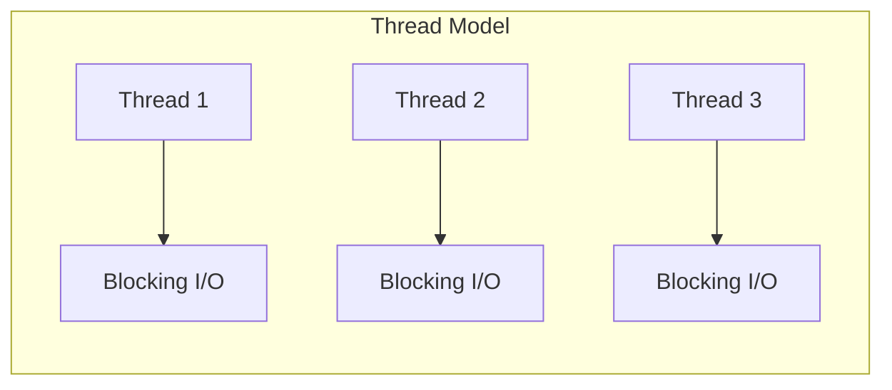
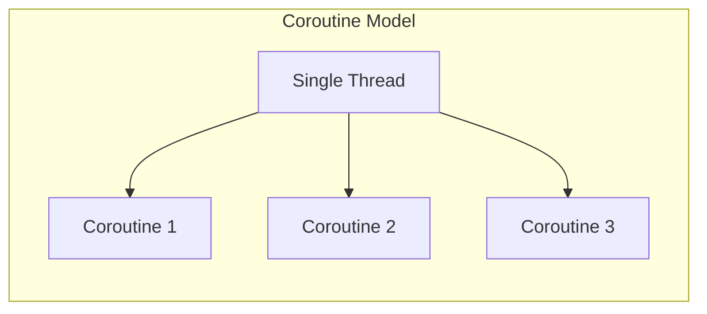
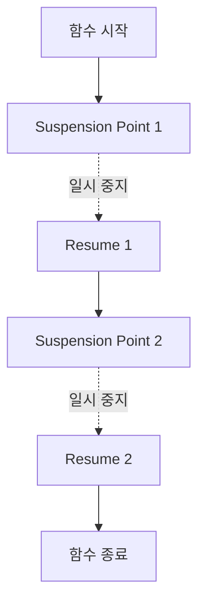
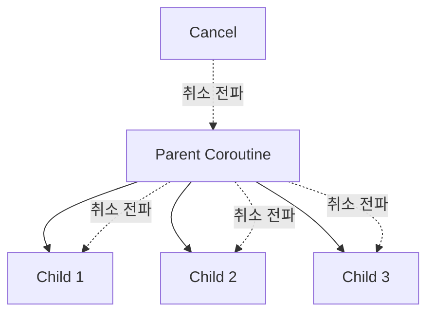

## Kotlin Coroutine

- coroutine은 **실행을 일시 중지(suspend)하고 나중에 재개(resume)할 수 있는 경량 동시성 단위**입니다.
    - 비동기 code를 동기 code처럼 순차적으로 작성할 수 있습니다.
    - thread보다 훨씬 가볍고 효율적으로 동작합니다.

- Kotlin은 **언어 차원에서 coroutine을 지원**합니다.
    - `suspend` keyword만 언어에 추가되었고, 나머지는 library로 제공됩니다.
    - `kotlinx.coroutines` library가 핵심 기능을 제공합니다.

```kotlin
suspend fun fetchUserData(): User {
    val profile = fetchProfile()    // 일시 중지, 완료 후 재개
    val friends = fetchFriends()    // 일시 중지, 완료 후 재개
    return User(profile, friends)
}
```

- 위 code는 비동기 작업이지만, 동기 code와 동일한 구조로 작성되었습니다.


---


## Coroutine vs Thread

- coroutine과 thread는 모두 동시성을 처리하지만, **동작 방식과 효율성에서 큰 차이**가 있습니다.





| 항목 | Thread | Coroutine |
| --- | --- | --- |
| Memory 사용 | thread당 약 1MB stack | coroutine당 수 KB |
| 생성 비용 | OS 자원 할당 필요 | 객체 생성 수준 |
| Context switching | OS kernel 개입, 비용 큼 | 사용자 영역에서 처리, 비용 작음 |
| 동시 실행 수 | 수천 개 한계 | 수십만 개 가능 |
| Blocking | thread 전체 blocking | coroutine만 suspend |

```kotlin
// 100,000개의 coroutine 생성 (문제없이 동작)
fun main() = runBlocking {
    repeat(100_000) {
        launch {
            delay(1000)
            print(".")
        }
    }
}
```

- 동일한 작업을 thread로 수행하면 `OutOfMemoryError`가 발생합니다.


---


## Suspend 함수

- `suspend` 함수는 **일시 중지가 가능한 함수**입니다.
    - 실행 도중 중단되었다가, 나중에 중단된 지점부터 재개됩니다.
    - 다른 `suspend` 함수나 coroutine 내부에서만 호출할 수 있습니다.

```kotlin
suspend fun fetchUser(id: Long): User {
    // network 호출 중 일시 중지
    val response = httpClient.get("https://api.example.com/users/$id")
    return response.body()
}
```


### Suspend 함수의 동작 원리

- `suspend` 함수는 **Continuation Passing Style(CPS)**로 변환됩니다.
    - compiler가 함수를 state machine으로 변환합니다.
    - 각 suspension point에서 상태를 저장하고 복원합니다.



- thread가 blocking되지 않으므로 다른 coroutine이 해당 thread를 사용할 수 있습니다.


### Suspend vs Blocking

- **Suspend** : coroutine만 중지되고 thread는 다른 작업 수행 가능.
- **Blocking** : thread 전체가 중지되어 다른 작업 불가.

```kotlin
// Suspend (권장)
suspend fun fetchData(): Data {
    delay(1000)  // coroutine만 suspend, thread는 free
    return Data()
}

// Blocking (비권장)
fun fetchDataBlocking(): Data {
    Thread.sleep(1000)  // thread 전체 blocking
    return Data()
}
```


---


## Coroutine Builder

- Coroutine builder는 **새로운 coroutine을 생성하고 시작**하는 함수입니다.
    - `launch`, `async`, `runBlocking` 등이 있습니다.


### launch

- **결과를 반환하지 않는** coroutine을 시작합니다.
    - "fire and forget" 방식의 작업에 적합합니다.
    - `Job` 객체를 반환하여 coroutine 제어가 가능합니다.

```kotlin
fun main() = runBlocking {
    val job = launch {
        delay(1000)
        println("World!")
    }
    println("Hello,")
    job.join()  // coroutine 완료 대기
}
// 출력: Hello, World!
```


### async

- **결과를 반환하는** coroutine을 시작합니다.
    - `Deferred<T>` 객체를 반환합니다.
    - `await()`로 결과를 받을 수 있습니다.

```kotlin
fun main() = runBlocking {
    val deferred1 = async { fetchUserProfile() }
    val deferred2 = async { fetchUserFriends() }

    // 두 작업이 병렬로 실행됨
    val profile = deferred1.await()
    val friends = deferred2.await()

    println("Profile: $profile, Friends: $friends")
}
```

- 여러 비동기 작업을 **병렬로 실행**하고 결과를 조합할 때 유용합니다.


### runBlocking

- **현재 thread를 blocking**하며 coroutine을 실행합니다.
    - main 함수나 test code에서 사용합니다.
    - 일반 code와 coroutine을 연결하는 bridge 역할입니다.

```kotlin
fun main() = runBlocking {
    // 여기서 suspend 함수 호출 가능
    val data = fetchData()
    println(data)
}
```

- production code에서는 가급적 사용을 피하고, `launch`나 `async`를 사용합니다.


---


## CoroutineScope와 Structured Concurrency

- **CoroutineScope**는 coroutine의 lifecycle을 관리하는 범위입니다.
    - 모든 coroutine은 특정 scope 내에서 실행됩니다.
    - scope가 취소되면 내부의 모든 coroutine도 취소됩니다.

```kotlin
class UserRepository {
    private val scope = CoroutineScope(Dispatchers.IO)

    fun fetchUsers() {
        scope.launch {
            val users = api.getUsers()
            // 처리
        }
    }

    fun cancel() {
        scope.cancel()  // 모든 coroutine 취소
    }
}
```


### Structured Concurrency

- **부모 coroutine이 자식 coroutine의 완료를 보장**하는 원칙입니다.
    - 자식 coroutine이 실패하면 부모도 취소됩니다.
    - 부모가 취소되면 모든 자식도 취소됩니다.



```kotlin
suspend fun fetchAllData() = coroutineScope {
    val users = async { fetchUsers() }
    val products = async { fetchProducts() }

    // 둘 중 하나라도 실패하면 전체 취소
    Result(users.await(), products.await())
}
```

- `coroutineScope`는 모든 자식 coroutine이 완료될 때까지 대기합니다.


---


## Dispatcher

- **Dispatcher**는 coroutine이 **어떤 thread에서 실행될지** 결정합니다.

| Dispatcher | 용도 | Thread |
| --- | --- | --- |
| `Dispatchers.Main` | UI 작업 | Main/UI thread |
| `Dispatchers.IO` | I/O 작업 (network, file) | 공유 thread pool |
| `Dispatchers.Default` | CPU 집약적 작업 | CPU core 수만큼 thread |
| `Dispatchers.Unconfined` | 특별한 경우 | 호출한 thread |

```kotlin
fun main() = runBlocking {
    launch(Dispatchers.Default) {
        // CPU 집약적 작업
        val result = calculatePrimes(1000000)
    }

    launch(Dispatchers.IO) {
        // I/O 작업
        val data = readFile("data.txt")
    }
}
```


### withContext

- **coroutine 내에서 dispatcher를 전환**할 때 사용합니다.
    - suspend 함수 내에서 특정 dispatcher로 작업을 수행합니다.

```kotlin
suspend fun fetchAndProcess(): Result {
    val data = withContext(Dispatchers.IO) {
        // I/O thread에서 실행
        api.fetchData()
    }

    return withContext(Dispatchers.Default) {
        // CPU thread에서 실행
        processData(data)
    }
}
```


---


## 전통적인 비동기 방식과 비교

- Coroutine 이전에는 **thread, callback, Future, Rx** 등의 방식으로 비동기를 처리했습니다.
    - 각 방식에는 고유한 문제점이 있으며, coroutine이 이를 해결합니다.


### Callback의 문제 : Callback Hell

- 중첩된 callback은 code를 이해하기 어렵게 만듭니다.

```kotlin
// Callback 방식 (복잡함)
fun loadUserData(userId: String) {
    fetchUser(userId) { user ->
        fetchProfile(user.id) { profile ->
            fetchFriends(user.id) { friends ->
                updateUI(user, profile, friends)
            }
        }
    }
}

// Coroutine 방식 (간결함)
suspend fun loadUserData(userId: String) {
    val user = fetchUser(userId)
    val profile = fetchProfile(user.id)
    val friends = fetchFriends(user.id)
    updateUI(user, profile, friends)
}
```


### Future/Promise의 문제 : 다른 Programming Model

- chaining 방식은 기존 programming 방식과 다릅니다.

```kotlin
// Future 방식
fun loadUserData(userId: String): CompletableFuture<UserData> {
    return fetchUserAsync(userId)
        .thenCompose { user -> fetchProfileAsync(user.id) }
        .thenCompose { profile -> fetchFriendsAsync(profile.userId) }
        .thenApply { friends -> UserData(friends) }
}

// Coroutine 방식 (동기 code와 동일한 구조)
suspend fun loadUserData(userId: String): UserData {
    val user = fetchUser(userId)
    val profile = fetchProfile(user.id)
    val friends = fetchFriends(profile.userId)
    return UserData(friends)
}
```


### Rx의 문제 : 학습 곡선

- Rx는 강력하지만, **operator가 많고 학습 곡선이 가파릅니다**.
    - 복잡한 data stream 처리에는 Rx가 여전히 유용합니다.
    - 단순한 비동기 작업에는 coroutine이 더 적합합니다.

| 상황 | 권장 방식 |
| --- | --- |
| 순차적 비동기 작업 | Coroutine |
| 병렬 비동기 작업 | Coroutine (`async`) |
| 복잡한 event stream | Rx 또는 Kotlin Flow |
| UI event 처리 | Coroutine + Flow |


---


## Exception 처리

- Coroutine에서 exception은 **structured concurrency 원칙에 따라 전파**됩니다.


### try-catch

- 일반 code와 동일하게 `try-catch`를 사용합니다.

```kotlin
suspend fun fetchUser(): User {
    return try {
        api.getUser()
    } catch (e: IOException) {
        User.DEFAULT
    }
}
```


### CoroutineExceptionHandler

- 최상위 coroutine에서 처리되지 않은 exception을 처리합니다.

```kotlin
val handler = CoroutineExceptionHandler { _, exception ->
    println("Caught: $exception")
}

fun main() = runBlocking {
    val job = launch(handler) {
        throw RuntimeException("Error!")
    }
    job.join()
}
```


### supervisorScope

- 자식 coroutine의 실패가 다른 자식에게 영향을 주지 않도록 합니다.

```kotlin
suspend fun fetchAllData() = supervisorScope {
    val users = async { fetchUsers() }      // 실패해도
    val products = async { fetchProducts() } // 계속 실행

    val userResult = runCatching { users.await() }
    val productResult = runCatching { products.await() }
}
```


---


## Reference

- <https://kotlinlang.org/docs/coroutines-overview.html>
- <https://kotlinlang.org/docs/coroutines-basics.html>
- <https://kotlinlang.org/docs/composing-suspending-functions.html>

