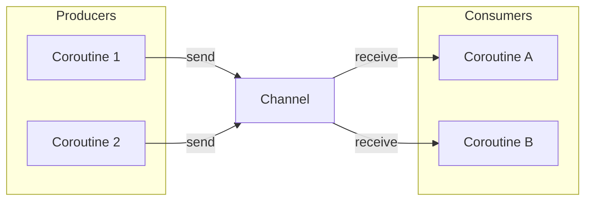
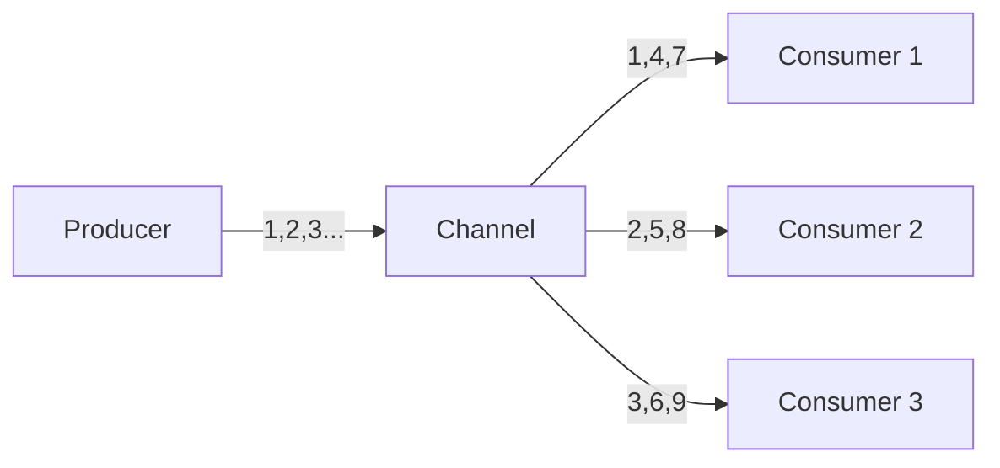
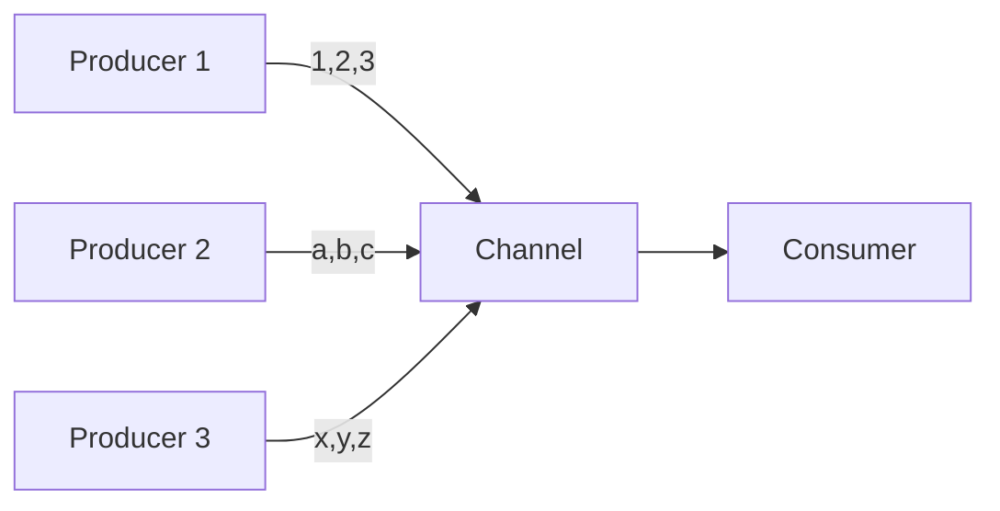
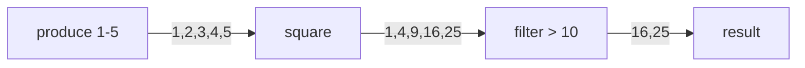

## Channel

- **Channel**은 coroutine 간 data를 전송하는 **hot stream**입니다.
    - `BlockingQueue`와 유사하지만 blocking 대신 suspending으로 동작합니다.
    - `send()`로 값을 보내고 `receive()`로 값을 받습니다.
    - producer와 consumer pattern을 구현하는 데 적합합니다.

```kotlin
val channel = Channel<Int>()

// Producer
launch {
    for (i in 1..5) {
        channel.send(i)
        println("Sent: $i")
    }
    channel.close()
}

// Consumer
launch {
    for (value in channel) {
        println("Received: $value")
    }
}
```


### Channel의 특성

- **Hot stream** : sender가 있으면 receiver 없이도 값을 보낼 수 있습니다 (buffer에 따라 다름).
- **Bidirectional** : 양방향 통신이 가능합니다.
- **Multiple producers/consumers** : 여러 coroutine이 동시에 send/receive할 수 있습니다.




---


## Channel vs Flow

- Channel과 Flow는 모두 data stream을 처리하지만 용도가 다릅니다.

| 항목 | Channel | Flow |
| --- | --- | --- |
| Type | Hot stream | Cold stream |
| 생산 시점 | 즉시 (collector 불필요) | collect 호출 시 |
| 소비 | 한 번만 소비 | 여러 번 collect 가능 |
| 주요 용도 | coroutine 간 통신 | data 변환 pipeline |
| 여러 consumer | 값 분배 (각각 다른 값) | 각각 전체 값 수신 |

```kotlin
// Channel : 한 번만 소비
val channel = Channel<Int>()
launch { channel.send(1); channel.send(2); channel.close() }

launch { println(channel.receive()) }  // 1
launch { println(channel.receive()) }  // 2

// Flow : 여러 번 collect
val flow = flowOf(1, 2)

launch { flow.collect { println("A: $it") } }  // A: 1, A: 2
launch { flow.collect { println("B: $it") } }  // B: 1, B: 2
```


---


## Channel Type

- Channel은 buffer 용량에 따라 네 가지 type이 있습니다.


### Rendezvous Channel

- **Rendezvous**(capacity = 0)는 buffer가 없는 기본 channel입니다.
    - sender는 receiver가 준비될 때까지 suspend됩니다.
    - sender와 receiver가 동시에 만나야 전송이 완료됩니다.

```kotlin
val channel = Channel<Int>()  // Rendezvous (기본)

launch {
    println("Sending 1")
    channel.send(1)  // receiver가 없으면 suspend
    println("Sent 1")
}

delay(1000)

launch {
    println("Receiving")
    println("Received: ${channel.receive()}")
}
// 출력 : Sending 1, (1초 후) Receiving, Sent 1, Received: 1
```


### Buffered Channel

- **Buffered**는 고정 크기 buffer를 가진 channel입니다.
    - buffer가 가득 차면 sender가 suspend됩니다.
    - buffer에 공간이 있으면 즉시 send가 완료됩니다.

```kotlin
val channel = Channel<Int>(capacity = 3)

launch {
    for (i in 1..5) {
        println("Sending $i")
        channel.send(i)  // 4, 5는 buffer가 찰 때까지 대기
        println("Sent $i")
    }
}
```


### Conflated Channel

- **Conflated**는 최신 값만 유지하는 channel입니다.
    - 새 값이 오면 이전 값을 덮어씁니다.
    - sender는 절대 suspend되지 않습니다.

```kotlin
val channel = Channel<Int>(Channel.CONFLATED)

launch {
    channel.send(1)
    channel.send(2)
    channel.send(3)  // 1, 2는 버려짐
}

delay(100)
println(channel.receive())  // 3 (최신 값만)
```


### Unlimited Channel

- **Unlimited**는 무제한 buffer를 가진 channel입니다.
    - sender는 절대 suspend되지 않습니다.
    - memory가 부족하면 `OutOfMemoryError`가 발생할 수 있습니다.

```kotlin
val channel = Channel<Int>(Channel.UNLIMITED)

launch {
    repeat(1_000_000) {
        channel.send(it)  // suspend 없이 즉시 완료
    }
}
```


### Channel Type 비교

| Type | Capacity | Sender Suspend | 특징 |
| --- | --- | --- | --- |
| Rendezvous | 0 | receiver 없으면 항상 | 동기적 전달 |
| Buffered | N | buffer 가득 차면 | 일반적인 buffer |
| Conflated | 1 | 절대 안 함 | 최신 값만 유지 |
| Unlimited | 무제한 | 절대 안 함 | memory 주의 |


---


## Channel 생성

- `Channel()` 함수로 직접 생성하거나, `produce`, `actor` builder로 coroutine과 함께 생성합니다.


### Channel() 함수

- `Channel()` 함수로 직접 생성합니다.

```kotlin
// Rendezvous (기본)
val ch1 = Channel<String>()

// Buffered
val ch2 = Channel<String>(capacity = 10)

// Conflated
val ch3 = Channel<String>(Channel.CONFLATED)

// Unlimited
val ch4 = Channel<String>(Channel.UNLIMITED)
```


### produce Builder

- **`produce`**는 channel과 함께 producer coroutine을 생성합니다.
    - `ReceiveChannel`을 반환합니다.
    - producer가 완료되면 자동으로 channel이 닫힙니다.

```kotlin
fun CoroutineScope.produceNumbers(): ReceiveChannel<Int> = produce {
    for (i in 1..5) {
        send(i)
    }
    // 자동으로 close()
}

val numbers = produceNumbers()
for (num in numbers) {
    println(num)
}
```


### actor Builder

- **`actor`**는 channel과 함께 consumer coroutine을 생성합니다.
    - `SendChannel`을 반환합니다.
    - message를 받아 처리하는 actor pattern을 구현합니다.

```kotlin
sealed class CounterMsg
object Increment : CounterMsg()
class GetCount(val response: CompletableDeferred<Int>) : CounterMsg()

fun CoroutineScope.counterActor() = actor<CounterMsg> {
    var count = 0
    for (msg in channel) {
        when (msg) {
            is Increment -> count++
            is GetCount -> msg.response.complete(count)
        }
    }
}

val counter = counterActor()
repeat(100) { counter.send(Increment) }
val response = CompletableDeferred<Int>()
counter.send(GetCount(response))
println(response.await())  // 100
```


---


## Send와 Receive

- `send`와 `receive`는 suspend 함수로, buffer 상태에 따라 coroutine이 일시 중지됩니다.
    - non-suspending 버전인 `trySend`, `tryReceive`도 제공됩니다.


### send / receive

- **`send`**는 값을 channel에 보냅니다 (suspend 함수).
- **`receive`**는 channel에서 값을 받습니다 (suspend 함수).

```kotlin
val channel = Channel<Int>()

launch {
    channel.send(1)
    channel.send(2)
    channel.close()
}

println(channel.receive())  // 1
println(channel.receive())  // 2
// channel.receive()  // ClosedReceiveChannelException
```


### trySend / tryReceive

- **`trySend`**와 **`tryReceive`**는 non-suspending 버전입니다.
    - 즉시 결과를 반환하며 suspend되지 않습니다.
    - `ChannelResult`를 반환합니다.

```kotlin
val channel = Channel<Int>(capacity = 1)

val sendResult = channel.trySend(1)
println(sendResult.isSuccess)  // true

val receiveResult = channel.tryReceive()
println(receiveResult.getOrNull())  // 1
```


### receiveCatching

- **`receiveCatching`**은 channel이 닫혀도 exception 없이 결과를 반환합니다.

```kotlin
val channel = Channel<Int>()

launch {
    channel.send(1)
    channel.close()
}

while (true) {
    val result = channel.receiveCatching()
    if (result.isClosed) break
    println(result.getOrNull())
}
```


### for loop으로 수신

- Channel은 `ReceiveChannel`을 구현하여 for loop으로 순회할 수 있습니다.
    - channel이 닫히면 loop가 종료됩니다.

```kotlin
val channel = Channel<Int>()

launch {
    for (i in 1..5) channel.send(i)
    channel.close()
}

for (value in channel) {
    println(value)
}
```


### consumeEach

- **`consumeEach`**는 모든 값을 처리하고 channel을 소비합니다.

```kotlin
val channel = Channel<Int>()

launch {
    for (i in 1..5) channel.send(i)
    channel.close()
}

channel.consumeEach { value ->
    println(value)
}
```


---


## Channel 닫기

- Channel을 닫는 방법과 닫힌 channel의 동작입니다.


### close

- **`close()`**는 channel을 닫습니다.
    - 닫힌 후 `send()`를 호출하면 `ClosedSendChannelException`이 발생합니다.
    - 이미 buffer에 있는 값은 receive할 수 있습니다.

```kotlin
val channel = Channel<Int>(capacity = 10)

channel.send(1)
channel.send(2)
channel.close()

// channel.send(3)  // ClosedSendChannelException

println(channel.receive())  // 1
println(channel.receive())  // 2
// channel.receive()  // ClosedReceiveChannelException
```


### isClosedForSend / isClosedForReceive

- Channel의 닫힌 상태를 확인합니다.
    - `isClosedForSend` : send가 불가능한지 확인합니다.
    - `isClosedForReceive` : receive가 불가능한지 확인합니다 (buffer도 비어야 함).

```kotlin
val channel = Channel<Int>(capacity = 5)
channel.send(1)

println(channel.isClosedForSend)     // false
println(channel.isClosedForReceive)  // false

channel.close()

println(channel.isClosedForSend)     // true
println(channel.isClosedForReceive)  // false (buffer에 값 있음)

channel.receive()

println(channel.isClosedForReceive)  // true
```


### cancel

- **`cancel()`**은 channel을 취소합니다.
    - `close()`와 달리 buffer의 남은 값도 버립니다.

```kotlin
val channel = Channel<Int>(capacity = 10)
channel.send(1)
channel.send(2)

channel.cancel()

// buffer의 값도 사라짐
// channel.receive()  // CancellationException
```


---


## Fan-out과 Fan-in

- 여러 coroutine이 하나의 channel을 공유하는 pattern입니다.


### Fan-out

- **Fan-out**은 하나의 producer가 여러 consumer에게 값을 분배합니다.
    - 각 값은 하나의 consumer만 받습니다.
    - load balancing에 유용합니다.

```kotlin
fun CoroutineScope.produceJobs(): ReceiveChannel<Int> = produce {
    repeat(10) { send(it) }
}

val jobs = produceJobs()

// 여러 consumer가 값을 나눠 받음
repeat(3) { consumerId ->
    launch {
        for (job in jobs) {
            println("Consumer $consumerId received $job")
        }
    }
}
```




### Fan-in

- **Fan-in**은 여러 producer가 하나의 channel로 값을 보냅니다.
    - 값들이 하나의 stream으로 합쳐집니다.

```kotlin
suspend fun sendNumbers(channel: SendChannel<Int>, start: Int, count: Int) {
    repeat(count) {
        channel.send(start + it)
    }
}

val channel = Channel<Int>()

// 여러 producer
launch { sendNumbers(channel, 1, 5) }
launch { sendNumbers(channel, 100, 5) }

// 단일 consumer
launch {
    repeat(10) {
        println(channel.receive())
    }
}
```




---


## Pipeline

- Channel을 연결하여 data processing pipeline을 구성합니다.


### Pipeline 구성

- 각 stage가 이전 stage의 출력을 입력으로 받습니다.

```kotlin
fun CoroutineScope.produceNumbers(): ReceiveChannel<Int> = produce {
    for (i in 1..5) send(i)
}

fun CoroutineScope.square(numbers: ReceiveChannel<Int>): ReceiveChannel<Int> = produce {
    for (num in numbers) send(num * num)
}

fun CoroutineScope.filter(numbers: ReceiveChannel<Int>): ReceiveChannel<Int> = produce {
    for (num in numbers) {
        if (num > 10) send(num)
    }
}

val numbers = produceNumbers()
val squared = square(numbers)
val filtered = filter(squared)

for (value in filtered) {
    println(value)  // 16, 25
}
```




### Prime Numbers Pipeline

- 에라토스테네스의 체를 pipeline으로 구현합니다.

```kotlin
fun CoroutineScope.numbersFrom(start: Int): ReceiveChannel<Int> = produce {
    var x = start
    while (true) send(x++)
}

fun CoroutineScope.filterPrimes(
    numbers: ReceiveChannel<Int>,
    prime: Int
): ReceiveChannel<Int> = produce {
    for (num in numbers) {
        if (num % prime != 0) send(num)
    }
}

var cur = numbersFrom(2)
repeat(10) {
    val prime = cur.receive()
    println(prime)
    cur = filterPrimes(cur, prime)
}
// 출력 : 2, 3, 5, 7, 11, 13, 17, 19, 23, 29
```


---


## 실전 예제

- Worker pool로 작업을 분산하거나, rate limiter로 요청 속도를 제한하는 등 실무에서 자주 사용하는 pattern입니다.


### Worker Pool

- 고정된 수의 worker가 작업을 처리합니다.

```kotlin
suspend fun processTask(task: Task): Result {
    delay(100)  // 작업 시뮬레이션
    return Result(task.id, "Processed")
}

suspend fun workerPool(
    tasks: ReceiveChannel<Task>,
    results: SendChannel<Result>,
    workerCount: Int
) = coroutineScope {
    repeat(workerCount) { workerId ->
        launch {
            for (task in tasks) {
                println("Worker $workerId processing ${task.id}")
                val result = processTask(task)
                results.send(result)
            }
        }
    }
}

val tasks = Channel<Task>(capacity = 100)
val results = Channel<Result>(capacity = 100)

launch {
    workerPool(tasks, results, workerCount = 4)
}

// 작업 전송
launch {
    repeat(20) { tasks.send(Task(it)) }
    tasks.close()
}

// 결과 수집
for (result in results) {
    println("Result: ${result.id}")
}
```


### Rate Limiter

- Channel을 사용하여 요청 속도를 제한합니다.

```kotlin
class RateLimiter(
    private val permitsPerSecond: Int
) {
    private val permits = Channel<Unit>(capacity = permitsPerSecond)

    init {
        CoroutineScope(Dispatchers.Default).launch {
            while (true) {
                repeat(permitsPerSecond) {
                    permits.trySend(Unit)
                }
                delay(1000)
            }
        }
    }

    suspend fun acquire() {
        permits.receive()
    }
}

val limiter = RateLimiter(permitsPerSecond = 10)

repeat(100) { i ->
    launch {
        limiter.acquire()
        println("Request $i at ${System.currentTimeMillis()}")
    }
}
```


### Event Bus

- Channel 기반 event bus를 구현합니다.

```kotlin
class EventBus {
    private val _events = Channel<Event>(Channel.BUFFERED)

    fun post(event: Event) {
        _events.trySend(event)
    }

    suspend fun subscribe(handler: suspend (Event) -> Unit) {
        for (event in _events) {
            handler(event)
        }
    }
}

val bus = EventBus()

// subscriber
launch {
    bus.subscribe { event ->
        println("Received: $event")
    }
}

// publisher
bus.post(UserLoggedIn("user1"))
bus.post(ItemPurchased("item1"))
```


---


## Reference

- <https://kotlinlang.org/docs/channels.html>
- <https://kotlinlang.org/api/kotlinx.coroutines/kotlinx-coroutines-core/kotlinx.coroutines.channels/-channel/>

